Author contributions can be found [here](https://docs.google.com/spreadsheets/d/1SkiqZlpZlEs1nf6JJUakREYS4mpghSmgb_0QlL8o3ek/edit#gid=1616763697)

Correspondence: esra@bmb.sdu.dk; thomas.flatt@unifr.ch 

Short Running Title: Phenomic Analysis of European _D. melanogaster_

# Lay Summary

For over 100 years, the vinegar fly _Drosophila melanogaster_ has been a workhorse for studying the genetic and phenotypic basis of evolutionary change. Ancestrally of southern-central African origin, this insect expanded its range, migrated out of Africa and colonized new habitats and climate zones around the globe. Recent population genomic analyses suggest that Europe was colonized from the Middle East ~1,800 years ago, yet we still know surprisingly little about how this human commensal adapted to different locales on the European continent and elsewhere. Here, we assayed fly strains isolated from 9 European populations for 16 traits in an international consortium effort, involving >100 researchers from 26 research groups in 17 countries and using semi-standardized experimental protocols. Despite differences in experimental (environmental) conditions among labs, our trait measurements agreed well across research teams, suggesting that they are robust and generalizable. European populations of the vinegar fly are markedly differentiated for several phenotypic traits that are related to Darwinian fitness and which might be subject to natural selection. Notably, flies from locations with higher humidity and rainfall and lower temperature survive better to the adult stage, lay more eggs, are better at surviving famine and, as adults, live longer than flies from drier, warmer locations; yet, as compared to flies from warmer, drier locales, they are considerably less well adapted to surviving heat stress, suggesting a trade-off between these components of fitness. Our findings begin to illuminate how this subtropical/tropical insect has adapted to different climates and habitats on the European continent and showcase the value of collaborative multi-lab studies that perform experiments in parallel.


# General overview of the phenotyping effort

We assayed 16 phenotypic traits, most of them representing fitness components (see Table 1 in main text for details): viability, developmental time, dry weight, thorax length, wing area, fertility, lifespan, cold-shock mortality, chill-coma recovery time, heat-shock mortality, diapause, locomotor activity, circadian eclosion timing, pigmentation, starvation resistance, and parasitoid resistance. Assay protocols for each trait are given below; detailed information about phenotyping batches, experimental blocks, replication, sample sizes, etc. can be found here https://github.com/esradm/DrosEU_PhenotypingWG/tree/main/SummaryTables. Phenotyping assays were carried out at 25ºC, 12 hours light:12 hours dark, and a minimum relative air humidity of 60%. Strains were maintained under density-controlled conditions for at least two generations prior to the assays. The fly food recipes used by the different labs are shown in section 1.2. Unless stated otherwise, mated females and males were phenotyped for a given trait. The following principal investigators and their research groups participated in the phenotyping effort (in alphabetical order): Jessica Abbott (JA); Alan Bergland (AB); Jean-Christophe Billeter (JCB); Hervé Colinet (HC); Claudia Fricke (CF); Thomas Flatt (TF); Patricia Gibert (PG); Josefa González (JG); Sonja Grath (SG); Katja Hoedjes (KH); Jan Hrcek (JH); Iryna Kozeretska (IK); Julian Mensch (JM); Banu Onder (BO); John Parsch (JP); Elena Pasyukova (EP); Nico Posnien (NP); Michael G. Ritchie (MR); Christian Schlötterer (CS); Paul Schmidt (PS); Marina Stamenkovic-Radak (MSR); Eran Tauber (ET); Jorge Vieira (JV); Christian Wegener (CW); Bas J. Zwaan (BZ).


```{r libraries, echo=FALSE, message=FALSE, warning=FALSE}

library(tidyverse)
library(ggpubr)
library(hrbrthemes)
library(qwraps2)
library(afex)
library(Hmisc)
library(knitr)
library(cowplot)
library(ggrepel)
library(DT)
library(data.table)
library(MetBrewer)
library(psych)
```


Nine sampling locations were chosen based on genomic data and these locations covered a wide range of latitude (~20°) and longitude (~40°) across the continent (see Table S1 below). From each location, 15 to 20 isofemale lines were established in corresponding labs at the sampling location and the isofemale lines were centrally maintained by Élio Sucena  at Instituto Gulbenkian de Ciência (IGC), Lisbon, Portugal. A total of 173 isofemale lines were used in this study.


```{r droseu_coord, echo=FALSE, message=FALSE}
droseu_coord <- read.csv("InfoTables/DrosEU_Coordinates_wDEST.csv", sep = ";") %>%
  select(!LineID_month)
```


```{r echo=FALSE, message=FALSE}
knitr::kable(droseu_coord, align = "llcccclllll", caption = 'Table S1: Sampling locations, coordinates and collectors, sorted by increasing latitude. Altitude is expressed in meters.')
```

```{css, echo = FALSE}
caption {
      color: black;
      font-weight: bold;
      font-size: 1.0em;
    }
```


<style>
p.caption {
  font-size: 0.9em;
}
</style>

```{r panmix_theme, echo=FALSE, message=FALSE}
panmix_theme <- theme(panel.grid.major = element_blank(), panel.grid.minor = element_blank(),panel.background = element_blank(), axis.line = element_line(colour = "black",), axis.title.x = element_text(size = 16), axis.text.x = element_text(size = 16, colour = "black"), axis.text.y = element_text(size = 16, colour = "black"),axis.title.y = element_text(size = 16))
```

```{r droseu_labs, echo=FALSE, message=FALSE}
droseu_labs <- data.frame(read.csv("InfoTables/DrosEU_Labs.csv"))
```

```{r echo=FALSE}

```

## Contributors

Author contributions can be found [here](https://docs.google.com/spreadsheets/d/1SkiqZlpZlEs1nf6JJUakREYS4mpghSmgb_0QlL8o3ek/edit#gid=1616763697)


Contributing labs are `r unique(droseu_labs$PI)` and detailed list below:

```{r echo=FALSE}
knitr::kable(droseu_labs, allign = "llll", caption = "Table S2. Contributing labs and traits, sorted by trait")
```

```{r echo=FALSE, message=FALSE}
cities <- read.csv("InfoTables/DrosEU_cities.csv")
```

# 1 - Materials and Methods 

## 1.1 - Drosophila population samples, isofemale lines, and stock maintenance

In summer and fall 2018 we collected inseminated D. melanogaster females at 9 European locations, which had already previously been characterized at the population genomic level by the DrosEU consortium (see Figure 1 in the main text; see Kapun et al., 2020, 2021; also see Machado et al. 2021): PT, Portugal (Recarei = RE); ES, Spain (Gimenells = GI [Lleida]); TR, Turkey (Yesiloz = YE); DE, Germany (Munich = MU); AT, Austria (Mauternbach = MA); UA, Ukraine (Uman = UM); DK, Denmark (Karensminde = KA); FI, Finland (Akaa = AK); RU, Russia (Valday = VA). From these females we established 173 isofemale lines, with each population being represented by at least 15 lines (Table SI.X) – we call this collection of lines the DrosEU population panel (DPP). Lines were centralized and maintained in the lab of Élio Sucena (ES) where species status (D. melanogaster vs. D. simulans) was verified using the protocol of Faria & Sucena (2017) and where  lines were tested for Wolbachia infection (see below for methodological details). Subsequently, lines were sent to participating laboratories for phenotyping (Figure 1 in the main text; see Table S2). To comply with the Nagoya protocol, material transfer agreements (MTAs) were prepared and exchanged between researchers to transport fly samples across borders.


## 1.2 - Diets

```{r droseu_diets, echo=FALSE, message=FALSE}
droseu_diets <- data.frame(read.csv("InfoTables/DrosEU_Diets_Feb22.csv"))
```


```{r, echo=FALSE}
DT::datatable(droseu_diets, options = list(pageLength = 10))
```


## 1.3 - Chromosomal inversion frequencies

For each isofemale line, the presence or absence of 5 cosmopolitan inversions (_In(2L)t_, _In(2R)NS_, _In(3L)P_,_In(3R)P_ and _In(3R)mo_) was diagnosed by PCR using previously published inverted-specific primers and conditions (Corbett-Detig et al, 2012) on DNA extracted from pools of 10-15 mixed-sex flies per line using the Qiagen DNeasy Blood & Tissue Kit. These data were used to investigate the effect of inversions on trait variation (linear model with inversion presence (1) or absence (0) used as explanatory variable). In addition, average inversion frequencies were derived for each population.


## 1.4 - Trait-specific assay conditions and measurements

### Viability
##### Gibert, Grath, Hoedjes, Schmidt, Stamenkovic-Radak and Zwaan Labs

Viability (=proportion egg-to-adult survival) was determined in parallel with developmental time (see below). Groups of 3-day to 5-day-old adults (at least 25 pairs) per isofemale line were allowed to lay eggs for at least 2 hours. Yeast was provided to stimulate egg laying. Immediately thereafter 40 eggs were collected and placed into a vial with 5 mL medium, with three replicate vials per isofemale line. The PS lab followed an alternative protocol whereby females were allowed to lay eggs directly into vials and the total number of eggs was recorded afterwards. Viability was calculated per vial as the proportion of adult individuals which eclosed from the eggs.

### Developmental time

#### Egg-to-pupa developmental time
##### Schmidt Lab
Egg-to-pupa developmental time (in hrs) was scored twice per day, when the chamber lights were turned on and two hours before they were turned off, by counting the number of individuals that had pupariated. Locations on the walls of the vials with new pupae were marked with a permanent marker in order to keep track of which pupae had emerged each day. 

#### Egg-to-adult developmental time
##### Gibert, Grath, Hoedjes, Schmidt, Stamenkovic-Radak and Zwaan Labs

Egg-to-adult developmental time (in hrs) was scored twice per day, similar to egg-to-pupa developmental time (see above); all adults that had emerged from each vial were collected for counting and sexing.

### Dry weight
##### Colinet, Hoedjes and Onder Labs

Measurements were performed in 3, 5 and 5 batches for the HC, KH and BO labs, respectively. Seven-day-old flies (on average 24 females and 24 males per isofemale line) from cultures of controlled density (50 eggs/5 mL of food) were sacrificed by either placing them directly at -20°C or by putting them first into a vial containing a piece of cotton imbibed with an ethyl acetate solution before storing them at -20ºC. Flies were sexed, placed individually into 96-well plates and transferred into a drying oven set at 60-70°C for at least 72 hours. Plates that were not measured immediately after the drying period were stored at room temperature using a protective cover for later weighing; if this was the case, previously dried plates were placed in the oven (60-70°C) for another 24 hours the day before weight measurements, to ensure that flies were well dehydrated. Flies were then transferred individually with an aspirator onto a small piece of aluminum foil for weight measurement on a microbalance with an accuracy of 1µg (Mettler Toledo UMX2 or MT5, Sartorius Cubis Micro Balance).

### Thorax length
##### Kozeretska, Posnien, Ritchie and Schmidt Labs

Flies used for measurements of thorax length were reared in 2 batches by the IK and in 1 batch by all other labs. NP kept the flies at -20°C for 5-14 days prior to mounting. Bodies / thoraces of 5- to 10-day-old flies (per isofemale line and sex, on average ~40 individuals for the IK and MR labs, and ~10 individuals for the NP and PS labs) were placed onto a double-sided sticky tape attached to a microscope slide or taped directly to the slide. Bodies were laid out on their right side, and photographs of thoraces were taken using a digital camera connected to a dissecting microscope (NP lab: QImaging MicroPublisher 5.0 digital camera mounted to a Leica M205 FA stereo microscope; MR lab: Leica DFC295 camera attached to a Leica M60 microscope; IK lab: a digital single-lens reflex (DSLR) Sigeta MCMOS 5100 5.1Mp USB 2.0 camera mounted on a MBS-10 stereo microscope, PS lab: Olympus DP73 digital camera mounted on a Leica MZ9.5 stereo microscope). Within each lab always the same magnification (50x) and resolution were used to increase reproducibility; a scale bar inserted on each photo or a software (PS lab) allowed transforming (square) pixels into (square) µm. Thorax length was defined as the distance from the anterior margin of the thorax to the posterior tip of the scutellum and was measured using the ‘Straight Line’ tool in ImageJ/Fiji (https://fiji.sc/) (Figure XA).

### Wing area
##### Onder, Posnien, Ritchie and Stamenkovic-Radak Labs

Flies used for wing area measurements were reared in 7, 1, 15 and 5 batches by the BO, NP, MR and MSR labs, respectively. Both the left and right wings of 5- to 10-day-old flies (per isofemale line and sex, on average 30 individuals were measured in the BO, MR and MSR labs, and 10 individuals in the NP lab) were removed and mounted in Entellan (Merck) (BO) or Hoyer’s mounting medium (NP) or placed directly onto double-sided sticky tape (MR, MSR). NP and MSR kept the flies at -20°C for 5 - 14 days prior to wing dissections. Photographs of wings were taken using a digital camera connected to a dissecting microscope (NP: QImaging MicroPublisher 5.0 digital camera mounted to a Leica M205 FA stereo microscope; MSR: Bresser MikroCam 5.0 MP digital camera mounted to Nikon SMZ 745T stereo microscope; MR: Leica DFC295 camera attached to Leica M60 stereo microscope; BO: Leica S9i with integrated 10 MP CMOS-camera). Within each lab the same magnification and resolution was used (NP: 50X; MSR: 50X; MR: 50X; BO: 48X). A photograph of a scale bar (ruler) was taken with the same settings as for the rest of the images during every measurement session, thereby allowing the conversion of (square) pixels to (square) µm. 

```{r fig.show = "hold", out.width = "49%", fig.align = "default", echo = FALSE}
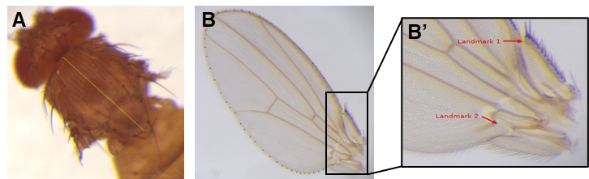

```


_Figure S1_. Thorax and wing measurements. (A) Thorax length was measured from the anterior margin of the thorax to the posterior tip of the scutellum. (B) Measurement area of the wing. (B’) Landmarks used to exclude the posterior part of the wing for area measurements. (C) Position of 15 landmarks used for wing centroid size (WCS) assessment. 

Wing area was estimated by quantifying wing centroid size (WCS; Bookstein, 1996). Fifteen landmarks (Figure S1C) were placed on wing images using tpsUtil and tpsDig2 (Rohlf, 2015) to obtain raw x and y landmark coordinates. WCS was calculated as the square root of the sum of squared deviations of landmarks around their centroid as implemented in MorphoJ (Klingenberg, 2011) or tpsRelw (Rohlf, 2015). To confirm that WCS represents wing area, the NP lab also manually measured wing area by outlining wings (Figure S1B) with the "Polygon Selection" tool in Fiji (https://fiji.sc/). The most proximal part of the wing was excluded from measurements, using two distinct landmarks, since it was more susceptible to damage during dissection (Figure S1B’). Linear regression of WCS against manually measured wing area showed a high positive correlation (adjusted R2 = 0.83, F1, 538 = 2605, p < 2.2 x 10-16) (Figure S2). 

```{r echo=FALSE}

```
_Figure S2_. Linear regression of WCS against manually measured wing area.


### Fertility
##### Billeter and Fricke Labs

For each isofemale line, up to 10 males and 10 virgin females were placed together in single-sex groups and allowed to mature for five days. Individual pairs were then placed together in a vial (5-7 pairs per line), and mating interactions were observed to ensure successful mating (a copulation duration of at least 10 minutes). Up to 5 successfully mated females per isofemale line were obtained. After successful mating, males were discarded and single females were allowed to oviposit for 2 days, then moved to a fresh vial and allowed to oviposit for 4 days, and then moved again to a new vial and allowed to oviposit for 2 days. Vials were maintained for at least 12 days until all offspring had eclosed. Prior to counting offspring, vials were kept in a freezer. Fertility was defined as the sum of all eclosed offspring produced per female over a maximum timespan of 8 days after a single mating.


### Lifespan

#### Line level measurements

##### Parsch and Pasyukova Labs

Lifespan (i.e., the duration of adult lifespan, in days) was measured for at least 15 isofemale lines per population, with 5-8 replicate vials per line. Each vial contained 10 flies per sex (20 flies in total), collected within 24 hours of eclosion and kept on 5 mL of food medium. Replicates were assayed in two batches (blocks), with at least one replicate for each line in each block. Food vials were changed and mortality was recorded every Monday, Wednesday, and Friday in the JP lab and daily in the EP lab (except for weekends). Flies that had escaped or which had died from non-natural causes during the course of the experiment were marked as censored for subsequent analysis.

#### Population level measurements

##### Flatt Lab
In contrast to the JP and EP labs, the TF lab assayed adult lifespan at the population level, not at the level of isofemale lines nested in populations. 24-hour cohorts of adult flies were kept in 1L demography cages (see Tatar et al., 2001 for details of cage design), with 10 replicate cages per population (each cage contained 5 flies per line and sex for each of the populations; see supplementary Table xx for a detailed list of lines). Age at death was scored when changing vials (containing 5 mL of food) on the cages, at first every second day for the first 3 weeks of the experiment, and thereafter on Mondays, Wednesdays and Fridays, until all individuals in the experiment had died. Flies that had escaped or which had died from non-natural causes during the course of the assay were marked as censored for subsequent analysis.

### Cold-shock mortality
##### Gonzalez, Kozeretska and Vieira Labs

Measurements were performed in 32, 9 and 2 batches (blocks) for the JV, JG and IK labs, respectively. For each isofemale line and sex, 1-8 replicates consisting of 6-25 flies collected around the peak of eclosion time were placed in vials with fresh food at least one day before the experiment. Five- to seven-day-old flies were then transferred into empty vials immersed in an ice-water bath in a box (polystyrene or styrofoam) and stored at 4°C. After 18 hours of cold-shock, vials were moved to a room at 25°C, and the number of dead flies was scored at a single time point 24 hours later. Cold-shock mortality was estimated for each vial as the proportion of dead flies, i.e. the number of dead flies divided by the number of assayed flies.

### Chill-coma recovery time
##### Vieira and Mensch Labs

Measurements of chill-coma recovery time (CCRT) were performed in 27 and 11 batches (blocks) for the JV and JM labs, respectively. Six 7-day-old flies per isofemale line and sex were placed in an empty vial (one vial per sex per line) immersed in an ice-water bath in a polystyrene box placed in a 4°C room. Six hours later, flies were removed from the vials and placed into individual wells of 24-well plates while being kept on ice. A timer was started once plates were moved from the ice to a bench in a room at 25°C. The recovery of each fly was monitored for a maximum duration of 60 minutes. Flies that were able to stand on their legs were considered recovered and CCRT (in seconds) was recorded. Flies that did not recover within 60 minutes of the recovery period were marked as censored for subsequent analysis.

### Heat-shock mortality
##### Parsch and Vieira Labs

Heat-shock mortality was measured for at least 15 isofemale lines per population. Single sex groups of fifteen 5- to 7-day-old flies were placed into empty vials inside a incubator set at 37ºC and the number of dead flies was scored for 7 hours every 30 minutes in the JV lab, or for 8 - 8.5 hours approximately every 45 minutes (for a total of 10-11 observations) in the JP lab. For each isofemale line, 5 replicates were assayed per sex. Replicates were measured in 32 batches (blocks) for the JV lab, and in 9 batches (blocks) during a single day for the JP lab. Heat-shock mortality was estimated for each vial as the proportion of dead flies, i.e. the number of dead flies divided by the number of assayed flies.

### Reproductive diapause
##### Bergland, Flatt and Schlotterer Labs

To induce adult reproductive diapause (or dormancy), 2-hour-old virgin females (on average 15 flies per isofemale line per population) were exposed to standard diapause-inducing conditions (Saunders et al., 1989), i.e., 12°C and 10:14 hours light:dark, during 3 weeks. Flies were transferred to new vials once per week. After 3 weeks under diapause conditions, flies were kept at -80ºC until dissection. Both ovaries were examined; an individual was classified as diapausing if all oocytes < stage 10 and if no mature eggs were present; individuals were classified as non-diapausing if at least one oocyte was > stage 10 or if mature eggs were present.


### Locomotor activity
##### Tauber Lab

Locomotor activity was measured on 1-13 males (on average 4) for each line using DAM2 Drosophila monitors (Trikinetics Inc., Waltham, MA, USA) in 2 batches (blocks). Single 1- to 3-day-old flies were placed into vials (10 cm x 0.5 cm) filled with 2 cm sugar/agar medium. Monitors were placed in light (LED) chambers, in an incubator at 24°C with ~30% humidity. Flies were entrained to a light-dark cycle (LD 12:12) for 5 days and then allowed to free-run for 10 days in constant darkness (DD). 

### Circadian eclosion timing
##### Wegener Lab

Eclosion rhythmicity was measured at the population level using outcrossed isofemale lines for each of the 9 populations (Table XX for IDs of lines used for outcrossing). For each experiment, similar numbers of offspring for all  isofemale lines of a given population were pooled and interbred. Flies were raised at a light-dark cycle of 14:10 hours (LD 14:10) in a climate chamber at either 18°C or 29°C, depending on the experiment. Age-mixed puparia of the resulting F1 generation (spanning an age difference of around 5 days at 18°C, or 4 days at 29°C) were collected and glued to a circular perspex disc using fungicide-free methyl cellulose glue (Tapetenkleister Nr. 389, Auro, Germany; diluted 1:30 in water). Eclosion was monitored for one week under LD14:10 or under constant darkness (DD) at either 18°C or 29°C using Drosophila eclosion monitors (Trikinetics Inc., Waltham, MA, USA). 

### Pigmentation
##### Abbott, Gibert and Schmidt Labs

Abbott, Gibert and Schmidt Labs

For each line, ten 13- to 15-day-old females, either alive or preserved in 95% ethanol, were air dried and placed on their left side, with photographs taken using a dissecting microscope  (PG lab: Axio Imager Z1, Zeiss; JA lab: Nikon SMZ1270, PS lab: Olympus DP73 digital camera mounted on a Leica MZ9.5 stereo microscope). Images were analyzed with ImageJ 1.46r, using the “Area Fraction” measurement tool. “Area Fraction” measures the percentage of pixels in a selected area highlighted in red using the “Threshold” tool, yielding an estimate of the percentage of dark pigmentation on the three terminal tergites of the abdomen (tergites 4, 5 and 6). The same tergites were scored by the PS lab using the procedure described in David et al. (1990); pigmentation scores were multiplied by 10 in order for them to be converted into pigmentation percentages similar to those measured by the JA and PG labs.


### Starvation resistance
##### Gonzalez, Onder and Pasyukova Labs

Measurements were performed in 5 batches (blocks) with at least 1 replicate per line in each batch. For each isofemale line and sex, 10 replicate vials, each with ten 3- to 7-day-old flies were assayed. Flies were kept in vials with 5 mL of 2% agar for the duration of the assay. Age at death was scored every 8 hours and starvation resistance was estimated as the number of hours from the start of the experiment until death.


### Parasitoid resistance
##### Hrcek Lab

Parasitoid resistance was measured using 5-8 isofemale lines per population in 3 batches (blocks). Groups of 3- to 5-day-old adults (at least 50 pairs) were allowed to lay eggs on an agar plate overnight for 10 hours. Yeast paste was provided to stimulate egg laying. Immediately thereafter, 80 eggs were collected and placed into a vial with 10 mL of medium. Eight to ten vials were prepared per line, depending on the number of eggs collected. Two days after eggs collection, a single female parasitoid Leptopilina boulardi, aged between 5- to 7-days old, was introduced for 24 hours into each vial (4 to 6 vials) belonging to the parasitization treatment group. Four vials were left non-parasitized as a control. Parasitoid resistance was measured as the proportion of adult flies emerging from the parasitized vials divided by the mean emergence of adults in the non-parasitized control vials.

### Wolbachia infections

Isofemale lines were screened for the presence of Wolbachia using three complementary approaches: (1) regular PCR-based screening using protocols described in Miller et al. (1988) and Faria & Sucena (2017) (ES lab); (2) this first screen was independently repeated using regular PCR following Strunov et al. (2022) (MK lab); and (3) quantitative real-time PCR (qPCR)-based screening following a modified protocol from Sambrook et al. (1989) (EP lab). For approach (1), whole-genome DNA was extracted from 3-5 flies per line following the protocol of Miller et al. (1988). A multiplex PCR reaction was carried out in 96-well plates using 1μL of diluted DNA with the GoTaq G2 Flexi DNA polymerase (Promega) in a 10μL total reaction volume per well using the following diagnostic primer pairs: Slif (Fwd: 5’ GTTAGCGCCTATTAGCACAT 3’; Rev: 5’ CGGGACAACTCAGTCTGTAA 3’); wsp (81Fwd: 5’ TGGTCCAATAAGTGATGAAGAAAC 3’; 691Rev: 5’ AAAAATTAAACGCTACTCCA 3’). The latter pair of primers serves to diagnose the presence or absence of Wolbachia (Zhou et al., 1998). The following PCR protocol was used: 95 ºC for 10 min; 30 cycles at 95 ºC for 30s, 60 ºC for 1 min, 72 ºC for 1 min; and a final extension step at 72 ºC for 10 min. PCR products were visualized by gel electrophoresis (1.5% agarose in TAE supplied with 1% RedSafe). For approach (2), we performed PCRs using VNTR-141 primers (Riegler et al., 2012) following the PCR conditions described in Strunov et al. (2022). This allowed us to distinguish between the two most common Wolbachia variants, wMel and wMelCS, based on a diagnostic length polymorphism in the VNTR region. For qPCR, whole-genomie DNA was extracted from pools of 20 flies per line following Sambrook et al. (1989). For approach (3), qPCR was performed on a MiniOpticon real-time PCR system (Bio-Rad). The total reaction volume was 20 µl per well, with 1 µl of diluted DNA, HotStart Taq (Sibenzyme), and SYBR Green I and W-Spec primers (Fwd: 5’ CATACCTATTCGAAGGGATAG 3’; Rev 5’ AGCTTCGAGTGAAACCAATTC 3’; Werren & Windsor, 2000). The W-Spec primer set is thought to give a stronger and more specific signal than a number of other primers (Simoes et al., 2011). The following PCR protocol was used: 94 ºC for 2.5 min; 50 cycles at 94 ºC for 20 s, 64 ºC for 20 s, 72 ºC for 30 s. The specificity of the PCR products detected was determined by melting curve analysis.


## 1.5 -Statistical analyses
### Linear models

Because of (for practical reasons inevitable) differences in data collection and structure among labs, it was typically not feasible for us to fit a single global trait-specific model that would incorporate all data from several labs that had measured the same phenotypic trait. Instead, we had to fit lab-specific models. In total, we ran 97 individual linear models (see XX for the separate analyses of circular data, i.e., circadian eclosion timing and locomotor activity). Modeling was performed in R (v.4.1.1) with the lmer function from the afex package (v.1.0-1). In all models, Population (i.e., population ID) was included as a fixed factor and, whenever applicable, Line (isofemale line ID), Replicate (e.g., replicate vial) and Batch (block) were included as random factors with appropriate nesting as in the following example:  
Trait ~ Population + (1|Line:Population) + (1|Batch) + (1|Replicate:Line:Population).
To keep the number of factors (and interactions) in the models small, and because we were not specifically interested in quantifying sexual dimorphism, the sexes were analyzed separately. Proportional data (e.g., for traits such as viability, pigmentation and cold-shock mortality) were arcsine-square-root transformed prior to analysis. Diapause and parasitoid resistance data were analyzed with binomial generalized linear mixed-effect models (glmer function from the afex package version 1.0-1) with Population as a fixed effect and Line nested within Population as a random effect. The number of flies scored and the number of flies emerging in control vials served as weights for diapause and parasitoid resistance, respectively. In two cases (locomotor activity ‒ absolute phase measured by the ET lab and viability measured by the PS lab) we used linear (fixed-effects) models instead of linear mixed-effect models because of singularity issues or lack of line replication. For the 95 linear mixed-effect models marginal R2 values (proportion of variance explained by Population) were extracted using the r2_nakagawa function from the performance package (v.0.10.2) (Nakagawa & Schielzeth, 2013). For the two linear models mentioned above we extracted R2 values from the model summaries. Population estimates and associated standard errors were extracted from all 97 model outputs by using the emmeans function from the emmeans package (v.1.7.1-1). Line random coefficients and associated standard errors were derived from Line random effects extracted from model outputs using the extract_random_effects function from the mixedup package (v.0.3.9) (Clark, 2022). Population coefficients were subsequently added to Line random effects to obtain Line random coefficients. Standard errors for the Line random coefficients were calculated as follows: 
sqrt(Population_SE^2 + Line_random_effect_SE^2)).

### Analyses of survival and mortality data
In addition to using linear mixed-effects models for analyzing time-to-event data (i.e., for lifespan, cold-shock mortality, chill-coma recovery time, heat-shock mortality, starvation resistance), we also used mixed-effects Cox models (i.e., Cox regression; proportional hazard analysis) implemented in the coxme package in R to analyze these traits.
### Analyses of locomotor activity
Locomotor activity data were processed into 30 minute bins, and four variables were analyzed. These included (1) circadian period and (2) acrophase (phase in DD) and were analyzed with the MESA algorithm (https://biodare2.ed.ac.uk/) (Zielinski et al., 2014). The other two variables, (3) activity level and (4) nocturnal/diurnal ratio, were analyzed with a R script (Pegoraro et al., 2022). The level of activity represents the daily number of 30-minute bins in which the animal moved at least once, averaged over 5 days. The ND ratio was calculated as the total number of 30-minute bins in which the animal was active during the 12 dark hours, divided by the number of activity bins during the 12 light hours (over 5 days). Except for the acrophase, data analysis was performed in R (R Development Core Team 2013). Except for the acrophase, data were analyzed with mixed-model ANOVA using the lme function in the nlme package in R (Pinheiro et al., 2023). Line was treated as a random effect. Analysis of acrophase was carried out using the Oriana software for circular statistics (Kovach Computing Services, Pentraeth, Isle of Anglesey, UK).

### Analyses of circadian eclosion timing and eclosion rhythmicity 
Eclosion events were processed into 1 hour bins. Phase and period were calculated using maximum entropy spectrum analysis (MESA); rhythmicity was assessed by using the JTK_CYCLE model, followed by Benjamini-Hochberg correction, as well as using Lomb-Scargle periodogram analysis, implemented in BioDare2 (https://biodare2.ed.ac.uk) (Zielinski et al., 2014).

### Effects of Wolbachia infection status on phenotypic variation
Based on the Wolbachia infection status of the isofemale lines as determined by the methods described above, we tested for phenotypic effects of Wolbachia presence in all investigated populations. To do so, we focused on isofemale lines that were unambiguously identified as being Wolbachia-infected (wol+) or uninfected (wol-) with both PCR approaches described above. The populations from Finland and Russia were excluded as all lines from these locations were Wolbachia-infected. Moreover, we only included lines that were assayed in all labs investigating a given phenotype. Finally, we only considered populations with at least three isofemale lines of each infection type (wol+, wol-). For each trait, we fitted linear mixed-effects models using the lme4 package in R (Bates et al., 2015) to test for the fixed effects of Population and of Wolbachia infection status on phenotypic variation. Whenever possible, we also included the factors Sex and Protein to carbohydrate ratio (P:C-ratio) of the laboratory fly food. To account for the fact that the latter factor is confounded by lab identity, we additionally included the random factor Lab in our models. Moreover, we fitted the random factors Line (nested within population) and Experimental batch (nested within lab) to account for biological and technical replication. To test for significance of the fixed factors and all possible interactions, we employed Type-III analysis of deviance using the R package car.

### Heritability estimates; genotypic, environmental and phenotypic variances
For each trait and lab, we estimated broad-sense heritability (H2, i.e., the total genotypic variance divided by the phenotypic variance) as “isofemale heritability” (intraclass correlation) by assuming that isofemale lines faithfully represent distinct genotypes (see Parsons, 1983; Hoffmann & Parsons, 1988; Falconer & Mackay, 1996; David et al., 2005). To do so, we estimated phenotypic and genotypic (as well as environmental) variances using linear mixed-effects models with the lmer function in the lme4 package in R (Bates et al., 2015); the models had the following form: Y = L + e, where Y is the phenotypic trait, L represents the random effect of genotype (i.e., the Line IDs), and e is the error. 

### Correlations between trait values measured by different labs
To assess the extent of reproducibility (repeatability) of trait estimates across labs, we estimated pairwise Pearson’s correlations between trait values estimated by different labs that had measured the same trait. Input trait values for these analyses consisted of Line random coefficients extracted from linear mixed-effect models (see above); correlations were calculated only for traits that had been measured in more than two labs.

### Meta-analyses of population differences
For each trait and sex, we used meta-analysis to compute Population summary effects. Each lab/assay in which the effect of Population on a trait was assessed with a linear mixed-effect model was considered to represent a separate “study”. Because Population has 9 levels, we carried out subgroup meta-analysis by considering each population as a subgroup, thus enabling us to test for phenotypic differences between populations which were unlikely to be caused by differences in environmental/assay conditions among labs. Input data for this analysis consisted of estimates and associated standard errors for the factor Population obtained from trait- and lab-specific linear mixed-effect models. Estimates were used as Population effects and standard errors were used as weights, i.e., to give more or less weight to “studies” (labs) depending on sample sizes and replication levels. Data from the NP lab (wing area, thorax length) were excluded as our threshold for analysis was a minimum of 5 lines per population but as only 3 lines per population had been phenotyped. The exclusion of these data, and the fact that the MR lab could only assay 5 out of 9 populations, left us with data from only a single single lab (IK), preventing us from analyzing male thorax length. Subgroup meta-analyses were performed in R (v.4.1.1) using a random-effects model implemented in the metagen (random = TRUE, method.tau = "REML") and update.meta (subgroup = Population, tau.common = FALSE) functions of the meta package (version 5.1-1) (Balduzzi et al, 2019). Cochran’s Q was used to assess heterogeneity (i.e., differences in effect sizes) between subgroups (=populations) which were unlikely due to differences in conditions among labs. Resulting p-values were corrected for multiple testing with the Bonferroni procedure (𝛼’ = 𝛼/n = 0.05/26 = 0.0019; n = 26 meta-analyses in total). Population summary effects were extracted from meta-analysis outputs and used as Population compound estimates for downstream analyses. A similar meta-analysis approach (without heterogeneity tests) was employed to generate Line compound estimates using the Line random coefficients and associated standard errors, which were both extracted from the mixed-effect models in which Line could be included as a random effect (see previous section). 

### Multivariate analyses I: Principal Component Analysis (PCA)
To analyze multivariate phenotypic correlations in more detail, trait values from model estimates were transformed using principal component analysis (PCA) for each sex separately using 134 male lines and 165 female lines (males: 10-17 lines per population, mean = 14.8; females: 14-20 lines per population, mean 18.33). Separate PCAs were carried out for males and females. For males, nine phenotypes were used (chill-coma recovery time, cold-shock mortality, egg-to-adult developmental time, dry weight, heat-shock mortality, lifespan, starvation resistance, thorax length, and wing area (left)). For females a greater number of phenotypic traits were available. To get a more complete picture of multivariate phenotypic correlations, two PCAs with different combinations of phenotypes were carried out: (i) nine phenotypes corresponding to those used in males ‒ see above (i.e., to allow a direct comparison with the male PCA); and (ii) 13 traits including the nine previously mentioned plus three measured only in females (reproductive diapause, fecundity, and total pigmentation) and viability (although sex was not specified for viability, it showed strong variation between populations, suggesting that it could be a key phenotype). The male PCA was termed M9 and the two female PCAs were termed F9 and F13. Phenotypic traits were scaled to unit variance and transformed using the PCA function from R package FactoMineR (Lê et al 2008). Traits with greater-than-average contributions to a given PC were considered key correlates of PCs, and phenotypic trait loadings are reported for the first 3 PCs. PCA plots with confidence ellipses were visualized with factoextra (Kassambara and Mundt, 2020). To check for effects of diet, all PCAs were also run with trait values derived from a single lab and chosen such that variation in diet  P:C (protein:carbohydrate) ratio was controlled (P:C ratio between 0.066 and 0.283). For males, thorax Length (TL) values were not available at the target P:C ratio, so a complete data PCA and a controlled P:C ratio PCA were run using data from the eight remaining phenotypic traits. Trait loadings for P:C controlled PCAs were compared to trait loadings for the PCAs containing data for all labs using Tucker’s Congruence Coefficients, implemented using the factor.congruence function in the psych package (Revelle, 2022).
 
### Multivariate analyses II: Discriminant Function Analysis (DFA)
Broad differences in population phenotypes were then quantified for each sex using discriminant function analysis (DFA). and the same 134 male lines and 165 female lines described above. DFA incorporated the model estimate trait values for 10 phenotypes in males (the nine that were measured plus viability) and 13 in females (the same as the F13 PCA). For each sex, Mahalanobis distance (D2) between populations was calculated, and the observations (134 and 165 lines in males and females, respectively) were reallocated to determine how distinct the populations were. All analyses were run in Genstat v22.1 with Genstat Procedure Library v30.1 loaded using the discriminate function.

### Multivariate analyses III: Correlations between environment and phenotype
To analyze effects of environmental factors on phenotypic traits, we downloaded for each population climatic data from the NASA database (https://data.nasa.gov) using geographical coordinates (latitude, longitude) of our sampling locations with help of nasapower R package (Sparks, 2018). Climate data for two different time periods were used: 30 years, in order to test for potential long-term effects on traits, and 30 days prior to the collection (sampling) date in order to test for effects of variation in weather conditions that might have impacted the grandparental or parental populations of field-collected flies. In total, 14 environmental variables (Table SXX) were used for each time period and transformed with PCA in the FactoMineR package (Lê et al., 2008). Environmental PCs with eigenvalues > 1 were then used as predictors in linear models of multivariate phenotypes. Separate models were run for males and females for all phenotypic PCs of interest. We also tested whether correlations between phenotype PCs and environmental PCs were greater than expected by random chance by using a permutation-based approach. In this analysis, we permuted environmental PC values for PC1 and PC2 among population labels and then re-ran correlations between environmental PCs and phenotypic PCs. In addition, in order to assess the clinality of traits, we estimated Pearson’s correlations between traits and latitude, longitude, and altitude; input trait values consisted of Line compound estimates from meta-analyses (see above).


# 2 - Results

```{r load_Rdas, include=FALSE}
droseu <- readRDS("Data/droseu_master_list_2022-05-02.rds")
lmers_anova <- readRDS("LinearModelsPop/all_lmers_pop_anova_list.rds")
glmers_anova <- readRDS("LinearModelsPop/all_glmers_pop_anova_list.rds")
lmers_tukey <- readRDS("LinearModelsPop/all_lmers_pop_tukey_list.rds")
lmers_sum <- readRDS("LinearModelsPop/all_lmers_pop_summary_list.rds")
table_line_wbatch <- readRDS("DescriptiveStatistics/all_table_Line_wbatch.rds")
table_line_wobatch <- readRDS("DescriptiveStatistics/all_table_Line_wobatch.rds")
table_pop_wbatch <- readRDS("DescriptiveStatistics/all_table_Pop_wbatch.rds")
table_pop_wobatch <- readRDS("DescriptiveStatistics/all_table_Pop_wobatch.rds")
coxme_anova <- readRDS("SurvivalAnalyses/all_coxmes_pop_anova_list.rds")
coxme_sum <- readRDS("SurvivalAnalyses/all_coxmes_pop_summary_list.rds")
```


## 2.1 - Linear Models  {#anchor}

**_Please note that "Plots and Linear Models by Lab" are presented in alphabetical order._**

Here is a summary table with p-values for all the analyses below. p-value adjustments are only made on meta analyses (Bonferroni correction for n = 20 traits).

```{r, echo=FALSE}
pval_table <- read.csv("InfoTables/models_metas_pvalues_summary_table.csv")
```

```{r, echo=FALSE}
DT::datatable(pval_table, options = list(pageLength = 25)) %>% formatRound(5:9, 4)
```

### Viability

```{r include=FALSE}
dir.create(file.path("Viability"), showWarnings = FALSE)
```

#### Contributors

Gibert Lab: Cristina Vieira, Laurence Mouton, Natacha Kremer, Sonia Martinez, Patricia Gibert

Grath Lab: Ingo Müller, Sonja Grath

Hoedjes Lab: Hristina Kostic, Katja Hoedjes

Schmidt Lab: Ozan Kiratli, Yonatan Babore, Liam Forsythe, Paul Schmidt

Stamenkovic-Radak Lab: Marija Savic Veselinovic, Marija Tanaskovic, Aleksandra Patenkovic, Mihailo Jelic, Katarina Eric, Pavle Eric, Slobodan Davidovic, Marina Stamenkovic-Radak

Zwaan Lab: Joost van den Heuvel, Bas Zwaan


```{r}
str(droseu$via)
```

#### Descriptive Statistics

Descriptive statistics at the line level, with batch information:
```{r, echo=FALSE}
DT::datatable(table_line_wbatch$Via, options = list(pageLength = 10)) %>% formatRound(5:12, 3)
```

Descriptive statistics at the line level, without batch information:
```{r, echo=FALSE}
DT::datatable(table_line_wobatch$Via, options = list(pageLength = 10)) %>% formatRound(4:11, 3)
```

Descriptive statistics at the population level, with batch information:
```{r, echo=FALSE}
DT::datatable(table_pop_wbatch$Via, options = list(pageLength = 10))  %>% formatRound(4:11, 3)
```

Descriptive statistics at the population level, without batch information:
```{r, echo=FALSE}
DT::datatable(table_pop_wobatch$Via, options = list(pageLength = 10)) %>% formatRound(3:10, 3)
```

#### Plots and Linear Models by Lab


```{r min_max_Via, echo=TRUE}
min_Via <- min(droseu$via$ProportionEggtoAdultSurvival)
max_Via <- max(droseu$via$ProportionEggtoAdultSurvival)
```

y-axis is scaled by the minimum (`r min_Via`) and maximum (`r max_Via`) values in the full data set.


```{r echo=FALSE}
knitr::include_graphics("Viability/p_Via_all.pdf")
```

##### Gibert Lab

```{r}
lmers_anova$Via_Gibert_lmer_pop
```

```{r}
lmers_sum$Via_Gibert_lmer_pop
```


```{r echo=FALSE}
knitr::include_graphics("Viability/p_Via_Gibert.pdf")
knitr::include_graphics("Viability/p_Via_pop_Gibert.pdf")
```

##### Grath Lab

```{r}
lmers_anova$Via_Grath_lmer_pop
```

```{r}
lmers_sum$Via_Grath_lmer_pop
```

```{r echo=FALSE}
knitr::include_graphics("Viability/p_Via_Grath.pdf")
knitr::include_graphics("Viability/p_Via_pop_Grath.pdf")
```

##### Hoedjes Lab

```{r}
lmers_anova$Via_Hoedjes_lmer_pop
```

```{r}
lmers_sum$Via_Hoedjes_lmer_pop
```

```{r echo=FALSE}
knitr::include_graphics("Viability/p_Via_Hoedjes.pdf")
knitr::include_graphics("Viability/p_Via_pop_Hoedjes.pdf")
```

##### Schmidt Lab

```{r}
lmers_anova$Via_Schmidt_lm_pop
```

```{r}
lmers_sum$Via_Schmidt_lm_pop
```

```{r echo=FALSE}
knitr::include_graphics("Viability/p_Via_Schmidt.pdf")
knitr::include_graphics("Viability/p_Via_pop_Schmidt.pdf")
```

##### Stamenkovic-Radak Lab

```{r}
lmers_anova$Via_StamenkovicRadak_lmer_pop
```

```{r}
lmers_sum$Via_StamenkovicRadak_lmer_pop
```

```{r echo=FALSE}
knitr::include_graphics("Viability/p_Via_StamenkovicRadak.pdf")
knitr::include_graphics("Viability/p_Via_pop_StamenkovicRadak.pdf")
```

##### Zwaan Lab

```{r}
lmers_anova$Via_Zwaan_lmer_pop
```

```{r}
lmers_sum$Via_Zwaan_lmer_pop
```

```{r echo=FALSE}
knitr::include_graphics("Viability/p_Via_Zwaan.pdf")
knitr::include_graphics("Viability/p_Via_pop_Zwaan.pdf")
```

#### Linear Models / Residuals

##### Gibert Lab
```{r fig.show = "hold", out.width = "49%", fig.align = "default", echo = FALSE}


```

##### Grath Lab
```{r fig.show = "hold", out.width = "49%", fig.align = "default", echo = FALSE}
knitr::include_graphics("LinearModelsPop/Viability/by_lab_models_residuals/Via_Grath_lmer_pop_hist_residuals.png")

knitr::include_graphics("LinearModelsPop/Viability/by_lab_models_residuals/Via_Grath_lmer_pop_qq_plot_residuals.png")
```

##### Hoedjes Lab
```{r fig.show = "hold", out.width = "49%", fig.align = "default", echo = FALSE}


knitr::include_graphics("LinearModelsPop/Viability/by_lab_models_residuals/Via_Hoedjes_lmer_pop_qq_plot_residuals.png")
```

##### Schmidt Lab
```{r fig.show = "hold", out.width = "49%", fig.align = "default", echo = FALSE}
knitr::include_graphics("LinearModelsPop/Viability/by_lab_models_residuals/Via_Schmidt_lm_pop_hist_residuals.png")

knitr::include_graphics("LinearModelsPop/Viability/by_lab_models_residuals/Via_Schmidt_lm_pop_qq_plot_residuals.png")
```

##### Stamenkovic-Radak Lab
```{r fig.show = "hold", out.width = "49%", fig.align = "default", echo = FALSE}


```

##### Zwaan Lab
```{r fig.show = "hold", out.width = "49%", fig.align = "default", echo = FALSE}
knitr::include_graphics("LinearModelsPop/Viability/by_lab_models_residuals/Via_Zwaan_lmer_pop_hist_residuals.png")


```

### Developmental time

```{r include=FALSE}
dir.create(file.path("DevelopmentTime"), showWarnings = FALSE)
```

#### Egg-to-pupa developmental time

##### Contributors

Schmidt Lab: Paul Schmidt

##### Data Reformatting

```{r}
str(droseu$dtp)
```

##### Descriptive Statistics

```{r}
# Note that the trait has been phenotyped only in Schmidt lab and in one batch.
```

Descriptive statistics at the line level:
```{r, echo=FALSE}
DT::datatable(table_line_wobatch$DT_P, options = list(pageLength = 10)) %>% formatRound(4:11, 3)
```

Descriptive statistics at the population level:
```{r, echo=FALSE}
DT::datatable(table_pop_wobatch$DT_P, options = list(pageLength = 10))  %>% formatRound(3:10, 3)
```

##### Plots and Linear Models by Lab

```{r min_max_DT_P, echo=TRUE}
min_DT_P <- min(droseu$dtp$DT_EggPupa)
max_DT_P <- max(droseu$dtp$DT_EggPupa)
```

y-axis is scaled by the minimum (`r min_DT_P`) and maximum (`r max_DT_P`) values in the full data set.

###### Schmidt Lab
```{r}
lmers_anova$DT_P_Schmidt_lmer_pop
```

```{r}
lmers_sum$DT_P_Schmidt_lmer_pop
```

```{r echo=FALSE}
knitr::include_graphics("DevelopmentTime/p_DT_P_Schmidt.pdf")
```

#### Egg-to-adult developmental time

##### Contributors

Gibert Lab: Cristina Vieira, Laurence Mouton, Natacha Kremer, Sonia Martinez, Patricia Gibert

Grath Lab: Ingo Müller, Sonja Grath

Hoedjes Lab: Hristina Kostic, Katja Hoedjes

Schmidt Lab: Ozan Kiratli, Yonatan Babore, Liam Forsythe, Paul Schmidt

Stamenkovic-Radak Lab: Marija Savic Veselinovic, Marija Tanaskovic, Aleksandra Patenkovic, Mihailo Jelic, Katarina Eric, Pavle Eric, Slobodan Davidovic, Marina Stamenkovic-Radak

Zwaan Lab: Joost van den Heuvel, Bas Zwaan

##### Data Reformatting

```{r d_DT_A}
str(droseu$dta)
```

##### Descriptive Statistics

Descriptive statistics at the line level, with batch information:
```{r, echo=FALSE}
DT::datatable(table_line_wbatch$DT_A, options = list(pageLength = 10)) %>% formatRound(6:13, 3)
```

Descriptive statistics at the line level, without batch information:
```{r, echo=FALSE}
DT::datatable(table_line_wobatch$DT_A, options = list(pageLength = 10)) %>% formatRound(5:12, 3)
```

Descriptive statistics at the population level, with batch information:
```{r, echo=FALSE}
DT::datatable(table_pop_wbatch$DT_A, options = list(pageLength = 10))  %>% formatRound(5:12, 3)
```

Descriptive statistics at the population level, without batch information:
```{r, echo=FALSE}
DT::datatable(table_pop_wobatch$DT_A, options = list(pageLength = 10)) %>% formatRound(4:11, 3)
```

##### Plots and Linear Models by Lab

```{r min_max_DT_A, echo=TRUE}
min_DT_A <- min(droseu$dta$DT_EggAdult)
max_DT_A <- max(droseu$dta$DT_EggAdult)
```

y-axis is scaled by the minimum (`r min_DT_A`) and maximum (`r max_DT_A`) values in the full data set.

```{r echo=FALSE}
knitr::include_graphics("DevelopmentTime/p_DT_A_F_all.pdf")
knitr::include_graphics("DevelopmentTime/p_DT_A_M_all.pdf")
```

###### Gibert Lab

```{r}
lmers_anova$DT_A_F_Gibert_lmer_pop
```

```{r}
lmers_sum$DT_A_F_Gibert_lmer_pop
```

```{r}
lmers_anova$DT_A_M_Gibert_lmer_pop
```

```{r}
lmers_sum$DT_A_M_Gibert_lmer_pop
```

```{r echo=FALSE}
knitr::include_graphics("DevelopmentTime/p_DT_A_F_Gibert.pdf")
knitr::include_graphics("DevelopmentTime/p_DT_A_F_pop_Gibert.pdf")
```

```{r echo=FALSE}
knitr::include_graphics("DevelopmentTime/p_DT_A_M_Gibert.pdf")
knitr::include_graphics("DevelopmentTime/p_DT_A_M_pop_Gibert.pdf")
```

###### Grath Lab
```{r}
lmers_anova$DT_A_F_Grath_lmer_pop
```

```{r}
lmers_sum$DT_A_F_Grath_lmer_pop
```

```{r}
lmers_anova$DT_A_M_Grath_lmer_pop
```

```{r}
lmers_sum$DT_A_M_Grath_lmer_pop
```

```{r echo=FALSE}
knitr::include_graphics("DevelopmentTime/p_DT_A_F_Grath.pdf")
knitr::include_graphics("DevelopmentTime/p_DT_A_F_pop_Grath.pdf")
```

```{r echo=FALSE}
knitr::include_graphics("DevelopmentTime/p_DT_A_M_Grath.pdf")
knitr::include_graphics("DevelopmentTime/p_DT_A_M_pop_Grath.pdf")
```

###### Hoedjes Lab

```{r}
lmers_anova$DT_A_F_Hoedjes_lmer_pop
```

```{r}
lmers_sum$DT_A_F_Hoedjes_lmer_pop
```

```{r}
lmers_anova$DT_A_M_Hoedjes_lmer_pop
```

```{r}
lmers_sum$DT_A_M_Hoedjes_lmer_pop
```

```{r echo=FALSE}
knitr::include_graphics("DevelopmentTime/p_DT_A_F_Hoedjes.pdf")
knitr::include_graphics("DevelopmentTime/p_DT_A_F_pop_Hoedjes.pdf")
```

```{r echo=FALSE}
knitr::include_graphics("DevelopmentTime/p_DT_A_M_Hoedjes.pdf")
knitr::include_graphics("DevelopmentTime/p_DT_A_M_pop_Hoedjes.pdf")
```

###### Schmidt Lab

```{r}
lmers_anova$DT_A_F_Schmidt_lmer_pop
```

```{r}
lmers_sum$DT_A_F_Schmidt_lmer_pop
```

```{r}
lmers_anova$DT_A_M_Schmidt_lmer_pop
```

```{r}
lmers_sum$DT_A_M_Schmidt_lmer_pop
```

```{r echo=FALSE}
knitr::include_graphics("DevelopmentTime/p_DT_A_F_Schmidt.pdf")
knitr::include_graphics("DevelopmentTime/p_DT_A_F_pop_Schmidt.pdf")
```

```{r echo=FALSE}
knitr::include_graphics("DevelopmentTime/p_DT_A_M_Schmidt.pdf")
knitr::include_graphics("DevelopmentTime/p_DT_A_M_pop_Schmidt.pdf")
```

###### Stamenkovic-Radak Lab

```{r}
lmers_anova$DT_A_F_StamenkovicRadak_lmer_pop
```

```{r}
lmers_sum$DT_A_F_StamenkovicRadak_lmer_pop
```

```{r}
lmers_anova$DT_A_M_StamenkovicRadak_lmer_pop
```

```{r}
lmers_sum$DT_A_M_StamenkovicRadak_lmer_pop
```

```{r echo=FALSE}
knitr::include_graphics("DevelopmentTime/p_DT_A_F_StamenkovicRadak.pdf")
knitr::include_graphics("DevelopmentTime/p_DT_A_F_pop_StamenkovicRadak.pdf")
```

```{r echo=FALSE}
knitr::include_graphics("DevelopmentTime/p_DT_A_M_StamenkovicRadak.pdf")
knitr::include_graphics("DevelopmentTime/p_DT_A_M_pop_StamenkovicRadak.pdf")
```

###### Zwaan Lab

```{r}
lmers_anova$DT_A_F_Zwaan_lmer_pop
```

```{r}
lmers_sum$DT_A_F_Zwaan_lmer_pop
```

```{r}
lmers_anova$DT_A_M_Zwaan_lmer_pop
```

```{r}
lmers_sum$DT_A_M_Zwaan_lmer_pop
```

```{r echo=FALSE}
knitr::include_graphics("DevelopmentTime/p_DT_A_F_Zwaan.pdf")
knitr::include_graphics("DevelopmentTime/p_DT_A_F_pop_Zwaan.pdf")
```

```{r echo=FALSE}
knitr::include_graphics("DevelopmentTime/p_DT_A_M_Zwaan.pdf")
knitr::include_graphics("DevelopmentTime/p_DT_A_M_pop_Zwaan.pdf")
```

##### Linear Models / Residuals

###### Gibert Lab
_Females_

```{r fig.show = "hold", out.width = "49%", fig.align = "default", echo = FALSE}
knitr::include_graphics("LinearModelsPop/DevelopmentTime/by_lab_models_residuals/DT_A_F_Gibert_lmer_pop_hist_residuals.png")

knitr::include_graphics("LinearModelsPop/DevelopmentTime/by_lab_models_residuals/DT_A_F_Gibert_lmer_pop_qq_plot_residuals.png")
```


_Males_

```{r fig.show = "hold", out.width = "49%", fig.align = "default", echo = FALSE}
knitr::include_graphics("LinearModelsPop/DevelopmentTime/by_lab_models_residuals/DT_A_M_Gibert_lmer_pop_hist_residuals.png")

knitr::include_graphics("LinearModelsPop/DevelopmentTime/by_lab_models_residuals/DT_A_M_Gibert_lmer_pop_qq_plot_residuals.png")
```

###### Grath Lab

_Females_

```{r fig.show = "hold", out.width = "49%", fig.align = "default", echo = FALSE}
knitr::include_graphics("LinearModelsPop/DevelopmentTime/by_lab_models_residuals/DT_A_F_Grath_lmer_pop_hist_residuals.png")

knitr::include_graphics("LinearModelsPop/DevelopmentTime/by_lab_models_residuals/DT_A_F_Grath_lmer_pop_qq_plot_residuals.png")
```

_Males_

```{r fig.show = "hold", out.width = "49%", fig.align = "default", echo = FALSE}
knitr::include_graphics("LinearModelsPop/DevelopmentTime/by_lab_models_residuals/DT_A_M_Grath_lmer_pop_hist_residuals.png")

knitr::include_graphics("LinearModelsPop/DevelopmentTime/by_lab_models_residuals/DT_A_M_Grath_lmer_pop_qq_plot_residuals.png")
```

###### Hoedjes Lab

_Females_

```{r fig.show = "hold", out.width = "49%", fig.align = "default", echo = FALSE}


```

_Males_

```{r fig.show = "hold", out.width = "49%", fig.align = "default", echo = FALSE}
knitr::include_graphics("LinearModelsPop/DevelopmentTime/by_lab_models_residuals/DT_A_M_Hoedjes_lmer_pop_hist_residuals.png")

knitr::include_graphics("LinearModelsPop/DevelopmentTime/by_lab_models_residuals/DT_A_M_Hoedjes_lmer_pop_qq_plot_residuals.png")
```

###### Schmidt Lab

_Females_

```{r fig.show = "hold", out.width = "49%", fig.align = "default", echo = FALSE}


knitr::include_graphics("LinearModelsPop/DevelopmentTime/by_lab_models_residuals/DT_A_F_Schmidt_lmer_pop_qq_plot_residuals.png")
```

_Males_

```{r fig.show = "hold", out.width = "49%", fig.align = "default", echo = FALSE}
knitr::include_graphics("LinearModelsPop/DevelopmentTime/by_lab_models_residuals/DT_A_M_Schmidt_lmer_pop_hist_residuals.png")


```

###### Stamenkovic-Radak Lab

_Females_

```{r fig.show = "hold", out.width = "49%", fig.align = "default", echo = FALSE}


knitr::include_graphics("LinearModelsPop/DevelopmentTime/by_lab_models_residuals/DT_A_F_StamenkovicRadak_lmer_pop_qq_plot_residuals.png")
```

_Males_

```{r fig.show = "hold", out.width = "49%", fig.align = "default", echo = FALSE}
knitr::include_graphics("LinearModelsPop/DevelopmentTime/by_lab_models_residuals/DT_A_M_StamenkovicRadak_lmer_pop_hist_residuals.png")


```

###### Zwaan Lab

_Females_

```{r fig.show = "hold", out.width = "49%", fig.align = "default", echo = FALSE}
knitr::include_graphics("LinearModelsPop/DevelopmentTime/by_lab_models_residuals/DT_A_F_Zwaan_lmer_pop_hist_residuals.png")

knitr::include_graphics("LinearModelsPop/DevelopmentTime/by_lab_models_residuals/DT_A_F_Zwaan_lmer_pop_qq_plot_residuals.png")
```

_Males_

```{r fig.show = "hold", out.width = "49%", fig.align = "default", echo = FALSE}
knitr::include_graphics("LinearModelsPop/DevelopmentTime/by_lab_models_residuals/DT_A_M_Zwaan_lmer_pop_hist_residuals.png")

knitr::include_graphics("LinearModelsPop/DevelopmentTime/by_lab_models_residuals/DT_A_M_Zwaan_lmer_pop_qq_plot_residuals.png")
```

### Dry weight

```{r include=FALSE}
dir.create(file.path("DryWeight"), showWarnings = FALSE)
```

#### Contributors

Colinet Lab: Sapho-Lou Marti , Hervé Colinet

Hoedjes Lab: Hristina Kostic, Katja Hoedjes

Onder Lab: Seda Coskun, Senel Selin Senkal, Dogus Can, Banu Sebnem Onder

#### Data Reformatting

```{r}
str(droseu$dw)
```

#### Descriptive Statistics

Descriptive statistics at the line level, with batch information:
```{r table_DW_Line_wobatch, echo=FALSE}
DT::datatable(table_line_wbatch$DW, options = list(pageLength = 10)) %>% formatRound(6:13, 3)
```

Descriptive statistics at the line level, without batch information:
```{r, echo=FALSE}
DT::datatable(table_line_wobatch$DW, options = list(pageLength = 10)) %>% formatRound(5:12, 3)
```

Descriptive statistics at the population level, with batch information:
```{r, echo=FALSE}
DT::datatable(table_pop_wbatch$DW, options = list(pageLength = 10))  %>% formatRound(5:12, 3)
```

Descriptive statistics at the population level, without batch information:
```{r, echo=FALSE}
DT::datatable(table_pop_wobatch$DW, options = list(pageLength = 10))  %>% formatRound(4:11, 3)
```

#### Plots and Linear Models by Lab

```{r min_max_DW}
min_DW <- min(droseu$dw$DW_micrograms)
max_DW <- max(droseu$dw$DW_micrograms)
```

y-axis is scaled by the minimum (`r min_DW`) and maximum (`r max_DW`) values in the full data set.

```{r echo=FALSE}
knitr::include_graphics("DryWeight/p_DW_F_all.pdf")
knitr::include_graphics("DryWeight/p_DW_M_all.pdf")
```

##### Colinet Lab

```{r}
lmers_anova$DW_F_Colinet_lmer_pop
```

```{r}
lmers_sum$DW_F_Colinet_lmer_pop
```

```{r}
lmers_anova$DW_M_Colinet_lmer_pop
```

```{r}
lmers_sum$DW_M_Colinet_lmer_pop
```

```{r echo=FALSE}
knitr::include_graphics("DryWeight/p_DW_F_Colinet.pdf")
knitr::include_graphics("DryWeight/p_DW_F_pop_Colinet.pdf")
```

```{r echo=FALSE}
knitr::include_graphics("DryWeight/p_DW_M_Colinet.pdf")
knitr::include_graphics("DryWeight/p_DW_M_pop_Colinet.pdf")
```

##### Hoedjes Lab

```{r}
lmers_anova$DW_F_Hoedjes_lmer_pop
```

```{r}
lmers_sum$DW_F_Hoedjes_lmer_pop
```

```{r}
lmers_anova$DW_M_Hoedjes_lmer_pop
```

```{r}
lmers_sum$DW_M_Hoedjes_lmer_pop
```

```{r echo=FALSE}
knitr::include_graphics("DryWeight/p_DW_F_Hoedjes.pdf")
knitr::include_graphics("DryWeight/p_DW_F_pop_Hoedjes.pdf")
```

```{r echo=FALSE}
knitr::include_graphics("DryWeight/p_DW_M_Hoedjes.pdf")
knitr::include_graphics("DryWeight/p_DW_M_pop_Hoedjes.pdf")
```

##### Onder Lab

```{r}
lmers_anova$DW_F_Onder_lmer_pop
```

```{r}
lmers_sum$DW_F_Onder_lmer_pop
```

```{r}
lmers_anova$DW_M_Onder_lmer_pop
```

```{r}
lmers_sum$DW_M_Onder_lmer_pop
```

```{r echo=FALSE}
knitr::include_graphics("DryWeight/p_DW_F_Onder.pdf")
knitr::include_graphics("DryWeight/p_DW_F_pop_Onder.pdf")
```

```{r echo=FALSE}
knitr::include_graphics("DryWeight/p_DW_M_Onder.pdf")
knitr::include_graphics("DryWeight/p_DW_M_pop_Onder.pdf")
```

#### Linear Models / Residuals

##### Colinet Lab

_Females_

```{r fig.show = "hold", out.width = "49%", fig.align = "default", echo = FALSE}
knitr::include_graphics("LinearModelsPop/DryWeight/by_lab_models_residuals/DW_F_Colinet_lmer_pop_hist_residuals.png")

knitr::include_graphics("LinearModelsPop/DryWeight/by_lab_models_residuals/DW_F_Colinet_lmer_pop_qq_plot_residuals.png")
```

_Males_

```{r fig.show = "hold", out.width = "49%", fig.align = "default", echo = FALSE}


```

##### Hoedjes Lab

_Females_

```{r fig.show = "hold", out.width = "49%", fig.align = "default", echo = FALSE}
knitr::include_graphics("LinearModelsPop/DryWeight/by_lab_models_residuals/DW_F_Hoedjes_lmer_pop_hist_residuals.png")

knitr::include_graphics("LinearModelsPop/DryWeight/by_lab_models_residuals/DW_F_Hoedjes_lmer_pop_qq_plot_residuals.png")
```

_Males_

```{r fig.show = "hold", out.width = "49%", fig.align = "default", echo = FALSE}


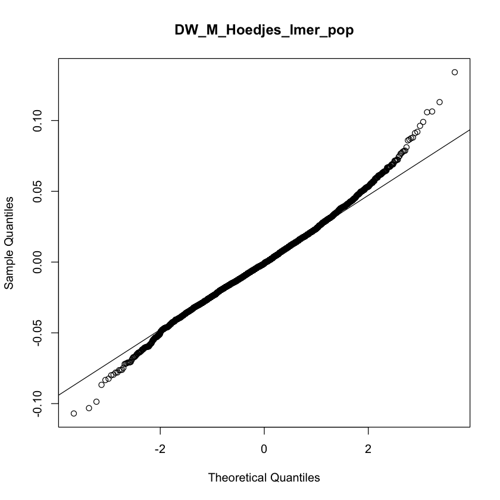
```

##### Onder Lab

_Females_

```{r fig.show = "hold", out.width = "49%", fig.align = "default", echo = FALSE}


```

_Males_

```{r fig.show = "hold", out.width = "49%", fig.align = "default", echo = FALSE}
knitr::include_graphics("LinearModelsPop/DryWeight/by_lab_models_residuals/DW_M_Onder_lmer_pop_hist_residuals.png")

knitr::include_graphics("LinearModelsPop/DryWeight/by_lab_models_residuals/DW_M_Onder_lmer_pop_qq_plot_residuals.png")
```

### Thorax length

```{r include=FALSE}
dir.create(file.path("ThoraxLength"), showWarnings = FALSE)
```

#### Contributors

Kozeretska Lab: Svitlana Serga, Alexandra Protsenko, Oleksandr Maistrenko, Iryna Kozeretska

Posnien Lab: Micael Reis, Lennart Hüper

Ritchie Lab: Megan Mcgunnigle, Nicola  Cook, Teresa Abaurrea, Michael Ritchie

Schmidt Lab: Amy Goldfischer, Paul Schmidt

#### Data Reformatting

```{r}
str(droseu$tl)
```

#### Descriptive Statistics

Descriptive statistics at the line level, with batch information:
```{r, echo=FALSE}
DT::datatable(table_line_wbatch$TL, options = list(pageLength = 10)) %>% formatRound(6:13, 3)
```

Descriptive statistics at the line level, without batch information:
```{r, echo=FALSE}
DT::datatable(table_line_wobatch$TL, options = list(pageLength = 10)) %>% formatRound(5:12, 3)
```

Descriptive statistics at the population level, with batch information:
```{r, echo=FALSE}
DT::datatable(table_pop_wbatch$TL, options = list(pageLength = 10))  %>% formatRound(5:12, 3)
```

Descriptive statistics at the population level, without batch information:
```{r, echo=FALSE}
DT::datatable(table_pop_wobatch$TL, options = list(pageLength = 10))  %>% formatRound(4:11, 3)
```

#### Plots and Linear Models by Lab

```{r}
min_TL <- min(droseu$tl$TL_micrometers)
max_TL <- max(droseu$tl$TL_micrometers)
```

y-axis is scaled by the minimum (`r min_TL`) and maximum (`r max_TL`) values in the full data set.

```{r echo=FALSE}
knitr::include_graphics("ThoraxLength/p_TL_F.pdf")
knitr::include_graphics("ThoraxLength/p_TL_M.pdf")
```

##### Kozeretska Lab

```{r}
lmers_anova$TL_F_Kozeretska_lmer_pop
```

```{r}
lmers_sum$TL_F_Kozeretska_lmer_pop
```

```{r}
lmers_anova$TL_M_Kozeretska_lmer_pop
```

```{r}
lmers_sum$TL_M_Kozeretska_lmer_pop
```

```{r echo=FALSE}
knitr::include_graphics("ThoraxLength/p_TL_F_Kozeretska.pdf")
knitr::include_graphics("ThoraxLength/p_TL_F_pop_Kozeretska.pdf")
```

```{r echo=FALSE}
knitr::include_graphics("ThoraxLength/p_TL_M_Kozeretska.pdf")
knitr::include_graphics("ThoraxLength/p_TL_M_pop_Kozeretska.pdf")
```

##### Posnien Lab

```{r}
lmers_anova$TL_F_Posnien_lmer_pop
```

```{r}
lmers_sum$TL_F_Posnien_lmer_pop
```

```{r}
lmers_anova$TL_M_Posnien_lmer_pop
```

```{r}
lmers_sum$TL_M_Posnien_lmer_pop
```

```{r echo=FALSE}
knitr::include_graphics("ThoraxLength/p_TL_F_Posnien.pdf")
knitr::include_graphics("ThoraxLength/p_TL_F_pop_Posnien.pdf")
```

```{r echo=FALSE}
knitr::include_graphics("ThoraxLength/p_TL_M_Posnien.pdf")
knitr::include_graphics("ThoraxLength/p_TL_M_pop_Posnien.pdf")
```

##### Ritchie Lab

```{r}
lmers_anova$TL_F_Ritchie_lmer_pop
```

```{r}
lmers_sum$TL_F_Ritchie_lmer_pop
```

```{r}
lmers_anova$TL_M_Ritchie_lmer_pop
```

```{r}
lmers_sum$TL_M_Ritchie_lmer_pop
```

```{r echo=FALSE}
knitr::include_graphics("ThoraxLength/p_TL_F_Ritchie.pdf")
knitr::include_graphics("ThoraxLength/p_TL_F_pop_Ritchie.pdf")
```

```{r echo=FALSE}
knitr::include_graphics("ThoraxLength/p_TL_M_Ritchie.pdf")
knitr::include_graphics("ThoraxLength/p_TL_M_pop_Ritchie.pdf")
```

##### Schmidt Lab

```{r}
lmers_anova$TL_F_Schmidt_lmer_pop
```

```{r}
lmers_sum$TL_F_Schmidt_lmer_pop
```

```{r echo=FALSE}
knitr::include_graphics("ThoraxLength/p_TL_F_Schmidt.pdf")
knitr::include_graphics("ThoraxLength/p_TL_F_pop_Schmidt.pdf")
```

#### Linear Models / Residuals

##### Kozeretska Lab

_Females_

```{r fig.show = "hold", out.width = "49%", fig.align = "default", echo = FALSE}


knitr::include_graphics("LinearModelsPop/ThoraxLength/by_lab_models_residuals/TL_F_Kozeretska_lmer_pop_qq_plot_residuals.png")
```

_Males_

```{r fig.show = "hold", out.width = "49%", fig.align = "default", echo = FALSE}
knitr::include_graphics("LinearModelsPop/ThoraxLength/by_lab_models_residuals/TL_M_Kozeretska_lmer_pop_hist_residuals.png")

knitr::include_graphics("LinearModelsPop/ThoraxLength/by_lab_models_residuals/TL_M_Kozeretska_lmer_pop_qq_plot_residuals.png")
```

##### Posnien Lab

_Females_

```{r fig.show = "hold", out.width = "49%", fig.align = "default", echo = FALSE}


```

_Males_

```{r fig.show = "hold", out.width = "49%", fig.align = "default", echo = FALSE}


```

##### Ritchie Lab

_Females_

```{r fig.show = "hold", out.width = "49%", fig.align = "default", echo = FALSE}


knitr::include_graphics("LinearModelsPop/ThoraxLength/by_lab_models_residuals/TL_F_Ritchie_lmer_pop_qq_plot_residuals.png")
```

_Males_

```{r fig.show = "hold", out.width = "49%", fig.align = "default", echo = FALSE}
knitr::include_graphics("LinearModelsPop/ThoraxLength/by_lab_models_residuals/TL_M_Ritchie_lmer_pop_hist_residuals.png")

knitr::include_graphics("LinearModelsPop/ThoraxLength/by_lab_models_residuals/TL_M_Ritchie_lmer_pop_qq_plot_residuals.png")
```

##### Schmidt Lab

_Females_

```{r fig.show = "hold", out.width = "49%", fig.align = "default", echo = FALSE}
knitr::include_graphics("LinearModelsPop/ThoraxLength/by_lab_models_residuals/TL_F_Schmidt_lmer_pop_hist_residuals.png")

knitr::include_graphics("LinearModelsPop/ThoraxLength/by_lab_models_residuals/TL_F_Schmidt_lmer_pop_qq_plot_residuals.png")
```

```{r echo=FALSE}
for (i in dev.list()[1]:dev.list()[length(dev.list())]) {
   invisible(dev.off())
}
# crashed bc tries to save lots -- need to remove some sometimes
```

### Wing area

```{r include=FALSE}
dir.create(file.path("WingArea"), showWarnings = FALSE)
```


#### Contributors

Onder Lab: Cansu Aksoy, Ekin Demir, Ezgi Cobanoglu, Banu Sebnem Onder

Posnien Lab: Micael Reis, Lennart Hüper, Nico Posnien

Ritchie Lab: Megan Mcgunnigle, Nicola  Cook, Teresa Abaurrea, Marija Tanaskovic, Michael Ritchie

Stamenkovic-Radak Lab: Marija Savic Veselinovic, Marija Tanaskovic, Aleksandra Patenkovic, Filip Filopovski, Mihailo Jelic, Katarina Eric, Pavle Eric, Slobodan Davidovic, Marina Stamenkovic-Radak

#### Data Reformatting

```{r d_WA}
str(droseu$wa)
```

#### _Left_

```{r echo=FALSE}
for (i in dev.list()[1]:dev.list()[length(dev.list())]) {
   invisible(dev.off())
}
# crashed bc tries to save lots -- need to remove some sometimes
```


#### Descriptive Statistics

Descriptive statistics at the line level, with batch information:
```{r, echo=FALSE}
DT::datatable(table_line_wbatch$WA_Left, options = list(pageLength = 10)) %>% formatRound(6:13, 3)
```

Descriptive statistics at the line level, without batch information:
```{r, echo=FALSE}
DT::datatable(table_line_wobatch$WA_Left, options = list(pageLength = 10)) %>% formatRound(5:12, 3)
```

Descriptive statistics at the population level, with batch information:
```{r, echo=FALSE}
DT::datatable(table_pop_wbatch$WA_Left, options = list(pageLength = 10))  %>% formatRound(5:12, 3)
```

Descriptive statistics at the population level, without batch information:
```{r, echo=FALSE}
DT::datatable(table_pop_wobatch$WA_Left, options = list(pageLength = 10))  %>% formatRound(4:11, 3)
```

#### Plots and Linear Models by Lab

```{r}

min_WAL <- min(droseu$wa$CentroidSizeLeft_micrometers)
max_WAL <- max(droseu$wa$CentroidSizeLeft_micrometers)

```

y-axis is scaled by the minimum (`r min_WAL`) and maximum (`r max_WAL`) values in the full data set.


```{r echo=FALSE}
knitr::include_graphics("WingArea/p_WA_F_L.pdf")
knitr::include_graphics("WingArea/p_WA_M_L.pdf")
```

##### Onder Lab

```{r}
lmers_anova$WA_L_F_Onder_lmer_pop
```

```{r}
lmers_sum$WA_L_F_Onder_lmer_pop
```

```{r}
lmers_anova$WA_L_M_Onder_lmer_pop
```

```{r}
lmers_sum$WA_L_M_Onder_lmer_pop
```

```{r echo=FALSE}
knitr::include_graphics("WingArea/p_WA_F_Onder_L.pdf")
knitr::include_graphics("WingArea/p_WA_F_L_pop_Onder.pdf")
```

```{r echo=FALSE}
knitr::include_graphics("WingArea/p_WA_M_Onder_L.pdf")
knitr::include_graphics("WingArea/p_WA_M_L_pop_Onder.pdf")
```

##### Posnien Lab

```{r}
lmers_anova$WA_L_F_Posnien_lmer_pop
```

```{r}
lmers_sum$WA_L_F_Posnien_lmer_pop
```

```{r}
lmers_anova$WA_L_M_Posnien_lmer_pop
```

```{r}
lmers_sum$WA_L_M_Posnien_lmer_pop
```


```{r echo=FALSE}
knitr::include_graphics("WingArea/p_WA_F_L_Posnien.pdf")
knitr::include_graphics("WingArea/p_WA_F_L_pop_Posnien.pdf")
```

```{r echo=FALSE}
knitr::include_graphics("WingArea/p_WA_M_L_Posnien.pdf")
knitr::include_graphics("WingArea/p_WA_M_L_pop_Posnien.pdf")
```

##### Ritchie Lab

```{r}
lmers_anova$WA_L_F_Ritchie_lmer_pop
```

```{r}
lmers_sum$WA_L_F_Ritchie_lmer_pop
```

```{r}
lmers_anova$WA_L_M_Ritchie_lmer_pop
```

```{r}
lmers_sum$WA_L_M_Ritchie_lmer_pop
```

```{r echo=FALSE}
knitr::include_graphics("WingArea/p_WA_F_L_Ritchie.pdf")
knitr::include_graphics("WingArea/p_WA_F_L_pop_Ritchie.pdf")
```

```{r echo=FALSE}
knitr::include_graphics("WingArea/p_WA_M_L_Ritchie.pdf")
knitr::include_graphics("WingArea/p_WA_M_L_pop_Ritchie.pdf")
```

##### Stamenkovic-Radak Lab

```{r}
lmers_anova$WA_L_F_StamenkovicRadak_lmer_pop
```

```{r}
lmers_sum$WA_L_F_StamenkovicRadak_lmer_pop
```

```{r}
lmers_anova$WA_L_M_StamenkovicRadak_lmer_pop
```

```{r}
lmers_sum$WA_L_M_StamenkovicRadak_lmer_pop
```

```{r echo=FALSE}
knitr::include_graphics("WingArea/p_WA_F_L_StamenkovicRadak.pdf")
knitr::include_graphics("WingArea/p_WA_F_L_pop_StamenkovicRadak.pdf")
```

```{r echo=FALSE}
knitr::include_graphics("WingArea/p_WA_M_L_StamenkovicRadak.pdf")
knitr::include_graphics("WingArea/p_WA_M_L_pop_StamenkovicRadak.pdf")
```

#### _Right_

#### Descriptive Statistics

Descriptive statistics at the line level, with batch information:
```{r, echo=FALSE}
DT::datatable(table_line_wbatch$WA_Right, options = list(pageLength = 10)) %>% formatRound(6:13, 3)
```

Descriptive statistics at the line level, without batch information:
```{r, echo=FALSE}
DT::datatable(table_line_wobatch$WA_Right, options = list(pageLength = 10)) %>% formatRound(5:12, 3)
```

Descriptive statistics at the population level, with batch information:
```{r, echo=FALSE}
DT::datatable(table_pop_wbatch$WA_Right, options = list(pageLength = 10))  %>% formatRound(5:12, 3)
```

Descriptive statistics at the population level, without batch information:
```{r, echo=FALSE}
DT::datatable(table_pop_wobatch$WA_Right, options = list(pageLength = 10))  %>% formatRound(4:11, 3)
```

#### Plots and Linear Models by Lab

##### Overview

```{r}
min_WAR <- min(droseu$wa$CentroidSizeRight_micrometers)
max_WAR <- max(droseu$wa$CentroidSizeRight_micrometers)
```

```{r echo=FALSE}
knitr::include_graphics("WingArea/p_WA_F_R.pdf")
knitr::include_graphics("WingArea/p_WA_M_R.pdf")
```

##### Onder Lab

```{r include=FALSE}
for (i in dev.list()[1]:dev.list()[length(dev.list())]) {
   invisible(dev.off())
}
# crashed bc tries to save lots -- need to remove some
```

```{r}
lmers_anova$WA_R_F_Onder_lmer_pop
```

```{r}
lmers_sum$WA_R_F_Onder_lmer_pop
```

```{r}
lmers_anova$WA_R_M_Onder_lmer_pop
```

```{r}
lmers_sum$WA_R_M_Onder_lmer_pop
```

```{r echo=FALSE}
knitr::include_graphics("WingArea/p_WA_F_R_Onder.pdf")
knitr::include_graphics("WingArea/p_WA_F_R_pop_Onder.pdf")
```

```{r echo=FALSE}
knitr::include_graphics("WingArea/p_WA_M_R_Onder.pdf")
knitr::include_graphics("WingArea/p_WA_M_R_pop_Onder.pdf")
```

##### Posnien Lab

```{r}
lmers_anova$WA_R_F_Posnien_lmer_pop
```

```{r}
lmers_sum$WA_R_F_Posnien_lmer_pop
```

```{r}
lmers_anova$WA_R_M_Posnien_lmer_pop
```

```{r}
lmers_sum$WA_R_M_Posnien_lmer_pop
```


```{r echo=FALSE}
knitr::include_graphics("WingArea/p_WA_F_R_Posnien.pdf")
knitr::include_graphics("WingArea/p_WA_F_R_pop_Posnien.pdf")
```

```{r echo=FALSE}
knitr::include_graphics("WingArea/p_WA_M_R_Posnien.pdf")
knitr::include_graphics("WingArea/p_WA_M_R_pop_Posnien.pdf")
```

##### Ritchie Lab

```{r}
lmers_anova$WA_R_F_Ritchie_lmer_pop
```

```{r}
lmers_sum$WA_R_F_Ritchie_lmer_pop
```

```{r}
lmers_anova$WA_R_M_Ritchie_lmer_pop
```

```{r}
lmers_sum$WA_R_M_Ritchie_lmer_pop
```


```{r echo=FALSE}
knitr::include_graphics("WingArea/p_WA_F_R_Ritchie.pdf")
knitr::include_graphics("WingArea/p_WA_F_R_pop_Ritchie.pdf")
```

```{r echo=FALSE}
knitr::include_graphics("WingArea/p_WA_M_R_Ritchie.pdf")
knitr::include_graphics("WingArea/p_WA_M_R_pop_Ritchie.pdf")
```

##### Stamenkovic-Radak Lab

```{r}
lmers_anova$WA_R_F_StamenkovicRadak_lmer_pop
```

```{r}
lmers_sum$WA_R_F_StamenkovicRadak_lmer_pop
```

```{r}
lmers_anova$WA_R_M_StamenkovicRadak_lmer_pop
```

```{r}
lmers_sum$WA_R_M_StamenkovicRadak_lmer_pop
```

```{r echo=FALSE}
knitr::include_graphics("WingArea/p_WA_F_R_StamenkovicRadak.pdf")
knitr::include_graphics("WingArea/p_WA_F_R_pop_StamenkovicRadak.pdf")
```

```{r echo=FALSE}
knitr::include_graphics("WingArea/p_WA_M_R_StamenkovicRadak.pdf")
knitr::include_graphics("WingArea/p_WA_M_R_pop_StamenkovicRadak.pdf")
```

#### Linear Models / Residuals (Left)

##### Onder Lab

_Females_

```{r fig.show = "hold", out.width = "49%", fig.align = "default", echo = FALSE}


knitr::include_graphics("LinearModelsPop/WingArea/by_lab_models_residuals/WA_L_F_Onder_lmer_pop_qq_plot_residuals.png")
```

_Males_

```{r fig.show = "hold", out.width = "49%", fig.align = "default", echo = FALSE}


knitr::include_graphics("LinearModelsPop/WingArea/by_lab_models_residuals/WA_L_M_Onder_lmer_pop_qq_plot_residuals.png")
```

##### Posnien Lab

_Females_

```{r fig.show = "hold", out.width = "49%", fig.align = "default", echo = FALSE}
knitr::include_graphics("LinearModelsPop/WingArea/by_lab_models_residuals/WA_L_F_Posnien_lmer_pop_hist_residuals.png")

knitr::include_graphics("LinearModelsPop/WingArea/by_lab_models_residuals/WA_L_F_Posnien_lmer_pop_qq_plot_residuals.png")
```

_Males_

```{r fig.show = "hold", out.width = "49%", fig.align = "default", echo = FALSE}
knitr::include_graphics("LinearModelsPop/WingArea/by_lab_models_residuals/WA_L_M_Posnien_lmer_pop_hist_residuals.png")

knitr::include_graphics("LinearModelsPop/WingArea/by_lab_models_residuals/WA_L_M_Posnien_lmer_pop_qq_plot_residuals.png")
```

##### Ritchie Lab

_Females_

```{r fig.show = "hold", out.width = "49%", fig.align = "default", echo = FALSE}


```

_Males_

```{r fig.show = "hold", out.width = "49%", fig.align = "default", echo = FALSE}


knitr::include_graphics("LinearModelsPop/WingArea/by_lab_models_residuals/WA_L_M_Ritchie_lmer_pop_qq_plot_residuals.png")
```

##### Stamenkovic-Radak Lab

_Females_

```{r fig.show = "hold", out.width = "49%", fig.align = "default", echo = FALSE}
knitr::include_graphics("LinearModelsPop/WingArea/by_lab_models_residuals/WA_L_F_StamenkovicRadak_lmer_pop_hist_residuals.png")

knitr::include_graphics("LinearModelsPop/WingArea/by_lab_models_residuals/WA_L_F_StamenkovicRadak_lmer_pop_qq_plot_residuals.png")
```

_Males_

```{r fig.show = "hold", out.width = "49%", fig.align = "default", echo = FALSE}
knitr::include_graphics("LinearModelsPop/WingArea/by_lab_models_residuals/WA_L_M_StamenkovicRadak_lmer_pop_hist_residuals.png")


```

#### Linear Models / Residuals (Right)

##### Onder Lab

_Females_

```{r fig.show = "hold", out.width = "49%", fig.align = "default", echo = FALSE}


knitr::include_graphics("LinearModelsPop/WingArea/by_lab_models_residuals/WA_R_F_Onder_lmer_pop_qq_plot_residuals.png")
```

_Males_

```{r fig.show = "hold", out.width = "49%", fig.align = "default", echo = FALSE}
knitr::include_graphics("LinearModelsPop/WingArea/by_lab_models_residuals/WA_R_M_Onder_lmer_pop_hist_residuals.png")

knitr::include_graphics("LinearModelsPop/WingArea/by_lab_models_residuals/WA_R_M_Onder_lmer_pop_qq_plot_residuals.png")
```

##### Posnien Lab

_Females_

```{r fig.show = "hold", out.width = "49%", fig.align = "default", echo = FALSE}
knitr::include_graphics("LinearModelsPop/WingArea/by_lab_models_residuals/WA_R_F_Posnien_lmer_pop_hist_residuals.png")


```

_Males_

```{r fig.show = "hold", out.width = "49%", fig.align = "default", echo = FALSE}
knitr::include_graphics("LinearModelsPop/WingArea/by_lab_models_residuals/WA_R_M_Posnien_lmer_pop_hist_residuals.png")

knitr::include_graphics("LinearModelsPop/WingArea/by_lab_models_residuals/WA_R_M_Posnien_lmer_pop_qq_plot_residuals.png")
```

##### Ritchie Lab

_Females_

```{r fig.show = "hold", out.width = "49%", fig.align = "default", echo = FALSE}
knitr::include_graphics("LinearModelsPop/WingArea/by_lab_models_residuals/WA_R_F_Ritchie_lmer_pop_hist_residuals.png")

knitr::include_graphics("LinearModelsPop/WingArea/by_lab_models_residuals/WA_R_F_Ritchie_lmer_pop_qq_plot_residuals.png")
```

_Males_

```{r fig.show = "hold", out.width = "49%", fig.align = "default", echo = FALSE}
knitr::include_graphics("LinearModelsPop/WingArea/by_lab_models_residuals/WA_R_M_Ritchie_lmer_pop_hist_residuals.png")

knitr::include_graphics("LinearModelsPop/WingArea/by_lab_models_residuals/WA_R_M_Ritchie_lmer_pop_qq_plot_residuals.png")
```

##### Stamenkovic-Radak Lab

_Females_

```{r fig.show = "hold", out.width = "49%", fig.align = "default", echo = FALSE}
knitr::include_graphics("LinearModelsPop/WingArea/by_lab_models_residuals/WA_R_F_StamenkovicRadak_lmer_pop_hist_residuals.png")

knitr::include_graphics("LinearModelsPop/WingArea/by_lab_models_residuals/WA_R_F_StamenkovicRadak_lmer_pop_qq_plot_residuals.png")
```

_Males_

```{r fig.show = "hold", out.width = "49%", fig.align = "default", echo = FALSE}
knitr::include_graphics("LinearModelsPop/WingArea/by_lab_models_residuals/WA_R_M_StamenkovicRadak_lmer_pop_hist_residuals.png")


```

```{r echo=FALSE}
for (i in dev.list()[1]:dev.list()[length(dev.list())]) {
   invisible(dev.off())
}
# crashed bc tries to save lots -- need to remove some sometimes
```

### Fecundity

```{r include=FALSE}
dir.create(file.path("Fecundity"), showWarnings = FALSE)
```


```{r}
#Note that the trait has been phenotyped only in females.
```

#### Contributors

Billeter Lab: Xiaocui Wang, Tiphaine Bailly, Mario Mira, Jean-Christophe Billeter

Fricke Lab: Claudia Fricke

#### Data Reformatting

```{r d_Fec}
str(droseu$fec)
```

#### Descriptive Statistics

Descriptive statistics at the line level, with batch information:
```{r tables_fec, echo=FALSE}
DT::datatable(table_line_wbatch$Fec, options = list(pageLength = 10)) %>% formatRound(6:13, 3)
```

Descriptive statistics for fecundity at the line level, without batch information:
```{r, echo=FALSE}
DT::datatable(table_line_wobatch$Fec, options = list(pageLength = 10)) %>% formatRound(5:12, 3)
```

Descriptive statistics at the population level, with batch information:
```{r, echo=FALSE}
DT::datatable(table_pop_wbatch$Fec, options = list(pageLength = 10))  %>% formatRound(5:12, 3)
```

Descriptive statistics at the population level, without batch information:
```{r, echo=FALSE}
DT::datatable(table_pop_wobatch$Fec, options = list(pageLength = 10)) %>% formatRound(4:11, 3)
```

#### Plots and Linear Models by Lab


```{r echo=TRUE}
min_Fec <- min(droseu$fec$NumberOfAdultsEclosed)
max_Fec <- max(droseu$fec$NumberOfAdultsEclosed)
```

y-axis is scaled by the minimum (`r min_Fec`) and maximum (`r max_Fec`) values in the full data set.


```{r echo=FALSE}
knitr::include_graphics("Fecundity/p_Fec_all.pdf")
```

##### Billeter Lab

```{r}
lmers_anova$Fec_Billeter_lmer_pop
```

```{r}
lmers_sum$Fec_Billeter_lmer_pop
```

```{r echo=FALSE}
knitr::include_graphics("Fecundity/p_Fec_Billeter.pdf")
knitr::include_graphics("Fecundity/p_Fec_pop_Billeter.pdf")
```

##### Fricke Lab

```{r}
lmers_anova$Fec_Fricke_lmer_pop
```

```{r}
lmers_sum$Fec_Fricke_lmer_pop
```

```{r echo=FALSE}
knitr::include_graphics("Fecundity/p_Fec_Fricke.pdf")
knitr::include_graphics("Fecundity/p_Fec_pop_Fricke.pdf")
```

#### Linear Models / Residuals

##### Billeter Lab

```{r fig.show = "hold", out.width = "49%", fig.align = "default", echo = FALSE}
knitr::include_graphics("LinearModelsPop/Fecundity/by_lab_models_residuals/Fec_Billeter_lmer_pop_hist_residuals.png")


```

##### Fricke Lab

```{r fig.show = "hold", out.width = "49%", fig.align = "default", echo = FALSE}
knitr::include_graphics("LinearModelsPop/Fecundity/by_lab_models_residuals/Fec_Fricke_lmer_pop_hist_residuals.png")

knitr::include_graphics("LinearModelsPop/Fecundity/by_lab_models_residuals/Fec_Fricke_lmer_pop_qq_plot_residuals.png")
```

### Lifespan

```{r echo=FALSE}
dir.create(file.path("Lifespan"), showWarnings = FALSE)
```


```{r echo=FALSE}
for (i in dev.list()[1]:dev.list()[length(dev.list())]) {
   invisible(dev.off())
}
# crashed bc tries to save lots -- need to remove some
```

#### Contributors

Flatt Lab: Esra Durmaz, Envel Kerdaffrec, Thibault Schowing, Virginie Thieu, Marisa Rodrigues, Thomas Flatt

Parsch Lab: Amanda Glaser-Schmitt, Eliza Argyridou, John Parsch

Pasyukova Lab: Natalia Roshina, Alexander Symonenko, Mikhail Trostnikov, Evgenia Tsybul'ko, Ekaterina Veselkina, Olga Rybina, Elena Pasyukova

#### Data Reformatting

```{r}
str(droseu$lsl)
```

```{r}
str(droseu$lsp)
```

```{r}
str(droseu$lsm)
```

#### Descriptive Statistics

Descriptive statistics at the line level, with batch information:

```{r tbales_ls, echo=FALSE}
DT::datatable(table_line_wbatch$LS_L, options = list(pageLength = 10)) %>% formatRound(6:13, 3)
```

Descriptive statistics at the line level, without batch information:

```{r, echo=FALSE}
DT::datatable(table_line_wobatch$LS_L, options = list(pageLength = 10)) %>% formatRound(5:12, 3)
```

Descriptive statistics at the population level, with batch information:
```{r, echo=FALSE}
DT::datatable(table_pop_wbatch$LS_M, options = list(pageLength = 10)) %>% formatRound(5:12, 3)
```

Descriptive statistics at the population level, without batch information:
```{r, echo=FALSE}
DT::datatable(table_pop_wobatch$LS_M, options = list(pageLength = 10)) %>% formatRound(4:11, 3)
```

#### Plots and Linear Models by Lab

```{r}
min_LS <- min(droseu$lsm$LSM_AgeAtDeath_days)
max_LS <- max(droseu$lsm$LSM_AgeAtDeath_days)
```

y-axis is scaled by the minimum (`r min_LS`) and maximum (`r max_LS`) values in the full data set.

```{r echo=FALSE}
knitr::include_graphics("Lifespan/p_LS_F.pdf")
knitr::include_graphics("Lifespan/p_LS_M.pdf")
```

##### Flatt Lab

```{r}
lmers_anova$LS_F_Flatt_lmer_pop
```

```{r}
lmers_sum$LS_F_Flatt_lmer_pop
```

```{r}
lmers_anova$LS_M_Flatt_lmer_pop
```

```{r}
lmers_sum$LS_M_Flatt_lmer_pop
```

```{r echo=FALSE}
knitr::include_graphics("Lifespan/p_LS_F_Flatt.pdf")
knitr::include_graphics("Lifespan/p_LS_M_Flatt.pdf")
```

##### Parsch Lab

```{r}
lmers_anova$LS_F_Parsch_lmer_pop
```

```{r}
lmers_sum$LS_F_Parsch_lmer_pop
```

```{r}
lmers_anova$LS_M_Parsch_lmer_pop
```

```{r}
lmers_sum$LS_M_Parsch_lmer_pop
```
```{r echo=FALSE}
knitr::include_graphics("Lifespan/p_LS_F_Parsch.pdf")
knitr::include_graphics("Lifespan/p_LS_F_pop_Parsch.pdf")
```

```{r echo=FALSE}
knitr::include_graphics("Lifespan/p_LS_M_Parsch.pdf")
knitr::include_graphics("Lifespan/p_LS_M_pop_Parsch.pdf")
```

##### Pasyukova Lab

```{r}
lmers_anova$LS_F_Pasyukova_lmer_pop
```

```{r}
lmers_sum$LS_F_Pasyukova_lmer_pop
```

```{r}
lmers_anova$LS_M_Pasyukova_lmer_pop
```

```{r}
lmers_sum$LS_M_Pasyukova_lmer_pop
```

```{r echo=FALSE}
knitr::include_graphics("Lifespan/p_LS_F_Pasyukova.pdf")
knitr::include_graphics("Lifespan/p_LS_F_pop_Pasyukova.pdf")
```

```{r echo=FALSE}
knitr::include_graphics("Lifespan/p_LS_M_Pasyukova.pdf")
knitr::include_graphics("Lifespan/p_LS_M_pop_Pasyukova.pdf")
```

#### Survival Analyses

##### Flatt Lab

_Females_
```{r}
coxme_anova$LS_P_F_Flatt_coxme
```

```{r echo=FALSE}
knitr::include_graphics("SurvivalAnalyses/Lifespan/p_LS_F_Flatt_survival_curves.pdf")
```

_Males_
```{r}
coxme_anova$LS_P_M_Flatt_coxme
```

```{r echo=FALSE}
knitr::include_graphics("SurvivalAnalyses/Lifespan/p_LS_M_Flatt_survival_curves.pdf")
```

##### Parsch Lab

_Females_

```{r}
coxme_anova$LS_L_F_Parsch_coxme
```

```{r echo=FALSE}
knitr::include_graphics("SurvivalAnalyses/Lifespan/p_LS_F_Parsch_survival_curves.pdf")
```

_Males_

```{r}
coxme_anova$LS_L_M_Parsch_coxme
```

```{r echo=FALSE}
knitr::include_graphics("SurvivalAnalyses/Lifespan/p_LS_M_Parsch_survival_curves.pdf")
```

##### Pasyukova Lab

_Females_
```{r}
coxme_anova$LS_L_F_Pasyukova_coxme
```

```{r echo=FALSE}
knitr::include_graphics("SurvivalAnalyses/Lifespan/p_LS_F_Pasyukova_survival_curves.pdf")
```

_Males_
```{r}
coxme_anova$LS_L_M_Pasyukova_coxme
```

```{r echo=FALSE}
knitr::include_graphics("SurvivalAnalyses/Lifespan/p_LS_M_Pasyukova_survival_curves.pdf")
```

#### Linear Models / Residuals

##### Flatt Lab

_Females_

```{r fig.show = "hold", out.width = "49%", fig.align = "default", echo = FALSE}
knitr::include_graphics("LinearModelsPop/Lifespan/by_lab_models_residuals/LS_F_Flatt_lmer_pop_hist_residuals.png")

knitr::include_graphics("LinearModelsPop/Lifespan/by_lab_models_residuals/LS_F_Flatt_lmer_pop_qq_plot_residuals.png")
```

_Males_

```{r fig.show = "hold", out.width = "49%", fig.align = "default", echo = FALSE}


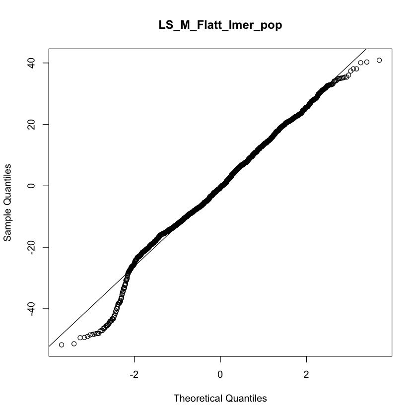
```

##### Parsch Lab

_Females_

```{r fig.show = "hold", out.width = "49%", fig.align = "default", echo = FALSE}
knitr::include_graphics("LinearModelsPop/Lifespan/by_lab_models_residuals/LS_F_Parsch_lmer_pop_hist_residuals.png")

knitr::include_graphics("LinearModelsPop/Lifespan/by_lab_models_residuals/LS_F_Parsch_lmer_pop_qq_plot_residuals.png")
```

_Males_

```{r fig.show = "hold", out.width = "49%", fig.align = "default", echo = FALSE}
knitr::include_graphics("LinearModelsPop/Lifespan/by_lab_models_residuals/LS_M_Parsch_lmer_pop_hist_residuals.png")

knitr::include_graphics("LinearModelsPop/Lifespan/by_lab_models_residuals/LS_M_Parsch_lmer_pop_qq_plot_residuals.png")
```

##### Pasyukova Lab

_Females_

```{r fig.show = "hold", out.width = "49%", fig.align = "default", echo = FALSE}


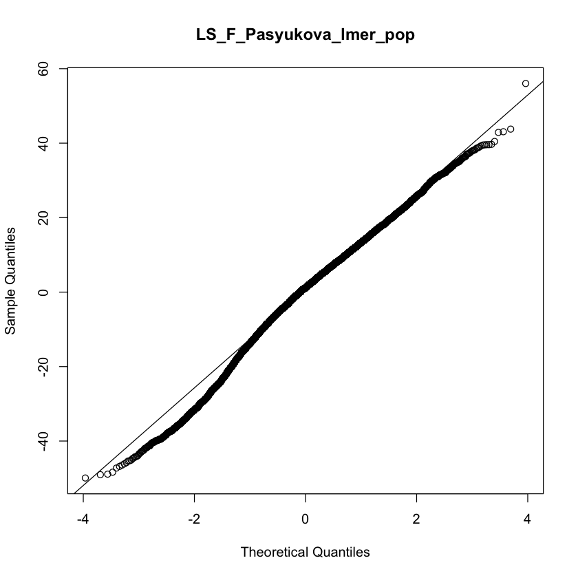
```

_Males_

```{r fig.show = "hold", out.width = "49%", fig.align = "default", echo = FALSE}
knitr::include_graphics("LinearModelsPop/Lifespan/by_lab_models_residuals/LS_M_Pasyukova_lmer_pop_hist_residuals.png")

knitr::include_graphics("LinearModelsPop/Lifespan/by_lab_models_residuals/LS_M_Pasyukova_lmer_pop_qq_plot_residuals.png")
```

### Cold-shock mortality

```{r echo=FALSE}
dir.create(file.path("ColdShock"), showWarnings = FALSE)
```


#### Contributors

Gonzalez Lab: Llewellyn Green, Josefa Gonzalez, Miriam Merenciano

Kozeretska Lab: Svitlana Serga, Alexandra Protsenko, Oleksandr Maistrenko, Iryna Kozeretska

Vieira Lab: Jorge Vieira, Cristina P. Vieira, Pedro Duque, Tânia Dias


#### Data Reformatting

```{r}
str(droseu$csm)
```

#### Descriptive Statistics


Descriptive statistics at the line level, with batch information:
```{r, echo=FALSE}
DT::datatable(table_line_wbatch$CSM, options = list(pageLength = 10)) %>% formatRound(6:13, 3)
```

Descriptive statistics at the line level, without batch information:
```{r, echo=FALSE}
DT::datatable(table_line_wobatch$CSM, options = list(pageLength = 10)) %>% formatRound(5:12, 3)
```

Descriptive statistics at the population level, with batch information:
```{r, echo=FALSE}
DT::datatable(table_pop_wbatch$CSM, options = list(pageLength = 10)) %>% formatRound(5:12, 3)
```

Descriptive statistics at the population level, without batch information:
```{r, echo=FALSE}
DT::datatable(table_pop_wobatch$CSM, options = list(pageLength = 10)) %>% formatRound(4:11, 3)
```

#### Plots and Linear Models by Lab


```{r min_max_CSM, echo=TRUE}
min_CSM <- min(droseu$csm$CSM_PropDead_ED)
max_CSM <- max(droseu$csm$CSM_PropDead_ED)
```

y-axis is scaled by the minimum (`r min_CSM`) and maximum (`r max_CSM`) values in the full data set.

```{r echo=FALSE}
knitr::include_graphics("ColdShock/p_CSM_F.pdf")
knitr::include_graphics("ColdShock/p_CSM_M.pdf")
```
##### Gonzalez Lab

```{r}
lmers_anova$CSM_F_Gonzalez_lmer_pop
```

```{r}
lmers_sum$CSM_F_Gonzalez_lmer_pop
```

```{r}
lmers_anova$CSM_M_Gonzalez_lmer_pop
```

```{r}
lmers_sum$CSM_M_Gonzalez_lmer_pop
```

```{r echo=FALSE}
knitr::include_graphics("ColdShock/p_CSM_F_Gonzalez.pdf")
knitr::include_graphics("ColdShock/p_CSM_F_pop_Gonzalez.pdf")
```

```{r echo=FALSE}
knitr::include_graphics("ColdShock/p_CSM_M_Gonzalez.pdf")
knitr::include_graphics("ColdShock/p_CSM_M_pop_Gonzalez.pdf")
```

##### Kozeretska Lab

```{r}
lmers_anova$CSM_F_Kozeretska_lmer_pop
```

```{r}
lmers_sum$CSM_F_Kozeretska_lmer_pop
```

```{r}
lmers_anova$CSM_M_Kozeretska_lmer_pop
```

```{r}
lmers_sum$CSM_M_Kozeretska_lmer_pop
```

```{r echo=FALSE}
knitr::include_graphics("ColdShock/p_CSM_F_Kozeretska.pdf")
knitr::include_graphics("ColdShock/p_CSM_F_pop_Kozeretska.pdf")
```

```{r echo=FALSE}
knitr::include_graphics("ColdShock/p_CSM_M_Kozeretska.pdf")
knitr::include_graphics("ColdShock/p_CSM_M_pop_Kozeretska.pdf")
```

##### Vieira Lab

```{r}
lmers_anova$CSM_F_Vieira_lmer_pop
```

```{r}
lmers_sum$CSM_F_Vieira_lmer_pop
```

```{r}
lmers_anova$CSM_M_Vieira_lmer_pop
```

```{r}
lmers_sum$CSM_M_Vieira_lmer_pop
```

```{r echo=FALSE}
knitr::include_graphics("ColdShock/p_CSM_F_Vieira.pdf")
knitr::include_graphics("ColdShock/p_CSM_F_pop_Vieira.pdf")
```

```{r echo=FALSE}
knitr::include_graphics("ColdShock/p_CSM_M_Vieira.pdf")
knitr::include_graphics("ColdShock/p_CSM_M_pop_Vieira.pdf")
```

#### Linear Models / Residuals

##### Gonzalez Lab

_Females_

```{r fig.show = "hold", out.width = "49%", fig.align = "default", echo = FALSE}
knitr::include_graphics("LinearModelsPop/ColdShock/by_lab_models_residuals/CSM_F_Gonzalez_lmer_pop_hist_residuals.png")

knitr::include_graphics("LinearModelsPop/ColdShock/by_lab_models_residuals/CSM_F_Gonzalez_lmer_pop_qq_plot_residuals.png")
```

_Males_

```{r fig.show = "hold", out.width = "49%", fig.align = "default", echo = FALSE}


knitr::include_graphics("LinearModelsPop/ColdShock/by_lab_models_residuals/CSM_M_Gonzalez_lmer_pop_qq_plot_residuals.png")
```

##### Kozeretska Lab

_Females_

```{r fig.show = "hold", out.width = "49%", fig.align = "default", echo = FALSE}
knitr::include_graphics("LinearModelsPop/ColdShock/by_lab_models_residuals/CSM_F_Kozeretska_lmer_pop_hist_residuals.png")


```

_Males_

```{r fig.show = "hold", out.width = "49%", fig.align = "default", echo = FALSE}
knitr::include_graphics("LinearModelsPop/ColdShock/by_lab_models_residuals/CSM_M_Kozeretska_lmer_pop_hist_residuals.png")

knitr::include_graphics("LinearModelsPop/ColdShock/by_lab_models_residuals/CSM_M_Kozeretska_lmer_pop_qq_plot_residuals.png")
```

##### Vieira Lab

_Females_

```{r fig.show = "hold", out.width = "49%", fig.align = "default", echo = FALSE}


knitr::include_graphics("LinearModelsPop/ColdShock/by_lab_models_residuals/CSM_F_Vieira_lmer_pop_qq_plot_residuals.png")
```

_Males_

```{r fig.show = "hold", out.width = "49%", fig.align = "default", echo = FALSE}
knitr::include_graphics("LinearModelsPop/ColdShock/by_lab_models_residuals/CSM_M_Vieira_lmer_pop_hist_residuals.png")


```

```{r echo=FALSE}
for (i in dev.list()[1]:dev.list()[length(dev.list())]) {
   invisible(dev.off())
}
# crashed bc tries to save lots -- need to remove some sometimes
```

### Chill-coma recovery time

```{r include=FALSE}
dir.create(file.path("ChillComa"), showWarnings = FALSE)
```


#### Contributors

Mensch Lab: Florencia Putero, Lucas Kreiman, Julian Mensch

Vieira Lab: Jorge Vieira, Cristina P. Vieira, Pedro Duque, Tânia Dias


#### Data Reformatting

```{r}
str(droseu$ccrt)
```

#### Descriptive Statistics

Descriptive statistics at the line level, with batch information:
```{r, echo=FALSE}
DT::datatable(table_line_wbatch$CCRT, options = list(pageLength = 10)) %>% formatRound(6:13, 3)
```

Descriptive statistics at the line level, without batch information:
```{r, echo=FALSE}
DT::datatable(table_line_wobatch$CCRT, options = list(pageLength = 10)) %>% formatRound(5:12, 3)
```

Descriptive statistics at the population level, with batch information:
```{r, echo=FALSE}
DT::datatable(table_pop_wbatch$CCRT, options = list(pageLength = 10)) %>% formatRound(5:12, 3)
```

Descriptive statistics at the population level, without batch information:
```{r, echo=FALSE}
DT::datatable(table_pop_wobatch$CCRT, options = list(pageLength = 10)) %>% formatRound(4:11, 3)
```

#### Plots and Linear Models by Lab

```{r min_max_CCRT, echo=TRUE}
min_CCRT <- min(droseu$ccrt$CCRT_seconds)
max_CCRT <- max(droseu$ccrt$CCRT_seconds)
```

y-axis is scaled by the minimum (`r min_CSM`) and maximum (`r max_CSM`) values in the full data set.

##### Mensch Lab

```{r}
lmers_anova$CCRT_F_Mensch_lmer_pop
```

```{r}
lmers_sum$CCRT_F_Mensch_lmer_pop
```

```{r}
lmers_anova$CCRT_M_Mensch_lmer_pop
```

```{r}
lmers_sum$CCRT_M_Mensch_lmer_pop
```

```{r echo=FALSE}
knitr::include_graphics("ChillComa/p_CCRT_F_Mensch.pdf")
knitr::include_graphics("ChillComa/p_CCRT_F_pop_Mensch.pdf")
```

```{r echo=FALSE}
knitr::include_graphics("ChillComa/p_CCRT_M_Mensch.pdf")
knitr::include_graphics("ChillComa/p_CCRT_M_pop_Mensch.pdf")
```

##### Vieira Lab

```{r}
lmers_anova$CCRT_F_Vieira_lmer_pop
```

```{r}
lmers_sum$CCRT_F_Vieira_lmer_pop
```

```{r}
lmers_anova$CCRT_M_Vieira_lmer_pop
```

```{r}
lmers_sum$CCRT_M_Vieira_lmer_pop
```

```{r echo=FALSE}
knitr::include_graphics("ChillComa/p_CCRT_F_Vieira.pdf")
knitr::include_graphics("ChillComa/p_CCRT_F_pop_Vieira.pdf")
```

```{r echo=FALSE}
knitr::include_graphics("ChillComa/p_CCRT_M_Vieira.pdf")
knitr::include_graphics("ChillComa/p_CCRT_M_pop_Vieira.pdf")
```

#### Survival Analyses

##### Mensch Lab

_Females_
```{r}
coxme_anova$CCRT_F_coxme_Mensch
```

```{r, echo=FALSE}
knitr::include_graphics("SurvivalAnalyses/ChillComa/p_CCRT_F_Mensch_survival_curves.pdf")
```

_Males_
```{r}
coxme_anova$CCRT_M_coxme_Mensch
```

```{r, echo=FALSE}
knitr::include_graphics("SurvivalAnalyses/ChillComa/p_CCRT_M_Mensch_survival_curves.pdf")
```

##### Vieira Lab

_Females_
```{r}
coxme_anova$CCRT_F_coxme_Vieira
```

```{r, echo=FALSE}
knitr::include_graphics("SurvivalAnalyses/ChillComa/p_CCRT_F_Vieira_survival_curves.pdf")
```

_Males_
```{r}
coxme_anova$CCRT_M_coxme_Vieira
```

```{r, echo=FALSE}
knitr::include_graphics("SurvivalAnalyses/ChillComa/p_CCRT_M_Vieira_survival_curves.pdf")
```

#### Linear Models / Residuals

##### Mensch Lab

_Females_

```{r fig.show = "hold", out.width = "49%", fig.align = "default", echo = FALSE}
knitr::include_graphics("LinearModelsPop/ChillComa/by_lab_models_residuals/CCRT_F_Mensch_lmer_pop_hist_residuals.png")

knitr::include_graphics("LinearModelsPop/ChillComa/by_lab_models_residuals/CCRT_F_Mensch_lmer_pop_qq_plot_residuals.png")
```

_Males_

```{r fig.show = "hold", out.width = "49%", fig.align = "default", echo = FALSE}
knitr::include_graphics("LinearModelsPop/ChillComa/by_lab_models_residuals/CCRT_M_Mensch_lmer_pop_hist_residuals.png")

knitr::include_graphics("LinearModelsPop/ChillComa/by_lab_models_residuals/CCRT_M_Mensch_lmer_pop_qq_plot_residuals.png")
```

##### Vieira Lab

_Females_

```{r fig.show = "hold", out.width = "49%", fig.align = "default", echo = FALSE}


```

_Males_

```{r fig.show = "hold", out.width = "49%", fig.align = "default", echo = FALSE}
knitr::include_graphics("LinearModelsPop/ChillComa/by_lab_models_residuals/CCRT_M_Vieira_lmer_pop_hist_residuals.png")

knitr::include_graphics("LinearModelsPop/ChillComa/by_lab_models_residuals/CCRT_M_Vieira_lmer_pop_qq_plot_residuals.png")
```

### Heat-shock mortality

```{r include=FALSE}
dir.create(file.path("HeatShock"), showWarnings = FALSE)
```


#### Contributors

Parsch Lab: Eliza Argyridou, Amanda Glaser-Schmitt, John Parsch

Vieira Lab: Jorge Vieira, Cristina P. Vieira, Pedro Duque, Tânia Dias

#### Data Reformatting

```{r}
str(droseu$hsm)
```

#### Descriptive Statistics

Descriptive statistics at the line level, with batch information:
```{r, echo=FALSE}
DT::datatable(table_line_wbatch$HSM, options = list(pageLength = 10)) %>% formatRound(6:13, 3)
```

Descriptive statistics at the line level, without batch information:
```{r, echo=FALSE}
DT::datatable(table_line_wobatch$HSM, options = list(pageLength = 10)) %>% formatRound(5:12, 3)
```

Descriptive statistics at the population level, with batch information:
```{r, echo=FALSE}
DT::datatable(table_pop_wbatch$HSM, options = list(pageLength = 10)) %>% formatRound(5:11, 3)
```

Descriptive statistics at the population level, without batch information:
```{r, echo=FALSE}
DT::datatable(table_pop_wobatch$HSM, options = list(pageLength = 10)) %>% formatRound(4:11, 3)
```

#### Plots and Linear Models by Lab


```{r}
min_HSM <- min(droseu$hsm$TimeDeath_min)
max_HSM <- max(droseu$hsm$TimeDeath_min)
```

y-axis is scaled by the minimum (`r min_HSM`) and maximum (`r max_HSM`) values in the full data set.

```{r echo=FALSE}
knitr::include_graphics("HeatShock/p_HSM_F.pdf")
knitr::include_graphics("HeatShock/p_HSM_M.pdf")
```

##### Parsch Lab

```{r}
lmers_anova$HSM_F_Parsch_lmer_pop
```

```{r}
lmers_sum$HSM_F_Parsch_lmer_pop
```

```{r}
lmers_anova$HSM_M_Parsch_lmer_pop
```

```{r}
lmers_sum$HSM_M_Parsch_lmer_pop
```

```{r echo=FALSE}
knitr::include_graphics("HeatShock/p_HSM_F_Parsch.pdf")
knitr::include_graphics("HeatShock/p_HSM_F_pop_Parsch.pdf")
```

```{r echo=FALSE}
knitr::include_graphics("HeatShock/p_HSM_M_Parsch.pdf")
knitr::include_graphics("HeatShock/p_HSM_M_pop_Parsch.pdf")
```

##### Vieira Lab

```{r}
lmers_anova$HSM_F_Vieira_lmer_pop
```

```{r}
lmers_sum$HSM_F_Vieira_lmer_pop
```

```{r}
lmers_anova$HSM_M_Vieira_lmer_pop
```

```{r}
lmers_sum$HSM_M_Vieira_lmer_pop
```

```{r echo=FALSE}
knitr::include_graphics("HeatShock/p_HSM_F_Vieira.pdf")
knitr::include_graphics("HeatShock/p_HSM_F_pop_Vieira.pdf")
```

```{r echo=FALSE}
knitr::include_graphics("HeatShock/p_HSM_M_Vieira.pdf")
knitr::include_graphics("HeatShock/p_HSM_M_pop_Vieira.pdf")
```

#### Survival Analyses

##### Parsch Lab

_Females_
```{r}
coxme_anova$HSM_F_coxme_Parsch
```

```{r, echo=FALSE}
knitr::include_graphics("SurvivalAnalyses/HeatShock/p_HSM_F_Parsch_survival_curves.pdf")
```

_Males_
```{r}
coxme_anova$HSM_M_coxme_Parsch
```

```{r, echo=FALSE}
knitr::include_graphics("SurvivalAnalyses/HeatShock/p_HSM_M_Parsch_survival_curves.pdf")
```

##### Vieira Lab

_Females_
```{r}
coxme_anova$HSM_F_coxme_Vieira
```

```{r, echo=FALSE}
knitr::include_graphics("SurvivalAnalyses/HeatShock/p_HSM_F_Vieira_survival_curves.pdf")
```

_Males_
```{r}
coxme_anova$HSM_M_coxme_Vieira
```

```{r, echo=FALSE}
knitr::include_graphics("SurvivalAnalyses/HeatShock/p_HSM_M_Vieira_survival_curves.pdf")
```

#### Linear Models / Residuals

##### Parsch Lab

_Females_

```{r fig.show = "hold", out.width = "49%", fig.align = "default", echo = FALSE}
knitr::include_graphics("LinearModelsPop/HeatShock/by_lab_models_residuals/HSM_F_Parsch_lmer_pop_hist_residuals.png")

knitr::include_graphics("LinearModelsPop/HeatShock/by_lab_models_residuals/HSM_F_Parsch_lmer_pop_qq_plot_residuals.png")
```

_Males_

```{r fig.show = "hold", out.width = "49%", fig.align = "default", echo = FALSE}
knitr::include_graphics("LinearModelsPop/HeatShock/by_lab_models_residuals/HSM_M_Parsch_lmer_pop_hist_residuals.png")

knitr::include_graphics("LinearModelsPop/HeatShock/by_lab_models_residuals/HSM_M_Parsch_lmer_pop_qq_plot_residuals.png")
```

##### Vieria Lab

_Females_

```{r fig.show = "hold", out.width = "49%", fig.align = "default", echo = FALSE}
knitr::include_graphics("LinearModelsPop/HeatShock/by_lab_models_residuals/HSM_F_Vieira_lmer_pop_hist_residuals.png")

knitr::include_graphics("LinearModelsPop/HeatShock/by_lab_models_residuals/HSM_F_Vieira_lmer_pop_qq_plot_residuals.png")
```

_Males_

```{r fig.show = "hold", out.width = "49%", fig.align = "default", echo = FALSE}


knitr::include_graphics("LinearModelsPop/HeatShock/by_lab_models_residuals/HSM_M_Vieira_lmer_pop_qq_plot_residuals.png")
```

### Diapause

```{r include=FALSE}
dir.create(file.path("Diapause"), showWarnings = FALSE)
```


#### Contributors

Bergland Lab: Liam Miller, Alan Bergland, Priscilla Erickson

Flatt Lab: Esra Durmaz, Envel Kerdaffrec, Thibault Schowing, Virginie Thieu, Marisa Rodrigues, Thomas Flatt

Schlotterer Lab: Manolis Lyrakis, Christian Schlötterer

#### Data Reformatting

```{r}
str(droseu$dia)
```

#### Descriptive Statistics

Descriptive statistics at the population level, with batch information:
```{r echo=FALSE}
DT::datatable(table_pop_wbatch$Dia_Prop_Max_Stage9, options = list(pageLength = 10)) %>% formatRound(5:12, 3)
```

Descriptive statistics at the population level, without batch information:
```{r echo=FALSE}
DT::datatable(table_pop_wobatch$Dia_Prop_Max_Stage9, options = list(pageLength = 10)) %>% formatRound(4:11, 3)
```

#### Plots and Linear Models by Lab

```{r}
min_Dia <- min(droseu$dia$Prop_Max_Stage9)
max_Dia <- max(droseu$dia$Prop_Max_Stage9)
```

```{r echo=FALSE}
knitr::include_graphics("Diapause/p_Dia.pdf")
```

##### Bergland Lab
```{r}
lmers_anova$Dia_Bergland_lmer_pop
```

```{r}
lmers_sum$Dia_Bergland_lmer_pop
```

```{r echo=FALSE}
knitr::include_graphics("Diapause/p_Dia_Pop_Bergland_wbatch.pdf")
knitr::include_graphics("Diapause/p_Dia_Pop_Bergland_wobatch.pdf")
```

##### Flatt Lab

```{r}
lmers_anova$Dia_Flatt_lm_pop
```

```{r}
lmers_sum$Dia_Flatt_lm_pop
```

```{r echo=FALSE}
knitr::include_graphics("Diapause/p_Dia_Pop_Flatt_wbatch.pdf")
knitr::include_graphics("Diapause/p_Dia_Pop_Flatt_wobatch.pdf")
```

##### Schlotterer Lab

```{r}
lmers_anova$Dia_Schlotterer_lmer_pop
```

```{r}
lmers_sum$Dia_Schlotterer_lmer_pop
```

```{r echo=FALSE}
knitr::include_graphics("Diapause/p_Dia_Pop_Schlotterer_wbatch.pdf")
knitr::include_graphics("Diapause/p_Dia_Pop_Schlotterer_wobatch.pdf")
```

#### Linear Models / Residuals

##### Bergland Lab

```{r fig.show = "hold", out.width = "49%", fig.align = "default", echo = FALSE}
knitr::include_graphics("LinearModelsPop/Diapause/by_lab_models_residuals/Dia_Bergland_lmer_pop_hist_residuals.png")

knitr::include_graphics("LinearModelsPop/Diapause/by_lab_models_residuals/Dia_Bergland_lmer_pop_qq_plot_residuals.png")
```

##### Flatt Lab

```{r fig.show = "hold", out.width = "49%", fig.align = "default", echo = FALSE}
knitr::include_graphics("LinearModelsPop/Diapause/by_lab_models_residuals/Dia_Flatt_lm_pop_hist_residuals.png")

knitr::include_graphics("LinearModelsPop/Diapause/by_lab_models_residuals/Dia_Flatt_lm_pop_qq_plot_residuals.png")
```

##### Schlotterer Lab

```{r fig.show = "hold", out.width = "49%", fig.align = "default", echo = FALSE}
knitr::include_graphics("LinearModelsPop/Diapause/by_lab_models_residuals/Dia_Schlotterer_lmer_pop_hist_residuals.png")


```


### Circadian eclosion timing

```{r include=FALSE}
dir.create(file.path("CircadianEclosion"), showWarnings = FALSE)
```


```{r}
#Note that the trait has been phenotyped as mixed sex.
```

#### Contributors

Wegener Lab: Susanne Klühspies, Christian Wegener

#### Data Reformatting

```{r}
str(droseu$cets)
```

#### Descriptive Statistics

##### 18_LD_DD

Descriptive statistics for ZT_hours_MESA:
```{r echo=FALSE}
DT::datatable(table_pop_wbatch$CETS_18_LD_DD_ZT_hours_MESA, options = list(pageLength = 10)) %>% formatRound(5:5, 3)
```

Descriptive statistics for ZT_hours_LSPR:
```{r echo=FALSE}
DT::datatable(table_pop_wbatch$CETS_18_LD_DD_ZT_hours_LSPR, options = list(pageLength = 10)) %>% formatRound(5:5, 3)
```

Descriptive statistics for Period_MESA:
```{r echo=FALSE}
DT::datatable(table_pop_wbatch$CETS_18_LD_DD_Period_MESA, options = list(pageLength = 10)) %>% formatRound(5:5, 3)
```

Descriptive statistics for Period_LSPR:
```{r echo=FALSE}
DT::datatable(table_pop_wbatch$CETS_18_LD_DD_Period_LSPR, options = list(pageLength = 10)) %>% formatRound(5:5, 3)
```

Descriptive statistics for Rhythmicity_LSPR_amplitude:
```{r echo=FALSE}
DT::datatable(table_pop_wbatch$CETS_18_LD_DD_Rhythmicity_LSPR_amplitude, options = list(pageLength = 10)) %>% formatRound(5:5, 3)
```

Descriptive statistics for Rhythmicity_JTK_p_BH_corrected:
```{r echo=FALSE}
DT::datatable(table_pop_wbatch$CETS_18_LD_DD_Rhythmicity_JTK_p_BH_corrected, options = list(pageLength = 10)) %>% formatRound(5:5, 3)
```

##### 18_LD_LD

Descriptive statistics for ZT_hours_MESA:
```{r echo=FALSE}
DT::datatable(table_pop_wbatch$CETS_18_LD_LD_ZT_hours_MESA, options = list(pageLength = 10)) %>% formatRound(5:5, 3)
```

Descriptive statistics for ZT_hours_LSPR:
```{r echo=FALSE}
DT::datatable(table_pop_wbatch$CETS_18_LD_LD_ZT_hours_LSPR, options = list(pageLength = 10)) %>% formatRound(5:5, 3)
```

Descriptive statistics for Period_MESA:
```{r echo=FALSE}
DT::datatable(table_pop_wbatch$CETS_18_LD_LD_Period_MESA, options = list(pageLength = 10)) %>% formatRound(5:5, 3)
```

Descriptive statistics for Period_LSPR:
```{r echo=FALSE}
DT::datatable(table_pop_wbatch$CETS_18_LD_LD_Period_LSPR, options = list(pageLength = 10)) %>% formatRound(5:5, 3)
```

Descriptive statistics for Rhythmicity_LSPR_amplitude:
```{r echo=FALSE}
DT::datatable(table_pop_wbatch$CETS_18_LD_LD_Rhythmicity_LSPR_amplitude, options = list(pageLength = 10)) %>% formatRound(5:5, 3)
```

Descriptive statistics for Rhythmicity_JTK_p_BH_corrected:
```{r echo=FALSE}
DT::datatable(table_pop_wbatch$CETS_18_LD_LD_Rhythmicity_JTK_p_BH_corrected, options = list(pageLength = 10)) %>% formatRound(5:5, 3)
```

##### 29_LD_DD

Descriptive statistics for ZT_hours_MESA:
```{r echo=FALSE}
DT::datatable(table_pop_wbatch$CETS_29_LD_DD_ZT_hours_MESA, options = list(pageLength = 10)) %>% formatRound(5:5, 3)
```

Descriptive statistics for ZT_hours_LSPR:
```{r echo=FALSE}
DT::datatable(table_pop_wbatch$CETS_29_LD_DD_ZT_hours_LSPR, options = list(pageLength = 10)) %>% formatRound(5:5, 3)
```

Descriptive statistics for Period_MESA:
```{r echo=FALSE}
DT::datatable(table_pop_wbatch$CETS_29_LD_DD_Period_MESA, options = list(pageLength = 10)) %>% formatRound(5:5, 3)
```

Descriptive statistics for Period_LSPR:
```{r echo=FALSE}
DT::datatable(table_pop_wbatch$CETS_29_LD_DD_Period_LSPR, options = list(pageLength = 10)) %>% formatRound(5:5, 3)
```

Descriptive statistics for Rhythmicity_LSPR_amplitude:
```{r echo=FALSE}
DT::datatable(table_pop_wbatch$CETS_29_LD_DD_Rhythmicity_LSPR_amplitude, options = list(pageLength = 10)) %>% formatRound(5:5, 3)
```

Descriptive statistics for Rhythmicity_JTK_p_BH_corrected:
```{r echo=FALSE}
DT::datatable(table_pop_wbatch$CETS_29_LD_DD_Rhythmicity_JTK_p_BH_corrected, options = list(pageLength = 10)) %>% formatRound(5:5, 3)
```

##### 29_LD_LD

Descriptive statistics for ZT_hours_MESA:
```{r echo=FALSE}
DT::datatable(table_pop_wbatch$CETS_29_LD_LD_ZT_hours_MESA, options = list(pageLength = 10)) %>% formatRound(5:5, 3)
```

Descriptive statistics for ZT_hours_LSPR:
```{r echo=FALSE}
DT::datatable(table_pop_wbatch$CETS_29_LD_LD_ZT_hours_LSPR, options = list(pageLength = 10)) %>% formatRound(5:5, 3)
```

Descriptive statistics for Period_MESA:
```{r echo=FALSE}
DT::datatable(table_pop_wbatch$CETS_29_LD_LD_Period_MESA, options = list(pageLength = 10)) %>% formatRound(5:5, 3)
```

Descriptive statistics for Period_LSPR:
```{r echo=FALSE}
DT::datatable(table_pop_wbatch$CETS_29_LD_LD_Period_LSPR, options = list(pageLength = 10)) %>% formatRound(5:5, 3)
```

Descriptive statistics for Rhythmicity_LSPR_amplitude:
```{r echo=FALSE}
DT::datatable(table_pop_wbatch$CETS_29_LD_LD_Rhythmicity_LSPR_amplitude, options = list(pageLength = 10)) %>% formatRound(5:5, 3)
```

Descriptive statistics for Rhythmicity_JTK_p_BH_corrected:
```{r echo=FALSE}
DT::datatable(table_pop_wbatch$CETS_29_LD_LD_Rhythmicity_JTK_p_BH_corrected, options = list(pageLength = 10)) %>% formatRound(5:5, 3)
```

#### Plots and Linear Models by Lab

##### Wegener Lab

From Chris:

```{r echo=FALSE}
knitr::include_graphics("CircadianEclosion/FromChris/Graphs_plate_MESA.png")
```

```{r echo=FALSE}
knitr::include_graphics("CircadianEclosion/FromChris/Graphs_DrosEU_eclosion/Slide1.png")
```

```{r echo=FALSE}
knitr::include_graphics("CircadianEclosion/FromChris/Graphs_DrosEU_eclosion/Slide2.png")
```

```{r echo=FALSE}
knitr::include_graphics("CircadianEclosion/FromChris/Graphs_DrosEU_eclosion/Slide3.png")
```

From Eran:

```{r}
knitr::include_graphics("CircadianEclosion/FromEran/eclosion_data_Christian_Page_1.png")
```

```{r}
knitr::include_graphics("CircadianEclosion/FromEran/eclosion_data_Christian_Page_2.png")
```

### Locomotor activity

```{r include=FALSE}
dir.create(file.path("Locomotor"), showWarnings = FALSE)
```


```{r}
#Note that the trait has been phenotyped only in males.
```

#### Contributors

Tauber Lab: Bettina Fishman, Eran Tauber

#### Data Reformatting

```{r}
str(droseu$la)
```
#### Descriptive Statistics

##### LA - Activity

Descriptive statistics at the line level, with batch information:
```{r, echo=FALSE}
DT::datatable(table_line_wbatch$LA_Activity, options = list(pageLength = 10)) %>% formatRound(6:13, 3)
```

Descriptive statistics at the line level, without batch information:
```{r, echo=FALSE}
DT::datatable(table_line_wobatch$LA_Activity, options = list(pageLength = 10)) %>% formatRound(5:12, 3)
```

Descriptive statistics at the population level, with batch information:
```{r, echo=FALSE}
DT::datatable(table_pop_wbatch$LA_Activity, options = list(pageLength = 10)) %>% formatRound(5:12, 3)
```

Descriptive statistics at the population level, without batch information:
```{r, echo=FALSE}
DT::datatable(table_pop_wbatch$LA_Activity, options = list(pageLength = 10)) %>% formatRound(4:11, 3)
```

##### LA - ND ratio

Descriptive statistics at the line level, with batch information:
```{r, echo=FALSE}
DT::datatable(table_line_wbatch$LA_ND, options = list(pageLength = 10)) %>% formatRound(6:13, 3)
```

Descriptive statistics at the line level, without batch information:
```{r, echo=FALSE}
DT::datatable(table_line_wobatch$LA_ND, options = list(pageLength = 10)) %>% formatRound(5:12, 3)
```

Descriptive statistics at the population level, with batch information:
```{r, echo=FALSE}
DT::datatable(table_pop_wbatch$LA_ND, options = list(pageLength = 10)) %>% formatRound(5:12, 3)
```

Descriptive statistics at the population level, without batch information:
```{r, echo=FALSE}
DT::datatable(table_pop_wobatch$LA_ND, options = list(pageLength = 10)) %>% formatRound(4:11, 3)
```

##### LA - Circadian Phase

Descriptive statistics at the line level, with batch information:
```{r, echo=FALSE}
DT::datatable(table_line_wbatch$LA_CircPhase, options = list(pageLength = 10)) %>% formatRound(6:13, 3)
```

Descriptive statistics at the line level, without batch information:
```{r, echo=FALSE}
DT::datatable(table_line_wobatch$LA_CircPhase, options = list(pageLength = 10)) %>% formatRound(5:12, 3)
```

Descriptive statistics at the population level, with batch information:
```{r, echo=FALSE}
DT::datatable(table_pop_wbatch$LA_CircPhase, options = list(pageLength = 10)) %>% formatRound(5:12, 3)
```

Descriptive statistics at the population level, without batch information:
```{r, echo=FALSE}
DT::datatable(table_pop_wobatch$LA_CircPhase, options = list(pageLength = 10)) %>% formatRound(4:11, 3)
```

#### Plots and Linear Models by Lab

##### Tauber Lab

_ND_
```{r}
lmers_anova$LA_NDlog2_Tauber_lmer_pop
```

```{r}
lmers_sum$LA_NDlog2_Tauber_lmer_pop
```

_CircPhase_
```{r}
lmers_anova$LA_CircPhase_Tauber_lmer_pop
```

```{r}
lmers_sum$LA_CircPhase_Tauber_lmer_pop
```

_Activity_
```{r}
lmers_anova$LA_Activity_Tauber_lmer_pop
```

```{r}
lmers_sum$LA_Activity_Tauber_lmer_pop
```

From Eran:

Red letters denote significant difference by Multiple Comparisons of Means: Tukey Contrasts

```{r echo=FALSE}
knitr::include_graphics("Locomotor/FromEran/pheno2022_Page_1.png")
```

```{r echo=FALSE}
knitr::include_graphics("Locomotor/FromEran/pheno2022_Page_2.png")
```

```{r echo=FALSE}
knitr::include_graphics("Locomotor/FromEran/pheno2022_Page_3.png")
```

Phase in DD represented in angle. The mean and 95 confidence limits are shown. CI limits in red indicate uniform distribution (low concentration. i.e. Rayleigh test not significant).

```{r echo=FALSE}

```

Oriana 3 (Stacked circular).

```{r echo=FALSE}
knitr::include_graphics("Locomotor/FromEran/pheno2022_Page_5.png")
```

#### Linear Models / Residuals


_Activity_

```{r echo=FALSE, out.width="50%"}

```

```{r echo=FALSE, out.width="50%"}

```

_ND Ratio_

```{r echo=FALSE, out.width="50%"}

```

```{r echo=FALSE, out.width="50%"}

```

_Circadian Phase_

```{r echo=FALSE, out.width="50%"}

```

```{r echo=FALSE, out.width="50%"}

```

### Starvation resistance

```{r include=FALSE}
dir.create(file.path("Starvation"), showWarnings = FALSE)
```


#### Contributors

Gonzalez Lab: Llewellyn Green, Josefa Gonzalez, Miriam Merenciano

Onder Lab: Seda Coskun, Ekin Demir, Senel Selin Senkal, Cansu Aksoy

Pasyukova Lab: Alexander Symonenko, Natalia Roshina, Mikhail Trostnokov, Ekaterina Veselkina, Evgenia Tsybul'ko, Olga Rybina, Elena Pasyukova


#### Data Reformatting

```{r}
str(droseu$sr)
```

#### Descriptive Statistics

Descriptive statistics at the line level, with batch information:
```{r, echo=FALSE}
DT::datatable(table_line_wbatch$SR, options = list(pageLength = 10)) %>% formatRound(6:13, 3)
```

Descriptive statistics at the line level, without batch information:
```{r, echo=FALSE}
DT::datatable(table_line_wobatch$SR, options = list(pageLength = 10)) %>% formatRound(5:12, 3)
```

Descriptive statistics at the population level, with batch information:
```{r, echo=FALSE}
DT::datatable(table_pop_wbatch$SR, options = list(pageLength = 10)) %>% formatRound(5:12, 3)
```

Descriptive statistics at the population level, without batch information:
```{r, echo=FALSE}
DT::datatable(table_pop_wobatch$SR, options = list(pageLength = 10)) %>% formatRound(4:11, 3)
```

#### Plots and Linear Models by Lab

```{r}
min_SR <- min(droseu$sr$AgeAtDeath_hours)
max_SR <- max(droseu$sr$AgeAtDeath_hours)
```

```{r echo=FALSE}
knitr::include_graphics("Starvation/p_SR_F.pdf")
knitr::include_graphics("Starvation/p_SR_M.pdf")
```

##### Gonzalez Lab

```{r}
lmers_anova$SR_F_Gonzalez_lmer_pop
```

```{r}
lmers_sum$SR_F_Gonzalez_lmer_pop
```

```{r}
lmers_anova$SR_M_Gonzalez_lmer_pop
```

```{r}
lmers_sum$SR_M_Gonzalez_lmer_pop
```

```{r echo=FALSE}
knitr::include_graphics("Starvation/p_SR_F_Gonzalez.pdf")
knitr::include_graphics("Starvation/p_SR_F_pop_Gonzalez.pdf")
```

```{r echo=FALSE}
knitr::include_graphics("Starvation/p_SR_M_Gonzalez.pdf")
knitr::include_graphics("Starvation/p_SR_M_pop_Gonzalez.pdf")
```

##### Onder Lab

```{r}
lmers_anova$SR_F_Onder_lmer_pop
```

```{r}
lmers_sum$SR_F_Onder_lmer_pop
```

```{r}
lmers_anova$SR_M_Onder_lmer_pop
```

```{r}
lmers_sum$SR_M_Onder_lmer_pop
```

```{r echo=FALSE}
knitr::include_graphics("Starvation/p_SR_F_Onder.pdf")
knitr::include_graphics("Starvation/p_SR_F_pop_Onder.pdf")
```

```{r echo=FALSE}
knitr::include_graphics("Starvation/p_SR_M_Onder.pdf")
knitr::include_graphics("Starvation/p_SR_M_pop_Onder.pdf")
```

##### Pasyukova Lab

```{r}
lmers_anova$SR_F_Pasyukova_lmer_pop
```

```{r}
lmers_sum$SR_F_Pasyukova_lmer_pop
```

```{r}
lmers_anova$SR_M_Pasyukova_lmer_pop
```

```{r}
lmers_sum$SR_M_Pasyukova_lmer_pop
```

```{r echo=FALSE}
knitr::include_graphics("Starvation/p_SR_F_Pasyukova.pdf")
knitr::include_graphics("Starvation/p_SR_F_pop_Pasyukova.pdf")
```

```{r echo=FALSE}
knitr::include_graphics("Starvation/p_SR_M_Pasyukova.pdf")
knitr::include_graphics("Starvation/p_SR_M_pop_Pasyukova.pdf")
```

#### Survival Analyses

##### Gonzalez Lab

_Females_
```{r}
coxme_anova$SR_F_Gonzalez_coxme
```

```{r echo=FALSE}
knitr::include_graphics("SurvivalAnalyses/Starvation/p_SR_F_Gonzalez_survival_curves.pdf")
```

_Males_
```{r}
coxme_anova$SR_M_Gonzalez_coxme
```

```{r echo=FALSE}
knitr::include_graphics("SurvivalAnalyses/Starvation/p_SR_M_Gonzalez_survival_curves.pdf")
```

##### Onder Lab

_Females_
```{r}
coxme_anova$SR_F_Onder_coxme
```

```{r echo=FALSE}
knitr::include_graphics("SurvivalAnalyses/Starvation/p_SR_F_Onder_survival_curves.pdf")
```

_Males_

```{r}
coxme_anova$SR_M_Onder_coxme
```

```{r echo=FALSE}
knitr::include_graphics("SurvivalAnalyses/Starvation/p_SR_M_Onder_survival_curves.pdf")
```

##### Pasyukova Lab

_Females_
```{r}
coxme_anova$SR_F_Pasyukova_coxme
```

```{r echo=FALSE}
knitr::include_graphics("SurvivalAnalyses/Starvation/p_SR_F_Pasyukova_survival_curves.pdf")
```

_Males_
```{r}
coxme_anova$SR_M_Pasyukova_coxme
```

```{r echo=FALSE}
knitr::include_graphics("SurvivalAnalyses/Starvation/p_SR_M_Pasyukova_survival_curves.pdf")
```

##### coxme

#### Linear Models / Residuals

##### Gonzalez Lab

_Females_

```{r fig.show = "hold", out.width = "49%", fig.align = "default", echo = FALSE}


knitr::include_graphics("LinearModelsPop/Starvation/by_lab_models_residuals/SR_F_Gonzalez_lmer_pop_qq_plot_residuals.png")
```

_Males_

```{r fig.show = "hold", out.width = "49%", fig.align = "default", echo = FALSE}


knitr::include_graphics("LinearModelsPop/Starvation/by_lab_models_residuals/SR_M_Gonzalez_lmer_pop_qq_plot_residuals.png")
```

##### Onder Lab

_Females_

```{r fig.show = "hold", out.width = "49%", fig.align = "default", echo = FALSE}
knitr::include_graphics("LinearModelsPop/Starvation/by_lab_models_residuals/SR_F_Onder_lmer_pop_hist_residuals.png")

knitr::include_graphics("LinearModelsPop/Starvation/by_lab_models_residuals/SR_F_Onder_lmer_pop_qq_plot_residuals.png")
```

_Males_

```{r fig.show = "hold", out.width = "49%", fig.align = "default", echo = FALSE}
knitr::include_graphics("LinearModelsPop/Starvation/by_lab_models_residuals/SR_M_Onder_lmer_pop_hist_residuals.png")


```

##### Pasyukova Lab

_Females_

```{r fig.show = "hold", out.width = "49%", fig.align = "default", echo = FALSE}
knitr::include_graphics("LinearModelsPop/Starvation/by_lab_models_residuals/SR_F_Pasyukova_lmer_pop_hist_residuals.png")

knitr::include_graphics("LinearModelsPop/Starvation/by_lab_models_residuals/SR_F_Pasyukova_lmer_pop_qq_plot_residuals.png")
```

_Males_

```{r fig.show = "hold", out.width = "49%", fig.align = "default", echo = FALSE}
knitr::include_graphics("LinearModelsPop/Starvation/by_lab_models_residuals/SR_M_Pasyukova_lmer_pop_hist_residuals.png")

knitr::include_graphics("LinearModelsPop/Starvation/by_lab_models_residuals/SR_M_Pasyukova_lmer_pop_qq_plot_residuals.png")
```

### Pigmentation

```{r include=FALSE}
dir.create(file.path("Pigmentation"), showWarnings = FALSE)
```


#### Contributors

Abbott Lab: Jessica Abbott, Qinyang Li, Shahzad Khan

Gibert Lab:Cristina Vieira, Laurence Mouton, Natacha Kremer, Sonia Martinez, Camille Mermet, Patricia Gibert

Schmidt Lab: Amy Goldfischer, Paul Schmidt

#### Data Reformatting

```{r}
str(droseu$pgm)
```

#### Descriptive Statistics

#### _T4_
Descriptive statistics at the line level, with batch information:
```{r, echo=FALSE}
DT::datatable(table_line_wbatch$Pgm_PercT4, options = list(pageLength = 10)) %>% formatRound(6:13, 3)
```

Descriptive statistics at the line level, without batch information:
```{r table_Pgm_Line_PercT4_wobatch, echo=FALSE}
DT::datatable(table_line_wobatch$Pgm_PercT4, options = list(pageLength = 10)) %>% formatRound(5:12, 3)
```

Descriptive statistics at the population level, with batch information:
```{r table_Pgm_Pop_PercT4_wbatch, echo=FALSE}
DT::datatable(table_pop_wbatch$Pgm_PercT4, options = list(pageLength = 10)) %>% formatRound(5:12, 3)
```

Descriptive statistics at the population level, without batch information:
```{r table_Pgm_Pop_PercT4_wobatch, echo=FALSE}
DT::datatable(table_pop_wobatch$Pgm_PercT4, options = list(pageLength = 10))%>% formatRound(4:11, 3)
```

#### _T5_

Descriptive statistics at the line level, with batch information:
```{r, echo=FALSE}
DT::datatable(table_line_wbatch$Pgm_PercT5, options = list(pageLength = 10)) %>% formatRound(6:13, 3)
```

Descriptive statistics at the line level, without batch information:
```{r table_Pgm_Line_PercT5_wobatch, echo=FALSE}
DT::datatable(table_line_wobatch$Pgm_PercT5, options = list(pageLength = 10)) %>% formatRound(5:12, 3)
```

Descriptive statistics at the population level, with batch information:
```{r table_Pgm_Pop_PercT5_wbatch, echo=FALSE}
DT::datatable(table_pop_wbatch$Pgm_PercT5, options = list(pageLength = 10)) %>% formatRound(5:12, 3)
```

Descriptive statistics at the population level, without batch information:
```{r table_Pgm_Pop_PercT5_wobatch, echo=FALSE}
DT::datatable(table_pop_wobatch$Pgm_PercT5, options = list(pageLength = 10))%>% formatRound(4:11, 3)
```

#### _T6_

Descriptive statistics at the line level, with batch information:
```{r, echo=FALSE}
DT::datatable(table_line_wbatch$Pgm_PercT6, options = list(pageLength = 10)) %>% formatRound(6:13, 3)
```

Descriptive statistics at the line level, without batch information:
```{r table_Pgm_Line_PercT6_wobatch, echo=FALSE}
DT::datatable(table_line_wobatch$Pgm_PercT6, options = list(pageLength = 10)) %>% formatRound(5:12, 3)
```

Descriptive statistics at the population level, with batch information:
```{r table_Pgm_Pop_PercT6_wbatch, echo=FALSE}
DT::datatable(table_pop_wbatch$Pgm_PercT6, options = list(pageLength = 10)) %>% formatRound(5:12, 3)
```

Descriptive statistics at the population level, without batch information:
```{r table_Pgm_Pop_PercT6_wobatch, echo=FALSE}
DT::datatable(table_pop_wobatch$Pgm_PercT6, options = list(pageLength = 10))%>% formatRound(4:11, 3)
```

#### _Total_

Descriptive statistics at the line level, with batch information:

```{r, echo=FALSE}
DT::datatable(table_line_wbatch$Pgm_TotalPerc, options = list(pageLength = 10)) %>% formatRound(6:13, 3)
```

Descriptive statistics at the line level, without batch information:
```{r table_Pgm_Line_PercT_wobatch, echo=FALSE}
DT::datatable(table_line_wobatch$Pgm_TotalPerc, options = list(pageLength = 10)) %>% formatRound(5:12, 3)
```

Descriptive statistics at the population level, with batch information:
```{r table_Pgm_Pop_PercT_wbatch, echo=FALSE}
DT::datatable(table_pop_wbatch$Pgm_TotalPerc, options = list(pageLength = 10)) %>% formatRound(5:12, 3)
```

Descriptive statistics at the population level, without batch information:
```{r table_Pgm_Pop_PercT_wobatch, echo=FALSE}
DT::datatable(table_pop_wobatch$Pgm_TotalPerc, options = list(pageLength = 10))%>% formatRound(4:11, 3)
```

#### Plots and Linear Models by Lab

##### Abbott Lab

_PercT4_

```{r}
lmers_anova$Pgm_T4_Abbott_lmer_pop
```

```{r}
lmers_sum$Pgm_T4_Abbott_lmer_pop
```

```{r echo=FALSE}
knitr::include_graphics("Pigmentation/p_Pgm_Abbott_PercT4.pdf")
knitr::include_graphics("Pigmentation/p_Pgm_pop_Abbott_PercT4.pdf")
```

_PercT5_

```{r}
lmers_anova$Pgm_T5_Abbott_lmer_pop
```

```{r}
lmers_sum$Pgm_T5_Abbott_lmer_pop
```

```{r echo=FALSE}
knitr::include_graphics("Pigmentation/p_Pgm_Abbott_PercT5.pdf")
knitr::include_graphics("Pigmentation/p_Pgm_pop_Abbott_PercT5.pdf")
```

_PercT6_

```{r}
lmers_anova$Pgm_T6_Abbott_lmer_pop
```

```{r}
lmers_sum$Pgm_T6_Abbott_lmer_pop
```

```{r echo=FALSE}
knitr::include_graphics("Pigmentation/p_Pgm_Abbott_PercT6.pdf")
knitr::include_graphics("Pigmentation/p_Pgm_pop_Abbott_PercT6.pdf")
```

_TotalPerc_

```{r}
lmers_anova$Pgm_Total_Abbott_lmer_pop
```

```{r}
lmers_sum$Pgm_Total_Abbott_lmer_pop
```

```{r echo=FALSE}
knitr::include_graphics("Pigmentation/p_Pgm_Abbott_TotalPerc.pdf")
knitr::include_graphics("Pigmentation/p_Pgm_pop_Abbott_TotalPerc.pdf")
```

##### Gibert Lab

_PercT4_

```{r}
lmers_anova$Pgm_T4_Gibert_lmer_pop
```

```{r}
lmers_sum$Pgm_T4_Gibert_lmer_pop
```

```{r echo=FALSE}
knitr::include_graphics("Pigmentation/p_Pgm_Gibert_PercT4.pdf")
knitr::include_graphics("Pigmentation/p_Pgm_pop_Gibert_PercT4.pdf")
```

_PercT5_

```{r}
lmers_anova$Pgm_T5_Gibert_lmer_pop
```

```{r}
lmers_sum$Pgm_T5_Gibert_lmer_pop
```

```{r echo=FALSE}
knitr::include_graphics("Pigmentation/p_Pgm_Gibert_PercT5.pdf")
knitr::include_graphics("Pigmentation/p_Pgm_pop_Gibert_PercT5.pdf")
```

_PercT6_

```{r}
lmers_anova$Pgm_T6_Gibert_lmer_pop
```

```{r}
lmers_sum$Pgm_T6_Gibert_lmer_pop
```

```{r echo=FALSE}
knitr::include_graphics("Pigmentation/p_Pgm_Gibert_PercT6.pdf")
knitr::include_graphics("Pigmentation/p_Pgm_pop_Gibert_PercT6.pdf")
```

_TotalPerc_

```{r}
lmers_anova$Pgm_Total_Gibert_lmer_pop
```

```{r}
lmers_sum$Pgm_Total_Gibert_lmer_pop
```

```{r echo=FALSE}
knitr::include_graphics("Pigmentation/p_Pgm_Gibert_TotalPerc.pdf")
knitr::include_graphics("Pigmentation/p_Pgm_pop_Gibert_TotalPerc.pdf")
```

##### Schmidt Lab

_PercT4_

```{r}
lmers_anova$Pgm_T4_Schmidt_lmer_pop
```

```{r}
lmers_sum$Pgm_T4_Schmidt_lmer_pop
```

```{r echo=FALSE}
knitr::include_graphics("Pigmentation/p_Pgm_Schmidt_PercT4.pdf")
knitr::include_graphics("Pigmentation/p_Pgm_pop_Schmidt_PercT4.pdf")
```

_PercT5_
```{r}
lmers_anova$Pgm_T5_Schmidt_lmer_pop
```

```{r}
lmers_sum$Pgm_T5_Schmidt_lmer_pop
```

```{r echo=FALSE}
knitr::include_graphics("Pigmentation/p_Pgm_Schmidt_PercT5.pdf")
knitr::include_graphics("Pigmentation/p_Pgm_pop_Schmidt_PercT5.pdf")
```

_PercT6_
```{r}
lmers_anova$Pgm_T6_Schmidt_lmer_pop
```

```{r}
lmers_sum$Pgm_T6_Schmidt_lmer_pop
```

```{r echo=FALSE}
knitr::include_graphics("Pigmentation/p_Pgm_Schmidt_PercT6.pdf")
knitr::include_graphics("Pigmentation/p_Pgm_pop_Schmidt_PercT6.pdf")
```

_TotalPerc_

```{r}
lmers_anova$Pgm_Total_Schmidt_lmer_pop
```

```{r}
lmers_sum$Pgm_Total_Schmidt_lmer_pop
```

```{r echo=FALSE}
knitr::include_graphics("Pigmentation/p_Pgm_Schmidt_TotalPerc.pdf")
knitr::include_graphics("Pigmentation/p_Pgm_pop_Schmidt_TotalPerc.pdf")
```

#### Linear Models / Residuals

##### Abbott Lab
```{r fig.show = "hold", out.width = "49%", fig.align = "default", echo = FALSE}
knitr::include_graphics("LinearModelsPop/Pigmentation/by_lab_models_residuals/Pgm_T4_Abbott_lmer_pop_hist_residuals.png")

knitr::include_graphics("LinearModelsPop/Pigmentation/by_lab_models_residuals/Pgm_T4_Abbott_lmer_pop_qq_plot_residuals.png")
```

```{r fig.show = "hold", out.width = "49%", fig.align = "default", echo = FALSE}
knitr::include_graphics("LinearModelsPop/Pigmentation/by_lab_models_residuals/Pgm_T5_Abbott_lmer_pop_hist_residuals.png")

knitr::include_graphics("LinearModelsPop/Pigmentation/by_lab_models_residuals/Pgm_T5_Abbott_lmer_pop_qq_plot_residuals.png")
```

```{r fig.show = "hold", out.width = "49%", fig.align = "default", echo = FALSE}


knitr::include_graphics("LinearModelsPop/Pigmentation/by_lab_models_residuals/Pgm_T6_Abbott_lmer_pop_qq_plot_residuals.png")
```

```{r fig.show = "hold", out.width = "49%", fig.align = "default", echo = FALSE}


```

##### Gibert Lab

```{r fig.show = "hold", out.width = "49%", fig.align = "default", echo = FALSE}
knitr::include_graphics("LinearModelsPop/Pigmentation/by_lab_models_residuals/Pgm_T4_Gibert_lmer_pop_hist_residuals.png")

knitr::include_graphics("LinearModelsPop/Pigmentation/by_lab_models_residuals/Pgm_T4_Gibert_lmer_pop_qq_plot_residuals.png")
```

```{r fig.show = "hold", out.width = "49%", fig.align = "default", echo = FALSE}


knitr::include_graphics("LinearModelsPop/Pigmentation/by_lab_models_residuals/Pgm_T5_Gibert_lmer_pop_qq_plot_residuals.png")
```

```{r fig.show = "hold", out.width = "49%", fig.align = "default", echo = FALSE}
knitr::include_graphics("LinearModelsPop/Pigmentation/by_lab_models_residuals/Pgm_T6_Gibert_lmer_pop_hist_residuals.png")


```

```{r fig.show = "hold", out.width = "49%", fig.align = "default", echo = FALSE}


knitr::include_graphics("LinearModelsPop/Pigmentation/by_lab_models_residuals/Pgm_Total_Gibert_lmer_pop_qq_plot_residuals.png")
```

##### Schmidt Lab

```{r fig.show = "hold", out.width = "49%", fig.align = "default", echo = FALSE}
knitr::include_graphics("LinearModelsPop/Pigmentation/by_lab_models_residuals/Pgm_T4_Schmidt_lmer_pop_hist_residuals.png")


```

```{r fig.show = "hold", out.width = "49%", fig.align = "default", echo = FALSE}


knitr::include_graphics("LinearModelsPop/Pigmentation/by_lab_models_residuals/Pgm_T5_Schmidt_lmer_pop_qq_plot_residuals.png")
```

```{r fig.show = "hold", out.width = "49%", fig.align = "default", echo = FALSE}
knitr::include_graphics("LinearModelsPop/Pigmentation/by_lab_models_residuals/Pgm_T6_Schmidt_lmer_pop_hist_residuals.png")

knitr::include_graphics("LinearModelsPop/Pigmentation/by_lab_models_residuals/Pgm_T6_Schmidt_lmer_pop_qq_plot_residuals.png")
```

```{r fig.show = "hold", out.width = "49%", fig.align = "default", echo = FALSE}
knitr::include_graphics("LinearModelsPop/Pigmentation/by_lab_models_residuals/Pgm_Total_Schmidt_lmer_pop_hist_residuals.png")

knitr::include_graphics("LinearModelsPop/Pigmentation/by_lab_models_residuals/Pgm_Total_Schmidt_lmer_pop_qq_plot_residuals.png")
```


### Parasitoid resistance

```{r include=FALSE}
dir.create(file.path("ParasitoidResistance"), showWarnings = FALSE)
```


#### Contributors

Hrcek Lab: Vincent Montbel, Somayeh Rasouli Dogaheh, Jan Hrcek

#### Generalized Dissimilarity Model (GDM) _to_be_fixed_

We used the WorldClim database (www.worldclim.org) which includes 19 bioclimatic variables, monthly precipitation, minimum, maximum and average monthly temperature, wind, vapor and solar radiation. Those variables that are identified as important in the model are shown in table 1 (_Refer to Results V_).

The generalized dissimilarity model here after GDM is a matrix regression technique (Ferrier et al., 2007) to analyze and predict primarily beta diversity patterns. However, it was shown that GDM could be used to explore relationship between morphological traits variation and environmental variation (Thomassen et al., 2010; Baldassarre et al., 2013).

In GDM we use matrix correlation among biotic and environmental dissimilarity plus geographic distance between sample sites to predict biotic dissimilarity across landscape. One of the advantages of GDM is that it can fit nonlinear relationship of variables by the help of I-spline function. GDM consists of two steps; in the first step using all pairwise combinations of sampling sites, it fits dissimilarities in predictor variables (environmental variables) to dissimilarities in response variables (phenotypic variables). In this step all environmental predictors with sum of I-spline coefficients of zero were removed then the remaining environmental data were permuted and introduced in the random order to the model. GDM were fitted with these permuted data, and the result of deviance explained by this model compared with deviance explained by GDM fitted to unpermuted data. Predictors importance is calculated based on the difference in deviance explained between permuted model and unpermuted model. In this step backward elimination could be used so that less important predictors were dropped from the model (Ferrier et al., 2007). In the final step, using the result of above procedures spatial prediction of response variables pattern across the entire range of study areas were made.

For each response variable we ran four different models. Ful model that includes environmental and geographic distance as predictor variables. To examine possible correlation between geographic distance and environmental dissimilarity, we ran two additional models each selecting only one of them (geographic distance and environmental dissimilarity) as predator variables. We also ran a random model to compare with fitted models to make sure null hypothesis were not rejected randomly. To run random model, we produced random values of environmental variables for each location and as we have few locations, we produced 100000 random models. Then we used mean deviance explained by these random models and compared them with full, environment and geographic distance models. If the difference between deviance explained by random model were lower than any other three models, we consider the relationship of response variables with predictor variables not random (Thomassen et al., 2010; Baldassarre et al., 2013).


## 2.2 - Meta-Analyses

```{r echo=FALSE}
knitr::include_graphics("MetaAnalyses/all_models_pop_meta_summary_effect.png")
```

```{r echo=FALSE, out.width="50%", fig.align='center'}

```

### Plots by Trait

#### Viability

```{r echo=FALSE, out.width="50%"}

```

#### Development Time

```{r fig.show = "hold", out.width = "49%", fig.align = "default", echo = FALSE}
knitr::include_graphics("MetaAnalyses/DevelopmentTime/DT_A_F_lmers_pop_meta_summary_effect.png")
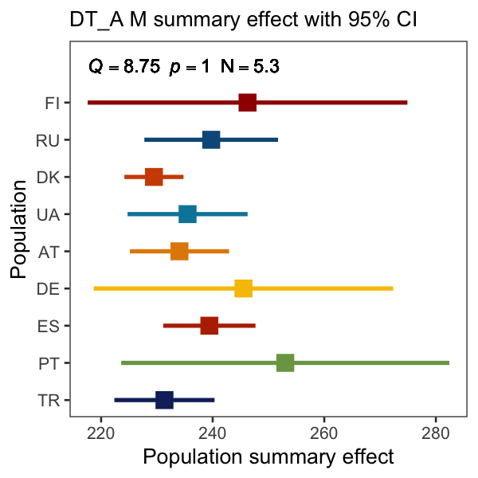
```

#### Dry weight

```{r fig.show = "hold", out.width = "49%", fig.align = "default", echo = FALSE}
knitr::include_graphics("MetaAnalyses/DryWeight/DW_F_lmers_pop_meta_summary_effect.png")
knitr::include_graphics("MetaAnalyses/DryWeight/DW_M_lmers_pop_meta_summary_effect.png")
```

#### Thorax length

```{r echo=FALSE, out.width="49%"}
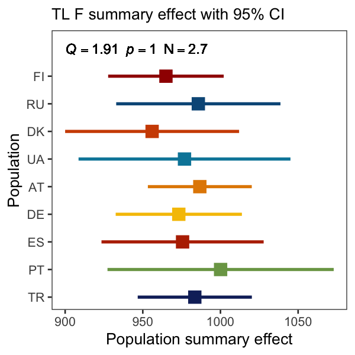
```

#### Wing area

_Left Wings_

```{r fig.show = "hold", out.width = "49%", fig.align = "default", echo = FALSE}


```

_Right Wings_

```{r fig.show = "hold", out.width = "49%", fig.align = "default", echo = FALSE}
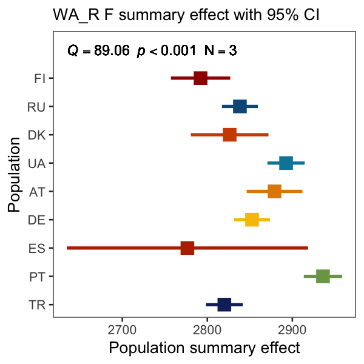
knitr::include_graphics("MetaAnalyses/WingArea/WA_R_M_lmers_pop_meta_summary_effect.png")
```

#### Fecundity

```{r echo=FALSE, out.width="49%"}
knitr::include_graphics("MetaAnalyses/Fecundity/Fec_F_lmers_pop_meta_summary_effect.png")
```

#### Lifespan

```{r fig.show = "hold", out.width = "49%", fig.align = "default", echo = FALSE}
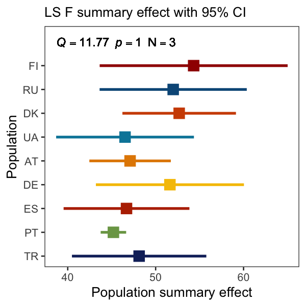
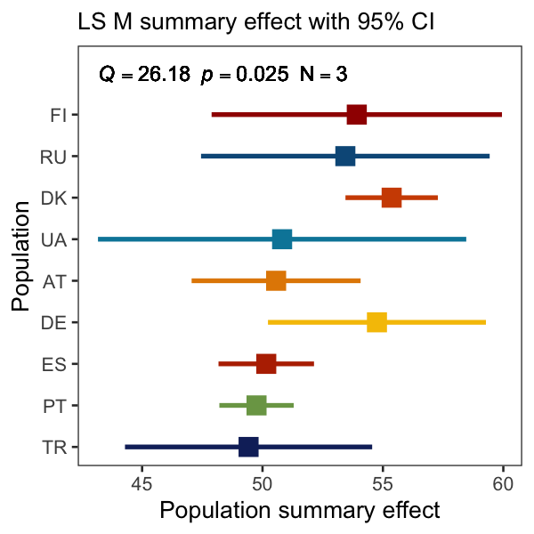
```

#### Cold-shock mortality

```{r fig.show = "hold", out.width = "49%", fig.align = "default", echo = FALSE}
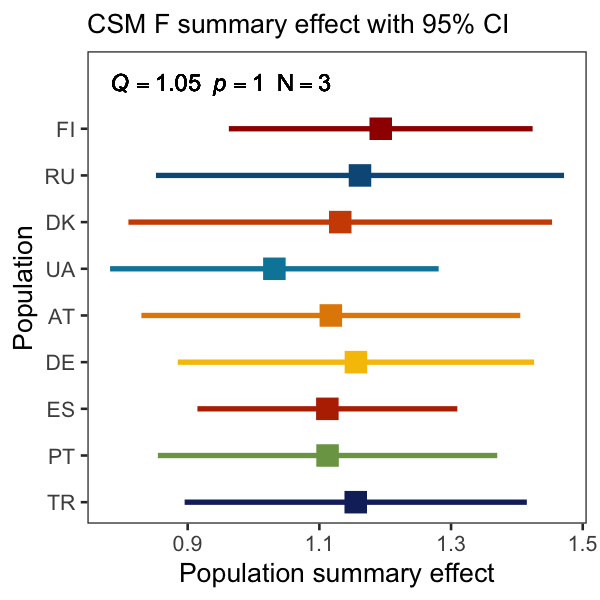
knitr::include_graphics("MetaAnalyses/ColdShock/CSM_M_lmers_pop_meta_summary_effect.png")
```

#### Chill-coma recovery time

```{r fig.show = "hold", out.width = "49%", fig.align = "default", echo = FALSE}
knitr::include_graphics("MetaAnalyses/ChillComa/CCRT_F_lmers_pop_meta_summary_effect.png")
knitr::include_graphics("MetaAnalyses/ChillComa/CCRT_M_lmers_pop_meta_summary_effect.png")
```

#### Heat-shock mortality

```{r fig.show = "hold", out.width = "49%", fig.align = "default", echo = FALSE}
knitr::include_graphics("MetaAnalyses/HeatShock/HSM_F_lmers_pop_meta_summary_effect.png")
knitr::include_graphics("MetaAnalyses/HeatShock/HSM_M_lmers_pop_meta_summary_effect.png")
```

#### Diapause

Using GLMER estimates

```{r echo=FALSE, out.width="49%"}

```

#### Starvation resistance

```{r fig.show = "hold", out.width = "49%", fig.align = "default", echo = FALSE}
knitr::include_graphics("MetaAnalyses/Starvation/SR_F_lmers_pop_meta_summary_effect.png")
knitr::include_graphics("MetaAnalyses/Starvation/SR_M_lmers_pop_meta_summary_effect.png")

```

#### Pigmentation

```{r echo=FALSE, out.width="49%"}
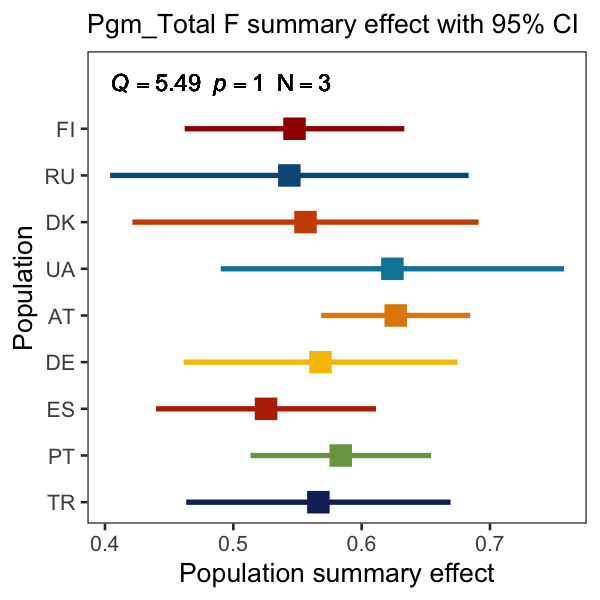
```


## 2.3 - Lab Correlations

Input data are populations estimates and lines random coefficients extracted from each single linear model. On the composite figures below, the red dashed lines represent the 0.05 significance threshold.


### Pearson's - Population level
```{r echo=FALSE}
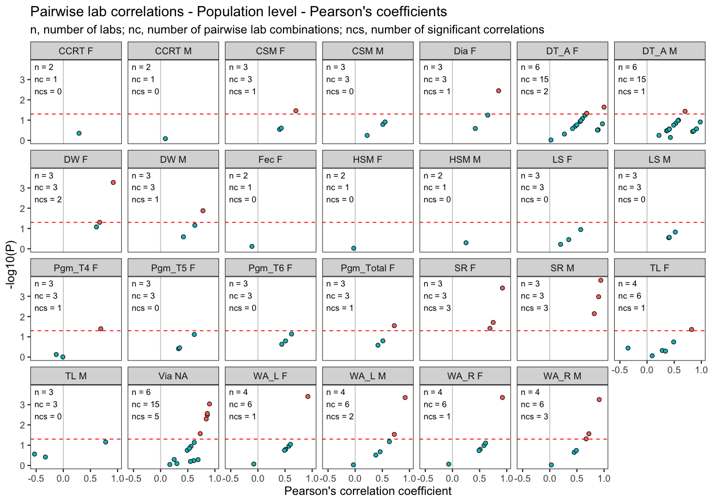
```

### Spearman's - Population level
```{r echo=FALSE}
knitr::include_graphics("LabCorrelations/lab_correlation_pop_spearman.png")
```

### Pearson's - Line level
```{r echo=FALSE}
knitr::include_graphics("LabCorrelations/lab_correlation_line_pearson.png")
```

### Spearman's - Line level
```{r echo=FALSE}
knitr::include_graphics("LabCorrelations/lab_correlation_line_spearman.png")
```

## 2.4 - Heritability

_Within lab H2_
```{r echo=FALSE, message=FALSE}
h2_data_withinlabs <- read.csv("Heritability/H2_line_raw_data_within_labs.csv")
DT::datatable(h2_data_withinlabs, options = list(pageLength = 10)) %>% formatRound(4:7, 3)
```

_Between lab H2 with random coefs_
```{r echo=FALSE, message=FALSE}
h2_rc_btwlabs <- read.csv("Heritability/H2_line_random_coefs_between_labs.csv")
DT::datatable(h2_rc_btwlabs, options = list(pageLength = 10)) %>% formatRound(4:6, 3)

```

_Between lab H2 with raw data_
```{r echo=FALSE, message=FALSE}
h2_data_btwlabs <- read.csv("Heritability/H2_line_raw_data_between_labs.csv")
DT::datatable(h2_data_btwlabs, options = list(pageLength = 10)) %>% formatRound(4:6, 3)
```

## 2.5 - Linear Models with Geographical Variables

```{r eval=FALSE, echo=TRUE}
# All model outputs can be found in:

lmers_lat <- readRDS("LinearModelsLat/all_lmers_lat_anova_list.rds")
lmers_lon <- readRDS("LinearModelsLon/all_lmers_lon_anova_list.rds")
lmers_alt <- readRDS("LinearModelsAlt/all_lmers_alt_anova_list.rds")
```

### Geography - Latitude

```{r, echo=FALSE}
pval_table_lat <- read.csv("LinearModelsLat/all_models_lat_pvalues.csv")
```

```{r, echo=FALSE}
DT::datatable(pval_table_lat, options = list(pageLength = 10)) %>% formatRound(6, 4)
```

### Geography - Longitude

```{r, echo=FALSE}
pval_table_lon <- read.csv("LinearModelsLon/all_models_lon_pvalues.csv")
```

```{r, echo=FALSE}
DT::datatable(pval_table_lon, options = list(pageLength = 10)) %>% formatRound(6, 4)
```

### Geography - Altitude

```{r, echo=FALSE}
pval_table_alt <- read.csv("LinearModelsAlt/all_models_alt_pvalues.csv")
```

```{r, echo=FALSE}
DT::datatable(pval_table_alt, options = list(pageLength = 10)) %>% formatRound(6, 4)
```

## 2.6 - Correlations with Geographical Variables

### Latitude - Line level
```{r echo=FALSE}
knitr::include_graphics("GeoCorrelations/line_lat_pearson_correlations_facets.png")
```

```{r echo=FALSE, out.width="50%", fig.align='center', fig.cap="Dashed black and red lines represent uncorrected and corrected for multiple testing (Bonferroni) significance thresholds, respectively."}

```

### Latitude - Population level
```{r echo=FALSE}

```

```{r echo=FALSE, out.width="50%", fig.align='center', fig.cap="Dashed black and red lines represent uncorrected and corrected for multiple testing (Bonferroni) significance thresholds, respectively."}
knitr::include_graphics("GeoCorrelations/pop_lat_pearson_correlations.png")
```

### Longtitude - Line level
```{r echo=FALSE}

```

```{r echo=FALSE, out.width="50%", fig.align='center', fig.cap="Dashed black and red lines represent uncorrected and corrected for multiple testing (Bonferroni) significance thresholds, respectively."}

```

### Longtitude - Population level
```{r echo=FALSE}
knitr::include_graphics("GeoCorrelations/pop_lon_pearson_correlations_facets.png")
```

```{r echo=FALSE, out.width="50%", fig.align='center', fig.cap="Dashed black and red lines represent uncorrected and corrected for multiple testing (Bonferroni) significance thresholds, respectively."}
knitr::include_graphics("GeoCorrelations/pop_lon_pearson_correlations.png")
```

## 2.7 - Trait Correlations

### Pearson pairwise correlations


```{r echo=FALSE, fig.cap="Trait correlations in females for the nine traits that were measured on both sexes using line compound estimates from all labs", fig.align='center'}
knitr::include_graphics("TraitCorrelations/trait_correlations_f9_line_random_coefs.png")
```

```{r echo=FALSE, fig.cap="Trait correlations in females for the nine traits that were measured on both sexes using line estimates from labs with similar P/C ratios", fig.align='center'}
knitr::include_graphics("TraitCorrelations/trait_correlations_f9_line_random_coefs_diet.png")
```

```{r echo=FALSE, fig.cap="Trait correlations for all 12 female traits using line compound estimates from all labs", fig.align='center'}
knitr::include_graphics("TraitCorrelations/trait_correlations_fmax_line_random_coefs.png")
```

```{r echo=FALSE, fig.cap="Trait correlations for all 12 female traits using line estimates from labs with similar P/C ratios", fig.align='center'}
knitr::include_graphics("TraitCorrelations/trait_correlations_fmax_line_random_coefs_diet.png")
```

```{r echo=FALSE, fig.cap="Trait correlations for all 12 female traits plus viability using line compound estimates from all labs", fig.align='center'}
knitr::include_graphics("TraitCorrelations/trait_correlations_fmaxp_line_random_coefs.png")
```

```{r echo=FALSE, fig.cap="Trait correlations for all 12 female traits plus viability using line estimates from labs with similar P/C ratios", fig.align='center'}
knitr::include_graphics("TraitCorrelations/trait_correlations_fmaxp_line_random_coefs_diet.png")
```

```{r echo=FALSE, fig.cap="Trait correlations in males for the nine traits that were measured on both sexes using line compound estimates from all labs", fig.align='center'}
knitr::include_graphics("TraitCorrelations/trait_correlations_m9_line_random_coefs_diet.png")
```

```{r echo=FALSE, fig.cap="Trait correlations in males for the nine traits that were measured on both sexes using line estimates from labs with similar P/C ratios", fig.align='center'}
knitr::include_graphics("TraitCorrelations/trait_correlations_m9_line_random_coefs.png")
```


## 2.8 - PCA

```{r include=FALSE}
colorize <- function(x, color) {
  if (knitr::is_latex_output()) {
    sprintf("\\textcolor{%s}{%s}", color, x)
  } else if (knitr::is_html_output()) {
    sprintf("<span style='color: %s;'>%s</span>", color,
      x)
  } else x
}
```


Read in the various PCA objects

```{r read PCA objects 1}
## Load PCA objects
pca_F13 <- readRDS("PCA/PCA_SI/pca_F13.rds")
pca_F9 <- readRDS("PCA/PCA_SI/pca_F9.rds")
pca_M9 <- readRDS("PCA/PCA_SI/pca_M9.rds")
```

Principal Component Analysis (PCA) was carried out for each sex separately. Initially, a PCA containing all 12 female traits (CCRT, CSM, DT_A, DW, HSM, LS, SR, TL, WA_L, DIA, FEC and PGM_T) plus Viability was considered, termed F13 (Female - 13 traits). Separate female and male PCAs were then carried out for a set of nine traits which had been measured in both sexes (CCRT, CSM, DT_A, DW, HSM, LS, SR, TL, WA_L) termed F9 (Female - traits) and M9 (Male - 9 traits), allowing a direct comparison of the sexes.

Summary results are provided below. Figures show vector plots next to co-ordinate plots (with population confidence ellipses) for PC1 vs PC2 and PC3 vs PC4. Below these are the eigenvalues (the contribution of each principal component to the total variance) and the loadings (how each variable contributes to the first five principal component). Loadings with values > 0.6 or < -0.6 are considered important, while loadings with values > 0.4 or < -0.4 are considered to have moderate contributions.

Considering important and moderate loadings we can identify some general patterns across all three PCA, including:  
  
  * PC1: positive correlations between dry weight, wing area and starvation resistance  
  * PC2: a negative correlation between lifespan and thorax length  
  * PC3: a negative correlation between heat shock mortality and cold shock mortality  

### Female - all traits (F13)

F13 Vector plots (left hand side) and co-ordinate plots (right-hand side) for PC1 vs PC2 (top) and PC3 vs PC4 (bottom). Co-ordinate plots show populations surrounded by 95% confidence ellipses.

```{r echo=FALSE}


```

```{r eigenvalues for F13}
# F13 eigenvalues
pca_F13$eig
```

```{r loadings for F13}
# F13 loadings
pca_F13$var$coord
```

### Female - 9 traits (F9)

F9 Vector plots (left hand side) and co-ordinate plots (right-hand side) for PC1 vs PC2 (top) and PC3 vs PC4 (bottom). Co-ordinate plots show populations surrounded by 95% confidence ellipses.

```{r echo=FALSE}


```

```{r eigenvalues for F9}
# F9 eigenvalues
pca_F9$eig
```

```{r loadings for F9}
# F9 loadings
pca_F9$var$coord
```


### Male - 9 traits (M9)

M9 Vector plots (left hand side) and co-ordinate plots (right-hand side) for PC1 vs PC2 (top) and PC3 vs PC4 (bottom). Co-ordinate plots show populations surrounded by 95% confidence ellipses. PC2 

```{r echo=FALSE}


```

```{r eigenvalues for M9}
# M9 eigenvalues
pca_M9$eig
```

```{r loadings for M9}
# M9 loadings
pca_M9$var$coord
```


## 2.9 - Discriminant Function Analysis results

```{r include=FALSE}
knitr::opts_chunk$set(echo = TRUE)
library(psych)
library(knitr)
```

```{r read DFA objects 2}
## Load DFA objects

## Original F13 and M10 DFA objects
fem_mahala <- read.table("TraitCorrelations/DFA_SI/MR_female_mahala.txt", header = TRUE)
fem_reallo <- read.table("TraitCorrelations/DFA_SI/MR_female_realloc.txt", header = TRUE)
mal_mahala <- read.table("TraitCorrelations/DFA_SI/MR_male_mahala.txt", header = TRUE)
mal_reallo <- read.table("TraitCorrelations/DFA_SI/MR_male_realloc.txt", header = TRUE)
```

Discriminant Function Analysis (DFA) was carried out for females using the F13 set of traits, and for males using the M9 traits plus viability. Summary data including squared Mahalanobis distances, reclassification results and distance plots are provided below. Populations in tables are labelled with both country and location (e.g. Austria, Mauternbach is labelled as AT-MA), while plots only contain location data (e.g. MA for Mauternbach).

### F13 DFA

```{r female mahalanobis, echo=FALSE, message=FALSE}
knitr::kable(fem_mahala, align = "lccccccccc",
             caption = 'Squared Mahalanobis distance between populations following DFA of female lines (F13 traits)')
```

```{r female reallocation, echo=FALSE, message=FALSE}
knitr::kable(fem_reallo, align = "lcccccccccr",
             caption = 'Reclassification of female lines among populations following DFA of female lines (F13 traits)')
```

DFA distance plot for female lines based on F13 traits plus viability  

```{r female distance figure, echo=FALSE, message=FALSE}
knitr::include_graphics("TraitCorrelations/DFA_SI/FemaleDis.png")
```


### M9+via DFA

```{r male mahalanobis, echo=FALSE, message=FALSE}
knitr::kable(mal_mahala, align = "lccccccccc",
             caption = 'Squared Mahalanobis distance between populations following DFA of male lines (M9 traits plus via)')
```

```{r male reallocation, echo=FALSE, message=FALSE}
knitr::kable(mal_reallo, align = "lcccccccccr",
             caption = 'Reclassification of male lines among populations following DFA of male lines (M9 traits plus via)')
```


DFA distance plot for male lines based on M9 traits plus viability   
```{r male distance figure, echo=FALSE, message=FALSE}
knitr::include_graphics("TraitCorrelations/DFA_SI/MaleDis.png")
```


## 2.10 - Effect of Diet and Lab

```{r echo=FALSE, out.width="50%", fig.cap="Protein to carbohydrate (P/C) ratio variation among labs.", fig.align = "center"}
knitr::include_graphics("Diets/DrosEU_Diets_PC_ratios_facets.png")
```

```{r echo=FALSE, out.width="70%", fig.cap="Protein to carbohydrate (P/C) ratio variation between and within traits.", fig.align = "center"}

```

```{r echo=FALSE, fig.cap="Effect of protein to carbohydrate (P/C) ratio on population estimates for each trait.", fig.align = "center"}
knitr::include_graphics("Diets/DrosEU_Diets_PC_ratios_traits_pop_facets.png")
```

```{r echo=FALSE, fig.cap="Effect of lab on population estimates for each trait.", fig.align = "center"}
knitr::include_graphics("Diets/DrosEU_Diets_lab_traits_pop_facets.png")
```

```{r echo=FALSE, fig.cap="Effect of lab and P/C ratio on population estimates. Red dots and lines represent PC/ratios. P/C ratios are scaled within but not between traits.", fig.align = "center"}
knitr::include_graphics("Diets/DrosEU_Diets_PC_ratios_lab_traits_pop_facets.png")
```

### Plots by trait

Lab P/C ratios are indicated at the bottom of the y axis.

#### Viability
```{r echo=FALSE, out.width="50%"}
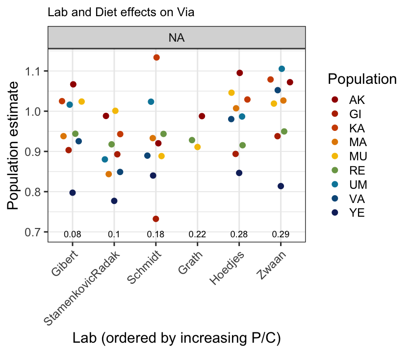
```

#### Development time
```{r echo=FALSE, out.width="50%"}

```

#### Dry weight
```{r echo=FALSE, out.width="50%"}

```

#### Thorax length
```{r echo=FALSE, out.width="50%"}
knitr::include_graphics("Diets/DrosEU_Diets_PC_ratios_TL_pop_facets.png")
```

#### Wing area
```{r echo=FALSE, out.width="50%"}
knitr::include_graphics("Diets/DrosEU_Diets_PC_ratios_WA_L_pop_facets.png")
```

#### Fecundity
```{r echo=FALSE, out.width="50%"}
knitr::include_graphics("Diets/DrosEU_Diets_PC_ratios_Fec_pop_facets.png")
```

#### Lifespan
```{r echo=FALSE, out.width="50%"}

```

#### Cold-shock mortality
```{r echo=FALSE, out.width="50%"}
knitr::include_graphics("Diets/DrosEU_Diets_PC_ratios_CSM_pop_facets.png")
```

#### Heat-shock mortality
```{r echo=FALSE, out.width="50%"}
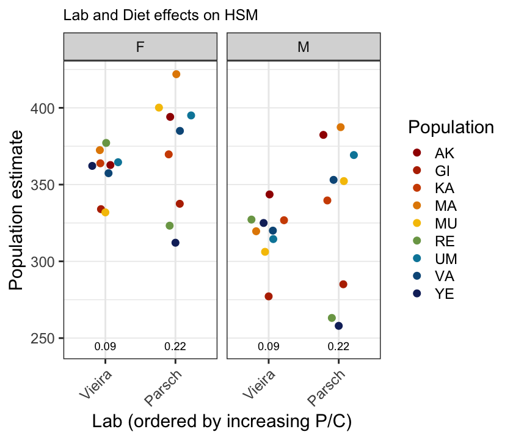
```

#### Diapause
```{r echo=FALSE, out.width="50%"}
knitr::include_graphics("Diets/DrosEU_Diets_PC_ratios_Dia_pop_facets.png")
```

#### Starvation resistance
```{r echo=FALSE, out.width="50%"}
knitr::include_graphics("Diets/DrosEU_Diets_PC_ratios_SR_pop_facets.png")
```

```{r echo=FALSE, out.width="50%"}
knitr::include_graphics("Diets/DrosEU_Diets_PC_ratios_WA_R_pop_facets.png")
```

#### Pigmentation
```{r echo=FALSE, out.width="50%"}
knitr::include_graphics("Diets/DrosEU_Diets_PC_ratios_Pgm_T4_pop_facets.png")
```

```{r echo=FALSE, out.width="50%"}
knitr::include_graphics("Diets/DrosEU_Diets_PC_ratios_Pgm_T5_pop_facets.png")
```

```{r echo=FALSE, out.width="50%"}

```

```{r echo=FALSE, out.width="50%"}

```

### Meta regressions

In a meta analysis framework (similiar to what has been used to generate compound estimates) one can run meta regressions to test for the effect of different variables (called moderators) on trait variation. Here one can regress out the effect of _Population_ alone (similar to the subgroup analyses carried out previously) or in combination with other moderators such as _Lab_ and _Diet_. This allow us to roughly estimate how much variance is explained by the different moderators, which would help interpret the lab correlations and the main subgroup meta analyses resuts. However, given our small samples sizes, these meta regressions will be even more underpowered than the subgroup analyses and resuts should be interpreted with caution.

```{r echo=FALSE, fig.align='center', fig.cap="Variance explained (R2) by Population, Lab and P/C ratio for each trait. Note that some P/C infomation is missing in some cases and that these analyses could be run only when at least two labs have phenotyped the same trait." }

```

Below is a summary table recapitulating the data presented in the previous figure.

```{r, echo=FALSE}
meta_reg_diet <- read.csv("MetaRegressionDiet/all_models_pop_meta_reg_diets_r2.csv")
DT::datatable(meta_reg_diet, options = list(pageLength = 20)) %>% formatRound(4:5, c(2,4))
```

## 2.11 - Effect of Diet on PCA


```{r include=FALSE}
knitr::opts_chunk$set(echo = TRUE)
library(psych)
library(knitr)
```

Read in the various PCA objects

```{r read PCA objects 3}
## Load PCA objects

## Original F13 and F9 PCA objects
pca_F13 <- readRDS("LinearModelsPop/PCA_ControlledDiet/PCA_CD_SI/pca_F13.rds")
pca_F9 <- readRDS("LinearModelsPop/PCA_ControlledDiet/PCA_CD_SI/pca_F9.rds")

## Additional PCA objects for testing effect of diet
pca_M8 <- readRDS("LinearModelsPop/PCA_ControlledDiet/PCA_CD_SI/pca_M8.rds")

pcactl_F13 <- readRDS("LinearModelsPop/PCA_ControlledDiet/PCA_CD_SI/pcactl_F13.rds")
pcactl_F9 <- readRDS("LinearModelsPop/PCA_ControlledDiet/PCA_CD_SI/pcactl_F9.rds")
pcactl_M8 <- readRDS("LinearModelsPop/PCA_ControlledDiet/PCA_CD_SI/pcactl_M8.rds")
```

For F13 and F9 PCAs with all data were compared to PCAs featuring a single estimate for each phenotypic trait value taken from labs in which dietary P:C ratio was similar.

For males, thorax Length (TL) values were not available for the diet controlled PCA, so the PCA with all data was rerun with only the 8 other phenotypic traits.

Key summary results appear below. Loadings for the first five principal components for the all data PCA and the controlled diet data PCA are provided, followed by Tucker's congruence coefficients for these PCs. These coefficients show how well principal componenets (PCs) from the different PCAs correlate with one another (values above 0.85 can be considered high, values above 0.95 very high). Co-ordinate plots (with population confidence ellipses) are then provided for PC1 vs PC2.

#### F13 effect of diet 

```{r diet effect for F13 original loadings}
# F13 loadings for all data
pca_F13$var$coord
```

```{r diet effect for F13 diet control loadings}
# F13 loadings for controlled diet data
pcactl_F13$var$coord
```

```{r diet effect for F13 tucker}
# F13 Tucker's congruence values
factor.congruence(pca_F13$var$coord, pcactl_F13$var$coord,2)
```

```{r echo=FALSE}

```

Tucker's congruence coefficient for PC1 is high (0.91), and for PC2 the coefficient is moderate (0.75), with some key correlations between traits appearing in both PCAs (positively correlated loadings for DW, TL and WA in PC1, positively correlated HSM and Via in PC2). The populations thus occupy similar positions within the PC1 vs PC2 co-ordinate space. Although congruence coefficients for PC3, PC4 and PC5 are lower (0.56-0.77), some correlations are maintained (e.g. positively correlated CCRT and Dia in PC3)


#### F9 effect of diet 

```{r diet effect for F9 original loadings}
# F9 loadings for all data
pca_F9$var$coord
```

```{r diet effect for F9 diet control loadings}
# F9 loadings for controlled diet data
pcactl_F9$var$coord
```


```{r diet effect for F9 Tucker}
# F9 Tucker's congruence values
factor.congruence(pca_F9$var$coord, pcactl_F9$var$coord,2)
```

```{r echo=FALSE}

```

Tucker's congruence coefficient for PC1 is very high, but coefficients for other PCs are lower and show reordering. As with the F13, PC1 trait correlations are similar (positively correlated loadings for DW, TL and WA), but for other PCs correlations either move between PCs(e.g. the negative correlation between SR and TL moves from PC2 in all data to PC3 in the diet controlled PCA) or appear much weaker. Thus the populations occupy similar positions along PC1 but with differences along PC2 (even accounting for the change in sign).


#### M8 effect of diet 

```{r diet effect for M8 original loadings}
# M8 loadings for all data
pca_M8$var$coord
```

```{r diet effect for M8 diet control loadings}
# M8 loadings for controlled diet data
pcactl_M8$var$coord
```

```{r diet effect for M8}
# M8 Tucker's congruence values
factor.congruence(pca_M8$var$coord, pcactl_M8$var$coord,2)
```

```{r echo=FALSE}

```

Tucker's congruence coefficient for PC1 is very high and for PC2 it is high, with many PC1 and PC2 trait correlations similar for the two PCAs, leading to the populations occupying similar positions within the PC1 vs PC2 co-ordinate space.  Congruence coefficients are lower for PC3, PC4 and PC5, although some trait correlations are maintained (e.g. the positive correlation of CCRT and SR along PC3).


## 2.12 - Climatic Variables

```{r include=FALSE}
knitr::opts_chunk$set(echo = TRUE)
library(car)
```

For the analyses of the climatic variables, two time periods were chosen: 30 years (to trace the long-lasting climatic effects) and 30 days (short weather effect, on average over a couple generations for different localities). 14 climatic variables data (see the list below) was downloaded from the NASA database using R package “nasapower” and PCA analysis was done with “FactoMineR” package.  

```{r climate variables, echo=FALSE, message=FALSE}
ClimVarPCA <- read.csv("EnvironmentalAnalysis/PCA_Pheno_Clim_SI/ClimVar4PCA_4Rmd.csv")
knitr::kable(ClimVarPCA, 
             caption = 'List of the climatic variables used in PCA.')
```

Below we show different outputs from the two different versions of the climate PCA (30 days above, 30 years below), summarising some key results.  

### Vector and Coordinate Plots

In the coordinate plots, the populations separate along the two dimensions rather differently for the 30 day and 30 year data sets, possibly because the short-term climate data (30 days) does not include winter (cold season).  

__PCA for 30 days data__  

```{r 30d vector and coord plots, echo=FALSE, message=FALSE}

```

__PCA for 30 years data__ 

```{r 30y vector and coord plots, echo=FALSE, message=FALSE}

```

### Scree Plots (eigenvalues)

The first two PCs in both data sets had eigenvalues >1 explaining 94.7% (30 days) and 89.8% (30 years) of the variation. Thus PC1 and PC2 were used in the further analyses.  

__Scree plot for 30 days data__  

```{r 30d scree plot, echo=FALSE, message=FALSE}

```

__Scree plot for 30 years data__  

```{r 30y scree plot, echo=FALSE, message=FALSE}
knitr::include_graphics("EnvironmentalAnalysis/PCA_Pheno_Clim_SI/Climate_PCA_Scree_30y.svg")
```

### Loadings Plots  

There was much overlap in the contributions of different variable to PC1 and PC2. Average temperatures (TS, T2M and T2MWET) all strongly contributed to PC1, while precipitation (PRECTOTCORR) and humidity (RH2M) contributed to PC2. However, frost days was important for PC1 in the 30 year data but not the 30 day data, and while temperature range was important in both data sets, maximum temperatures (TS_MAX and T2M_MAX) were only important in the 30 year data set.

__Loadings for 30 days data__  

```{r 30d loadings, echo=FALSE, message=FALSE}

```

__Loadings for 30 years data__  

```{r 30y loadings, echo=FALSE, message=FALSE}

```

### Correlations with Geographical Coordinates  

In the 30 year dataset PC1 showed strong (< -0.8) negative correlations with latitude and longitude, while in the 30 day dataset PC2 showed a strong (0.8) positive correlation with latitude.

__Correlations for 30 days data__  

```{r 30d correlation plot, echo=FALSE, message=FALSE}

```

__Correlations for 30 years data__  

```{r 30y correlation plot, echo=FALSE, message=FALSE}

```


### Phenotype-Climate associations

Glms were carried out to investigate associations between phenotype principal components (PCs) and climate PCs. For all three different trait combinations (F13, F9 and M9), and for both sets of climate data (30 days and 30 years), separate glms were run considering either phenotype PC 1, 2 or 3 as a response variable, and both climate PCs 1 and 2 as explanatory variables (18 glms total). The summary table below shows the significance of climate variables in explaining each phenotype PC. A permutation based approach was then used to test if correlations between phenotype and climate PCs were greater than expected at random (1000 permutations per phenotype PC:climate PC combination).

#### Phenotype-Climate assoc. summary
```{r summary of significant PC-PC associations, echo=FALSE, message=FALSE}

```
```
#### Signif. codes: ‘***’ 0.001, ‘**’ 0.01, ‘*’ 0.05
```

Results for glms involving phenotype PC1 (all 3 phenotype PCAs and both 30d and 30y climate PCAs) were rather over-dispersed (>2).

#### Phenotype-Climate permutation  

The permutation derived threshold for significance is demarcated by the coloured lines. Purmuted data appear as grey points, and real data appear as a coloured point. Only points that have higher -log~10~ P values (i.e. lower P values) and higher R^2^ values pass this statistical test (P and R^2^ are perfectly correlated). Four correlations between phenotype PC2 and climate PC2 passed the permutation procedure (F13 - 30 day, F13 - 30 year, F9 - 30 day, and M9 - 30 day).  

```{r permutations for PC-PC associations, echo=FALSE, message=FALSE}
knitr::include_graphics("EnvironmentalAnalysis/PCA_Pheno_Clim_SI/all_permutation_results_v3.svg")
```

#### Phenotype PC2-Climate PC2 correl. 

Climatic and phenotypic variables with greater-than-average contributions (loadings) to a given principal component are shown in the accompanying x- and y-axis vector plots, respectively. For males (M9 plots on right hand side), the phenotype PC2 is inverted relative to females (loadings for Life span and Thorax Length differ in direction)

```{r all PC2 versus PC2 plots, echo=FALSE, message=FALSE, out.width="40%"}

```

#### Glm and permutation summary stats 

```{r read csv files}
## Load data tables for glms

F13_30y_data <- read.csv("EnvironmentalAnalysis/PCA_Pheno_Clim_SI/F9maxP_30y_data.csv")
F13_30d_data <- read.csv("EnvironmentalAnalysis/PCA_Pheno_Clim_SI/F9maxP_30d_data.csv")
F9_30y_data <- read.csv("EnvironmentalAnalysis/PCA_Pheno_Clim_SI/F9_30y_data.csv")
F9_30d_data <- read.csv("EnvironmentalAnalysis/PCA_Pheno_Clim_SI/F9_30d_data.csv")
M9_30y_data <- read.csv("EnvironmentalAnalysis/PCA_Pheno_Clim_SI/M9_30y_data.csv")
M9_30d_data <- read.csv("EnvironmentalAnalysis/PCA_Pheno_Clim_SI/M9_30d_data.csv")

## Load permutation test objects

emp_pr_F13_y <- readRDS("EnvironmentalAnalysis/PCA_Pheno_Clim_SI/emp_pr_F13_y.rds")
emp_pr_F9_y <- readRDS("EnvironmentalAnalysis/PCA_Pheno_Clim_SI/emp_pr_F9_y.rds")
emp_pr_M9_y <- readRDS("EnvironmentalAnalysis/PCA_Pheno_Clim_SI/emp_pr_M9_y.rds")
emp_pr_F13_d <- readRDS("EnvironmentalAnalysis/PCA_Pheno_Clim_SI/emp_pr_F13_d.rds")
emp_pr_F9_d <- readRDS("EnvironmentalAnalysis/PCA_Pheno_Clim_SI/emp_pr_F9_d.rds")
emp_pr_M9_d <- readRDS("EnvironmentalAnalysis/PCA_Pheno_Clim_SI/emp_pr_M9_d.rds")
```

Below are:  
  
1. Summary ANOVA tables for each of the glms considering phenotype PC x climate PC associations, and  
2. Ranked p values for these associations following the permutation procedure.  

##### 1. Summary ANOVA tables

**F13: Climate 30 days**

```{r F13 30d PC1}
# Phenotype: PC1
F13_PC1_d <- glm(F13_30d_data$PC1_F9maxP ~ F13_30d_data$PC1_clim + F13_30d_data$PC2_clim,data = F13_30d_data)
Anova(F13_PC1_d, test.statistic="F")
```

```{r F13 30d PC2}
# Phenotype: PC2
F13_PC2_d <- glm(F13_30d_data$PC2_F9maxP ~ F13_30d_data$PC1_clim + F13_30d_data$PC2_clim,data = F13_30d_data)
Anova(F13_PC2_d, test.statistic="F")
```

```{r F13 30d PC3}
# Phenotype: PC3
F13_PC3_d <- glm(F13_30d_data$PC3_F9maxP ~ F13_30d_data$PC1_clim + F13_30d_data$PC2_clim,data = F13_30d_data)
Anova(F13_PC3_d, test.statistic="F")
```

**F13: Climate 30 years**

```{r F13 30y PC1}
# Phenotype: PC1
F13_PC1_y <- glm(F13_30y_data$PC1_F9maxP ~ F13_30y_data$PC1_clim + F13_30y_data$PC2_clim,data = F13_30y_data)
Anova(F13_PC1_y, test.statistic="F")
```

```{r F13 30y PC2}
# Phenotype: PC2
F13_PC2_y <- glm(F13_30y_data$PC2_F9maxP ~ F13_30y_data$PC1_clim + F13_30y_data$PC2_clim,data = F13_30y_data)
Anova(F13_PC2_y, test.statistic="F")
```

```{r F13 30y PC3}
# Phenotype: PC3
F13_PC3_y <- glm(F13_30y_data$PC3_F9maxP ~ F13_30y_data$PC1_clim + F13_30y_data$PC2_clim,data = F13_30y_data)
Anova(F13_PC3_y, test.statistic="F")
```

**F9: Climate 30 days**

```{r F9 30d PC1}
# Phenotype: PC1
F9_PC1_d <- glm(F9_30d_data$PC1_F9 ~ F9_30d_data$PC1_clim + F9_30d_data$PC2_clim,data = F9_30d_data)
Anova(F9_PC1_d, test.statistic="F")
```

```{r F9 30d PC2}
# Phenotype: PC2
F9_PC2_d <- glm(F9_30d_data$PC2_F9 ~ F9_30d_data$PC1_clim + F9_30d_data$PC2_clim,data = F9_30d_data)
Anova(F9_PC2_d, test.statistic="F")
```

```{r F9 30d PC3}
# Phenotype: PC3
F9_PC3_d <- glm(F9_30d_data$PC3_F9 ~ F9_30d_data$PC1_clim + F9_30d_data$PC2_clim,data = F9_30d_data)
Anova(F9_PC3_d, test.statistic="F")
```

**F9: Climate 30 years**

```{r F9 30y PC1}
# Phenotype: PC1
F9_PC1_y <- glm(F9_30y_data$PC1_F9 ~ F9_30y_data$PC1_clim + F9_30y_data$PC2_clim,data = F9_30y_data)
Anova(F9_PC1_y, test.statistic="F")
```

```{r F9 30y PC2}
# Phenotype: PC2
F9_PC2_y <- glm(F9_30y_data$PC2_F9 ~ F9_30y_data$PC1_clim + F9_30y_data$PC2_clim,data = F9_30y_data)
Anova(F9_PC2_y, test.statistic="F")
```

```{r F9 30y PC3}
# Phenotype: PC3
F9_PC3_y <- glm(F9_30y_data$PC3_F9 ~ F9_30y_data$PC1_clim + F9_30y_data$PC2_clim,data = F9_30y_data)
Anova(F9_PC3_y, test.statistic="F")
```

**M9: Climate 30 days**

```{r M9 30d PC1}
# Phenotype: PC1
M9_PC1_d <- glm(M9_30d_data$PC1_M9 ~ M9_30d_data$PC1_clim + M9_30d_data$PC2_clim,data = M9_30d_data)
Anova(M9_PC1_d, test.statistic="F")
```

```{r M9 30d PC2}
# Phenotype: PC2
M9_PC2_d <- glm(M9_30d_data$PC2_M9 ~ M9_30d_data$PC1_clim + M9_30d_data$PC2_clim,data = M9_30d_data)
Anova(M9_PC2_d, test.statistic="F")
```

```{r M9 30d PC3}
# Phenotype: PC3
M9_PC3_d <- glm(M9_30d_data$PC3_M9 ~ M9_30d_data$PC1_clim + M9_30d_data$PC2_clim,data = M9_30d_data)
Anova(M9_PC3_d, test.statistic="F")
```

**M9: Climate 30 years**

```{r M9 30y PC1}
# Phenotype: PC1
M9_PC1_y <- glm(M9_30y_data$PC1_M9 ~ M9_30y_data$PC1_clim + M9_30y_data$PC2_clim,data = M9_30y_data)
Anova(M9_PC1_y, test.statistic="F")
```

```{r M9 30y PC2}
# Phenotype: PC2
M9_PC2_y <- glm(M9_30y_data$PC2_M9 ~ M9_30y_data$PC1_clim + M9_30y_data$PC2_clim,data = M9_30y_data)
Anova(M9_PC2_y, test.statistic="F")
```

```{r M9 30y PC3}
# Phenotype: PC3
M9_PC3_y <- glm(M9_30y_data$PC3_M9 ~ M9_30y_data$PC1_clim + M9_30y_data$PC2_clim,data = M9_30y_data)
Anova(M9_PC3_y, test.statistic="F")
```

##### 2. Ranked permutation P values

The following tables are ranked by pr_p: the probability that the p-value for the observed data is smaller than the permutations. Phenotype PC : climate PC combinations with a pr_p > 0.95 are considered significant.

**Climate 30 days**

```{r F13 30 day}
# F13: Climate 30 days
emp_pr_F13_d[order(emp_pr_F13_d$pr_p),]
```

```{r F9 30 day}
# F9: Climate 30 days
emp_pr_F9_d[order(emp_pr_F9_d$pr_p),]
```

```{r M9 30 day}
# M9: Climate 30 days
emp_pr_M9_d[order(emp_pr_M9_d$pr_p),]
```

**Climate 30 years**

```{r F13 30 year}
# F13: Climate 30 years
emp_pr_F13_y[order(emp_pr_F13_y$pr_p),]
```

```{r F9 30 year}
# F9: Climate 30 years
emp_pr_F9_y[order(emp_pr_F9_y$pr_p),]
```

```{r M9 30 year}
# M9: Climate 30 years
emp_pr_M9_y[order(emp_pr_M9_y$pr_p),]
```


## 2.13 - Wolbachia

### Population

```{r, echo=FALSE}
pval_Wolb_pop <- read.csv("LinearModelsPop_Wolb/all_models_pop_pvalues_Wolb.csv")
```

```{r, echo=FALSE}
DT::datatable(pval_Wolb_pop, options = list(pageLength = 10)) %>% formatRound(6:6, 3)
```

```{r echo=FALSE}
knitr::include_graphics("LinearModelsPop_Wolb/all_models_pop_pvalues_Wolb.pdf")
```

### Latitude

```{r, echo=FALSE}
pval_Wolb_lat <- read.csv("LinearModelsLat_Wolb/all_models_lat_pvalues_Wolb.csv")
```

```{r, echo=FALSE}
DT::datatable(pval_Wolb_lat, options = list(pageLength = 10)) %>% formatRound(6:6, 3)
```

```{r echo=FALSE}
knitr::include_graphics("LinearModelsLat_Wolb/all_models_lat_pvalues_Wolb.pdf")
```

### Longitude

```{r, echo=FALSE}
pval_Wolb_lon <- read.csv("LinearModelsLon_Wolb/all_models_lon_pvalues_Wolb.csv")
```

```{r, echo=FALSE}
DT::datatable(pval_Wolb_lon, options = list(pageLength = 10)) %>% formatRound(6:6, 4)
```


```{r echo=FALSE}
knitr::include_graphics("LinearModelsLon_Wolb/all_models_lon_pvalues_Wolb.pdf")
```

### Altitude

```{r, echo=FALSE}
pval_Wolb_alt <- read.csv("LinearModelsAlt_Wolb/all_models_alt_pvalues_Wolb.csv")
```

```{r, echo=FALSE}
DT::datatable(pval_Wolb_alt, options = list(pageLength = 10)) %>% formatRound(6:6, 3)
```


```{r echo=FALSE}
knitr::include_graphics("LinearModelsAlt_Wolb/all_models_alt_pvalues_Wolb.pdf")
```

## 2.14 - Inversion frequencies


```{r inv_freqs, echo=FALSE, message=FALSE}
inv_freqs <- read.csv("Inversions/inversion_frequencies_pops.csv") %>%
  rename(LocationAbbr = Population) %>%
  inner_join(select(droseu_coord, Country, LocationAbbr, Latitude, Longitude, Altitude)) %>%
  relocate(Country, LocationAbbr, Latitude, Longitude, Altitude) %>%
  mutate_if(is.numeric, ~round(., 2))
```

The table below recapitulates the average inversion frequencies among the 9 nine populations

```{r, echo=FALSE}
DT::datatable(inv_freqs, options = list(pageLength = 9))
```

### Correlation between population estimates and inversion frequencies

**_In(2L)t_**

```{r, echo=FALSE}
DT::datatable(read.csv("Inversions/pop_2lt_pearson_correlations.csv"), options = list(pageLength = 10))
```
```{r echo=FALSE}
knitr::include_graphics("Inversions/pop_2lt_pearson_correlations_facets.png")
```

**_In(2R)NS_**

```{r, echo=FALSE}
DT::datatable(read.csv("Inversions/pop_2RNs_pearson_correlations.csv"), options = list(pageLength = 10))
```

```{r echo=FALSE}

```

**_In(3L)P_**

```{r, echo=FALSE}
DT::datatable(read.csv("Inversions/pop_3LP_pearson_correlations.csv"), options = list(pageLength = 10))
```

```{r echo=FALSE}

```

**_In(3R)P_**

```{r, echo=FALSE}
DT::datatable(read.csv("Inversions/pop_3RP_pearson_correlations.csv"), options = list(pageLength = 10))
```

```{r echo=FALSE}
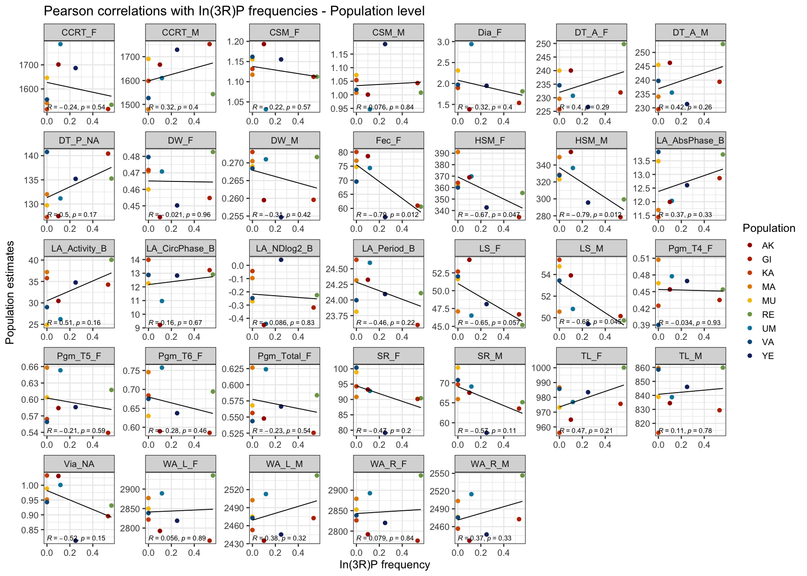
```

**_In(3R)mo_**

```{r, echo=FALSE}
DT::datatable(read.csv("Inversions/pop_3Rmo_pearson_correlations.csv"), options = list(pageLength = 10))
```

```{r echo=FALSE}

```


### Effect of inversions on trait variation

The table below recapitulates the inversion status (presence or absence, 1 or 0, respectively) of all the lines that have been phenotyped in this study. 

```{r, echo=FALSE, message=FALSE}
inv_freqs <- read.csv("Data/DrosEU_lines_inversions_typing.csv") %>%
  mutate(
    In2Lt = ifelse(In2Lt == 0.5 | In2Lt == 1, 1, 0),
    LocationAbbr = str_extract(line_id, "^.{2}")
  ) %>%
  rename(Line = line_id) %>%
  select(LocationAbbr, contains("In")) %>%
  inner_join(select(droseu_coord, Country, LocationAbbr, Latitude, Longitude, Altitude)) %>%
  relocate(Country, LocationAbbr, Latitude, Longitude, Altitude)
```


```{r, echo=FALSE}
DT::datatable(inv_freqs, options = list(pageLength = 10))
```

**_In(2L)t_**

```{r, echo=FALSE}
DT::datatable(read.csv("Inversions/line_2Lt_lms.csv"), options = list(pageLength = 10))
```

```{r echo=FALSE}

```

**_In(2R)NS_**

```{r, echo=FALSE}
DT::datatable(read.csv("Inversions/line_2RNs_lms.csv"), options = list(pageLength = 10))
```

```{r echo=FALSE}

```

**_In(3L)P_**

```{r, echo=FALSE}
DT::datatable(read.csv("Inversions/line_3LP_lms.csv"), options = list(pageLength = 10))
```

```{r echo=FALSE}

```

**_In(3R)P_**

```{r, echo=FALSE}
DT::datatable(read.csv("Inversions/line_3RP_lms.csv"), options = list(pageLength = 10))
```

```{r echo=FALSE}

```

**_In(3R)mo_**

```{r, echo=FALSE}
DT::datatable(read.csv("Inversions/line_3Rmo_lms.csv"), options = list(pageLength = 10))
```

```{r echo=FALSE}

```


# 3 - Additional analyses by consortium members 

## UPGMA trees

Model estimates for each population, sex and trait, as well as the results of the Tukey tests, were extracted from the linear model estimate files. In order to obtain the UPGMA trees, a Bash script was written that allows the calculation of a distance matrix based on the model estimates for each population, sex and trait, then uses the command line version of MEGAX (Kumar S, Stecher G, Li M, Knyaz C, Tamura K. MEGA X: Molecular Evolutionary Genetics Analysis across Computing Platforms. Mol Biol Evol. 2018 Jun 1;35(6):1547-1549. doi: 10.1093/molbev/msy096. PMID: 29722887; PMCID: PMC5967553), to obtain an UPGMA tree that is saved as a Newick file, and then plots the tree using the plottree software application (https://github.com/iBiology/plottree). For facility of use, this pipeline is available as a Docker image, called  values2tree, at the pegi3s Bioinformatics Docker Images Project (https://pegi3s.github.io/dockerfiles/; H. López-Fernández; P. Ferreira; M. Reboiro-Jato; C.P. Vieira; J. Vieira (2021) The pegi3s Bioinformatics Docker Images Project. 15th International Conference on Practical Applications of Computational Biology & Bioinformatics: PACBB 2021. Salamanca, Spain. 6 - October DOI), and uses the pegi3s Docker images for megax_cc and plottree. The values2tree Bash script code is available on github at https://github.com/pegi3s/dockerfiles/tree/master/values2tree

```{r echo=FALSE}
knitr::include_graphics("UPGMATrees/UPGMA_04072024.pdf")
```

## Species Distribution Model

SDM_Maxent_WorldClim

```{r eval=FALSE, include=FALSE}
htmltools::includeHTML("SDM_Maxent_worldclime/Results/Dmelanogaster.html")
```

```{r echo=FALSE}
knitr::include_graphics("SDM_Maxent_worldclime/SDM_4_Rmd/DrosEU_PhenotypingWG_Page_1.png")
knitr::include_graphics("SDM_Maxent_worldclime/SDM_4_Rmd/DrosEU_PhenotypingWG_Page_2.png")
knitr::include_graphics("SDM_Maxent_worldclime/SDM_4_Rmd/DrosEU_PhenotypingWG_Page_3.png")
knitr::include_graphics("SDM_Maxent_worldclime/SDM_4_Rmd/DrosEU_PhenotypingWG_Page_4.png")
knitr::include_graphics("SDM_Maxent_worldclime/SDM_4_Rmd/DrosEU_PhenotypingWG_Page_5.png")
knitr::include_graphics("SDM_Maxent_worldclime/SDM_4_Rmd/DrosEU_PhenotypingWG_Page_6.png")
```


## GDM

_**Please refer to /GDM folder for details.**_


```{r echo=FALSE}
GDM_table1 <- read.csv("GDM/GDM_table1.csv")
GDM_table2 <- read.csv("GDM/GDM_table2.csv")
GDM_table3 <- read.csv("GDM/GDM_table3.csv")
```

```{r echo=FALSE, message=FALSE}
knitr::kable(GDM_table1, caption = 'Table 1: Predictor variables identified as important in GDMs.')
```

```{r echo=FALSE, message=FALSE}
knitr::kable(GDM_table2, caption = 'Table 2: Proportion of variation in phenotypic variables that explained by each model')
```

_Table 3: Result of generalized dissimilarity model for phenotypic variables, the most important predictor variables were shown in bold._

```{r include=FALSE}
knitr::include_graphics("GDM/GDM_Table3_4Rmd.png")
```

### Dry weight
```{r echo=FALSE, out.width="40%", out.height="40%"}
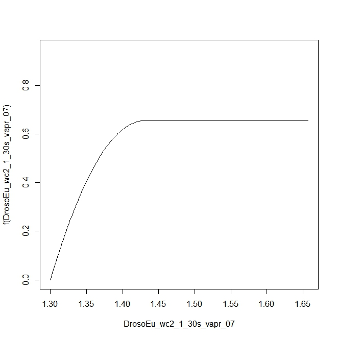
```

```{r include=FALSE, out.height="40%", out.width="40%"}

```

### Fecundity
```{r echo=FALSE, out.width="40%", out.height="40%"}

```

```{r include=FALSE, out.height="40%", out.width="40%"}
knitr::include_graphics("GDM/GDM_Worldclim/Fec/Fec_wind07_i-spline.jpeg")
```

### Lifespan
```{r echo=FALSE, out.width="40%", out.height="40%"}
knitr::include_graphics("GDM/GDM_Worldclim/LS_F/LS_F_srad05_i-spline.jpeg")
```

```{r echo=FALSE, out.width="40%", out.height="40%"}
knitr::include_graphics("GDM/GDM_Worldclim/LS_F/LS_F_bio10_i-spline.jpeg")
```

```{r echo=FALSE, out.width="40%", out.height="40%"}
knitr::include_graphics("GDM/GDM_Worldclim/LS_F/LS_F_vapr06_i-spline.jpeg")
```

```{r echo=FALSE, out.width="40%", out.height="40%"}
knitr::include_graphics("GDM/GDM_Worldclim/LS_F/LS_F_wind08_ispline.jpeg")
```

```{r echo=FALSE, out.width="40%", out.height="40%"}

```

```{r echo=FALSE, out.width="40%", out.height="40%"}

```

```{r echo=FALSE, out.width="40%", out.height="40%"}
knitr::include_graphics("GDM/GDM_Worldclim/LS_M/LS_M_GDM_prec10_i-spline.jpeg")
```

```{r echo=FALSE, out.width="40%", out.height="40%"}
knitr::include_graphics("GDM/GDM_Worldclim/LS_M/LS_M_GDM_wind12_i-spline.jpeg")
```

### Thorax length
```{r echo=FALSE, out.width="40%", out.height="40%"}
knitr::include_graphics("GDM/GDM_Worldclim/TL_F/TL_F_perc05_i-spline.jpeg")
```

```{r echo=FALSE, out.width="40%", out.height="40%"}
knitr::include_graphics("GDM/GDM_Worldclim/TL_F/TL_F_srad06_i-spline.jpeg")
```

```{r echo=FALSE, out.width="40%", out.height="40%"}
knitr::include_graphics("GDM/GDM_Worldclim/TL_F/TL_F_wind12_i-spline.jpeg")
```

### Wing area
```{r echo=FALSE, out.width="40%", out.height="40%"}

```

```{r echo=FALSE, out.width="40%", out.height="40%"}
knitr::include_graphics("GDM/GDM_Worldclim/WA_L_M/WA_L_M_vapr06_i-spline.jpeg")
```

```{r echo=FALSE, out.width="40%", out.height="40%"}
knitr::include_graphics("GDM/GDM_Worldclim/WA_R_F/WA_R_F_wind8_i-spline.jpeg")
```

```{r echo=FALSE, out.width="40%", out.height="40%"}
knitr::include_graphics("GDM/GDM_Worldclim/WA_R_F/WA_R_F_vapr8_i-spline.jpeg")
```

```{r echo=FALSE, out.width="40%", out.height="40%"}
knitr::include_graphics("GDM/GDM_Worldclim/WA_R_F/WA_R_F_bio8_i-spline.jpeg")
```

```{r echo=FALSE, out.width="40%", out.height="40%"}
knitr::include_graphics("GDM/GDM_Worldclim/WA_R_M/WA_R_M_wind08_i-spline.jpeg")
```

```{r echo=FALSE, out.width="40%", out.height="40%"}
knitr::include_graphics("GDM/GDM_Worldclim/WA_R_M/WA_R_M_vapr06_i-spline.jpeg")
```


# References

- Balduzzi S, Rücker G, Schwarzer G. 2019. How to perform a meta-analysis with R: a practical tutorial. Evidence Based Mental Health 22:153-160.

- Bates D, Mächler M, Bolker B, Walker S. 2015. Fitting Linear Mixed-Effects Models Using lme4. Journal of Statistical Software 67:1-48.

- Bookstein FL. 1996. Biometrics, biomathematics and the morphometric synthesis. Bulletin of Mathematical Biology 58:313-365.

- Clark M. 2022. mixedup: Miscellaneous functions for mixed models. R package version 0.3.9, https://m-clark.github.io/mixedup.

- David JR, Gibert P, Legout H, Petavy G, Capy P, Moreteau B. 2005. Isofemale lines in Drosophila: an empirical approach to quantitative trait analysis in natural populations. Heredity 94:3-12.

- Falconer DS, Mackay TFC. 1996. Introduction to Quantitative Genetics. 4th Edition. Longman, London.

- Faria VG, Sucena E. 2017. From Nature to the Lab: Establishing Drosophila Resources for Evolutionary Genetics. Frontiers in Ecology and Evolution 5:61.

- Hoffmann AA, Parsons PA. 1988. The Analysis of Quantitative Variation in Natural Populations with Isofemale Strains. Genetics Selection Evolution 20:87-98.

- Kapun M, Barrón MG, Staubach F, Obbard DJ, Wiberg RAW, Vieira J, Goubert C, Rota-Stabelli O, Kankare M, Bogaerts-Márquez M et al. 2020. Genomic analysis of European Drosophila melanogaster populations reveals longitudinal structure, continent-wide selection, and previously unknown DNA viruses. Molecular Biology and Evolution 37:2661-2678.

- Kapun M, Nunez JCB, Bogaerts-Márquez M, Murga-Moreno J, Paris M, Outten J, Coronado-Zamora M, Tern C, Rota-Stabelli O, Guerreiro MPG et al. 2021. Drosophila Evolution over Space and Time (DEST): A New Population Genomics Resource. Molecular Biology and Evolution 38:5782-5805.

- Kassambara A, Mundt F. 2020. factoextra: Extract and Visualize the Results of Multivariate Data Analyses. https://cran.r-project.org/package=factoextra.

- Klingenberg CP. 2011. MorphoJ: an integrated software package for geometric morphometrics. Molecular Ecology Resources 11:353-357.

- Lê S, Josse J, Husson F. 2008. FactoMineR: an R package for multivariate analysis. Journal of Statistical Software 25:1–18.

- Machado HE, Bergland AO, Taylor R, Tilk S, Behrman E, Dyer K, Fabian DK, Flatt T, González J, Karasov TL et al. 2021. Broad geographic sampling reveals the shared basis and environmental correlates of seasonal adaptation in Drosophila. eLife 10: e67577.

- Miller SA, Dykes DD, Polesky HF. 1988. A simple salting out procedure for extracting DNA from human nucleated cells. Nucleic Acids Research 16:1215.

- Nakagawa S, Schielzeth H. 2013. A general and simple method for obtaining R2 from generalised linear mixed-effects models. Methods in Ecology and Evolution 4:133-142.

- Parsons PA. 1983. The Evolutionary Biology of Colonizing Species. Cambridge University Press, Cambridge.

- Pegoraro M, Sayegh Rezek E, Fishman B, Tauber E. 2022. Nucleotide Variation in Drosophila cryptochrome Is Linked to Circadian Clock Function: An Association Analysis. Frontiers in Physiology 13:781380.

- Pinheiro J, Bates D, R Core Team. 2023. nlme: Linear and Nonlinear Mixed Effects Models. R package version 3.1-164, https://CRAN.R-project.org/package=nlme.

- Revelle W. 2022. psych: Procedures for Psychological, Psychometric, and Personality Research. https://cran.r-project.org/package=psych.

- Riegler M, Iturbe-Ormaetxe I, Woolfit M, Miller WJ, O'Neill SL. 2012. Tandem repeat markers as novel diagnostic tools for high resolution fingerprinting of Wolbachia. BMC Microbiology 12 (Suppl 1):S12,

- Rohlf FJ. 2015. The tps series of software. Hystrix, the Italian Journal of Mammalogy 26:9-12.

- Sambrook J, Fritsch EF, Maniatis T. 1989. Molecular Cloning: A Laboratory Manual. Cold Spring Harbor, NY: Cold Spring Harbor Laboratory.

- Saunders DS, Henrich VC, Gilbert LI. Induction of Diapause in Drosophila melanogaster: Photoperiodic Regulation and the Impact of Arrhythmic Clock Mutations on Time Measurement. Proceedings of the National Academy of Sciences of the USA 1989;86(10):3748-52.

- Simões PM, Mialdea G, Reiss D, Sagot MF, Charlat S. 2011. Wolbachia detection: an assessment of standard PCR protocols. Molecular Ecology Resources 11:567-572.

- Sparks AH. 2018. nasapower: a NASA POWER global meteorology, surface solar energy and climatology data client for R. Journal of Open Source Software 3:1035.

- Strunov A, Lerch S, Blanckenhorn WU, Miller WJ, Kapun M. 2022. Complex effects of environment and Wolbachia infections on the life history of Drosophila melanogaster hosts. Journal of Evolutionary Biology 35:788-802.

- Symonenko AV, Roshina NV, Krementsova AV, Pasyukova EG. 2018. Reduced Neuronal Transcription of Escargot, the Drosophila Gene Encoding a Snail-Type Transcription Factor, Promotes Longevity. Frontiers in Genetics 9:151.

- Tatar M, Chien SA, Priest NK. 2001. Negligible senescence during reproductive dormancy in Drosophila melanogaster. American Naturalist 158:248-258.

- Werren JH, Windsor DM. 2000. Wolbachia infection frequencies in insects: evidence of a global equilibrium? Proceedings of the Royal Society of London B 267:1277-1285.

- Zhou W, Rousset F, O'Neil S. 1998. Phylogeny and PCR-based classification of Wolbachia strains using wsp gene sequences. Proceedings of the Royal Society of London B 265:509-515.

- Zielinski T, Moore AM, Troup E, Halliday KJ, Millar AJ. 2014. Strengths and limitations of period estimation methods for circadian data. PLoS ONE 9:e96462.
