# Phenotyping effort


**Collaborative phenotyping effort of European _Drosophila melanogaster_ populations**  

In 2017, DrosEU consortium has decided to make a collaborative phenotyping effort of European _Drosophila melanogaster_ populations at the Groningen meeting. 

The call was made with approximate numbers of populations, lines, etc. and under predefined criteria (finish within a year, reps, blocks, etc) and participating labs have indicated which traits they are willing to phenotype. 

## Sampling Locations

```{r libraries, echo=FALSE, message=FALSE, warning=FALSE}

library(tidyverse)
library(ggpubr)
library(hrbrthemes)
library(qwraps2)
library(afex)
library(Hmisc)
library(knitr)
library(cowplot)
library(ggrepel)
library(DT)
library(data.table)
library(MetBrewer)
```


Nine sampling locations were chosen based on genomic data and these locations covered a wide range of latitude (~20°) and longitude (~40°) across the continent (see table below). From each location, 15 to 20 isofemale lines were established in corresponding labs at the sampling location and the isofemale lines were centrally maintained by Élio Sucena  at Instituto Gulbenkian de Ciência (IGC), Lisbon, Portugal. A total of 173 isofemale lines were used in this study. 

```{r droseu_coord, echo=FALSE, message=FALSE}
droseu_coord <- read.csv("InfoTables/DrosEU_Coordinates.csv")
droseu_coord <- data.frame(droseu_coord %>%
  add_column(Collector = c("Jorge Vieira", "Josefa Gonzalez", "Mads Schou", "John Parsch & Amanda Glaser-Schmitt","Andrea Betancourt","Maaria Kankare","Iryna Kozeretska","Banu Onder","Elena Pasyukova")))
```

```{r echo=FALSE, message=FALSE}
knitr::kable(droseu_coord, align = "llcccl", caption = 'Table X. Sampling locations, coordinates and collectors, sorted by increasing latitude')
```

```{css, echo = FALSE}
caption {
      color: black;
      font-weight: bold;
      font-size: 1.0em;
    }
```


```{r echo=FALSE}

```

```{r panmix_theme, echo=FALSE, message=FALSE}
panmix_theme <- theme(panel.grid.major = element_blank(), panel.grid.minor = element_blank(),panel.background = element_blank(), axis.line = element_line(colour = "black",), axis.title.x = element_text(size = 16), axis.text.x = element_text(size = 16, colour = "black"), axis.text.y = element_text(size = 16, colour = "black"),axis.title.y = element_text(size = 16))
```

```{r droseu_labs, echo=FALSE, message=FALSE}
droseu_labs <- data.frame(read.csv("InfoTables/DrosEU_Labs.csv"))
```

## Contributors (phenotyping)

Contributed labs are `r unique(droseu_labs$PI)` and detailed list below :

```{r echo=FALSE}
knitr::kable(droseu_labs, allign = "llll", caption = "Table X. Contributed labs and traits, sorted by trait") 
```

```{r echo=FALSE, message=FALSE}
cities <- read.csv("InfoTables/DrosEU_cities.csv")
```


```{r echo=FALSE}
knitr::include_graphics("InfoTables/research_groups_map-1.png")
```


## Contributors (analyses)

_tbd_

# Methods

## Wolbachia _work in progress_

Sucena, Pasyukova, Kapun, Viera and Kozeretska Labs have genotyped the isofemale lines for Wolbachia using different methods and some discrepancies were observed, mainly due to the sensitivity differences in protocols -- we are working on it. 

Tables below were made using Sucena Lab's results. 

```{r wolbachia-data, echo=FALSE, message=FALSE}
droseu_wol <- data.frame(read.csv("InfoTables/DrosEU_wolbachia_2021.csv"))
```

```{r, echo=FALSE}
DT::datatable(droseu_wol, options = list(pageLength = 10))
```

```{r Wol_Freqs, echo=FALSE}
Wol_Freqs <- data.frame(unique(droseu_wol$Population))

Wol_Pops <- c((AK_freq <- nrow(droseu_wol %>% filter(Population=="AK") %>% filter(Wolbachia=="1")) / 
  nrow(droseu_wol %>% filter(Population == "AK")) * 100), 
  (GI_freq <- nrow(droseu_wol %>% filter(Population=="GI") %>% filter(Wolbachia=="1")) / 
  nrow(droseu_wol %>% filter(Population == "GI")) * 100), 
  (KA_freq <- nrow(droseu_wol %>% filter(Population=="KA") %>% filter(Wolbachia=="1")) / 
  nrow(droseu_wol %>% filter(Population == "KA")) * 100), 
  (MA_freq <- nrow(droseu_wol %>% filter(Population=="MA") %>% filter(Wolbachia=="1")) / 
  nrow(droseu_wol %>% filter(Population == "MA")) * 100), 
  (MU_freq <- nrow(droseu_wol %>% filter(Population=="MU") %>% filter(Wolbachia=="1")) / 
  nrow(droseu_wol %>% filter(Population == "MU")) * 100), 
  (RE_freq <- nrow(droseu_wol %>% filter(Population=="RE") %>% filter(Wolbachia=="1")) / 
  nrow(droseu_wol %>% filter(Population == "RE")) * 100),
  (UM_freq <- nrow(droseu_wol %>% filter(Population=="UM") %>% filter(Wolbachia=="1")) / 
  nrow(droseu_wol %>% filter(Population == "UM")) * 100),
  (VA_freq <- nrow(droseu_wol %>% filter(Population=="VA") %>% filter(Wolbachia=="1")) / 
  nrow(droseu_wol %>% filter(Population == "VA")) * 100),
  (YE_freq <- nrow(droseu_wol %>% filter(Population=="YE") %>% filter(Wolbachia=="1")) / 
  nrow(droseu_wol %>% filter(Population == "YE")) * 100))

pop_freqs <- cbind(unique(droseu_wol$Country), Wol_Freqs, Wol_Pops)

cols <- c("Country", "Population", "Wolbachia_Freq")
wolbachia_pop_freqs <- setnames(pop_freqs, cols)

```

```{r wolbachia_pop_freqs}
wolbachia_pop_freqs # Wolbachia frequency by country and population abbreviation 
```

## Diets

```{r droseu_diets, echo=FALSE, message=FALSE}
droseu_diets <- data.frame(read.csv("InfoTables/DrosEU_Diets_Feb22.csv"))
```

```{r, echo=FALSE}
DT::datatable(droseu_diets, options = list(pageLength = 10))
```


## Inversion Frequencies _work in progress_
_need to do a few more PCRs, will add them here soon_

## Traits 

_Contributors and methods for experiments_

### Viability
##### Gibert, Grath, Hoedjes, Schmidt, Stamenkovic-Radak and Zwaan Labs


3-5 day old adults (at least 25 pairs) are allowed to lay eggs en masse. Yeast is provided to stimulate egg laying (for at least 2 hours). Eggs are collected, and 40 are placed in each vial. Viability is calculated per vial, as the percentage of individuals that emerged from the 40 eggs.

Schmidt Lab : Females were allowed to lay eggs in vials and total number of eggs were recorded. Viability is calculated as the percentage of individuals that emerged from total number of eggs, per vial.

### Developmental time

#### Egg-to-pupa developmental time
##### Schmidt Lab


#### Egg-to-adult developmental time
##### Gibert, Grath, Hoedjes, Schmidt, Stamenkovic-Radak and Zwaan Labs


Developmental time is scored as both the egg-to-pupa and egg-to-adult development time. Both were scored twice a day, when the chamber lights are turned on and two hours before they are turned off. In order to measure the egg-to-pupa developmental time, the spot where a pupa is found is marked with a permanent marker to keep track of which pupae have emerged in each day. The egg-to-adult developmental time is estimated by counting all emerged adults from the vial, and by sexing them.


### Dry weight
##### Colinet, Hoedjes and Onder Labs

At day 7 after emergence, flies are killed by snap freezing them in liquid nitrogen, by putting them at -20ºC or by putting them into an ethyl acetate solution and stored at -20ºC. Then they are sexed and placed into 96 wells plates, and placed in an oven set at 60-70 °C, for at least 3 days. At this point flies can be stored at room temperature using a protective cover. If this is the case, the day before measurements are made dry flies are again placed for 24h in the oven (60-70 °C) to ensure material is well dehydrated. Flies are then placed on a small piece of aluminium foil for direct weight measurement on microbalance (accuracy 1µg).


### Thorax length
##### Kozeretska, Posnien, Ritchie and Schmidt Labs

Five to seven days old flies are placed onto a double-sided sticky tape attached to a microscope slide and a picture of the thorax taken using a digital camera connected to a dissecting microscope. The same magnification and resolution is always used to increase reproducibility, and a scale bar inserted on each photo to allow transforming pixels into µm units. Thorax length is defined as the distance from the anterior margin of the thorax to the posterior tip of the scutellum and it is measured using the “Straight Line” in ImageJ/Fiji.


### Wing area
##### Onder, Posnien, Ritchie and Stamenkovic-Radak Labs

Both the left and right wings of five to seven days old flies (10 flies per sex per replicate) are removed and placed into a drop of Entellan®Merck, Hoyer’s Medium, sticked to a double-side sticky tape, or taped directly to the slide. Pictures of the wing preparations are taken using a digital camera connected to a dissecting microscope. The same magnification and resolution is always used to increase reproducibility. A scale bar is placed on each photo to allow transforming pixels into µm units. Manual measurements of wing length and wing area are performed using the “Straight Line” and “Polygon Selection” tools, respectively of ImageJ/Fiji (10.1371/journal.pone.0000007).


### Fecundity
##### Billeter and Fricke Labs

For each isofemale line, 10 males and 10 females are placed together in single-sex groups and allowed to mature for five days. Then, they are placed together (5-7 pairs), and mating interactions observed to ensure successful mating (at least 10 min copulation duration) to ensure that we have five successfully mated females. After a successful mating, males are discarded and females allowed to oviposit alone for 48 hours, moved to another vial, and allowed to oviposit for four days, and again moved to another vial and allowed to oviposit for two days to check that of egg-laying stopped. Vials are incubated until all offspring is born. Individuals are then frozen and the offspring counted.


### Lifespan
##### Flatt, Parsch and Pasyukova Labs

Line level lifespan: Ten flies per sex/line are placed in each vial. The age at death will be scored when changing the food, at least three times a week. Five replicates are used.

Population level lifespan: Flies are kept in 1L demography cages (5 flies per line/sex for each population). The age at death will be scored when changing the food, at least three times a week. Ten replicates were performed.


### Cold-shock mortality
##### Gonzalez, Kozeretska and Vieira Labs

Batches of 15-20 seven days old flies are placed for 18 hours in an empty vial immersed in an ice-water slurry box placed at a 4°C room for 18 hours. Then the vials are removed to a bench in a 25°C room and mortality scored 24 hours later.


### Chill-coma recovery time
##### Vieira and Mensch Labs

Sexed flies are placed in an empty vial immersed in an ice-water slurry box placed at a 4°C room in the morning. Six hours later, flies are removed from the tube to individual wells of 24 well plates while being kept on ice. A timer is started once the plate is moved from the ice to a bench in a 25°C room. Each fly is checked by eye for recovery for a maximum of 60 minutes. Flies that are able to stand on their legs are considered recovered and the CCRT (in seconds) recorded.


### Heat-shock mortality
##### Parsch and Vieira Labs

Batches of 15-20 seven days old flies are placed in empty vials inside a 37ºC incubator and mortality checked for 7 hours every 30 minutes.


### Diapause
##### Bergland, Flatt and Schlotterer Labs

In order to induce diapause, two hour old 'phenotypic virgins' (pharate or melanized with meconium visible) female flies are exposed to 12°C and 10:14 light/dark hours for 3 weeks, using an incubator that allows temperature tracking. Vials are changed once per week. After three weeks under diapause conditions, flies are frozen at -80C until dissection. Both ovaries will be examined and classified according to the following simplified 'classification': 1) < stage 10: diapause; 2) stage 10-13: intermediate; 3) stage 14: non-diapause.


- Standard diapause conditions: 12°C at 10:14 hrs L:D (under these conditions we might expect around 50% dipause frequency)
- duration of exposure: 3 weeks
- assays will be done in incubators (Percival or Memmert); temperature conditions will be tracked using data loggers / iButtons
- Try to have haphazard standardization; similar conditions coupled with consistent tracking of temperature (multiple iButtons, for example)
- We will use egg lays in bottles to be able to collect more flies for the assay (approx. 1-2 bottles per line)
- Larval density will be controlled (approximately) prior to assays: we will do this by letting a fixed number of (approx. 10-20) females (housed together with 5-10 males) oviposit over night (fixed time window) - how many females and the duration of egg laying might need to be adjusted a bit depending on the fertility of the lines (to be determined when lines are being amplified prior to assays)
- The Bergland and Flatt labs will standardize their fly food according to the Gulbenkian recipe (in terms of amounts / proportions); Manolis from the Schlötterer lab will not standardize the food and use their local diet; importantly, flies for the assays will not be exposed to any (additional) live yeast (i.e., the diet will contain liophilized yeast but no live yeast sprinkled on top).
- From the bottles we will collect upon eclosion 'phenotypic virgins' (=pharate adults or melanized with meconium visible), approx. within 2 hours after eclosion
- Flies will be kept in vials for assay (15-20 flies in the same vial to account for mortality); we aim to measure a minimum of 10 females per line (from approx. 10-15 lines x 10 populations, yielding about 1000-1500 flies for dissections in total)
- The food in the assays will be changed once per week
- To keep the workload and effort manageable the assays will be performed in 2-3 blocks (optimally only 2) over time: e.g., from each population we will measure a subset of all lines (e.g., 5-7 lines, i.e. 1/2 or 1/3 of all lines) in each of the 2-3 blocks. 
- After 3 weeks under diapause conditions, flies will either be dissected or kept frozen until dissection (dry, at -80C; can be stored for a few months) 
- We will adopt a simplified diapause 'classification':
- Stage 10 will be defined as the checkpoint
- < Stage 10: diapause
- Stage 10-13: intermediate
- Stage 14: non-diapause
- We will examine both ovaries.


### Circadian eclosion timing
##### Wegener Lab

The eclosion rhythmicity has been measured in outcrossed Munich, Akaa, Gimenells, Uman, Mauternbach, Karensminde, Valday, Yesiloz and Recarei strains at:

1) LD14:10 @ 29°C, flies raised at 29°C

2) DD 29°C after LD14:10 entrainment, flies raised at 29°C

3) LD14:10 @ 18°C, flies raised at 18°C

4) DD 18°C after LD14:10 entrainment, flies raised at 18°C

### Locomotor activity
##### Tauber Lab

The locomotor activity of the flies (males only) was measured using the DAM2 Drosophila monitors (Trikinetics Inc., Waltham, MA). Flies were 1-3 days old. Single flies were placed in glass tubes (10 cm × 0.5 cm) that were filled with 2 cm sugar/agar medium. The monitors were placed in light chambers driven by LED,  in an incubator at 24°C, ~30% humidity. The flies were entrained to a light-dark cycle (LD 12:12) for 5d and then allowed to free-run for 10 d in constant darkness (DD). The activity data were processed into 30 min bins, and four different variables were analysed. These included the circadian period, and the phase, which were analyzed using the FFT NLLS algorithm available at the BioDare2 server (https://biodare2.ed.ac.uk/). The other two variables, level of activity and the nocturnal/diurnal ratio were analyzed by a custom-made R script.
 

### Starvation resistance
##### Gonzalez, Onder and Pasyukova Labs

Batches of 10 sexed flies are transferred to glass vials filled with 5 mL of 2% agar for starvation 3-7 days after eclosion. The age at death will be scored every 8 hours.

### Pigmentation
##### Abbott, Gibert and Schmidt Labs

Abbott and Gibert Labs : For each line, 10 females, 13-15 days old, either alive or stored in 95% ethanol, are air dried and placed on their left side, and pictures taken using a dissecting microscope. Images are then analysed in ImageJ 1.46r, using the Area Fraction measurement in the Analyze menu. Area Fraction measures the percentage of pixels in a selected area that have been highlighted in red using the Threshold tool. This gives an estimate of the percentage of dark pigmentation on the three terminal tergites of the abdomen (4, 5 and 6). 

Schmidt Lab : The last three tergites were scored according to David et al. 1990.  

### Parasitoid resistance 
##### Hrcek Lab

The resistance of the lines to parasitoids will be measured using _Leptopilina boulard_. 

## Data reformatting 

MasterSheets 

All data files are reformatted as so called _Master Sheets_, in which the data structure is the same for all the sub-data sets and all details/edits logged in a README sheet. 

```{r README_example, echo=FALSE}
headers <- c("Supervisor/PI", "Diet", "Batch", "Population", "Line", "Sex", "ReplicateVial", "TraitValue") 

descriptions <- c("Lab identifier", "Either standardized _S_ or non-standardized _NS_ ", "From 1 to n" , "Population identifier in abbreviated form (i.e. _AK_)", "Line identifier (i.e. _MU1_)", "Either female (F) or male (M)", "Replicate identifier (from 1 to n)", "Trait value in x units")

README_example <- data.table(Headers =  headers, Descriptions = descriptions)
```

```{r echo=FALSE, message=FALSE}
knitr::kable(README_example, align = "ll", caption = 'Table X. Filling in the data spreadsheet and header description')
```

```{r MS_example, echo=FALSE}
MS_example <- data.table(read.csv("Data/MasterSheets_Feb22_git/VIA_MasterSheet_Feb22.csv"))
```

```{r, echo=FALSE}
DT::datatable(MS_example, options = list(pageLength = 10)) 
```

All proportion data has been arcsin transformed prior to the analyses. For others, please see the residual plots after linear models and let us know if you think the trait data set need transformation. 

## Data check

For each trait and lab, we ran counts for sex, population, line and replicate vial (if applicable). If we could spot anything suspicious or unusual (typos, shifts, etc.), I have contacted you already. Please let me know if there is anything that you have spotted and we missed. Thanks! 

# Results : Examples & Directories & Legends {#anchor}

### Tables 

Here is an example code for tables (egg-to-adult viability). The very same code is used for other traits (either with or without _Batch_) by filtering the data at supervisor, batch, population and/or line levels (and also for sex, if applicable). 

```{r descriptive_stats, eval=TRUE, echo=TRUE, message=FALSE, warning=FALSE}

## First defined standard error and coefficient of variation

std_err <- function(x) sd(x)/sqrt(length(x))
coef_var <- function(x) sd(x)/mean(x)
estimate_mode <- function(v) {
   uniqv <- unique(v)
   uniqv[which.max(tabulate(match(v, uniqv)))]
}
```

```{r, eval=FALSE, echo=TRUE, message=FALSE, warning=FALSE}

# Then compute descriptive statistics (mean, median, minimum, maximum, standard error, coefficient of variation and mode) at the defined levels (line with batch information example below) : 

table_Via_Line_wbatch <- write.csv(d_Via %>% group_by(Supervisor.PI, Batch, Population, Line) %>% summarise_at(vars(ProportionEggtoAdultSurvival), list(Mean = mean, SD= sd, Median = median, Min = min, Max = max, SE = std_err, CV = coef_var, Mode = estimate_mode)), file = "Viability/table_Via_Line_wbatch.csv", row.names = T)

```

Tables for descriptive statistics at population and line levels can be found in the trait directory, under the file name **__table_TraitAbbreviation_Level_BatchInfo.csv__**  (_i.e. Viability/table_Via_Line_wobatch.csv_)

### Figures

Data range is calculated with `#r min()` and `#r max()` functions for each trait.

y-axis on the figures is scaled by the minimum (`#r min_trait`) and maximum (`#r max_trait`) values in the full data set for a given trait. 

The very same ggplot theme has been used all across the document, called _droseu_theme_

```{r droseu_theme, eval=FALSE, echo=TRUE}
myColors <- met.brewer("Johnson", 9)
names(myColors) <- as.factor(c("AK", "GI", "KA", "MA", "MU", "RE", "UM", "VA", "YE"))
colScale <- scale_fill_manual(name = "Population", values = myColors)

droseu_theme <- theme(panel.grid.major = element_blank(), panel.grid.minor = element_blank(), panel.background = element_blank(), axis.line = element_line(colour = "black",),  axis.title.x = element_text(size = 16), axis.text.x = element_text(size = 16),axis.text.y = element_text(size = 16),axis.title.y = element_text(size = 16), colScale)

p_TraitAbbreviation_Lab + ylim(c(min_trait, max_trait)) + droseu_theme + colScale
```

```{r, echo=FALSE}
## Need to run this in the background
myColors <- met.brewer("Johnson", 9)
names(myColors) <- as.factor(c("AK", "GI", "KA", "MA", "MU", "RE", "UM", "VA", "YE"))
colScale <- scale_fill_manual(name = "Population", values = myColors)

droseu_theme <- theme(panel.grid.major = element_blank(), panel.grid.minor = element_blank(), panel.background = element_blank(), axis.line = element_line(colour = "black",),  axis.title.x = element_text(size = 16), axis.text.x = element_text(size = 16),axis.text.y = element_text(size = 16),axis.title.y = element_text(size = 16))
```

Here is an example code for figures (egg-to-adult viabiliy, Gibert Lab). The very same code is used to generate plots for other contributing labs and traits (either for _Batch_ or _Population_) by filtering the data at supervisor level (for females and males separately, if applicable). 

```{r plot_example, eval=FALSE, echo=TRUE, message=FALSE, warning=FALSE}

p_Via_Gibert <- ggplot(data = filter(droseu$via, Supervisor.PI=='Gibert')), 
                       #subsets for supervisor
                       aes(x=Population_Lat, y=ProportionEggtoAdultSurvival, fill=Batch)) +
                        #define x- and y-axis and fill
                       geom_boxplot(outlier.shape = NA, notch=FALSE) +  #boxplot
                       labs(title="p_Via_Gibert", x="Population", y = "ProportionEggtoAdultSurvival") + 
                      ylim(c(min_Via, max_Via)) + 
                      droseu_theme #y-axis limits, axis labels and droseu_theme

pdf(file="Viability/p_Via_Gibert.pdf",width=8, height=5)

p_Via_Gibert

invisible(dev.off())
```


### Linear Models

Here is an example code for linear models (egg-to-adult development time, males, Gibert Lab). The very same code is used for other contributing labs and traits by filtering the data at supervisor level (for females and males separately, if applicable), adding or removing factors if they cause convergence problems or singularity (i.e. if only one replicate vial has been phenotyped per line and/or population and/or batch, the lowest level [ _replicate_vial_  in this example] has been dropped from given model). 

```{r lmer_example, eval=FALSE, echo=TRUE, message=FALSE, warning=FALSE}
DT_A_M_lmer_Gibert <- lmer(DT_EggAdult ~ Population + 
                             #Population (fixed)
                             (1|Line:Population) + 
                             #Line (random) is nested in Population (fixed)
                             (1|Batch) +
                             #Batch is a random effect 
                             (1|ReplicateVial : Line),
                            #Replicate vial (random) is nested in Line (random)
                           data = d_DT_A_M[d_DT_A_M$Supervisor.PI == "Gibert",]) 
                            #Filter by Lab in development time, males data 
capture.output(summary(DT_A_M_lmer_Gibert),file = "DevelopmentTime/DT_A_M_lmer_Gibert_sum.txt") #save output summary 
capture.output(anova(DT_A_M_lmer_Gibert),file = "DevelopmentTime/DT_A_M_lmer_Gibert.txt") #save anova output 

```

```{r tukey_example, eval=FALSE, echo=TRUE, message=FALSE, warning=FALSE}
#need to put in tukey example here 
```

```{r anova_example, eval=FALSE, echo=TRUE, message=FALSE, warning=FALSE}
anova(DT_A_M_lmer_Gibert) #print anova output
```

```{r summary_example, eval=FALSE, echo=TRUE, message=FALSE, warning=FALSE}
summary(DT_A_M_lmer_Gibert) #print model output summary 
```


Here is an example code for linear models for geography (altitude, dry weight, males, Onder Lab). The very same code is used for other contributing labs and traits by filtering the data at supervisor level (for females and males separately, if applicable), adding or removing factors if they cause convergence problems or singularity (i.e. if only one replicate vial has been phenotyped per line and/or population and/or batch, the lowest level [ _replicate_vial_  in this example] has been dropped from given model) and also for latitude and longitude. 

```{r genography_example, eval=FALSE, echo=TRUE, message=FALSE, warning=FALSE}
DW_M_lmer_Alt_Onder <- lmer(DW_micrograms ~ Altitude + (1|Population) + (1|Population:Line), data = d_DW_M[d_DW_M$Supervisor.PI == "Onder",])
capture.output(summary(DW_M_lmer_Alt_Onder),file = "DryWeight/DW_M_lmer_Alt_Onder_sum.txt")
capture.output(anova(DW_M_lmer_Alt_Onder),file = "DryWeight/DW_M_lmer_Alt_Onder.txt")
```


### Survival Models

Here is an example code for survival analyses (starvation resistance, females, Gonzalez Lab). The very same code is used for other contributing labs and traits by filtering the data at supervisor level and sex. Please note that the level "replicate_vial" has been dropped from all survival analyses, as it clogs the models due to the volume of data.

```{r coxme_example, eval=FALSE, echo=TRUE, message=FALSE, warning=FALSE}
SR_F_coxme_Gonzalez <- coxme(Surv(AgeAtDeath_hours, Censor) ~ Population + (1|Population/Line) , data = filter(d_SR_surv, Supervisor.PI == "Gonzalez", Sex == "F"))
capture.output(summary(SR_F_coxme_Gonzalez), file = "Starvation/SR_F_coxme_Gonzalez_sum.txt")
capture.output(anova(SR_F_coxme_Gonzalez), file = "Starvation/SR_F_coxme_Gonzalez.txt")

```

All analyses outputs can be found in the trait directory (Analyses/Trait), under the file names  **__TraitAbbreviation_Function_Output.txt__** . The analyses at the lab level can be found in the same trait directory, under _by_lab_ folders (_i.e. LinearModelsPop/DevelopmentTime/by_lab_txt_output/DT_A_M_Gibert_lmer_pop_anova.txt_)

### Meta Analyses

Please refer to the .pdf file below ( _README_META.pdf_ ) for details. 

```{r echo=FALSE}
knitr::include_graphics("MetaAnalyses/README_META.pdf")
```

### Generalized Dissimilarity Model (GDM)

We used the WorldClim database (www.worldclim.org) which includes 19 bioclimatic variables, monthly precipitation, minimum, maximum and average monthly temperature, wind, vapor and solar radiation. Those variables that are identified as important in the model are shown in table 1 (_Refer to Results V_).

__Generalized dissimilarity model__

The generalized dissimilarity model here after GDM is a matrix regression technique (Ferrier et al., 2007) to analyze and predict primarily beta diversity patterns. However, it was shown that GDM could be used to explore relationship between morphological traits variation and environmental variation (Thomassen et al., 2010; Baldassarre et al., 2013).

In GDM we use matrix correlation among biotic and environmental dissimilarity plus geographic distance between sample sites to predict biotic dissimilarity across landscape. One of the advantages of GDM is that it can fit nonlinear relationship of variables by the help of I-spline function. GDM consists of two steps; in the first step using all pairwise combinations of sampling sites, it fits dissimilarities in predictor variables (environmental variables) to dissimilarities in response variables (phenotypic variables). In this step all environmental predictors with sum of I-spline coefficients of zero were removed then the remaining environmental data were permuted and introduced in the random order to the model. GDM were fitted with these permuted data, and the result of deviance explained by this model compared with deviance explained by GDM fitted to unpermuted data. Predictors importance is calculated based on the difference in deviance explained between permuted model and unpermuted model. In this step backward elimination could be used so that less important predictors were dropped from the model (Ferrier et al., 2007). In the final step, using the result of above procedures spatial prediction of response variables pattern across the entire range of study areas were made. 

For each response variable we ran four different models. Ful model that includes environmental and geographic distance as predictor variables. To examine possible correlation between geographic distance and environmental dissimilarity, we ran two additional models each selecting only one of them (geographic distance and environmental dissimilarity) as predator variables. We also ran a random model to compare with fitted models to make sure null hypothesis were not rejected randomly. To run random model, we produced random values of environmental variables for each location and as we have few locations, we produced 100000 random models. Then we used mean deviance explained by these random models and compared them with full, environment and geographic distance models. If the difference between deviance explained by random model were lower than any other three models, we consider the relationship of response variables with predictor variables not random (Thomassen et al., 2010; Baldassarre et al., 2013). 


**Reading the data, tables and model outputs in R**
```{r load_Rdas, include=TRUE}
droseu <- readRDS("Data/droseu_master_list_2022-05-02.rds")
lmers_anova <- readRDS("LinearModelsPop/all_lmers_pop_anova_list.rds")
glmers_anova <- readRDS("LinearModelsPop/all_glmers_pop_anova_list.rds")
lmers_tukey <- readRDS("LinearModelsPop/all_lmers_pop_tukey_list.rds")
lmers_sum <- readRDS("LinearModelsPop/all_lmers_pop_summary_list.rds")
table_line_wbatch <- readRDS("DescriptiveStatistics/all_table_Line_wbatch.rds")
table_line_wobatch <- readRDS("DescriptiveStatistics/all_table_Line_wobatch.rds")
table_pop_wbatch <- readRDS("DescriptiveStatistics/all_table_Pop_wbatch.rds")
table_pop_wobatch <- readRDS("DescriptiveStatistics/all_table_Pop_wobatch.rds")
coxme_anova <- readRDS("SurvivalAnalyses/all_coxmes_pop_anova_list.rds")
coxme_sum <- readRDS("SurvivalAnalyses/all_coxmes_pop_summary_list.rds")
```


**_Please note that "Plots and Linear Models by Lab" are presented in alphabetical order._** 

# Results : Linear Models  {#anchor}

## Overview 

Here is a summary table with p-values for all the analyses below. p-value adjustments are only made on meta analyses (Bonferroni correction for n = 20 traits). 

```{r, echo=FALSE}
pval_table <- read.csv("InfoTables/models_metas_pvalues_summary_table.csv")
```

```{r, echo=FALSE}
DT::datatable(pval_table, options = list(pageLength = 25)) %>% formatRound(5:9, 4)
```

```{r}
knitr::include_graphics("LabCorrelations/lab_correlation_line_pearson.pdf")
```

```{r}
knitr::include_graphics("LabCorrelations/lab_correlation_pop_pearson.pdf")
```

```{r}
knitr::include_graphics("LabCorrelations/lab_correlation_pop_spearman.pdf")
```

## Viability

```{r include=FALSE}
dir.create(file.path("Viability"), showWarnings = FALSE)
```

_For a detailed description of tables, plots, linear models and outputs, please refer [here](#anchor) _

### Contributors  

Gibert Lab : Cristina Vieira, Laurence Mouton, Natacha Kremer, Sonia Martinez, Patricia Gibert

Grath Lab : Ingo Müller, Sonja Grath

Hoedjes Lab : Hristina Kostic, Katja Hoedjes

Schmidt Lab : Ozan Kiratli, Yonatan Babore, Liam Forsythe, Paul Schmidt

Stamenkovic-Radak Lab : Marija Savic Veselinovic, Marija Tanaskovic, Aleksandra Patenkovic, Mihailo Jelic, Katarina Eric, Pavle Eric, Slobodan Davidovic, Marina Stamenkovic-Radak

Zwaan Lab : Joost van den Heuvel, Bas Zwaan


```{r}
str(droseu$via)
```

### Descriptive Statistics

Descriptive statistics at the line level, with batch information : 
```{r, echo=FALSE}
DT::datatable(table_line_wbatch$Via, options = list(pageLength = 10)) %>% formatRound(5:12, 3)
```

Descriptive statistics at the line level, without batch information : 
```{r, echo=FALSE}
DT::datatable(table_line_wobatch$Via, options = list(pageLength = 10)) %>% formatRound(4:11, 3)
```

Descriptive statistics at the population level, with batch information : 
```{r, echo=FALSE}
DT::datatable(table_pop_wbatch$Via, options = list(pageLength = 10))  %>% formatRound(4:11, 3)
```

Descriptive statistics at the population level, without batch information : 
```{r, echo=FALSE}
DT::datatable(table_pop_wobatch$Via, options = list(pageLength = 10)) %>% formatRound(3:10, 3)
```

### Plots and Linear Models by Lab  

#### Overview 

```{r min_max_Via, echo=TRUE}
min_Via <- min(droseu$via$ProportionEggtoAdultSurvival)
max_Via <- max(droseu$via$ProportionEggtoAdultSurvival)
```

y-axis is scaled by the minimum (`r min_Via`) and maximum (`r max_Via`) values in the full data set.


```{r echo=FALSE}
knitr::include_graphics("Viability/p_Via_all.pdf")
```

#### Gibert Lab

```{r}
lmers_anova$Via_Gibert_lmer_pop
```

```{r}
lmers_sum$Via_Gibert_lmer_pop
```


```{r echo=FALSE}
knitr::include_graphics("Viability/p_Via_Gibert.pdf")
knitr::include_graphics("Viability/p_Via_pop_Gibert.pdf")
```

#### Grath Lab

```{r}
lmers_anova$Via_Grath_lmer_pop
```

```{r}
lmers_sum$Via_Grath_lmer_pop
```

```{r echo=FALSE}
knitr::include_graphics("Viability/p_Via_Grath.pdf")
knitr::include_graphics("Viability/p_Via_pop_Grath.pdf")
```

#### Hoedjes Lab

```{r}
lmers_anova$Via_Hoedjes_lmer_pop
```

```{r}
lmers_sum$Via_Hoedjes_lmer_pop
```

```{r echo=FALSE}
knitr::include_graphics("Viability/p_Via_Hoedjes.pdf")
knitr::include_graphics("Viability/p_Via_pop_Hoedjes.pdf")
```

#### Schmidt Lab

```{r}
lmers_anova$Via_Schmidt_lm_pop
```

```{r}
lmers_sum$Via_Schmidt_lm_pop
```

```{r echo=FALSE}
knitr::include_graphics("Viability/p_Via_Schmidt.pdf")
knitr::include_graphics("Viability/p_Via_pop_Schmidt.pdf")
```

#### Stamenkovic-Radak Lab

```{r}
lmers_anova$Via_StamenkovicRadak_lmer_pop
```

```{r}
lmers_sum$Via_StamenkovicRadak_lmer_pop
```

```{r echo=FALSE}
knitr::include_graphics("Viability/p_Via_StamenkovicRadak.pdf")
knitr::include_graphics("Viability/p_Via_pop_StamenkovicRadak.pdf")
```

#### Zwaan Lab

```{r}
lmers_anova$Via_Zwaan_lmer_pop
```

```{r}
lmers_sum$Via_Zwaan_lmer_pop
```

```{r echo=FALSE}
knitr::include_graphics("Viability/p_Via_Zwaan.pdf")
knitr::include_graphics("Viability/p_Via_pop_Zwaan.pdf")
```

### Linear Models / Residuals 

#### Gibert Lab
```{r fig.show = "hold", out.width = "49%", fig.align = "default", echo = FALSE}
knitr::include_graphics("LinearModelsPop/Viability/by_lab_models_residuals/Via_Gibert_lmer_pop_hist_residuals.png")

knitr::include_graphics("LinearModelsPop/Viability/by_lab_models_residuals/Via_Gibert_lmer_pop_qq_plot_residuals.png")

```

#### Grath Lab
```{r fig.show = "hold", out.width = "49%", fig.align = "default", echo = FALSE}


knitr::include_graphics("LinearModelsPop/Viability/by_lab_models_residuals/Via_Grath_lmer_pop_qq_plot_residuals.png")
```

#### Hoedjes Lab
```{r fig.show = "hold", out.width = "49%", fig.align = "default", echo = FALSE}
knitr::include_graphics("LinearModelsPop/Viability/by_lab_models_residuals/Via_Hoedjes_lmer_pop_hist_residuals.png")

knitr::include_graphics("LinearModelsPop/Viability/by_lab_models_residuals/Via_Hoedjes_lmer_pop_qq_plot_residuals.png")
```

#### Schmidt Lab
```{r fig.show = "hold", out.width = "49%", fig.align = "default", echo = FALSE}


```

#### Stamenkovic-Radak Lab
```{r fig.show = "hold", out.width = "49%", fig.align = "default", echo = FALSE}
knitr::include_graphics("LinearModelsPop/Viability/by_lab_models_residuals/Via_StamenkovicRadak_lmer_pop_hist_residuals.png")

knitr::include_graphics("LinearModelsPop/Viability/by_lab_models_residuals/Via_StamenkovicRadak_lmer_pop_qq_plot_residuals.png")
```

#### Zwaan Lab
```{r fig.show = "hold", out.width = "49%", fig.align = "default", echo = FALSE}
knitr::include_graphics("LinearModelsPop/Viability/by_lab_models_residuals/Via_Zwaan_lmer_pop_hist_residuals.png")

knitr::include_graphics("LinearModelsPop/Viability/by_lab_models_residuals/Via_Zwaan_lmer_pop_qq_plot_residuals.png")
```

## Developmental time

```{r include=FALSE}
dir.create(file.path("DevelopmentTime"), showWarnings = FALSE)
```

### Egg-to-pupa developmental time

_For a detailed description of tables, plots, linear models and outputs, please refer [here](#anchor) _

#### Contributors  

Schmidt Lab : Paul Schmidt

#### Data Reformatting

```{r}
str(droseu$dtp) 
```

#### Descriptive Statistics

```{r}
# Note that the trait has been phenotyped only in Schmidt lab and in one batch.
```

Descriptive statistics at the line level :  
```{r, echo=FALSE}
DT::datatable(table_line_wobatch$DT_P, options = list(pageLength = 10)) %>% formatRound(4:11, 3)
```

Descriptive statistics at the population level: 
```{r, echo=FALSE}
DT::datatable(table_pop_wobatch$DT_P, options = list(pageLength = 10))  %>% formatRound(3:10, 3)
```


#### Plots and Linear Models by Lab

```{r min_max_DT_P, echo=TRUE}
min_DT_P <- min(droseu$dtp$DT_EggPupa)
max_DT_P <- max(droseu$dtp$DT_EggPupa)
```

y-axis is scaled by the minimum (`r min_DT_P`) and maximum (`r max_DT_P`) values in the full data set. 

##### Schmidt Lab
```{r}
lmers_anova$DT_P_Schmidt_lmer_pop
```

```{r}
lmers_sum$DT_P_Schmidt_lmer_pop
```

```{r echo=FALSE}
knitr::include_graphics("DevelopmentTime/p_DT_P_Schmidt.pdf")
```

### Egg-to-adult developmental time

_For a detailed description of tables, plots, linear models and outputs, please refer [here](#anchor) _

#### Contributors  

Gibert Lab : Cristina Vieira, Laurence Mouton, Natacha Kremer, Sonia Martinez, Patricia Gibert

Grath Lab : Ingo Müller, Sonja Grath

Hoedjes Lab : Hristina Kostic, Katja Hoedjes

Schmidt Lab : Ozan Kiratli, Yonatan Babore, Liam Forsythe, Paul Schmidt

Stamenkovic-Radak Lab : Marija Savic Veselinovic, Marija Tanaskovic, Aleksandra Patenkovic, Mihailo Jelic, Katarina Eric, Pavle Eric, Slobodan Davidovic, Marina Stamenkovic-Radak

Zwaan Lab : Joost van den Heuvel, Bas Zwaan

#### Data Reformatting


```{r d_DT_A}
str(droseu$dta) 
```

#### Descriptive Statistics

Descriptive statistics at the line level, with batch information : 
```{r, echo=FALSE}
DT::datatable(table_line_wbatch$DT_A, options = list(pageLength = 10)) %>% formatRound(6:13, 3)
```

Descriptive statistics at the line level, without batch information : 
```{r, echo=FALSE}
DT::datatable(table_line_wobatch$DT_A, options = list(pageLength = 10)) %>% formatRound(5:12, 3)
```

Descriptive statistics at the population level, with batch information : 
```{r, echo=FALSE}
DT::datatable(table_pop_wbatch$DT_A, options = list(pageLength = 10))  %>% formatRound(5:12, 3)
```

Descriptive statistics at the population level, without batch information : 
```{r, echo=FALSE}
DT::datatable(table_pop_wobatch$DT_A, options = list(pageLength = 10)) %>% formatRound(4:11, 3)
```

#### Plots and Linear Models by Lab

##### Overview 

```{r min_max_DT_A, echo=TRUE}
min_DT_A <- min(droseu$dta$DT_EggAdult)
max_DT_A <- max(droseu$dta$DT_EggAdult)
```
  
y-axis is scaled by the minimum (`r min_DT_A`) and maximum (`r max_DT_A`) values in the full data set. 

```{r echo=FALSE}
knitr::include_graphics("DevelopmentTime/p_DT_A_F_all.pdf")
knitr::include_graphics("DevelopmentTime/p_DT_A_M_all.pdf")
```

##### Gibert Lab

```{r}
lmers_anova$DT_A_F_Gibert_lmer_pop
```

```{r}
lmers_sum$DT_A_F_Gibert_lmer_pop
```

```{r}
lmers_anova$DT_A_M_Gibert_lmer_pop
```

```{r}
lmers_sum$DT_A_M_Gibert_lmer_pop
```

```{r echo=FALSE}
knitr::include_graphics("DevelopmentTime/p_DT_A_F_Gibert.pdf")
knitr::include_graphics("DevelopmentTime/p_DT_A_F_pop_Gibert.pdf")
```

```{r echo=FALSE}
knitr::include_graphics("DevelopmentTime/p_DT_A_M_Gibert.pdf")
knitr::include_graphics("DevelopmentTime/p_DT_A_M_pop_Gibert.pdf")
```

##### Grath Lab
```{r}
lmers_anova$DT_A_F_Grath_lmer_pop
```

```{r}
lmers_sum$DT_A_F_Grath_lmer_pop
```

```{r}
lmers_anova$DT_A_M_Grath_lmer_pop
```

```{r}
lmers_sum$DT_A_M_Grath_lmer_pop
```

```{r echo=FALSE}
knitr::include_graphics("DevelopmentTime/p_DT_A_F_Grath.pdf")
knitr::include_graphics("DevelopmentTime/p_DT_A_F_pop_Grath.pdf")
```

```{r echo=FALSE}
knitr::include_graphics("DevelopmentTime/p_DT_A_M_Grath.pdf")
knitr::include_graphics("DevelopmentTime/p_DT_A_M_pop_Grath.pdf")
```

##### Hoedjes Lab

```{r}
lmers_anova$DT_A_F_Hoedjes_lmer_pop
```

```{r}
lmers_sum$DT_A_F_Hoedjes_lmer_pop
```

```{r}
lmers_anova$DT_A_M_Hoedjes_lmer_pop
```

```{r}
lmers_sum$DT_A_M_Hoedjes_lmer_pop
```

```{r echo=FALSE}
knitr::include_graphics("DevelopmentTime/p_DT_A_F_Hoedjes.pdf")
knitr::include_graphics("DevelopmentTime/p_DT_A_F_pop_Hoedjes.pdf")
```

```{r echo=FALSE}
knitr::include_graphics("DevelopmentTime/p_DT_A_M_Hoedjes.pdf")
knitr::include_graphics("DevelopmentTime/p_DT_A_M_pop_Hoedjes.pdf")
```

##### Schmidt Lab

```{r}
lmers_anova$DT_A_F_Schmidt_lmer_pop
```

```{r}
lmers_sum$DT_A_F_Schmidt_lmer_pop
```

```{r}
lmers_anova$DT_A_M_Schmidt_lmer_pop
```

```{r}
lmers_sum$DT_A_M_Schmidt_lmer_pop
```

```{r echo=FALSE}
knitr::include_graphics("DevelopmentTime/p_DT_A_F_Schmidt.pdf")
knitr::include_graphics("DevelopmentTime/p_DT_A_F_pop_Schmidt.pdf")
```

```{r echo=FALSE}
knitr::include_graphics("DevelopmentTime/p_DT_A_M_Schmidt.pdf")
knitr::include_graphics("DevelopmentTime/p_DT_A_M_pop_Schmidt.pdf")
```

##### Stamenkovic-Radak Lab

```{r}
lmers_anova$DT_A_F_StamenkovicRadak_lmer_pop
```

```{r}
lmers_sum$DT_A_F_StamenkovicRadak_lmer_pop
```

```{r}
lmers_anova$DT_A_M_StamenkovicRadak_lmer_pop
```

```{r}
lmers_sum$DT_A_M_StamenkovicRadak_lmer_pop
```

```{r echo=FALSE}
knitr::include_graphics("DevelopmentTime/p_DT_A_F_StamenkovicRadak.pdf")
knitr::include_graphics("DevelopmentTime/p_DT_A_F_pop_StamenkovicRadak.pdf")
```

```{r echo=FALSE}
knitr::include_graphics("DevelopmentTime/p_DT_A_M_StamenkovicRadak.pdf")
knitr::include_graphics("DevelopmentTime/p_DT_A_M_pop_StamenkovicRadak.pdf")
```

##### Zwaan Lab

```{r}
lmers_anova$DT_A_F_Zwaan_lmer_pop
```

```{r}
lmers_sum$DT_A_F_Zwaan_lmer_pop
```

```{r}
lmers_anova$DT_A_M_Zwaan_lmer_pop
```

```{r}
lmers_sum$DT_A_M_Zwaan_lmer_pop
```

```{r echo=FALSE}
knitr::include_graphics("DevelopmentTime/p_DT_A_F_Zwaan.pdf")
knitr::include_graphics("DevelopmentTime/p_DT_A_F_pop_Zwaan.pdf")
```

```{r echo=FALSE}
knitr::include_graphics("DevelopmentTime/p_DT_A_M_Zwaan.pdf")
knitr::include_graphics("DevelopmentTime/p_DT_A_M_pop_Zwaan.pdf")
```

#### Linear Models / Residuals

##### Gibert Lab
_Females_
```{r fig.show = "hold", out.width = "49%", fig.align = "default", echo = FALSE}
knitr::include_graphics("LinearModelsPop/DevelopmentTime/by_lab_models_residuals/DT_A_F_Gibert_lmer_pop_hist_residuals.png")


```


_Males_
```{r fig.show = "hold", out.width = "49%", fig.align = "default", echo = FALSE}


```

##### Grath Lab

_Females_
```{r fig.show = "hold", out.width = "49%", fig.align = "default", echo = FALSE}
knitr::include_graphics("LinearModelsPop/DevelopmentTime/by_lab_models_residuals/DT_A_F_Grath_lmer_pop_hist_residuals.png")

knitr::include_graphics("LinearModelsPop/DevelopmentTime/by_lab_models_residuals/DT_A_F_Grath_lmer_pop_qq_plot_residuals.png")
```

_Males_
```{r fig.show = "hold", out.width = "49%", fig.align = "default", echo = FALSE}
knitr::include_graphics("LinearModelsPop/DevelopmentTime/by_lab_models_residuals/DT_A_M_Grath_lmer_pop_hist_residuals.png")

knitr::include_graphics("LinearModelsPop/DevelopmentTime/by_lab_models_residuals/DT_A_M_Grath_lmer_pop_qq_plot_residuals.png")
```

##### Hoedjes Lab

_Females_
```{r fig.show = "hold", out.width = "49%", fig.align = "default", echo = FALSE}
knitr::include_graphics("LinearModelsPop/DevelopmentTime/by_lab_models_residuals/DT_A_F_Hoedjes_lmer_pop_hist_residuals.png")

knitr::include_graphics("LinearModelsPop/DevelopmentTime/by_lab_models_residuals/DT_A_F_Hoedjes_lmer_pop_qq_plot_residuals.png")
```

_Males_
```{r fig.show = "hold", out.width = "49%", fig.align = "default", echo = FALSE}


```

##### Schmidt Lab

_Females_
```{r fig.show = "hold", out.width = "49%", fig.align = "default", echo = FALSE}
knitr::include_graphics("LinearModelsPop/DevelopmentTime/by_lab_models_residuals/DT_A_F_Schmidt_lmer_pop_hist_residuals.png")

knitr::include_graphics("LinearModelsPop/DevelopmentTime/by_lab_models_residuals/DT_A_F_Schmidt_lmer_pop_qq_plot_residuals.png")
```

_Males_
```{r fig.show = "hold", out.width = "49%", fig.align = "default", echo = FALSE}
knitr::include_graphics("LinearModelsPop/DevelopmentTime/by_lab_models_residuals/DT_A_M_Schmidt_lmer_pop_hist_residuals.png")

knitr::include_graphics("LinearModelsPop/DevelopmentTime/by_lab_models_residuals/DT_A_M_Schmidt_lmer_pop_qq_plot_residuals.png")
```

##### Stamenkovic-Radak Lab

_Females_
```{r fig.show = "hold", out.width = "49%", fig.align = "default", echo = FALSE}
knitr::include_graphics("LinearModelsPop/DevelopmentTime/by_lab_models_residuals/DT_A_F_StamenkovicRadak_lmer_pop_hist_residuals.png")

knitr::include_graphics("LinearModelsPop/DevelopmentTime/by_lab_models_residuals/DT_A_F_StamenkovicRadak_lmer_pop_qq_plot_residuals.png")
```

_Males_
```{r fig.show = "hold", out.width = "49%", fig.align = "default", echo = FALSE}


knitr::include_graphics("LinearModelsPop/DevelopmentTime/by_lab_models_residuals/DT_A_M_StamenkovicRadak_lmer_pop_qq_plot_residuals.png")
```

##### Zwaan Lab

_Females_
```{r fig.show = "hold", out.width = "49%", fig.align = "default", echo = FALSE}
knitr::include_graphics("LinearModelsPop/DevelopmentTime/by_lab_models_residuals/DT_A_F_Zwaan_lmer_pop_hist_residuals.png")


```

_Males_
```{r fig.show = "hold", out.width = "49%", fig.align = "default", echo = FALSE}
knitr::include_graphics("LinearModelsPop/DevelopmentTime/by_lab_models_residuals/DT_A_M_Zwaan_lmer_pop_hist_residuals.png")


```

## Dry weight

```{r include=FALSE}
dir.create(file.path("DryWeight"), showWarnings = FALSE)
```

_For a detailed description of tables, plots, linear models and outputs, please refer [here](#anchor) _

### Contributors  

Colinet Lab : Sapho-Lou Marti , Hervé Colinet

Hoedjes Lab : Hristina Kostic, Katja Hoedjes

Onder Lab : Seda Coskun, Senel Selin Senkal, Dogus Can, Banu Sebnem Onder

### Data Reformatting

```{r}
str(droseu$dw)
```

### Descriptive Statistics

Descriptive statistics at the line level, with batch information : 
```{r table_DW_Line_wobatch, echo=FALSE}
DT::datatable(table_line_wbatch$DW, options = list(pageLength = 10)) %>% formatRound(6:13, 3)
```

Descriptive statistics at the line level, without batch information : 
```{r, echo=FALSE}
DT::datatable(table_line_wobatch$DW, options = list(pageLength = 10)) %>% formatRound(5:12, 3)
```

Descriptive statistics at the population level, with batch information : 
```{r, echo=FALSE}
DT::datatable(table_pop_wbatch$DW, options = list(pageLength = 10))  %>% formatRound(5:12, 3)
```

Descriptive statistics at the population level, without batch information : 
```{r, echo=FALSE}
DT::datatable(table_pop_wobatch$DW, options = list(pageLength = 10))  %>% formatRound(4:11, 3)
```

### Plots and Linear Models by Lab

#### Overview 

```{r min_max_DW}
min_DW <- min(droseu$dw$DW_micrograms)
max_DW <- max(droseu$dw$DW_micrograms)
```

y-axis is scaled by the minimum (`r min_DW`) and maximum (`r max_DW`) values in the full data set. 

```{r echo=FALSE}
knitr::include_graphics("DryWeight/p_DW_F_all.pdf")
knitr::include_graphics("DryWeight/p_DW_M_all.pdf")
```

#### Colinet Lab

```{r}
lmers_anova$DW_F_Colinet_lmer_pop
```

```{r}
lmers_sum$DW_F_Colinet_lmer_pop
```

```{r}
lmers_anova$DW_M_Colinet_lmer_pop
```

```{r}
lmers_sum$DW_M_Colinet_lmer_pop
```

```{r echo=FALSE}
knitr::include_graphics("DryWeight/p_DW_F_Colinet.pdf")
knitr::include_graphics("DryWeight/p_DW_F_pop_Colinet.pdf")
```

```{r echo=FALSE}
knitr::include_graphics("DryWeight/p_DW_M_Colinet.pdf")
knitr::include_graphics("DryWeight/p_DW_M_pop_Colinet.pdf")
```

#### Hoedjes Lab 

```{r}
lmers_anova$DW_F_Hoedjes_lmer_pop
```

```{r}
lmers_sum$DW_F_Hoedjes_lmer_pop
```

```{r}
lmers_anova$DW_M_Hoedjes_lmer_pop
```

```{r}
lmers_sum$DW_M_Hoedjes_lmer_pop
```

```{r echo=FALSE}
knitr::include_graphics("DryWeight/p_DW_F_Hoedjes.pdf")
knitr::include_graphics("DryWeight/p_DW_F_pop_Hoedjes.pdf")
```

```{r echo=FALSE}
knitr::include_graphics("DryWeight/p_DW_M_Hoedjes.pdf")
knitr::include_graphics("DryWeight/p_DW_M_pop_Hoedjes.pdf")
```

#### Onder Lab

```{r}
lmers_anova$DW_F_Onder_lmer_pop
```

```{r}
lmers_sum$DW_F_Onder_lmer_pop
```

```{r}
lmers_anova$DW_M_Onder_lmer_pop
```

```{r}
lmers_sum$DW_M_Onder_lmer_pop
```

```{r echo=FALSE}
knitr::include_graphics("DryWeight/p_DW_F_Onder.pdf")
knitr::include_graphics("DryWeight/p_DW_F_pop_Onder.pdf")
```

```{r echo=FALSE}
knitr::include_graphics("DryWeight/p_DW_M_Onder.pdf")
knitr::include_graphics("DryWeight/p_DW_M_pop_Onder.pdf")
```

### Linear Models / Residuals

#### Colinet Lab

_Females_
```{r fig.show = "hold", out.width = "49%", fig.align = "default", echo = FALSE}
knitr::include_graphics("LinearModelsPop/DryWeight/by_lab_models_residuals/DW_F_Colinet_lmer_pop_hist_residuals.png")

knitr::include_graphics("LinearModelsPop/DryWeight/by_lab_models_residuals/DW_F_Colinet_lmer_pop_qq_plot_residuals.png")
```

_Males_
```{r fig.show = "hold", out.width = "49%", fig.align = "default", echo = FALSE}
knitr::include_graphics("LinearModelsPop/DryWeight/by_lab_models_residuals/DW_M_Colinet_lmer_pop_hist_residuals.png")

knitr::include_graphics("LinearModelsPop/DryWeight/by_lab_models_residuals/DW_M_Colinet_lmer_pop_qq_plot_residuals.png")
```

#### Hoedjes Lab

_Females_
```{r fig.show = "hold", out.width = "49%", fig.align = "default", echo = FALSE}
knitr::include_graphics("LinearModelsPop/DryWeight/by_lab_models_residuals/DW_F_Hoedjes_lmer_pop_hist_residuals.png")


```

_Males_
```{r fig.show = "hold", out.width = "49%", fig.align = "default", echo = FALSE}
knitr::include_graphics("LinearModelsPop/DryWeight/by_lab_models_residuals/DW_M_Hoedjes_lmer_pop_hist_residuals.png")

knitr::include_graphics("LinearModelsPop/DryWeight/by_lab_models_residuals/DW_M_Hoedjes_lmer_pop_qq_plot_residuals.png")
```

#### Onder Lab

_Females_
```{r fig.show = "hold", out.width = "49%", fig.align = "default", echo = FALSE}
knitr::include_graphics("LinearModelsPop/DryWeight/by_lab_models_residuals/DW_F_Onder_lmer_pop_hist_residuals.png")

knitr::include_graphics("LinearModelsPop/DryWeight/by_lab_models_residuals/DW_F_Onder_lmer_pop_qq_plot_residuals.png")
```

_Males_
```{r fig.show = "hold", out.width = "49%", fig.align = "default", echo = FALSE}


```


## Thorax length

```{r include=FALSE}
dir.create(file.path("ThoraxLength"), showWarnings = FALSE)
```

_For a detailed description of tables, plots, linear models and outputs, please refer [here](#anchor) _

### Contributors  

Kozeretska Lab : Svitlana Serga, Alexandra Protsenko, Oleksandr Maistrenko, Iryna Kozeretska

Posnien Lab : Micael Reis, Lennart Hüper

Ritchie Lab : Megan Mcgunnigle, Nicola  Cook, Teresa Abaurrea, Michael Ritchie

Schmidt Lab : Amy Goldfischer, Paul Schmidt

### Data Reformatting

```{r}
str(droseu$tl)
```

### Descriptive Statistics

Descriptive statistics at the line level, with batch information :
```{r, echo=FALSE}
DT::datatable(table_line_wbatch$TL, options = list(pageLength = 10)) %>% formatRound(6:13, 3)
```

Descriptive statistics at the line level, without batch information : 
```{r, echo=FALSE}
DT::datatable(table_line_wobatch$TL, options = list(pageLength = 10)) %>% formatRound(5:12, 3)
```

Descriptive statistics at the population level, with batch information : 
```{r, echo=FALSE}
DT::datatable(table_pop_wbatch$TL, options = list(pageLength = 10))  %>% formatRound(5:12, 3)
```

Descriptive statistics at the population level, without batch information : 
```{r, echo=FALSE}
DT::datatable(table_pop_wobatch$TL, options = list(pageLength = 10))  %>% formatRound(4:11, 3)
```

### Plots and Linear Models by Lab  

#### Overview 

```{r}
min_TL <- min(droseu$tl$TL_micrometers)
max_TL <- max(droseu$tl$TL_micrometers)
```

y-axis is scaled by the minimum (`r min_TL`) and maximum (`r max_TL`) values in the full data set. 

```{r echo=FALSE}
knitr::include_graphics("ThoraxLength/p_TL_F.pdf")
knitr::include_graphics("ThoraxLength/p_TL_M.pdf")
```

#### Kozeretska Lab

```{r}
lmers_anova$TL_F_Kozeretska_lmer_pop
```

```{r}
lmers_sum$TL_F_Kozeretska_lmer_pop
```

```{r}
lmers_anova$TL_M_Kozeretska_lmer_pop
```

```{r}
lmers_sum$TL_M_Kozeretska_lmer_pop
```

```{r echo=FALSE}
knitr::include_graphics("ThoraxLength/p_TL_F_Kozeretska.pdf")
knitr::include_graphics("ThoraxLength/p_TL_F_pop_Kozeretska.pdf")
```

```{r echo=FALSE}
knitr::include_graphics("ThoraxLength/p_TL_M_Kozeretska.pdf")
knitr::include_graphics("ThoraxLength/p_TL_M_pop_Kozeretska.pdf")
```

#### Posnien Lab 

```{r}
lmers_anova$TL_F_Posnien_lmer_pop
```

```{r}
lmers_sum$TL_F_Posnien_lmer_pop
```

```{r}
lmers_anova$TL_M_Posnien_lmer_pop
```

```{r}
lmers_sum$TL_M_Posnien_lmer_pop
```

```{r echo=FALSE}
knitr::include_graphics("ThoraxLength/p_TL_F_Posnien.pdf")
knitr::include_graphics("ThoraxLength/p_TL_F_pop_Posnien.pdf")
```

```{r echo=FALSE}
knitr::include_graphics("ThoraxLength/p_TL_M_Posnien.pdf")
knitr::include_graphics("ThoraxLength/p_TL_M_pop_Posnien.pdf")
```

#### Ritchie Lab

```{r}
lmers_anova$TL_F_Ritchie_lmer_pop
```

```{r}
lmers_sum$TL_F_Ritchie_lmer_pop
```

```{r}
lmers_anova$TL_M_Ritchie_lmer_pop
```

```{r}
lmers_sum$TL_M_Ritchie_lmer_pop
```

```{r echo=FALSE}
knitr::include_graphics("ThoraxLength/p_TL_F_Ritchie.pdf")
knitr::include_graphics("ThoraxLength/p_TL_F_pop_Ritchie.pdf")
```

```{r echo=FALSE}
knitr::include_graphics("ThoraxLength/p_TL_M_Ritchie.pdf")
knitr::include_graphics("ThoraxLength/p_TL_M_pop_Ritchie.pdf")
```

#### Schmidt Lab

```{r}
lmers_anova$TL_F_Schmidt_lmer_pop
```

```{r}
lmers_sum$TL_F_Schmidt_lmer_pop
```

```{r echo=FALSE}
knitr::include_graphics("ThoraxLength/p_TL_F_Schmidt.pdf")
knitr::include_graphics("ThoraxLength/p_TL_F_pop_Schmidt.pdf")
```

### Linear Models / Residuals

#### Kozeretska Lab

_Females_
```{r fig.show = "hold", out.width = "49%", fig.align = "default", echo = FALSE}
knitr::include_graphics("LinearModelsPop/ThoraxLength/by_lab_models_residuals/TL_F_Kozeretska_lmer_pop_hist_residuals.png")

knitr::include_graphics("LinearModelsPop/ThoraxLength/by_lab_models_residuals/TL_F_Kozeretska_lmer_pop_qq_plot_residuals.png")
```

_Males_
```{r fig.show = "hold", out.width = "49%", fig.align = "default", echo = FALSE}
knitr::include_graphics("LinearModelsPop/ThoraxLength/by_lab_models_residuals/TL_M_Kozeretska_lmer_pop_hist_residuals.png")

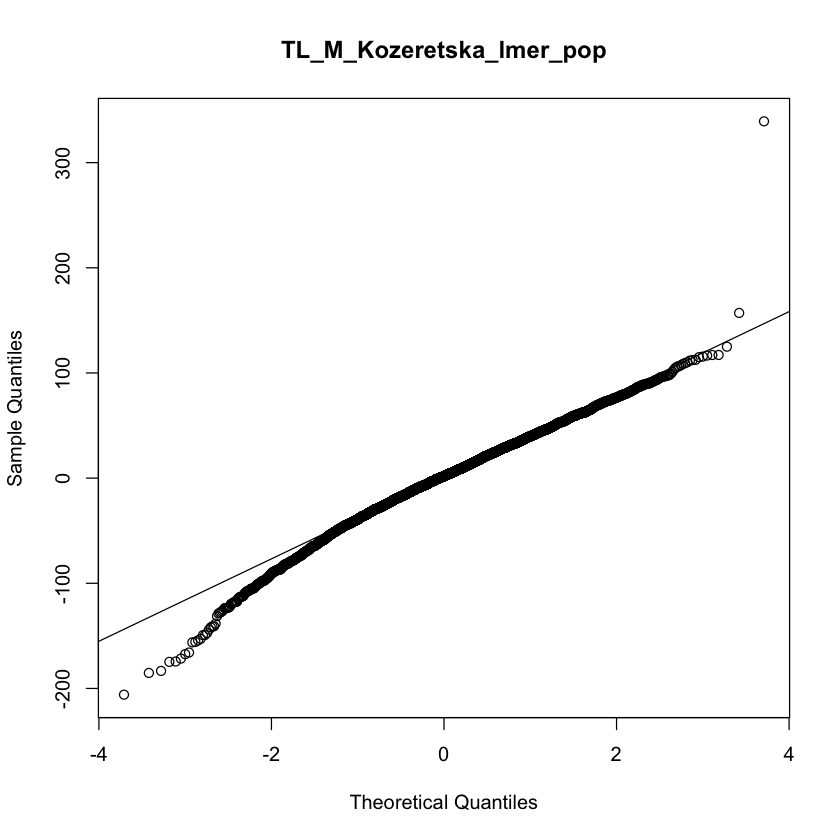
```

#### Posnien Lab

_Females_
```{r fig.show = "hold", out.width = "49%", fig.align = "default", echo = FALSE}
knitr::include_graphics("LinearModelsPop/ThoraxLength/by_lab_models_residuals/TL_F_Posnien_lmer_pop_hist_residuals.png")

knitr::include_graphics("LinearModelsPop/ThoraxLength/by_lab_models_residuals/TL_F_Posnien_lmer_pop_qq_plot_residuals.png")
```

_Males_
```{r fig.show = "hold", out.width = "49%", fig.align = "default", echo = FALSE}
knitr::include_graphics("LinearModelsPop/ThoraxLength/by_lab_models_residuals/TL_M_Posnien_lmer_pop_hist_residuals.png")

knitr::include_graphics("LinearModelsPop/ThoraxLength/by_lab_models_residuals/TL_M_Posnien_lmer_pop_qq_plot_residuals.png")
```

#### Ritchie Lab

_Females_
```{r fig.show = "hold", out.width = "49%", fig.align = "default", echo = FALSE}
knitr::include_graphics("LinearModelsPop/ThoraxLength/by_lab_models_residuals/TL_F_Ritchie_lmer_pop_hist_residuals.png")

knitr::include_graphics("LinearModelsPop/ThoraxLength/by_lab_models_residuals/TL_F_Ritchie_lmer_pop_qq_plot_residuals.png")
```

_Males_
```{r fig.show = "hold", out.width = "49%", fig.align = "default", echo = FALSE}


```

#### Schmidt Lab

_Females_
```{r fig.show = "hold", out.width = "49%", fig.align = "default", echo = FALSE}
knitr::include_graphics("LinearModelsPop/ThoraxLength/by_lab_models_residuals/TL_F_Schmidt_lmer_pop_hist_residuals.png")


```

```{r echo=FALSE}
for (i in dev.list()[1]:dev.list()[length(dev.list())]) {
   invisible(dev.off())
}
# crashed bc tries to save lots -- need to remove some sometimes
```

## Wing area

```{r include=FALSE}
dir.create(file.path("WingArea"), showWarnings = FALSE)
```

_For a detailed description of tables, plots, linear models and outputs, please refer [here](#anchor) _

### Contributors  

Onder Lab : Cansu Aksoy, Ekin Demir, Ezgi Cobanoglu, Banu Sebnem Onder

Posnien Lab : Micael Reis, Lennart Hüper, Nico Posnien

Ritchie Lab : Megan Mcgunnigle, Nicola  Cook, Teresa Abaurrea, Marija Tanaskovic, Michael Ritchie

Stamenkovic-Radak Lab : Marija Savic Veselinovic, Marija Tanaskovic, Aleksandra Patenkovic, Filip Filopovski, Mihailo Jelic, Katarina Eric, Pavle Eric, Slobodan Davidovic, Marina Stamenkovic-Radak

### Data Reformatting

```{r d_WA}
str(droseu$wa)
```

### _Left_

```{r echo=FALSE}
for (i in dev.list()[1]:dev.list()[length(dev.list())]) {
   invisible(dev.off())
}
# crashed bc tries to save lots -- need to remove some sometimes
```


### Descriptive Statistics

Descriptive statistics at the line level, with batch information : 
```{r, echo=FALSE}
DT::datatable(table_line_wbatch$WA_Left, options = list(pageLength = 10)) %>% formatRound(6:13, 3)
```

Descriptive statistics at the line level, without batch information : 
```{r, echo=FALSE}
DT::datatable(table_line_wobatch$WA_Left, options = list(pageLength = 10)) %>% formatRound(5:12, 3)
```

Descriptive statistics at the population level, with batch information : 
```{r, echo=FALSE}
DT::datatable(table_pop_wbatch$WA_Left, options = list(pageLength = 10))  %>% formatRound(5:12, 3)
```

Descriptive statistics at the population level, without batch information : 
```{r, echo=FALSE}
DT::datatable(table_pop_wobatch$WA_Left, options = list(pageLength = 10))  %>% formatRound(4:11, 3)
```

### Plots and Linear Models by Lab  

#### Overview 

```{r}

min_WAL <- min(droseu$wa$CentroidSizeLeft_micrometers)
max_WAL <- max(droseu$wa$CentroidSizeLeft_micrometers)

```

y-axis is scaled by the minimum (`r min_WAL`) and maximum (`r max_WAL`) values in the full data set. 


```{r echo=FALSE}
knitr::include_graphics("WingArea/p_WA_F_L.pdf")
knitr::include_graphics("WingArea/p_WA_M_L.pdf")
```

#### Onder Lab

```{r}
lmers_anova$WA_L_F_Onder_lmer_pop
```

```{r}
lmers_sum$WA_L_F_Onder_lmer_pop
```

```{r}
lmers_anova$WA_L_M_Onder_lmer_pop
```

```{r}
lmers_sum$WA_L_M_Onder_lmer_pop
```

```{r echo=FALSE}
knitr::include_graphics("WingArea/p_WA_F_Onder_L.pdf")
knitr::include_graphics("WingArea/p_WA_F_L_pop_Onder.pdf")
```

```{r echo=FALSE}
knitr::include_graphics("WingArea/p_WA_M_Onder_L.pdf")
knitr::include_graphics("WingArea/p_WA_M_L_pop_Onder.pdf")
```

#### Posnien Lab 

```{r}
lmers_anova$WA_L_F_Posnien_lmer_pop
```

```{r}
lmers_sum$WA_L_F_Posnien_lmer_pop
```

```{r}
lmers_anova$WA_L_M_Posnien_lmer_pop
```

```{r}
lmers_sum$WA_L_M_Posnien_lmer_pop
```


```{r echo=FALSE}
knitr::include_graphics("WingArea/p_WA_F_L_Posnien.pdf")
knitr::include_graphics("WingArea/p_WA_F_L_pop_Posnien.pdf")
```

```{r echo=FALSE}
knitr::include_graphics("WingArea/p_WA_M_L_Posnien.pdf")
knitr::include_graphics("WingArea/p_WA_M_L_pop_Posnien.pdf")
```

#### Ritchie Lab

```{r}
lmers_anova$WA_L_F_Ritchie_lmer_pop
```

```{r}
lmers_sum$WA_L_F_Ritchie_lmer_pop
```

```{r}
lmers_anova$WA_L_M_Ritchie_lmer_pop
```

```{r}
lmers_sum$WA_L_M_Ritchie_lmer_pop
```

```{r echo=FALSE}
knitr::include_graphics("WingArea/p_WA_F_L_Ritchie.pdf")
knitr::include_graphics("WingArea/p_WA_F_L_pop_Ritchie.pdf")
```

```{r echo=FALSE}
knitr::include_graphics("WingArea/p_WA_M_L_Ritchie.pdf")
knitr::include_graphics("WingArea/p_WA_M_L_pop_Ritchie.pdf")
```

#### Stamenkovic-Radak Lab

```{r}
lmers_anova$WA_L_F_StamenkovicRadak_lmer_pop
```

```{r}
lmers_sum$WA_L_F_StamenkovicRadak_lmer_pop
```

```{r}
lmers_anova$WA_L_M_StamenkovicRadak_lmer_pop
```

```{r}
lmers_sum$WA_L_M_StamenkovicRadak_lmer_pop
```

```{r echo=FALSE}
knitr::include_graphics("WingArea/p_WA_F_L_StamenkovicRadak.pdf")
knitr::include_graphics("WingArea/p_WA_F_L_pop_StamenkovicRadak.pdf")
```

```{r echo=FALSE}
knitr::include_graphics("WingArea/p_WA_M_L_StamenkovicRadak.pdf")
knitr::include_graphics("WingArea/p_WA_M_L_pop_StamenkovicRadak.pdf")
```

### _Right_

### Descriptive Statistics

Descriptive statistics at the line level, with batch information : 
```{r, echo=FALSE}
DT::datatable(table_line_wbatch$WA_Right, options = list(pageLength = 10)) %>% formatRound(6:13, 3)
```

Descriptive statistics at the line level, without batch information : 
```{r, echo=FALSE}
DT::datatable(table_line_wobatch$WA_Right, options = list(pageLength = 10)) %>% formatRound(5:12, 3)
```

Descriptive statistics at the population level, with batch information : 
```{r, echo=FALSE}
DT::datatable(table_pop_wbatch$WA_Right, options = list(pageLength = 10))  %>% formatRound(5:12, 3)
```

Descriptive statistics at the population level, without batch information : 
```{r, echo=FALSE}
DT::datatable(table_pop_wobatch$WA_Right, options = list(pageLength = 10))  %>% formatRound(4:11, 3)
```

### Plots and Linear Models by Lab  

#### Overview 

```{r}
min_WAR <- min(droseu$wa$CentroidSizeRight_micrometers)
max_WAR <- max(droseu$wa$CentroidSizeRight_micrometers)
```

```{r echo=FALSE}
knitr::include_graphics("WingArea/p_WA_F_R.pdf")
knitr::include_graphics("WingArea/p_WA_M_R.pdf")
```

#### Onder Lab

```{r include=FALSE}
for (i in dev.list()[1]:dev.list()[length(dev.list())]) {
   invisible(dev.off())
}
# crashed bc tries to save lots -- need to remove some 
```

```{r}
lmers_anova$WA_R_F_Onder_lmer_pop
```

```{r}
lmers_sum$WA_R_F_Onder_lmer_pop
```

```{r}
lmers_anova$WA_R_M_Onder_lmer_pop
```

```{r}
lmers_sum$WA_R_M_Onder_lmer_pop
```

```{r echo=FALSE}
knitr::include_graphics("WingArea/p_WA_F_R_Onder.pdf")
knitr::include_graphics("WingArea/p_WA_F_R_pop_Onder.pdf")
```

```{r echo=FALSE}
knitr::include_graphics("WingArea/p_WA_M_R_Onder.pdf")
knitr::include_graphics("WingArea/p_WA_M_R_pop_Onder.pdf")
```

#### Posnien Lab 

```{r}
lmers_anova$WA_R_F_Posnien_lmer_pop
```

```{r}
lmers_sum$WA_R_F_Posnien_lmer_pop
```

```{r}
lmers_anova$WA_R_M_Posnien_lmer_pop
```

```{r}
lmers_sum$WA_R_M_Posnien_lmer_pop
```


```{r echo=FALSE}
knitr::include_graphics("WingArea/p_WA_F_R_Posnien.pdf")
knitr::include_graphics("WingArea/p_WA_F_R_pop_Posnien.pdf")
```

```{r echo=FALSE}
knitr::include_graphics("WingArea/p_WA_M_R_Posnien.pdf")
knitr::include_graphics("WingArea/p_WA_M_R_pop_Posnien.pdf")
```

#### Ritchie Lab

```{r}
lmers_anova$WA_R_F_Ritchie_lmer_pop
```

```{r}
lmers_sum$WA_R_F_Ritchie_lmer_pop
```

```{r}
lmers_anova$WA_R_M_Ritchie_lmer_pop
```

```{r}
lmers_sum$WA_R_M_Ritchie_lmer_pop
```


```{r echo=FALSE}
knitr::include_graphics("WingArea/p_WA_F_R_Ritchie.pdf")
knitr::include_graphics("WingArea/p_WA_F_R_pop_Ritchie.pdf")
```

```{r echo=FALSE}
knitr::include_graphics("WingArea/p_WA_M_R_Ritchie.pdf")
knitr::include_graphics("WingArea/p_WA_M_R_pop_Ritchie.pdf")
```

#### Stamenkovic-Radak Lab

```{r}
lmers_anova$WA_R_F_StamenkovicRadak_lmer_pop
```

```{r}
lmers_sum$WA_R_F_StamenkovicRadak_lmer_pop
```

```{r}
lmers_anova$WA_R_M_StamenkovicRadak_lmer_pop
```

```{r}
lmers_sum$WA_R_M_StamenkovicRadak_lmer_pop
```

```{r echo=FALSE}
knitr::include_graphics("WingArea/p_WA_F_R_StamenkovicRadak.pdf")
knitr::include_graphics("WingArea/p_WA_F_R_pop_StamenkovicRadak.pdf")
```

```{r echo=FALSE}
knitr::include_graphics("WingArea/p_WA_M_R_StamenkovicRadak.pdf")
knitr::include_graphics("WingArea/p_WA_M_R_pop_StamenkovicRadak.pdf")
```

### Linear Models / Residuals (Left)

#### Onder Lab

_Females_
```{r fig.show = "hold", out.width = "49%", fig.align = "default", echo = FALSE}
knitr::include_graphics("LinearModelsPop/WingArea/by_lab_models_residuals/WA_L_F_Onder_lmer_pop_hist_residuals.png")

knitr::include_graphics("LinearModelsPop/WingArea/by_lab_models_residuals/WA_L_F_Onder_lmer_pop_qq_plot_residuals.png")
```

_Males_
```{r fig.show = "hold", out.width = "49%", fig.align = "default", echo = FALSE}
knitr::include_graphics("LinearModelsPop/WingArea/by_lab_models_residuals/WA_L_M_Onder_lmer_pop_hist_residuals.png")

knitr::include_graphics("LinearModelsPop/WingArea/by_lab_models_residuals/WA_L_M_Onder_lmer_pop_qq_plot_residuals.png")
```

#### Posnien Lab

_Females_
```{r fig.show = "hold", out.width = "49%", fig.align = "default", echo = FALSE}
knitr::include_graphics("LinearModelsPop/WingArea/by_lab_models_residuals/WA_L_F_Posnien_lmer_pop_hist_residuals.png")


```

_Males_
```{r fig.show = "hold", out.width = "49%", fig.align = "default", echo = FALSE}
knitr::include_graphics("LinearModelsPop/WingArea/by_lab_models_residuals/WA_L_M_Posnien_lmer_pop_hist_residuals.png")

knitr::include_graphics("LinearModelsPop/WingArea/by_lab_models_residuals/WA_L_M_Posnien_lmer_pop_qq_plot_residuals.png")
```

#### Ritchie Lab

_Females_
```{r fig.show = "hold", out.width = "49%", fig.align = "default", echo = FALSE}
knitr::include_graphics("LinearModelsPop/WingArea/by_lab_models_residuals/WA_L_F_Ritchie_lmer_pop_hist_residuals.png")

knitr::include_graphics("LinearModelsPop/WingArea/by_lab_models_residuals/WA_L_F_Ritchie_lmer_pop_qq_plot_residuals.png")
```

_Males_
```{r fig.show = "hold", out.width = "49%", fig.align = "default", echo = FALSE}
knitr::include_graphics("LinearModelsPop/WingArea/by_lab_models_residuals/WA_L_M_Ritchie_lmer_pop_hist_residuals.png")


```

#### Stamenkovic-Radak Lab

_Females_
```{r fig.show = "hold", out.width = "49%", fig.align = "default", echo = FALSE}
knitr::include_graphics("LinearModelsPop/WingArea/by_lab_models_residuals/WA_L_F_StamenkovicRadak_lmer_pop_hist_residuals.png")

knitr::include_graphics("LinearModelsPop/WingArea/by_lab_models_residuals/WA_L_F_StamenkovicRadak_lmer_pop_qq_plot_residuals.png")
```

_Males_
```{r fig.show = "hold", out.width = "49%", fig.align = "default", echo = FALSE}


knitr::include_graphics("LinearModelsPop/WingArea/by_lab_models_residuals/WA_L_M_StamenkovicRadak_lmer_pop_qq_plot_residuals.png")
```

### Linear Models / Residuals (Right)

#### Onder Lab

_Females_
```{r fig.show = "hold", out.width = "49%", fig.align = "default", echo = FALSE}
knitr::include_graphics("LinearModelsPop/WingArea/by_lab_models_residuals/WA_R_F_Onder_lmer_pop_hist_residuals.png")

knitr::include_graphics("LinearModelsPop/WingArea/by_lab_models_residuals/WA_R_F_Onder_lmer_pop_qq_plot_residuals.png")
```

_Males_
```{r fig.show = "hold", out.width = "49%", fig.align = "default", echo = FALSE}


knitr::include_graphics("LinearModelsPop/WingArea/by_lab_models_residuals/WA_R_M_Onder_lmer_pop_qq_plot_residuals.png")
```

#### Posnien Lab

_Females_
```{r fig.show = "hold", out.width = "49%", fig.align = "default", echo = FALSE}


knitr::include_graphics("LinearModelsPop/WingArea/by_lab_models_residuals/WA_R_F_Posnien_lmer_pop_qq_plot_residuals.png")
```

_Males_
```{r fig.show = "hold", out.width = "49%", fig.align = "default", echo = FALSE}
knitr::include_graphics("LinearModelsPop/WingArea/by_lab_models_residuals/WA_R_M_Posnien_lmer_pop_hist_residuals.png")


```

#### Ritchie Lab

_Females_
```{r fig.show = "hold", out.width = "49%", fig.align = "default", echo = FALSE}
knitr::include_graphics("LinearModelsPop/WingArea/by_lab_models_residuals/WA_R_F_Ritchie_lmer_pop_hist_residuals.png")


```

_Males_
```{r fig.show = "hold", out.width = "49%", fig.align = "default", echo = FALSE}
knitr::include_graphics("LinearModelsPop/WingArea/by_lab_models_residuals/WA_R_M_Ritchie_lmer_pop_hist_residuals.png")

knitr::include_graphics("LinearModelsPop/WingArea/by_lab_models_residuals/WA_R_M_Ritchie_lmer_pop_qq_plot_residuals.png")
```

#### Stamenkovic-Radak Lab

_Females_
```{r fig.show = "hold", out.width = "49%", fig.align = "default", echo = FALSE}
knitr::include_graphics("LinearModelsPop/WingArea/by_lab_models_residuals/WA_R_F_StamenkovicRadak_lmer_pop_hist_residuals.png")

knitr::include_graphics("LinearModelsPop/WingArea/by_lab_models_residuals/WA_R_F_StamenkovicRadak_lmer_pop_qq_plot_residuals.png")
```

_Males_
```{r fig.show = "hold", out.width = "49%", fig.align = "default", echo = FALSE}
knitr::include_graphics("LinearModelsPop/WingArea/by_lab_models_residuals/WA_R_M_StamenkovicRadak_lmer_pop_hist_residuals.png")

knitr::include_graphics("LinearModelsPop/WingArea/by_lab_models_residuals/WA_R_M_StamenkovicRadak_lmer_pop_qq_plot_residuals.png")
```

```{r echo=FALSE}
for (i in dev.list()[1]:dev.list()[length(dev.list())]) {
   invisible(dev.off())
}
# crashed bc tries to save lots -- need to remove some sometimes
```

## Fecundity

```{r include=FALSE}
dir.create(file.path("Fecundity"), showWarnings = FALSE)
```

_For a detailed description of tables, plots, linear models and outputs, please refer [here](#anchor) _

```{r}
#Note that the trait has been phenotyped only in females.
```

### Contributors  

Billeter Lab : Xiaocui Wang, Tiphaine Bailly, Mario Mira, Jean-Christophe Billeter

Fricke Lab : Claudia Fricke

### Data Reformatting

```{r d_Fec}
str(droseu$fec)
```

### Descriptive Statistics

Descriptive statistics at the line level, with batch information : 
```{r tables_fec, echo=FALSE}
DT::datatable(table_line_wbatch$Fec, options = list(pageLength = 10)) %>% formatRound(6:13, 3)
```

Descriptive statistics for fecundity at the line level, without batch information : 
```{r, echo=FALSE}
DT::datatable(table_line_wobatch$Fec, options = list(pageLength = 10)) %>% formatRound(5:12, 3)
```

Descriptive statistics at the population level, with batch information : 
```{r, echo=FALSE}
DT::datatable(table_pop_wbatch$Fec, options = list(pageLength = 10))  %>% formatRound(5:12, 3)
```

Descriptive statistics at the population level, without batch information : 
```{r, echo=FALSE}
DT::datatable(table_pop_wobatch$Fec, options = list(pageLength = 10)) %>% formatRound(4:11, 3)
```

### Plots and Linear Models by Lab  

#### Overview 

```{r echo=TRUE}
min_Fec <- min(droseu$fec$NumberOfAdultsEclosed)
max_Fec <- max(droseu$fec$NumberOfAdultsEclosed)
```

y-axis is scaled by the minimum (`r min_Fec`) and maximum (`r max_Fec`) values in the full data set. 


```{r echo=FALSE}
knitr::include_graphics("Fecundity/p_Fec_all.pdf")
```

#### Billeter Lab

```{r}
lmers_anova$Fec_Billeter_lmer_pop
```

```{r}
lmers_sum$Fec_Billeter_lmer_pop
```

```{r echo=FALSE}
knitr::include_graphics("Fecundity/p_Fec_Billeter.pdf")
knitr::include_graphics("Fecundity/p_Fec_pop_Billeter.pdf")
```

#### Fricke Lab 

```{r}
lmers_anova$Fec_Fricke_lmer_pop
```

```{r}
lmers_sum$Fec_Fricke_lmer_pop
```

```{r echo=FALSE}
knitr::include_graphics("Fecundity/p_Fec_Fricke.pdf")
knitr::include_graphics("Fecundity/p_Fec_pop_Fricke.pdf")
```

### Linear Models / Residuals

#### Billeter Lab

```{r fig.show = "hold", out.width = "49%", fig.align = "default", echo = FALSE}
knitr::include_graphics("LinearModelsPop/Fecundity/by_lab_models_residuals/Fec_Billeter_lmer_pop_hist_residuals.png")

knitr::include_graphics("LinearModelsPop/Fecundity/by_lab_models_residuals/Fec_Billeter_lmer_pop_qq_plot_residuals.png")
```

#### Fricke Lab

```{r fig.show = "hold", out.width = "49%", fig.align = "default", echo = FALSE}
knitr::include_graphics("LinearModelsPop/Fecundity/by_lab_models_residuals/Fec_Fricke_lmer_pop_hist_residuals.png")

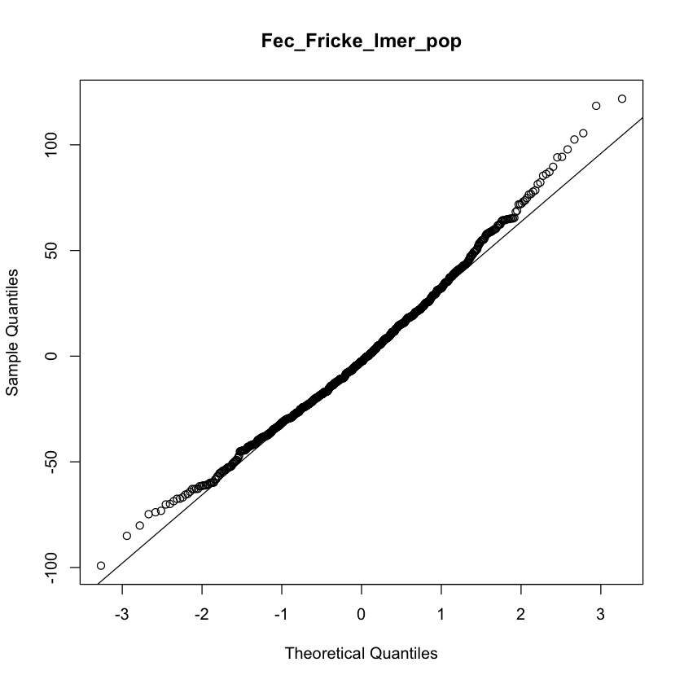
```

## Lifespan

```{r echo=FALSE}
dir.create(file.path("Lifespan"), showWarnings = FALSE)
```

_For a detailed description of tables, plots, linear models and outputs, please refer [here](#anchor) _

```{r echo=FALSE}
for (i in dev.list()[1]:dev.list()[length(dev.list())]) {
   invisible(dev.off())
}
# crashed bc tries to save lots -- need to remove some 
```

### Contributors  

Flatt Lab : Esra Durmaz, Envel Kerdaffrec, Thibault Schowing, Virginie Thieu, Marisa Rodrigues, Thomas Flatt

Parsch Lab : Amanda Glaser-Schmitt, Eliza Argyridou, John Parsch

Pasyukova Lab : Natalia Roshina, Alexander Symonenko, Mikhail Trostnikov, Evgenia Tsybul'ko, Ekaterina Veselkina, Olga Rybina, Elena Pasyukova

### Data Reformatting

```{r}
str(droseu$lsl)
```

```{r}
str(droseu$lsp)
```

```{r}
str(droseu$lsm)
```

### Descriptive Statistics

Descriptive statistics at the line level, with batch information :

```{r tbales_ls, echo=FALSE}
DT::datatable(table_line_wbatch$LS_L, options = list(pageLength = 10)) %>% formatRound(6:13, 3)
```

Descriptive statistics at the line level, without batch information :

```{r, echo=FALSE}
DT::datatable(table_line_wobatch$LS_L, options = list(pageLength = 10)) %>% formatRound(5:12, 3)
```

Descriptive statistics at the population level, with batch information :
```{r, echo=FALSE}
DT::datatable(table_pop_wbatch$LS_M, options = list(pageLength = 10)) %>% formatRound(5:12, 3)
```

Descriptive statistics at the population level, without batch information :
```{r, echo=FALSE}
DT::datatable(table_pop_wobatch$LS_M, options = list(pageLength = 10)) %>% formatRound(4:11, 3)
```

### Plots and Linear Models by Lab  

#### Overview 

```{r}
min_LS <- min(droseu$lsm$LSM_AgeAtDeath_days)
max_LS <- max(droseu$lsm$LSM_AgeAtDeath_days)
```

y-axis is scaled by the minimum (`r min_LS`) and maximum (`r max_LS`) values in the full data set.

```{r echo=FALSE}
knitr::include_graphics("Lifespan/p_LS_F.pdf")
knitr::include_graphics("Lifespan/p_LS_M.pdf")
```

#### Flatt Lab

```{r}
lmers_anova$LS_F_Flatt_lmer_pop
```

```{r}
lmers_sum$LS_F_Flatt_lmer_pop
```

```{r}
lmers_anova$LS_M_Flatt_lmer_pop
```

```{r}
lmers_sum$LS_M_Flatt_lmer_pop
```

```{r echo=FALSE}
knitr::include_graphics("Lifespan/p_LS_F_Flatt.pdf")
knitr::include_graphics("Lifespan/p_LS_M_Flatt.pdf")
```

#### Parsch Lab 

```{r}
lmers_anova$LS_F_Parsch_lmer_pop
```

```{r}
lmers_sum$LS_F_Parsch_lmer_pop
```

```{r}
lmers_anova$LS_M_Parsch_lmer_pop
```

```{r}
lmers_sum$LS_M_Parsch_lmer_pop
```
```{r echo=FALSE}
knitr::include_graphics("Lifespan/p_LS_F_Parsch.pdf")
knitr::include_graphics("Lifespan/p_LS_F_pop_Parsch.pdf")
```

```{r echo=FALSE}
knitr::include_graphics("Lifespan/p_LS_M_Parsch.pdf")
knitr::include_graphics("Lifespan/p_LS_M_pop_Parsch.pdf")
```

#### Pasyukova Lab

```{r}
lmers_anova$LS_F_Pasyukova_lmer_pop
```

```{r}
lmers_sum$LS_F_Pasyukova_lmer_pop
```

```{r}
lmers_anova$LS_M_Pasyukova_lmer_pop
```

```{r}
lmers_sum$LS_M_Pasyukova_lmer_pop
```

```{r echo=FALSE}
knitr::include_graphics("Lifespan/p_LS_F_Pasyukova.pdf")
knitr::include_graphics("Lifespan/p_LS_F_pop_Pasyukova.pdf")
```

```{r echo=FALSE}
knitr::include_graphics("Lifespan/p_LS_M_Pasyukova.pdf")
knitr::include_graphics("Lifespan/p_LS_M_pop_Pasyukova.pdf")
```

### Survival Analyses

#### Flatt Lab

_Females_
```{r}
coxme_anova$LS_P_F_Flatt_coxme
```

```{r echo=FALSE}
knitr::include_graphics("SurvivalAnalyses/Lifespan/p_LS_F_Flatt_survival_curves.pdf")
```

_Males_
```{r}
coxme_anova$LS_P_M_Flatt_coxme
```

```{r echo=FALSE}
knitr::include_graphics("SurvivalAnalyses/Lifespan/p_LS_M_Flatt_survival_curves.pdf")
```

#### Parsch Lab

_Females_

```{r}
coxme_anova$LS_L_F_Parsch_coxme
```

```{r echo=FALSE}
knitr::include_graphics("SurvivalAnalyses/Lifespan/p_LS_F_Parsch_survival_curves.pdf")
```

_Males_

```{r}
coxme_anova$LS_L_M_Parsch_coxme
```

```{r echo=FALSE}
knitr::include_graphics("SurvivalAnalyses/Lifespan/p_LS_M_Parsch_survival_curves.pdf")
```

#### Pasyukova Lab

_Females_
```{r}
coxme_anova$LS_L_F_Pasyukova_coxme
```

```{r echo=FALSE}
knitr::include_graphics("SurvivalAnalyses/Lifespan/p_LS_F_Pasyukova_survival_curves.pdf")
```

_Males_
```{r}
coxme_anova$LS_L_M_Pasyukova_coxme
```

```{r echo=FALSE}
knitr::include_graphics("SurvivalAnalyses/Lifespan/p_LS_M_Pasyukova_survival_curves.pdf")
```

### Linear Models / Residuals

#### Flatt Lab

_Females_
```{r fig.show = "hold", out.width = "49%", fig.align = "default", echo = FALSE}
knitr::include_graphics("LinearModelsPop/Lifespan/by_lab_models_residuals/LS_F_Flatt_lmer_pop_hist_residuals.png")

knitr::include_graphics("LinearModelsPop/Lifespan/by_lab_models_residuals/LS_F_Flatt_lmer_pop_qq_plot_residuals.png")
```

_Males_
```{r fig.show = "hold", out.width = "49%", fig.align = "default", echo = FALSE}
knitr::include_graphics("LinearModelsPop/Lifespan/by_lab_models_residuals/LS_M_Flatt_lmer_pop_hist_residuals.png")

knitr::include_graphics("LinearModelsPop/Lifespan/by_lab_models_residuals/LS_M_Flatt_lmer_pop_qq_plot_residuals.png")
```

#### Parsch Lab
_Females_
```{r fig.show = "hold", out.width = "49%", fig.align = "default", echo = FALSE}
knitr::include_graphics("LinearModelsPop/Lifespan/by_lab_models_residuals/LS_F_Parsch_lmer_pop_hist_residuals.png")


```

_Males_

```{r fig.show = "hold", out.width = "49%", fig.align = "default", echo = FALSE}
knitr::include_graphics("LinearModelsPop/Lifespan/by_lab_models_residuals/LS_M_Parsch_lmer_pop_hist_residuals.png")

knitr::include_graphics("LinearModelsPop/Lifespan/by_lab_models_residuals/LS_M_Parsch_lmer_pop_qq_plot_residuals.png")
```

#### Pasyukova Lab

_Females_
```{r fig.show = "hold", out.width = "49%", fig.align = "default", echo = FALSE}
knitr::include_graphics("LinearModelsPop/Lifespan/by_lab_models_residuals/LS_F_Pasyukova_lmer_pop_hist_residuals.png")

knitr::include_graphics("LinearModelsPop/Lifespan/by_lab_models_residuals/LS_F_Pasyukova_lmer_pop_qq_plot_residuals.png")
```

_Males_
```{r fig.show = "hold", out.width = "49%", fig.align = "default", echo = FALSE}


knitr::include_graphics("LinearModelsPop/Lifespan/by_lab_models_residuals/LS_M_Pasyukova_lmer_pop_qq_plot_residuals.png")
```

## Cold-shock mortality

```{r echo=FALSE}
dir.create(file.path("ColdShock"), showWarnings = FALSE)
```

_For a detailed description of tables, plots, linear models and outputs, please refer [here](#anchor) _

### Contributors  

Gonzalez Lab : Llewellyn Green, Josefa Gonzalez, Miriam Merenciano

Kozeretska Lab : Svitlana Serga, Alexandra Protsenko, Oleksandr Maistrenko, Iryna Kozeretska

Vieira Lab : Jorge Vieira, Cristina P. Vieira, Pedro Duque, Tânia Dias


### Data Reformatting

```{r}
str(droseu$csm)
```

### Descriptive Statistics


Descriptive statistics at the line level, with batch information :
```{r, echo=FALSE}
DT::datatable(table_line_wbatch$CSM, options = list(pageLength = 10)) %>% formatRound(6:13, 3)
```

Descriptive statistics at the line level, without batch information :
```{r, echo=FALSE}
DT::datatable(table_line_wobatch$CSM, options = list(pageLength = 10)) %>% formatRound(5:12, 3)
```

Descriptive statistics at the population level, with batch information :
```{r, echo=FALSE}
DT::datatable(table_pop_wbatch$CSM, options = list(pageLength = 10)) %>% formatRound(5:12, 3)
```

Descriptive statistics at the population level, without batch information :
```{r, echo=FALSE}
DT::datatable(table_pop_wobatch$CSM, options = list(pageLength = 10)) %>% formatRound(4:11, 3)
```

### Plots and Linear Models by Lab  

#### Overview 

```{r min_max_CSM, echo=TRUE}
min_CSM <- min(droseu$csm$CSM_PropDead_ED)
max_CSM <- max(droseu$csm$CSM_PropDead_ED)
```

y-axis is scaled by the minimum (`r min_CSM`) and maximum (`r max_CSM`) values in the full data set.

```{r echo=FALSE}
knitr::include_graphics("ColdShock/p_CSM_F.pdf")
knitr::include_graphics("ColdShock/p_CSM_M.pdf")
```
#### Gonzalez Lab

```{r}
lmers_anova$CSM_F_Gonzalez_lmer_pop
```

```{r}
lmers_sum$CSM_F_Gonzalez_lmer_pop
```

```{r}
lmers_anova$CSM_M_Gonzalez_lmer_pop
```

```{r}
lmers_sum$CSM_M_Gonzalez_lmer_pop
```

```{r echo=FALSE}
knitr::include_graphics("ColdShock/p_CSM_F_Gonzalez.pdf")
knitr::include_graphics("ColdShock/p_CSM_F_pop_Gonzalez.pdf")
```

```{r echo=FALSE}
knitr::include_graphics("ColdShock/p_CSM_M_Gonzalez.pdf")
knitr::include_graphics("ColdShock/p_CSM_M_pop_Gonzalez.pdf")
```

#### Kozeretska Lab 

```{r}
lmers_anova$CSM_F_Kozeretska_lmer_pop
```

```{r}
lmers_sum$CSM_F_Kozeretska_lmer_pop
```

```{r}
lmers_anova$CSM_M_Kozeretska_lmer_pop
```

```{r}
lmers_sum$CSM_M_Kozeretska_lmer_pop
```

```{r echo=FALSE}
knitr::include_graphics("ColdShock/p_CSM_F_Kozeretska.pdf")
knitr::include_graphics("ColdShock/p_CSM_F_pop_Kozeretska.pdf")
```

```{r echo=FALSE}
knitr::include_graphics("ColdShock/p_CSM_M_Kozeretska.pdf")
knitr::include_graphics("ColdShock/p_CSM_M_pop_Kozeretska.pdf")
```

#### Vieira Lab

```{r}
lmers_anova$CSM_F_Vieira_lmer_pop
```

```{r}
lmers_sum$CSM_F_Vieira_lmer_pop
```

```{r}
lmers_anova$CSM_M_Vieira_lmer_pop
```

```{r}
lmers_sum$CSM_M_Vieira_lmer_pop
```

```{r echo=FALSE}
knitr::include_graphics("ColdShock/p_CSM_F_Vieira.pdf")
knitr::include_graphics("ColdShock/p_CSM_F_pop_Vieira.pdf")
```

```{r echo=FALSE}
knitr::include_graphics("ColdShock/p_CSM_M_Vieira.pdf")
knitr::include_graphics("ColdShock/p_CSM_M_pop_Vieira.pdf")
```

### Linear Models / Residuals

#### Gonzalez Lab

_Females_
```{r fig.show = "hold", out.width = "49%", fig.align = "default", echo = FALSE}


knitr::include_graphics("LinearModelsPop/ColdShock/by_lab_models_residuals/CSM_F_Gonzalez_lmer_pop_qq_plot_residuals.png")
```

_Males_
```{r fig.show = "hold", out.width = "49%", fig.align = "default", echo = FALSE}
knitr::include_graphics("LinearModelsPop/ColdShock/by_lab_models_residuals/CSM_M_Gonzalez_lmer_pop_hist_residuals.png")

knitr::include_graphics("LinearModelsPop/ColdShock/by_lab_models_residuals/CSM_M_Gonzalez_lmer_pop_qq_plot_residuals.png")
```

#### Kozeretska Lab

_Females_
```{r fig.show = "hold", out.width = "49%", fig.align = "default", echo = FALSE}


knitr::include_graphics("LinearModelsPop/ColdShock/by_lab_models_residuals/CSM_F_Kozeretska_lmer_pop_qq_plot_residuals.png")
```

_Males_
```{r fig.show = "hold", out.width = "49%", fig.align = "default", echo = FALSE}
knitr::include_graphics("LinearModelsPop/ColdShock/by_lab_models_residuals/CSM_M_Kozeretska_lmer_pop_hist_residuals.png")


```

#### Vieira Lab

_Females_
```{r fig.show = "hold", out.width = "49%", fig.align = "default", echo = FALSE}
knitr::include_graphics("LinearModelsPop/ColdShock/by_lab_models_residuals/CSM_F_Vieira_lmer_pop_hist_residuals.png")


```

_Males_
```{r fig.show = "hold", out.width = "49%", fig.align = "default", echo = FALSE}


knitr::include_graphics("LinearModelsPop/ColdShock/by_lab_models_residuals/CSM_M_Vieira_lmer_pop_qq_plot_residuals.png")
```

```{r echo=FALSE}
for (i in dev.list()[1]:dev.list()[length(dev.list())]) {
   invisible(dev.off())
}
# crashed bc tries to save lots -- need to remove some sometimes
```

## Chill-coma recovery time

```{r include=FALSE}
dir.create(file.path("ChillComa"), showWarnings = FALSE)
```

_For a detailed description of tables, plots, linear models and outputs, please refer [here](#anchor) _

### Contributors  

Mensch Lab : Florencia Putero, Lucas Kreiman, Julian Mensch

Vieira Lab : Jorge Vieira, Cristina P. Vieira, Pedro Duque, Tânia Dias


### Data Reformatting

```{r}
str(droseu$ccrt)
```

### Descriptive Statistics

Descriptive statistics at the line level, with batch information :
```{r, echo=FALSE}
DT::datatable(table_line_wbatch$CCRT, options = list(pageLength = 10)) %>% formatRound(6:13, 3)
```

Descriptive statistics at the line level, without batch information :
```{r, echo=FALSE}
DT::datatable(table_line_wobatch$CCRT, options = list(pageLength = 10)) %>% formatRound(5:12, 3)
```

Descriptive statistics at the population level, with batch information :
```{r, echo=FALSE}
DT::datatable(table_pop_wbatch$CCRT, options = list(pageLength = 10)) %>% formatRound(5:12, 3)
```

Descriptive statistics at the population level, without batch information :
```{r, echo=FALSE}
DT::datatable(table_pop_wobatch$CCRT, options = list(pageLength = 10)) %>% formatRound(4:11, 3)
```

### Plots and Linear Models by Lab  

#### Overview 

```{r min_max_CCRT, echo=TRUE}
min_CCRT <- min(droseu$ccrt$CCRT_seconds)
max_CCRT <- max(droseu$ccrt$CCRT_seconds)
```

y-axis is scaled by the minimum (`r min_CSM`) and maximum (`r max_CSM`) values in the full data set.

#### Mensch Lab

```{r}
lmers_anova$CCRT_F_Mensch_lmer_pop
```

```{r}
lmers_sum$CCRT_F_Mensch_lmer_pop
```

```{r}
lmers_anova$CCRT_M_Mensch_lmer_pop
```

```{r}
lmers_sum$CCRT_M_Mensch_lmer_pop
```

```{r echo=FALSE}
knitr::include_graphics("ChillComa/p_CCRT_F_Mensch.pdf")
knitr::include_graphics("ChillComa/p_CCRT_F_pop_Mensch.pdf")
```

```{r echo=FALSE}
knitr::include_graphics("ChillComa/p_CCRT_M_Mensch.pdf")
knitr::include_graphics("ChillComa/p_CCRT_M_pop_Mensch.pdf")
```

#### Vieira Lab

```{r}
lmers_anova$CCRT_F_Vieira_lmer_pop
```

```{r}
lmers_sum$CCRT_F_Vieira_lmer_pop
```

```{r}
lmers_anova$CCRT_M_Vieira_lmer_pop
```

```{r}
lmers_sum$CCRT_M_Vieira_lmer_pop
```

```{r echo=FALSE}
knitr::include_graphics("ChillComa/p_CCRT_F_Vieira.pdf")
knitr::include_graphics("ChillComa/p_CCRT_F_pop_Vieira.pdf")
```

```{r echo=FALSE}
knitr::include_graphics("ChillComa/p_CCRT_M_Vieira.pdf")
knitr::include_graphics("ChillComa/p_CCRT_M_pop_Vieira.pdf")
```

### Survival Analyses

#### Mensch Lab

_Females_
```{r}
coxme_anova$CCRT_F_coxme_Mensch
```

```{r, echo=FALSE}
knitr::include_graphics("SurvivalAnalyses/ChillComa/p_CCRT_F_Mensch_survival_curves.pdf")
```

_Males_
```{r}
coxme_anova$CCRT_M_coxme_Mensch
```

```{r, echo=FALSE}
knitr::include_graphics("SurvivalAnalyses/ChillComa/p_CCRT_M_Mensch_survival_curves.pdf")
```

#### Vieira Lab

_Females_
```{r}
coxme_anova$CCRT_F_coxme_Vieira
```

```{r, echo=FALSE}
knitr::include_graphics("SurvivalAnalyses/ChillComa/p_CCRT_F_Vieira_survival_curves.pdf")
```

_Males_
```{r}
coxme_anova$CCRT_M_coxme_Vieira
```

```{r, echo=FALSE}
knitr::include_graphics("SurvivalAnalyses/ChillComa/p_CCRT_M_Vieira_survival_curves.pdf")
```

### Linear Models / Residuals

#### Mensch Lab

_Females_
```{r fig.show = "hold", out.width = "49%", fig.align = "default", echo = FALSE}
knitr::include_graphics("LinearModelsPop/ChillComa/by_lab_models_residuals/CCRT_F_Mensch_lmer_pop_hist_residuals.png")

knitr::include_graphics("LinearModelsPop/ChillComa/by_lab_models_residuals/CCRT_F_Mensch_lmer_pop_qq_plot_residuals.png")
```

_Males_
```{r fig.show = "hold", out.width = "49%", fig.align = "default", echo = FALSE}
knitr::include_graphics("LinearModelsPop/ChillComa/by_lab_models_residuals/CCRT_M_Mensch_lmer_pop_hist_residuals.png")

knitr::include_graphics("LinearModelsPop/ChillComa/by_lab_models_residuals/CCRT_M_Mensch_lmer_pop_qq_plot_residuals.png")
```

#### Vieira Lab

_Females_
```{r fig.show = "hold", out.width = "49%", fig.align = "default", echo = FALSE}
knitr::include_graphics("LinearModelsPop/ChillComa/by_lab_models_residuals/CCRT_F_Vieira_lmer_pop_hist_residuals.png")

knitr::include_graphics("LinearModelsPop/ChillComa/by_lab_models_residuals/CCRT_F_Vieira_lmer_pop_qq_plot_residuals.png")
```

_Males_
```{r fig.show = "hold", out.width = "49%", fig.align = "default", echo = FALSE}
knitr::include_graphics("LinearModelsPop/ChillComa/by_lab_models_residuals/CCRT_M_Vieira_lmer_pop_hist_residuals.png")

knitr::include_graphics("LinearModelsPop/ChillComa/by_lab_models_residuals/CCRT_M_Vieira_lmer_pop_qq_plot_residuals.png")
```

## Heat-shock mortality

```{r include=FALSE}
dir.create(file.path("HeatShock"), showWarnings = FALSE)
```

_For a detailed description of tables, plots, linear models and outputs, please refer [here](#anchor) _

### Contributors  

Parsch Lab : Eliza Argyridou, Amanda Glaser-Schmitt, John Parsch

Vieira Lab : Jorge Vieira, Cristina P. Vieira, Pedro Duque, Tânia Dias

### Data Reformatting

```{r}
str(droseu$hsm)
```

### Descriptive Statistics

Descriptive statistics at the line level, with batch information :
```{r, echo=FALSE}
DT::datatable(table_line_wbatch$HSM, options = list(pageLength = 10)) %>% formatRound(6:13, 3)
```

Descriptive statistics at the line level, without batch information :
```{r, echo=FALSE}
DT::datatable(table_line_wobatch$HSM, options = list(pageLength = 10)) %>% formatRound(5:12, 3)
```

Descriptive statistics at the population level, with batch information :
```{r, echo=FALSE}
DT::datatable(table_pop_wbatch$HSM, options = list(pageLength = 10)) %>% formatRound(5:11, 3)
```

Descriptive statistics at the population level, without batch information :
```{r, echo=FALSE}
DT::datatable(table_pop_wobatch$HSM, options = list(pageLength = 10)) %>% formatRound(4:11, 3)
```

### Plots and Linear Models by Lab  

#### Overview 

```{r}
min_HSM <- min(droseu$hsm$TimeDeath_min)
max_HSM <- max(droseu$hsm$TimeDeath_min)
```

y-axis is scaled by the minimum (`r min_HSM`) and maximum (`r max_HSM`) values in the full data set.

```{r echo=FALSE}
knitr::include_graphics("HeatShock/p_HSM_F.pdf")
knitr::include_graphics("HeatShock/p_HSM_M.pdf")
```

#### Parsch Lab

```{r}
lmers_anova$HSM_F_Parsch_lmer_pop
```

```{r}
lmers_sum$HSM_F_Parsch_lmer_pop
```

```{r}
lmers_anova$HSM_M_Parsch_lmer_pop
```

```{r}
lmers_sum$HSM_M_Parsch_lmer_pop
```

```{r echo=FALSE}
knitr::include_graphics("HeatShock/p_HSM_F_Parsch.pdf")
knitr::include_graphics("HeatShock/p_HSM_F_pop_Parsch.pdf")
```

```{r echo=FALSE}
knitr::include_graphics("HeatShock/p_HSM_M_Parsch.pdf")
knitr::include_graphics("HeatShock/p_HSM_M_pop_Parsch.pdf")
```

#### Vieira Lab 

```{r}
lmers_anova$HSM_F_Vieira_lmer_pop
```

```{r}
lmers_sum$HSM_F_Vieira_lmer_pop
```

```{r}
lmers_anova$HSM_M_Vieira_lmer_pop
```

```{r}
lmers_sum$HSM_M_Vieira_lmer_pop
```

```{r echo=FALSE}
knitr::include_graphics("HeatShock/p_HSM_F_Vieira.pdf")
knitr::include_graphics("HeatShock/p_HSM_F_pop_Vieira.pdf")
```

```{r echo=FALSE}
knitr::include_graphics("HeatShock/p_HSM_M_Vieira.pdf")
knitr::include_graphics("HeatShock/p_HSM_M_pop_Vieira.pdf")
```

### Survival Analyses

#### Parsch Lab

_Females_
```{r}
coxme_anova$HSM_F_coxme_Parsch
```

```{r, echo=FALSE}
knitr::include_graphics("SurvivalAnalyses/HeatShock/p_HSM_F_Parsch_survival_curves.pdf")
```

_Males_
```{r}
coxme_anova$HSM_M_coxme_Parsch
```

```{r, echo=FALSE}
knitr::include_graphics("SurvivalAnalyses/HeatShock/p_HSM_M_Parsch_survival_curves.pdf")
```

#### Vieira Lab

_Females_
```{r}
coxme_anova$HSM_F_coxme_Vieira
```

```{r, echo=FALSE}
knitr::include_graphics("SurvivalAnalyses/HeatShock/p_HSM_F_Vieira_survival_curves.pdf")
```

_Males_
```{r}
coxme_anova$HSM_M_coxme_Vieira
```

```{r, echo=FALSE}
knitr::include_graphics("SurvivalAnalyses/HeatShock/p_HSM_M_Vieira_survival_curves.pdf")
```

### Linear Models / Residuals

#### Parsch Lab

_Females_
```{r fig.show = "hold", out.width = "49%", fig.align = "default", echo = FALSE}


knitr::include_graphics("LinearModelsPop/HeatShock/by_lab_models_residuals/HSM_F_Parsch_lmer_pop_qq_plot_residuals.png")
```

_Males_
```{r fig.show = "hold", out.width = "49%", fig.align = "default", echo = FALSE}
knitr::include_graphics("LinearModelsPop/HeatShock/by_lab_models_residuals/HSM_M_Parsch_lmer_pop_hist_residuals.png")


```

#### Vieria Lab

_Females_
```{r fig.show = "hold", out.width = "49%", fig.align = "default", echo = FALSE}


```

_Males_
```{r fig.show = "hold", out.width = "49%", fig.align = "default", echo = FALSE}
knitr::include_graphics("LinearModelsPop/HeatShock/by_lab_models_residuals/HSM_M_Vieira_lmer_pop_hist_residuals.png")

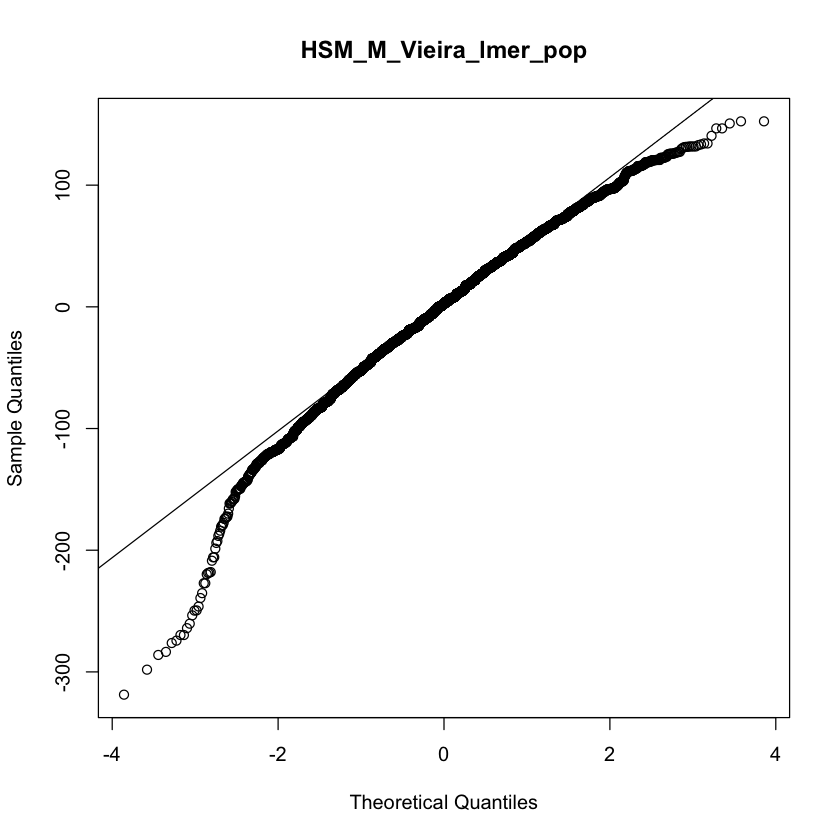
```

## Diapause

```{r include=FALSE}
dir.create(file.path("Diapause"), showWarnings = FALSE)
```

_For a detailed description of tables, plots, linear models and outputs, please refer [here](#anchor) _

### Contributors  

Bergland Lab : Liam Miller, Alan Bergland, Priscilla Erickson

Flatt Lab : Esra Durmaz, Envel Kerdaffrec, Thibault Schowing, Virginie Thieu, Marisa Rodrigues, Thomas Flatt

Schlotterer Lab : Manolis Lyrakis, Christian Schlötterer

### Data Reformatting

```{r}
str(droseu$dia)
```

### Descriptive Statistics

Descriptive statistics at the population level, with batch information :
```{r echo=FALSE}
DT::datatable(table_pop_wbatch$Dia_Prop_Max_Stage9, options = list(pageLength = 10)) %>% formatRound(5:12, 3)
```

Descriptive statistics at the population level, without batch information :
```{r echo=FALSE}
DT::datatable(table_pop_wobatch$Dia_Prop_Max_Stage9, options = list(pageLength = 10)) %>% formatRound(4:11, 3)
```

### Plots and Linear Models by Lab

#### Overview

```{r}
min_Dia <- min(droseu$dia$Prop_Max_Stage9)
max_Dia <- max(droseu$dia$Prop_Max_Stage9)
```

```{r echo=FALSE}
knitr::include_graphics("Diapause/p_Dia.pdf")
```

#### Bergland Lab
```{r}
lmers_anova$Dia_Bergland_lmer_pop
```

```{r}
lmers_sum$Dia_Bergland_lmer_pop
```

```{r echo=FALSE}
knitr::include_graphics("Diapause/p_Dia_Pop_Bergland_wbatch.pdf")
knitr::include_graphics("Diapause/p_Dia_Pop_Bergland_wobatch.pdf")
```

#### Flatt Lab 

```{r}
lmers_anova$Dia_Flatt_lm_pop
```

```{r}
lmers_sum$Dia_Flatt_lm_pop
```

```{r echo=FALSE}
knitr::include_graphics("Diapause/p_Dia_Pop_Flatt_wbatch.pdf")
knitr::include_graphics("Diapause/p_Dia_Pop_Flatt_wobatch.pdf")
```

#### Schlotterer Lab

```{r}
lmers_anova$Dia_Schlotterer_lmer_pop
```

```{r}
lmers_sum$Dia_Schlotterer_lmer_pop
```

```{r echo=FALSE}
knitr::include_graphics("Diapause/p_Dia_Pop_Schlotterer_wbatch.pdf")
knitr::include_graphics("Diapause/p_Dia_Pop_Schlotterer_wobatch.pdf")
```

### Linear Models / Residuals

#### Bergland Lab

```{r fig.show = "hold", out.width = "49%", fig.align = "default", echo = FALSE}
knitr::include_graphics("LinearModelsPop/Diapause/by_lab_models_residuals/Dia_Bergland_lmer_pop_hist_residuals.png")

knitr::include_graphics("LinearModelsPop/Diapause/by_lab_models_residuals/Dia_Bergland_lmer_pop_qq_plot_residuals.png")
```

#### Flatt Lab

```{r fig.show = "hold", out.width = "49%", fig.align = "default", echo = FALSE}
knitr::include_graphics("LinearModelsPop/Diapause/by_lab_models_residuals/Dia_Flatt_lm_pop_hist_residuals.png")

knitr::include_graphics("LinearModelsPop/Diapause/by_lab_models_residuals/Dia_Flatt_lm_pop_qq_plot_residuals.png")
```

#### Schlotterer Lab

```{r fig.show = "hold", out.width = "49%", fig.align = "default", echo = FALSE}
knitr::include_graphics("LinearModelsPop/Diapause/by_lab_models_residuals/Dia_Schlotterer_lmer_pop_hist_residuals.png")

knitr::include_graphics("LinearModelsPop/Diapause/by_lab_models_residuals/Dia_Schlotterer_lmer_pop_qq_plot_residuals.png")
```


## Circadian eclosion timing

```{r include=FALSE}
dir.create(file.path("CircadianEclosion"), showWarnings = FALSE)
```

_For a detailed description of tables, plots, linear models and outputs, please refer [here](#anchor) _

```{r}
#Note that the trait has been phenotyped as mixed sex. 
```

### Contributors  

Wegener Lab : Susanne Klühspies, Christian Wegener

### Data Reformatting

```{r}
str(droseu$cets)
```

### Descriptive Statistics

#### 18_LD_DD

Descriptive statistics for ZT_hours_MESA :
```{r echo=FALSE}
DT::datatable(table_pop_wbatch$CETS_18_LD_DD_ZT_hours_MESA, options = list(pageLength = 10)) %>% formatRound(5:5, 3)
```

Descriptive statistics for ZT_hours_LSPR :
```{r echo=FALSE}
DT::datatable(table_pop_wbatch$CETS_18_LD_DD_ZT_hours_LSPR, options = list(pageLength = 10)) %>% formatRound(5:5, 3)
```

Descriptive statistics for Period_MESA :
```{r echo=FALSE}
DT::datatable(table_pop_wbatch$CETS_18_LD_DD_Period_MESA, options = list(pageLength = 10)) %>% formatRound(5:5, 3)
```

Descriptive statistics for Period_LSPR :
```{r echo=FALSE}
DT::datatable(table_pop_wbatch$CETS_18_LD_DD_Period_LSPR, options = list(pageLength = 10)) %>% formatRound(5:5, 3)
```

Descriptive statistics for Rhythmicity_LSPR_amplitude :
```{r echo=FALSE}
DT::datatable(table_pop_wbatch$CETS_18_LD_DD_Rhythmicity_LSPR_amplitude, options = list(pageLength = 10)) %>% formatRound(5:5, 3)
```

Descriptive statistics for Rhythmicity_JTK_p_BH_corrected :
```{r echo=FALSE}
DT::datatable(table_pop_wbatch$CETS_18_LD_DD_Rhythmicity_JTK_p_BH_corrected, options = list(pageLength = 10)) %>% formatRound(5:5, 3)
```

#### 18_LD_LD

Descriptive statistics for ZT_hours_MESA :
```{r echo=FALSE}
DT::datatable(table_pop_wbatch$CETS_18_LD_LD_ZT_hours_MESA, options = list(pageLength = 10)) %>% formatRound(5:5, 3)
```

Descriptive statistics for ZT_hours_LSPR :
```{r echo=FALSE}
DT::datatable(table_pop_wbatch$CETS_18_LD_LD_ZT_hours_LSPR, options = list(pageLength = 10)) %>% formatRound(5:5, 3)
```

Descriptive statistics for Period_MESA :
```{r echo=FALSE}
DT::datatable(table_pop_wbatch$CETS_18_LD_LD_Period_MESA, options = list(pageLength = 10)) %>% formatRound(5:5, 3)
```

Descriptive statistics for Period_LSPR :
```{r echo=FALSE}
DT::datatable(table_pop_wbatch$CETS_18_LD_LD_Period_LSPR, options = list(pageLength = 10)) %>% formatRound(5:5, 3)
```

Descriptive statistics for Rhythmicity_LSPR_amplitude :
```{r echo=FALSE}
DT::datatable(table_pop_wbatch$CETS_18_LD_LD_Rhythmicity_LSPR_amplitude, options = list(pageLength = 10)) %>% formatRound(5:5, 3)
```

Descriptive statistics for Rhythmicity_JTK_p_BH_corrected :
```{r echo=FALSE}
DT::datatable(table_pop_wbatch$CETS_18_LD_LD_Rhythmicity_JTK_p_BH_corrected, options = list(pageLength = 10)) %>% formatRound(5:5, 3)
```

#### 29_LD_DD

Descriptive statistics for ZT_hours_MESA :
```{r echo=FALSE}
DT::datatable(table_pop_wbatch$CETS_29_LD_DD_ZT_hours_MESA, options = list(pageLength = 10)) %>% formatRound(5:5, 3)
```

Descriptive statistics for ZT_hours_LSPR :
```{r echo=FALSE}
DT::datatable(table_pop_wbatch$CETS_29_LD_DD_ZT_hours_LSPR, options = list(pageLength = 10)) %>% formatRound(5:5, 3)
```

Descriptive statistics for Period_MESA :
```{r echo=FALSE}
DT::datatable(table_pop_wbatch$CETS_29_LD_DD_Period_MESA, options = list(pageLength = 10)) %>% formatRound(5:5, 3)
```

Descriptive statistics for Period_LSPR :
```{r echo=FALSE}
DT::datatable(table_pop_wbatch$CETS_29_LD_DD_Period_LSPR, options = list(pageLength = 10)) %>% formatRound(5:5, 3)
```

Descriptive statistics for Rhythmicity_LSPR_amplitude :
```{r echo=FALSE}
DT::datatable(table_pop_wbatch$CETS_29_LD_DD_Rhythmicity_LSPR_amplitude, options = list(pageLength = 10)) %>% formatRound(5:5, 3)
```

Descriptive statistics for Rhythmicity_JTK_p_BH_corrected :
```{r echo=FALSE}
DT::datatable(table_pop_wbatch$CETS_29_LD_DD_Rhythmicity_JTK_p_BH_corrected, options = list(pageLength = 10)) %>% formatRound(5:5, 3)
```

#### 29_LD_LD

Descriptive statistics for ZT_hours_MESA :
```{r echo=FALSE}
DT::datatable(table_pop_wbatch$CETS_29_LD_LD_ZT_hours_MESA, options = list(pageLength = 10)) %>% formatRound(5:5, 3)
```

Descriptive statistics for ZT_hours_LSPR :
```{r echo=FALSE}
DT::datatable(table_pop_wbatch$CETS_29_LD_LD_ZT_hours_LSPR, options = list(pageLength = 10)) %>% formatRound(5:5, 3)
```

Descriptive statistics for Period_MESA :
```{r echo=FALSE}
DT::datatable(table_pop_wbatch$CETS_29_LD_LD_Period_MESA, options = list(pageLength = 10)) %>% formatRound(5:5, 3)
```

Descriptive statistics for Period_LSPR :
```{r echo=FALSE}
DT::datatable(table_pop_wbatch$CETS_29_LD_LD_Period_LSPR, options = list(pageLength = 10)) %>% formatRound(5:5, 3)
```

Descriptive statistics for Rhythmicity_LSPR_amplitude :
```{r echo=FALSE}
DT::datatable(table_pop_wbatch$CETS_29_LD_LD_Rhythmicity_LSPR_amplitude, options = list(pageLength = 10)) %>% formatRound(5:5, 3)
```

Descriptive statistics for Rhythmicity_JTK_p_BH_corrected :
```{r echo=FALSE}
DT::datatable(table_pop_wbatch$CETS_29_LD_LD_Rhythmicity_JTK_p_BH_corrected, options = list(pageLength = 10)) %>% formatRound(5:5, 3)
```

### Plots and Linear Models by Lab  

#### Overview 

#### Wegener Lab

From Chris :

```{r echo=FALSE}
knitr::include_graphics("CircadianEclosion/FromChris/Graphs_plate_MESA.png")
```

```{r echo=FALSE}

```

```{r echo=FALSE}
knitr::include_graphics("CircadianEclosion/FromChris/Graphs_DrosEU_eclosion/Slide2.png")
```

```{r echo=FALSE}

```

From Eran :

```{r}
knitr::include_graphics("CircadianEclosion/FromEran/eclosion_data_Christian_Page_1.png")
```

```{r}
knitr::include_graphics("CircadianEclosion/FromEran/eclosion_data_Christian_Page_2.png")
```

## Locomotor activity

```{r include=FALSE}
dir.create(file.path("Locomotor"), showWarnings = FALSE)
```

_For a detailed description of tables, plots, linear models and outputs, please refer [here](#anchor) _

```{r}
#Note that the trait has been phenotyped only in males.
```

### Contributors  

Tauber Lab : Bettina Fishman, Eran Tauber

### Data Reformatting

```{r}
str(droseu$la)
```
### Descriptive Statistics

#### LA - Activity

Descriptive statistics at the line level, with batch information :
```{r, echo=FALSE}
DT::datatable(table_line_wbatch$LA_Activity, options = list(pageLength = 10)) %>% formatRound(6:13, 3)
```

Descriptive statistics at the line level, without batch information :
```{r, echo=FALSE}
DT::datatable(table_line_wobatch$LA_Activity, options = list(pageLength = 10)) %>% formatRound(5:12, 3)
```

Descriptive statistics at the population level, with batch information :
```{r, echo=FALSE}
DT::datatable(table_pop_wbatch$LA_Activity, options = list(pageLength = 10)) %>% formatRound(5:12, 3)
```

Descriptive statistics at the population level, without batch information :
```{r, echo=FALSE}
DT::datatable(table_pop_wbatch$LA_Activity, options = list(pageLength = 10)) %>% formatRound(4:11, 3)
```

#### LA - ND ratio

Descriptive statistics at the line level, with batch information :
```{r, echo=FALSE}
DT::datatable(table_line_wbatch$LA_ND, options = list(pageLength = 10)) %>% formatRound(6:13, 3)
```

Descriptive statistics at the line level, without batch information :
```{r, echo=FALSE}
DT::datatable(table_line_wobatch$LA_ND, options = list(pageLength = 10)) %>% formatRound(5:12, 3)
```

Descriptive statistics at the population level, with batch information :
```{r, echo=FALSE}
DT::datatable(table_pop_wbatch$LA_ND, options = list(pageLength = 10)) %>% formatRound(5:12, 3)
```

Descriptive statistics at the population level, without batch information :
```{r, echo=FALSE}
DT::datatable(table_pop_wobatch$LA_ND, options = list(pageLength = 10)) %>% formatRound(4:11, 3)
```

#### LA - Circadian Phase

Descriptive statistics at the line level, with batch information :
```{r, echo=FALSE}
DT::datatable(table_line_wbatch$LA_CircPhase, options = list(pageLength = 10)) %>% formatRound(6:13, 3)
```

Descriptive statistics at the line level, without batch information :
```{r, echo=FALSE}
DT::datatable(table_line_wobatch$LA_CircPhase, options = list(pageLength = 10)) %>% formatRound(5:12, 3)
```

Descriptive statistics at the population level, with batch information :
```{r, echo=FALSE}
DT::datatable(table_pop_wbatch$LA_CircPhase, options = list(pageLength = 10)) %>% formatRound(5:12, 3)
```

Descriptive statistics at the population level, without batch information :
```{r, echo=FALSE}
DT::datatable(table_pop_wobatch$LA_CircPhase, options = list(pageLength = 10)) %>% formatRound(4:11, 3)
```

### Plots and Linear Models by Lab  

#### Overview 

#### Tauber Lab

_ND_
```{r}
lmers_anova$LA_NDlog2_Tauber_lmer_pop
```

```{r}
lmers_sum$LA_NDlog2_Tauber_lmer_pop
```

_CircPhase_
```{r}
lmers_anova$LA_CircPhase_Tauber_lmer_pop
```

```{r}
lmers_sum$LA_CircPhase_Tauber_lmer_pop
```

_Activity_
```{r}
lmers_anova$LA_Activity_Tauber_lmer_pop
```

```{r}
lmers_sum$LA_Activity_Tauber_lmer_pop
```

From Eran :

Red letters denote significant difference by Multiple Comparisons of Means: Tukey Contrasts

```{r echo=FALSE}
knitr::include_graphics("Locomotor/FromEran/pheno2022_Page_1.png")
```

```{r echo=FALSE}
knitr::include_graphics("Locomotor/FromEran/pheno2022_Page_2.png")
```

```{r echo=FALSE}
knitr::include_graphics("Locomotor/FromEran/pheno2022_Page_3.png")
```

Phase in DD represented in angle. The mean and 95 confidence limits are shown. CI limits in red indicate uniform distribution (low concentration. i.e. Rayleigh test not significant).

```{r echo=FALSE}
knitr::include_graphics("Locomotor/FromEran/pheno2022_Page_4.png")
```

Oriana 3 (Stacked circular).   

```{r echo=FALSE}
knitr::include_graphics("Locomotor/FromEran/pheno2022_Page_5.png")
```

### Linear Models / Residuals 

_Activity_
```{r echo=FALSE}
knitr::include_graphics("LinearModelsPop/Locomotor/by_lab_models_residuals/LA_Activity_Tauber_lmer_pop_hist_residuals.png")
```

```{r echo=FALSE}
knitr::include_graphics("LinearModelsPop/Locomotor/by_lab_models_residuals/LA_Activity_Tauber_lmer_pop_hist_residuals.png")
```

_ND Ratio_
```{r echo=FALSE}
knitr::include_graphics("LinearModelsPop/Locomotor/by_lab_models_residuals/LA_NDlog2_Tauber_lmer_pop_hist_residuals.png")
```

```{r echo=FALSE}
knitr::include_graphics("LinearModelsPop/Locomotor/by_lab_models_residuals/LA_NDlog2_Tauber_lmer_pop_qq_plot_residuals.png")
```

_Circadian Phase_
```{r echo=FALSE}
knitr::include_graphics("LinearModelsPop/Locomotor/by_lab_models_residuals/LA_CircPhase_Tauber_lmer_pop_hist_residuals.png")
```

```{r echo=FALSE}
knitr::include_graphics("LinearModelsPop/Locomotor/by_lab_models_residuals/LA_CircPhase_Tauber_lmer_pop_qq_plot_residuals.png")
```

## Starvation resistance

```{r include=FALSE}
dir.create(file.path("Starvation"), showWarnings = FALSE)
```

_For a detailed description of tables, plots, linear models and outputs, please refer [here](#anchor) _

### Contributors  

Gonzalez Lab : Llewellyn Green, Josefa Gonzalez, Miriam Merenciano

Onder Lab : Seda Coskun, Ekin Demir, Senel Selin Senkal, Cansu Aksoy

Pasyukova Lab : Alexander Symonenko, Natalia Roshina, Mikhail Trostnokov, Ekaterina Veselkina, Evgenia Tsybul'ko, Olga Rybina, Elena Pasyukova


### Data Reformatting

```{r}
str(droseu$sr)
```

### Descriptive Statistics

Descriptive statistics at the line level, with batch information :
```{r, echo=FALSE}
DT::datatable(table_line_wbatch$SR, options = list(pageLength = 10)) %>% formatRound(6:13, 3)
```

Descriptive statistics at the line level, without batch information :
```{r, echo=FALSE}
DT::datatable(table_line_wobatch$SR, options = list(pageLength = 10)) %>% formatRound(5:12, 3)
```

Descriptive statistics at the population level, with batch information :
```{r, echo=FALSE}
DT::datatable(table_pop_wbatch$SR, options = list(pageLength = 10)) %>% formatRound(5:12, 3)
```

Descriptive statistics at the population level, without batch information :
```{r, echo=FALSE}
DT::datatable(table_pop_wobatch$SR, options = list(pageLength = 10)) %>% formatRound(4:11, 3)
```

### Plots and Linear Models by Lab  

#### Overview 

```{r}
min_SR <- min(droseu$sr$AgeAtDeath_hours)
max_SR <- max(droseu$sr$AgeAtDeath_hours)
```

```{r echo=FALSE}
knitr::include_graphics("Starvation/p_SR_F.pdf")
knitr::include_graphics("Starvation/p_SR_M.pdf")
```

#### Gonzalez Lab

```{r}
lmers_anova$SR_F_Gonzalez_lmer_pop
```

```{r}
lmers_sum$SR_F_Gonzalez_lmer_pop
```

```{r}
lmers_anova$SR_M_Gonzalez_lmer_pop
```

```{r}
lmers_sum$SR_M_Gonzalez_lmer_pop
```

```{r echo=FALSE}
knitr::include_graphics("Starvation/p_SR_F_Gonzalez.pdf")
knitr::include_graphics("Starvation/p_SR_F_pop_Gonzalez.pdf")
```

```{r echo=FALSE}
knitr::include_graphics("Starvation/p_SR_M_Gonzalez.pdf")
knitr::include_graphics("Starvation/p_SR_M_pop_Gonzalez.pdf")
```

#### Onder Lab 

```{r}
lmers_anova$SR_F_Onder_lmer_pop
```

```{r}
lmers_sum$SR_F_Onder_lmer_pop
```

```{r}
lmers_anova$SR_M_Onder_lmer_pop
```

```{r}
lmers_sum$SR_M_Onder_lmer_pop
```

```{r echo=FALSE}
knitr::include_graphics("Starvation/p_SR_F_Onder.pdf")
knitr::include_graphics("Starvation/p_SR_F_pop_Onder.pdf")
```

```{r echo=FALSE}
knitr::include_graphics("Starvation/p_SR_M_Onder.pdf")
knitr::include_graphics("Starvation/p_SR_M_pop_Onder.pdf")
```

#### Pasyukova Lab

```{r}
lmers_anova$SR_F_Pasyukova_lmer_pop
```

```{r}
lmers_sum$SR_F_Pasyukova_lmer_pop
```

```{r}
lmers_anova$SR_M_Pasyukova_lmer_pop
```

```{r}
lmers_sum$SR_M_Pasyukova_lmer_pop
```

```{r echo=FALSE}
knitr::include_graphics("Starvation/p_SR_F_Pasyukova.pdf")
knitr::include_graphics("Starvation/p_SR_F_pop_Pasyukova.pdf")
```

```{r echo=FALSE}
knitr::include_graphics("Starvation/p_SR_M_Pasyukova.pdf")
knitr::include_graphics("Starvation/p_SR_M_pop_Pasyukova.pdf")
```

### Survival Analyses

#### Gonzalez Lab

_Females_
```{r}
coxme_anova$SR_F_Gonzalez_coxme
```

```{r echo=FALSE}
knitr::include_graphics("SurvivalAnalyses/Starvation/p_SR_F_Gonzalez_survival_curves.pdf")
```

_Males_
```{r}
coxme_anova$SR_M_Gonzalez_coxme
```

```{r echo=FALSE}
knitr::include_graphics("SurvivalAnalyses/Starvation/p_SR_M_Gonzalez_survival_curves.pdf")
```

#### Onder Lab

_Females_
```{r}
coxme_anova$SR_F_Onder_coxme
```

```{r echo=FALSE}
knitr::include_graphics("SurvivalAnalyses/Starvation/p_SR_F_Onder_survival_curves.pdf")
```

_Males_

```{r}
coxme_anova$SR_M_Onder_coxme
```

```{r echo=FALSE}
knitr::include_graphics("SurvivalAnalyses/Starvation/p_SR_M_Onder_survival_curves.pdf")
```

#### Pasyukova Lab

_Females_
```{r}
coxme_anova$SR_F_Pasyukova_coxme
```

```{r echo=FALSE}
knitr::include_graphics("SurvivalAnalyses/Starvation/p_SR_F_Pasyukova_survival_curves.pdf")
```

_Males_
```{r}
coxme_anova$SR_M_Pasyukova_coxme
```

```{r echo=FALSE}
knitr::include_graphics("SurvivalAnalyses/Starvation/p_SR_M_Pasyukova_survival_curves.pdf")
```

#### coxme

### Linear Models / Residuals

#### Gonzalez Lab

_Females_
```{r fig.show = "hold", out.width = "49%", fig.align = "default", echo = FALSE}
knitr::include_graphics("LinearModelsPop/Starvation/by_lab_models_residuals/SR_F_Gonzalez_lmer_pop_hist_residuals.png")

knitr::include_graphics("LinearModelsPop/Starvation/by_lab_models_residuals/SR_F_Gonzalez_lmer_pop_qq_plot_residuals.png")
```

_Males_
```{r fig.show = "hold", out.width = "49%", fig.align = "default", echo = FALSE}
knitr::include_graphics("LinearModelsPop/Starvation/by_lab_models_residuals/SR_M_Gonzalez_lmer_pop_hist_residuals.png")


```

#### Onder Lab

_Females_
```{r fig.show = "hold", out.width = "49%", fig.align = "default", echo = FALSE}
knitr::include_graphics("LinearModelsPop/Starvation/by_lab_models_residuals/SR_F_Onder_lmer_pop_hist_residuals.png")

knitr::include_graphics("LinearModelsPop/Starvation/by_lab_models_residuals/SR_F_Onder_lmer_pop_qq_plot_residuals.png")
```

_Males_
```{r fig.show = "hold", out.width = "49%", fig.align = "default", echo = FALSE}


knitr::include_graphics("LinearModelsPop/Starvation/by_lab_models_residuals/SR_M_Onder_lmer_pop_qq_plot_residuals.png")
```

#### Pasyukova Lab

_Females_
```{r fig.show = "hold", out.width = "49%", fig.align = "default", echo = FALSE}


```

_Males_
```{r fig.show = "hold", out.width = "49%", fig.align = "default", echo = FALSE}
knitr::include_graphics("LinearModelsPop/Starvation/by_lab_models_residuals/SR_M_Pasyukova_lmer_pop_hist_residuals.png")

knitr::include_graphics("LinearModelsPop/Starvation/by_lab_models_residuals/SR_M_Pasyukova_lmer_pop_qq_plot_residuals.png")
```

## Pigmentation

```{r include=FALSE}
dir.create(file.path("Pigmentation"), showWarnings = FALSE)
```

_For a detailed description of tables, plots, linear models and outputs, please refer [here](#anchor) _

### Contributors  

Abbott Lab : Jessica Abbott, Qinyang Li, Shahzad Khan

Gibert Lab :Cristina Vieira, Laurence Mouton, Natacha Kremer, Sonia Martinez, Camille Mermet, Patricia Gibert

Schmidt Lab : Amy Goldfischer, Paul Schmidt 

### Data Reformatting

```{r}
str(droseu$pgm)
```

### Descriptive Statistics

### _T4_
Descriptive statistics at the line level, with batch information :
```{r, echo=FALSE}
DT::datatable(table_line_wbatch$Pgm_PercT4, options = list(pageLength = 10)) %>% formatRound(6:13, 3)
```

Descriptive statistics at the line level, without batch information :
```{r table_Pgm_Line_PercT4_wobatch, echo=FALSE}
DT::datatable(table_line_wobatch$Pgm_PercT4, options = list(pageLength = 10)) %>% formatRound(5:12, 3)
```

Descriptive statistics at the population level, with batch information :
```{r table_Pgm_Pop_PercT4_wbatch, echo=FALSE}
DT::datatable(table_pop_wbatch$Pgm_PercT4, options = list(pageLength = 10)) %>% formatRound(5:12, 3)
```

Descriptive statistics at the population level, without batch information :
```{r table_Pgm_Pop_PercT4_wobatch, echo=FALSE}
DT::datatable(table_pop_wobatch$Pgm_PercT4, options = list(pageLength = 10))%>% formatRound(4:11, 3)
```

### _T5_

Descriptive statistics at the line level, with batch information :
```{r, echo=FALSE}
DT::datatable(table_line_wbatch$Pgm_PercT5, options = list(pageLength = 10)) %>% formatRound(6:13, 3)
```

Descriptive statistics at the line level, without batch information :
```{r table_Pgm_Line_PercT5_wobatch, echo=FALSE}
DT::datatable(table_line_wobatch$Pgm_PercT5, options = list(pageLength = 10)) %>% formatRound(5:12, 3)
```

Descriptive statistics at the population level, with batch information :
```{r table_Pgm_Pop_PercT5_wbatch, echo=FALSE}
DT::datatable(table_pop_wbatch$Pgm_PercT5, options = list(pageLength = 10)) %>% formatRound(5:12, 3)
```

Descriptive statistics at the population level, without batch information :
```{r table_Pgm_Pop_PercT5_wobatch, echo=FALSE}
DT::datatable(table_pop_wobatch$Pgm_PercT5, options = list(pageLength = 10))%>% formatRound(4:11, 3)
```

### _T6_

Descriptive statistics at the line level, with batch information :
```{r, echo=FALSE}
DT::datatable(table_line_wbatch$Pgm_PercT6, options = list(pageLength = 10)) %>% formatRound(6:13, 3)
```

Descriptive statistics at the line level, without batch information :
```{r table_Pgm_Line_PercT6_wobatch, echo=FALSE}
DT::datatable(table_line_wobatch$Pgm_PercT6, options = list(pageLength = 10)) %>% formatRound(5:12, 3)
```

Descriptive statistics at the population level, with batch information :
```{r table_Pgm_Pop_PercT6_wbatch, echo=FALSE}
DT::datatable(table_pop_wbatch$Pgm_PercT6, options = list(pageLength = 10)) %>% formatRound(5:12, 3)
```

Descriptive statistics at the population level, without batch information :
```{r table_Pgm_Pop_PercT6_wobatch, echo=FALSE}
DT::datatable(table_pop_wobatch$Pgm_PercT6, options = list(pageLength = 10))%>% formatRound(4:11, 3)
```

### _Total_

Descriptive statistics at the line level, with batch information :

```{r, echo=FALSE}
DT::datatable(table_line_wbatch$Pgm_TotalPerc, options = list(pageLength = 10)) %>% formatRound(6:13, 3)
```

Descriptive statistics at the line level, without batch information :
```{r table_Pgm_Line_PercT_wobatch, echo=FALSE}
DT::datatable(table_line_wobatch$Pgm_TotalPerc, options = list(pageLength = 10)) %>% formatRound(5:12, 3)
```

Descriptive statistics at the population level, with batch information :
```{r table_Pgm_Pop_PercT_wbatch, echo=FALSE}
DT::datatable(table_pop_wbatch$Pgm_TotalPerc, options = list(pageLength = 10)) %>% formatRound(5:12, 3)
```

Descriptive statistics at the population level, without batch information :
```{r table_Pgm_Pop_PercT_wobatch, echo=FALSE}
DT::datatable(table_pop_wobatch$Pgm_TotalPerc, options = list(pageLength = 10))%>% formatRound(4:11, 3)
```

#### Overview 

### Plots and Linear Models by Lab  

#### Abbott Lab

_PercT4_

```{r}
lmers_anova$Pgm_T4_Abbott_lmer_pop
```

```{r}
lmers_sum$Pgm_T4_Abbott_lmer_pop
```

```{r echo=FALSE}
knitr::include_graphics("Pigmentation/p_Pgm_Abbott_PercT4.pdf")
knitr::include_graphics("Pigmentation/p_Pgm_pop_Abbott_PercT4.pdf")
```

_PercT5_

```{r}
lmers_anova$Pgm_T5_Abbott_lmer_pop
```

```{r}
lmers_sum$Pgm_T5_Abbott_lmer_pop
```

```{r echo=FALSE}
knitr::include_graphics("Pigmentation/p_Pgm_Abbott_PercT5.pdf")
knitr::include_graphics("Pigmentation/p_Pgm_pop_Abbott_PercT5.pdf")
```

_PercT6_

```{r}
lmers_anova$Pgm_T6_Abbott_lmer_pop
```

```{r}
lmers_sum$Pgm_T6_Abbott_lmer_pop
```

```{r echo=FALSE}
knitr::include_graphics("Pigmentation/p_Pgm_Abbott_PercT6.pdf")
knitr::include_graphics("Pigmentation/p_Pgm_pop_Abbott_PercT6.pdf")
```

_TotalPerc_

```{r}
lmers_anova$Pgm_Total_Abbott_lmer_pop
```

```{r}
lmers_sum$Pgm_Total_Abbott_lmer_pop
```

```{r echo=FALSE}
knitr::include_graphics("Pigmentation/p_Pgm_Abbott_TotalPerc.pdf")
knitr::include_graphics("Pigmentation/p_Pgm_pop_Abbott_TotalPerc.pdf")
```

#### Gibert Lab 

_PercT4_

```{r}
lmers_anova$Pgm_T4_Gibert_lmer_pop
```

```{r}
lmers_sum$Pgm_T4_Gibert_lmer_pop
```

```{r echo=FALSE}
knitr::include_graphics("Pigmentation/p_Pgm_Gibert_PercT4.pdf")
knitr::include_graphics("Pigmentation/p_Pgm_pop_Gibert_PercT4.pdf")
```

_PercT5_

```{r}
lmers_anova$Pgm_T5_Gibert_lmer_pop
```

```{r}
lmers_sum$Pgm_T5_Gibert_lmer_pop
```

```{r echo=FALSE}
knitr::include_graphics("Pigmentation/p_Pgm_Gibert_PercT5.pdf")
knitr::include_graphics("Pigmentation/p_Pgm_pop_Gibert_PercT5.pdf")
```

_PercT6_

```{r}
lmers_anova$Pgm_T6_Gibert_lmer_pop
```

```{r}
lmers_sum$Pgm_T6_Gibert_lmer_pop
```

```{r echo=FALSE}
knitr::include_graphics("Pigmentation/p_Pgm_Gibert_PercT6.pdf")
knitr::include_graphics("Pigmentation/p_Pgm_pop_Gibert_PercT6.pdf")
```

_TotalPerc_

```{r}
lmers_anova$Pgm_Total_Gibert_lmer_pop
```

```{r}
lmers_sum$Pgm_Total_Gibert_lmer_pop
```

```{r echo=FALSE}
knitr::include_graphics("Pigmentation/p_Pgm_Gibert_TotalPerc.pdf")
knitr::include_graphics("Pigmentation/p_Pgm_pop_Gibert_TotalPerc.pdf")
```

#### Schmidt Lab

_PercT4_

```{r}
lmers_anova$Pgm_T4_Schmidt_lmer_pop
```

```{r}
lmers_sum$Pgm_T4_Schmidt_lmer_pop
```

```{r echo=FALSE}
knitr::include_graphics("Pigmentation/p_Pgm_Schmidt_PercT4.pdf")
knitr::include_graphics("Pigmentation/p_Pgm_pop_Schmidt_PercT4.pdf")
```

_PercT5_
```{r}
lmers_anova$Pgm_T5_Schmidt_lmer_pop
```

```{r}
lmers_sum$Pgm_T5_Schmidt_lmer_pop
```

```{r echo=FALSE}
knitr::include_graphics("Pigmentation/p_Pgm_Schmidt_PercT5.pdf")
knitr::include_graphics("Pigmentation/p_Pgm_pop_Schmidt_PercT5.pdf")
```

_PercT6_
```{r}
lmers_anova$Pgm_T6_Schmidt_lmer_pop
```

```{r}
lmers_sum$Pgm_T6_Schmidt_lmer_pop
```

```{r echo=FALSE}
knitr::include_graphics("Pigmentation/p_Pgm_Schmidt_PercT6.pdf")
knitr::include_graphics("Pigmentation/p_Pgm_pop_Schmidt_PercT6.pdf")
```

_TotalPerc_

```{r}
lmers_anova$Pgm_Total_Schmidt_lmer_pop
```

```{r}
lmers_sum$Pgm_Total_Schmidt_lmer_pop
```

```{r echo=FALSE}
knitr::include_graphics("Pigmentation/p_Pgm_Schmidt_TotalPerc.pdf")
knitr::include_graphics("Pigmentation/p_Pgm_pop_Schmidt_TotalPerc.pdf")
```

### Linear Models / Residuals

#### Abbott Lab
```{r fig.show = "hold", out.width = "49%", fig.align = "default", echo = FALSE}


```

```{r fig.show = "hold", out.width = "49%", fig.align = "default", echo = FALSE}
knitr::include_graphics("LinearModelsPop/Pigmentation/by_lab_models_residuals/Pgm_T5_Abbott_lmer_pop_hist_residuals.png")


```

```{r fig.show = "hold", out.width = "49%", fig.align = "default", echo = FALSE}
knitr::include_graphics("LinearModelsPop/Pigmentation/by_lab_models_residuals/Pgm_T6_Abbott_lmer_pop_hist_residuals.png")


```

```{r fig.show = "hold", out.width = "49%", fig.align = "default", echo = FALSE}
knitr::include_graphics("LinearModelsPop/Pigmentation/by_lab_models_residuals/Pgm_Total_Abbott_lmer_pop_hist_residuals.png")

knitr::include_graphics("LinearModelsPop/Pigmentation/by_lab_models_residuals/Pgm_Total_Abbott_lmer_pop_qq_plot_residuals.png")
```

#### Gibert Lab

```{r fig.show = "hold", out.width = "49%", fig.align = "default", echo = FALSE}


knitr::include_graphics("LinearModelsPop/Pigmentation/by_lab_models_residuals/Pgm_T4_Gibert_lmer_pop_qq_plot_residuals.png")
```

```{r fig.show = "hold", out.width = "49%", fig.align = "default", echo = FALSE}
knitr::include_graphics("LinearModelsPop/Pigmentation/by_lab_models_residuals/Pgm_T5_Gibert_lmer_pop_hist_residuals.png")


```

```{r fig.show = "hold", out.width = "49%", fig.align = "default", echo = FALSE}


knitr::include_graphics("LinearModelsPop/Pigmentation/by_lab_models_residuals/Pgm_T6_Gibert_lmer_pop_qq_plot_residuals.png")
```

```{r fig.show = "hold", out.width = "49%", fig.align = "default", echo = FALSE}
knitr::include_graphics("LinearModelsPop/Pigmentation/by_lab_models_residuals/Pgm_Total_Gibert_lmer_pop_hist_residuals.png")

knitr::include_graphics("LinearModelsPop/Pigmentation/by_lab_models_residuals/Pgm_Total_Gibert_lmer_pop_qq_plot_residuals.png")
```

#### Schmidt Lab

```{r fig.show = "hold", out.width = "49%", fig.align = "default", echo = FALSE}


knitr::include_graphics("LinearModelsPop/Pigmentation/by_lab_models_residuals/Pgm_T4_Schmidt_lmer_pop_qq_plot_residuals.png")
```

```{r fig.show = "hold", out.width = "49%", fig.align = "default", echo = FALSE}
knitr::include_graphics("LinearModelsPop/Pigmentation/by_lab_models_residuals/Pgm_T5_Schmidt_lmer_pop_hist_residuals.png")

knitr::include_graphics("LinearModelsPop/Pigmentation/by_lab_models_residuals/Pgm_T5_Schmidt_lmer_pop_qq_plot_residuals.png")
```

```{r fig.show = "hold", out.width = "49%", fig.align = "default", echo = FALSE}
knitr::include_graphics("LinearModelsPop/Pigmentation/by_lab_models_residuals/Pgm_T6_Schmidt_lmer_pop_hist_residuals.png")

knitr::include_graphics("LinearModelsPop/Pigmentation/by_lab_models_residuals/Pgm_T6_Schmidt_lmer_pop_qq_plot_residuals.png")
```

```{r fig.show = "hold", out.width = "49%", fig.align = "default", echo = FALSE}


knitr::include_graphics("LinearModelsPop/Pigmentation/by_lab_models_residuals/Pgm_Total_Schmidt_lmer_pop_qq_plot_residuals.png")
```


## Parasitoid resistance

```{r include=FALSE}
dir.create(file.path("ParasitoidResistance"), showWarnings = FALSE)
```

_For a detailed description of tables, plots, linear models and outputs, please refer [here](#anchor) _

### Contributors  

Hrcek Lab : Vincent Montbel, Somayeh Rasouli Dogaheh, Jan Hrcek

# Results : Meta-Analyses

```{r echo=FALSE}
# Full .pdf can be downloaded at /MetaAnalyses directory.
knitr::include_graphics("MetaAnalyses/README_META.pdf")
```


The aim of the meta analysis approach is to combine effects from different studies to identify an overall effect. Here, for a given trait, we consider each lab as being a study in which the effect of _Population_ has been assessed via a linear mixed-effect model. However, as we are not directly interested in finding overall effects and because _Population_ has 9 levels, we perform a subgroup meta analysis that allows to test for differences between populations (each population being considered as a subgroup). In a way, this is conceptually similar to performing a regression analysis to test for the effect of _Population_ on a given trait. 

The input data for the subgroup meta analysis consists of the estimates and standard errors obtained for _Population_ in the trait- and lab-specific linear mixed-effect models. Estimates are used as populations effects, and standard errors of those estimates are used as weights --- to give more or less weight to labs depending on sample size and replication level.

This approach can be used to assess differences between populations and generate compound population estimates as input data for downstream analyses. Similarly, this approach can be applied to line random coefficents extracted from the mixed-effect models (in which _Line_ is a random-effect variable) to generate compound line estimates --- note that we are not interested in finding differences between lines here.

## Population differentiation and compound estimates

### Input data

Linear models population estimates are located in the LinearModelsPop directory and trait sub directories. Files with identical names but different extensions contain the same data, they are just in different formats to simplify data handling and browsing. 

```{r echo=FALSE}
dir("../..", recursive = T)[grep("pop_estimates", dir("../..", recursive = T))]
```
Population estimates are available as a list (File 1), in which each element contains estimates for a given trait, or as a table (collapsed list, File 2 and 3). These files contain the population estimates for all the traits.

Alternatively, population estimates are available for each trait separately, for example for Viability:

```{r echo=FALSE}
f <- dir("../..", recursive = T)[grep("pop_model_estimates", dir("../..", recursive = T))]
f[grep("LinearModelsPop/Viability/", f)]
```


```{r load data table}
# read in models estimates for a specific trait, Viability, as a table
estimates_via <- readRDS("LinearModelsPop/Viability/Via_lmers_pop_model_estimates.rds")
print(estimates_via)
```


## Meta analyses model

We run meta analyses trait- and sex-wise using a random-effect model since we assume that effects measured in each lab do not only deviate because of sampling error alone but also because of other sources of variance --- such as lab effect.

```{r wa meta libs}
# packages and function
library(meta)
library(metafor)
source("Code/functions.R") # get makeEffects
```

```{r wa meta}
# read in models estimates for all models as a list
estimates_list <- readRDS("LinearModelsPop/all_models_pop_estimates_list.rds")

# meta analysis
meta_via <- metagen(data = makeEffects(estimates_list$via_lmer), 
                    TE = Y, 
                    seTE = SE, 
                    studlab = Study, 
                    fixed = FALSE, 
                    random = TRUE, 
                    method.tau = "REML")
```

```{r wa subgroup}
# subgroup meta analysis
meta_via_sub <- update.meta(meta_via, subgroup = Population, tau.common = FALSE)
```

As discussed in early September 2022 at the "analyses task force" meeting, partial data (incomple data sets) from Posnien lab has been removed prior to running analyses for Wing Area and Thorax Length. 

Importantly meta analyses have been run for all the traits, including those that have been measured in single labs (Locomotor Activity and Egg-to-pupa Development Time) and thus for which there is no data to combine. Obviously, results from these analyses are not relevant but it allows us to keep those traits in the loop and to streamline the generation of compound estimates --- they will be equal to linear model estimates in the case of the aforementioned traits. The same applies to Thorax Length males, a trait for which some populations have been measured only in one lab. _Population_ subgroup meta analyses have been run for the following 33 traits / sub traits / sex combinations (only 26 of them are actually relevant):

```{r echo=FALSE}
ce <- readRDS("MetaAnalyses/all_models_pop_meta_compound_estimates_list.rds")
print(gsub("MetaAnalyses/_pop_meta_compound_estimates", "", names(ce) ))
```
Also note that glmer estimates (not lmer) were used as input for the Diapause meta analysis.


## Meta analyses output

All meta analyses related outputs are saved in the MetaAnalyses directory and trait sub directories. For example all the _Population_ subgroup analysis files for Viability are listed below:

```{r echo=FALSE}
f <- dir("../..", recursive = T)[grep("pop_meta", dir("../..", recursive = T))]
rev(f[grep("MetaAnalyses/Viability/", f)])
#rev(dir("Viability/")[grep("pop_meta", dir("Viability/"))])
```
File naming is consistent between traits. The _trait_ or _sub trait_ abbrevation (Via for Viability, for other traits such as Wing Area Left it will be WA_L) is followed by _sex_ (NA because not available for Viability, otherwise F or M, and sometimes B when measurements were done on both sexes at the same time) and by the type of _models_ the input data comes from (lmers, can also be glmers). Files with identical names but with different extensions contain the same data but are saved in different formats to facilitate both data handling and browsing. Raw results of the subgroup analysis are stored in Files 1 and 2, which are then used to extract population summary effects (compound estimates) and analysis statistics (Files 5 and 6). Files 3 and 4 are graphic representations of the subgroup analysis results.


### Model results

Below are shown the raw results of the Viabilty meta analysis (files 1 and 2):
```{r}
# meta results for Viability
meta_via <- readRDS("MetaAnalyses/Viability/Via_NA_lmers_pop_meta.rds")
print(meta_via)
```

We are mainly interested in the second part of the meta analysis output, starting from the "Results for subgroups (random effects model)" table. For each population one can extract a summary effect (compound estimate) with its 95% confidence interval as well as the number of labs that have contributed to phenoytyping (k). Differences between populations can be assessed with the _Q_ statistic shown in the "Test for subgroup differences (random effects model)" part of the model output. In short, the _Q_ statistic quantifies the heterogeneity between the different subgroups, the higher the _Q_ value the greater the heterogeneity. Under the null hypothesis of no differences between subgroups, _Q_ follows a central $\chi^2$ distribution with degrees of freedom equal to k subgroups - 1, so one can report a _p_ value for any observed value of _Q_. In the case of Viability, _Q_ = 100.09 and is statistically significant (_p_ < 0.0001), meaning that _Population_ does have a significant effect on Viability.

### Compound population estimates

Compound population estimates (population summary effects) and their 95% confidence intervals were extracted from the meta analyses results and stored in Files 5 and 6. Below is an example for Viability:

```{r load comp pop via}
# read in population compound estimates
comp_pop_via <- readRDS("MetaAnalyses/Viability/Via_NA_lmers_pop_meta_compound_estimates.rds")
print(select(comp_pop_via, -c(Models, Sex, SE, N_lab_av))) # for clarity
```


### Visualisation of the meta analyses results

Results can be represented with a simplified forest plot (Files 3 and 4) where population summary effects (compound estimates) and populations are represented on x and y axis, respectively (Figure \@ref(fig:meta-plot-example)).


```{r meta-plot-example, echo=FALSE, out.width="50%", fig.cap="Subgroup meta analysis for Viability. N indicates the average number of labs that have phenotyped the different populations.", fig.align = "center"}
knitr::include_graphics("MetaAnalyses/Viability/Via_NA_lmers_pop_meta_summary_effect.png")
```


### Compiled data for all traits

Compiled population compound estimates, meta analyses statistics and composite figures for all traits are available in the MetaAnalyses directory:

```{r echo=FALSE}
dir("../..", recursive = T)[grep("all_models_pop_meta", dir("../..", recursive = T))]

#dir()[grep("pop", dir())]
```

All meta analyses main statistics are compiled in a single table (Files 4 and 6). _P_ values were corrected for multiple testing using Bonferroni and Benjamini Hochberg procedures (For Bonferroni n= 26 which corresponds to the number of "relevant" meta analyses that have been performed, see above). As mentioned earlier in the document, statistics for Locomotor Activity, Egg-to-pupa Development Time and Thorax Length in males should not be considered and have been filtered out from this table, leaving results for only 26 traits.

```{r}
# meta compiled statistics
meta_stats <- readRDS("MetaAnalyses/all_models_pop_meta_pvalues.rds")
print(meta_stats %>% mutate_at(vars(contains(c("P", "Q"))), round, 3))
```

Statistics such as _Q_ and _p_ values for all traits can be visualised on a single graph (File 5 and Figure \@ref(fig:meta-plot-pvalues)). 

```{r meta-plot-pvalues, echo=FALSE, out.width="50%", fig.cap="All meta analyses Q statistics and p values.", fig.align = "center"}
knitr::include_graphics("MetaAnalyses/all_models_pop_meta_pvalues.png")
```


Compiled compound population estimates for all traits are available both as a list (File 1) or a table (collapsed list, Files 2 and 3).
```{r}
# population compoud estimates as list
comp_pop_list <- readRDS("MetaAnalyses/all_models_pop_meta_compound_estimates_list.rds")
lapply(comp_pop_list, function(x) select(x, -c(Models, SE, N_lab_av))) %>% head(4)
```


Finally population summary effects for all traits can be visualized with a composite figure of all the meta analyses results (Files 7 and 8, Figure \@ref(fig:meta-fig-main)).


```{r meta-fig-main, echo=FALSE, fig.cap="Meta analyses population summary effects for all 26 traits.", fig.align = "center"}
knitr::include_graphics("MetaAnalyses/all_models_pop_meta_summary_effect.png")
```

## Compound line estimates

The meta analysis approach described for _Population_ has also been used to generate line compound estimates.

### Input data

Compiled line random coefficients extracted from the linear models outputs:
```{r echo=FALSE}
dir("../..", recursive = T)[grep("all_models_line_random_coefs", dir("../..", recursive = T))]
```

Trait-specific line random coefficients extracted from the linear models outputs, for example for Viability:
```{r echo=FALSE}
f <- dir("../..", recursive = T)[grep("line_random_coefs", dir("../..", recursive = T))]
f[grep("LinearModelsPop/Viability/", f)]
```

### Meta analyses model

The only difference with the _Population_ subgroup meta analyses is that here subgroups are defined by the _Line_ variable.

Importantly, as previously mentionned in the _Population_ meta analyses section, meta analyses for _Line_ have been run for all the traits, including those that have been measured in single labs (Locomotor Activity and Egg-to-pupa Development Time). In addition, even for traits involving several labs, some lines might have been measured only once. Again, results from these analyses are meaningless and should not be considered but it allows us to keep those traits in the loop and to streamline the generation of compound estimates. _Line_ subgroup meta analyses have been run for the following 32 traits to generate line compound estimates:

```{r echo=FALSE}
rc <- readRDS("MetaAnalyses/all_models_line_meta_compound_random_coefs_list.rds")
print(gsub("MetaAnalyses/_line_meta_compound_random_coefs", "", names(rc) ))
```

Note that we could not run the analysis for Locomotor Activity AbsPhase since line random coefficients are not available for that particular trait --- _Line_ could not be included as a random-effect factor in the linear model. For Diapause, we ran the meta analysis using the glmer models estimates only.

Finally partial data (incomple data sets) from Posnien lab has been removed prior to running analyses for Wing Area and Thorax Length, to match what has been done in the _Population_ meta analyses.

### Meta analyses output

We are not interested in testing for differences between lines, we just want to extract line summary effects (compound estimates), so there is not much to be shown here. However analyses raw results are still available for each trait, for example for Viability:

```{r echo=FALSE}
f <- dir("../..", recursive = T)[grep("line_meta", dir("../..", recursive = T))]
f <- f[grep("MetaAnalyses/Viability/", f)]
rev(f[grep("random_coefs", f, invert = T)])
#rev(dir("Viability/")[grep("pop_meta", dir("Viability/"))])
```

#### Compound line estimates

Compound line estimates (line summary effects) and their 95% confidence intervals were extracted from the meta analyses raw results for each trait. Below are listed the files for Viability:
```{r echo=FALSE}
f <- dir("../..", recursive = T)[grep("line_meta_compound", dir("../..", recursive = T))]
rev(f[grep("MetaAnalyses/Viability/", f)])
#rev(dir("Viability/")[grep("pop_meta", dir("Viability/"))])
```

#### Compiled data for all traits

Line compound estimates for all traits have been exported as a list, table and wide table:

```{r echo=FALSE}
dir("../..", recursive = T)[grep("all_models_line_meta", dir("../..", recursive = T))]

#dir()[grep("pop", dir())]
```
```{r}
# wide table, showing the first 30 lines and first 6 traits
lc_wide <- read.csv("MetaAnalyses/all_models_line_meta_compound_random_coefs_wide.csv")
print(lc_wide[1:30, 1:8])
```

## Results overview 

```{r echo=FALSE}
knitr::include_graphics("MetaAnalyses/all_models_pop_meta_summary_effect.png")
```

```{r echo=FALSE}
knitr::include_graphics("MetaAnalyses/all_models_pop_meta_pvalues.png")
```

## Plots by Trait  

### Viability

```{r echo=FALSE, out.width="50%"}
knitr::include_graphics("MetaAnalyses/Viability/Via_NA_lmers_pop_meta_summary_effect.png")
```

### Development Time

_Females_

```{r echo=FALSE, out.width="50%"}
knitr::include_graphics("MetaAnalyses/DevelopmentTime/DT_A_F_lmers_pop_meta_summary_effect.png")
```

_Males_

```{r echo=FALSE, out.width="50%"}
knitr::include_graphics("MetaAnalyses/DevelopmentTime/DT_A_M_lmers_pop_meta_summary_effect.png")
```

### Dry weight

_Females_

```{r echo=FALSE, out.width="50%"}
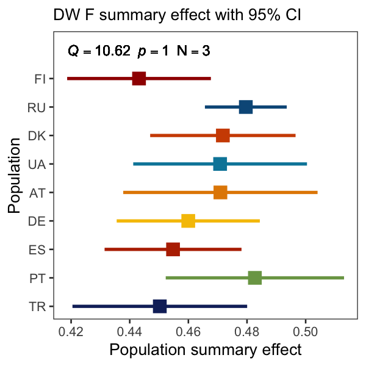
```

_Males_

```{r echo=FALSE, out.width="50%"}
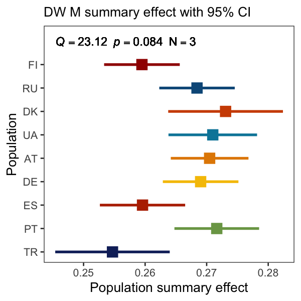
```

### Thorax length

_Females_

```{r echo=FALSE, out.width="50%"}
knitr::include_graphics("MetaAnalyses/ThoraxLength/TL_F_lmers_pop_meta_summary_effect.png")
```

### Wing area

_Left_
_Females_

```{r echo=FALSE, out.width="50%"}
knitr::include_graphics("MetaAnalyses/WingArea/WA_L_F_lmers_pop_meta_summary_effect.png")
```

_Males_

```{r echo=FALSE, out.width="50%"}
knitr::include_graphics("MetaAnalyses/WingArea/WA_L_M_lmers_pop_meta_summary_effect.png")
```

_Right_
_Females_
```{r echo=FALSE, out.width="50%"}
knitr::include_graphics("MetaAnalyses/WingArea/WA_R_F_lmers_pop_meta_summary_effect.png")
```

_Males_

```{r echo=FALSE, out.width="50%"}
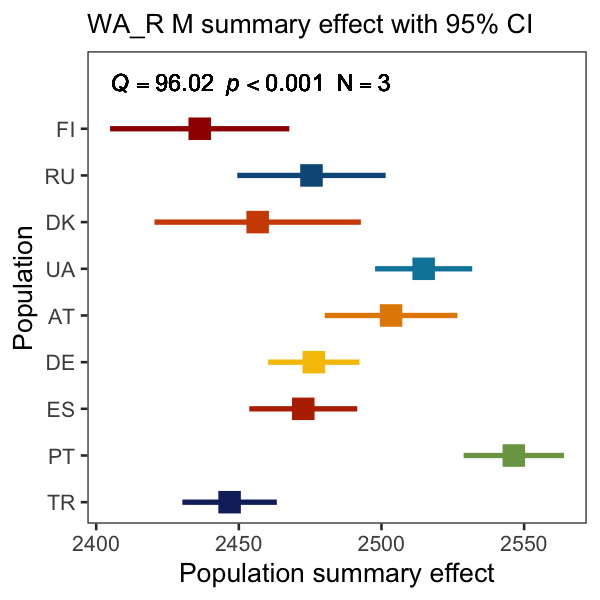
```

### Fecundity

```{r echo=FALSE, out.width="50%"}
knitr::include_graphics("MetaAnalyses/Fecundity/Fec_F_lmers_pop_meta_summary_effect.png")
```

### Lifespan

_Females_

```{r echo=FALSE, out.width="50%"}
knitr::include_graphics("MetaAnalyses/Lifespan/LS_F_lmers_pop_meta_summary_effect.pdf")
```

_Males_

```{r echo=FALSE, out.width="50%"}
knitr::include_graphics("MetaAnalyses/Lifespan/LS_M_lmers_pop_meta_summary_effect.png")
```

### Cold-shock mortality

_Females_

```{r echo=FALSE, out.width="50%"}
knitr::include_graphics("MetaAnalyses/ColdShock/CSM_F_lmers_pop_meta_summary_effect.png")
```

_Males_

```{r echo=FALSE, out.width="50%"}
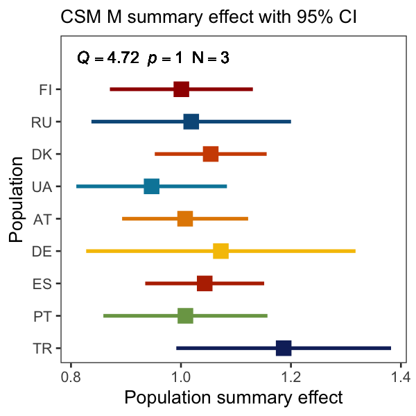
```


### Chill-coma recovery time

_Females_

```{r echo=FALSE, out.width="50%"}

```

_Males_

```{r echo=FALSE, out.width="50%"}
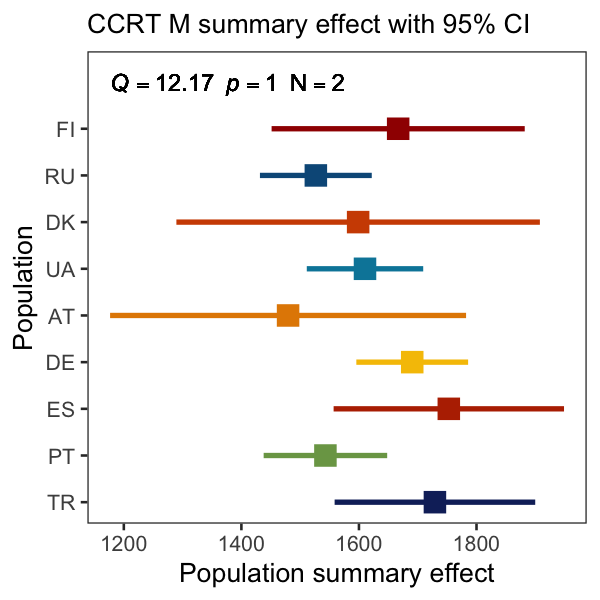
```


### Heat-shock mortality

_Females_

```{r echo=FALSE, out.width="50%"}

```

_Males_

```{r echo=FALSE, out.width="50%"}
knitr::include_graphics("MetaAnalyses/HeatShock/HSM_M_lmers_pop_meta_summary_effect.png")
```

### Diapause

Using GLMER estimates
```{r echo=FALSE, out.width="50%"}
knitr::include_graphics("MetaAnalyses/Diapause/Dia_F_glmers_pop_meta_summary_effect.png")
```

### Starvation resistance

_Females_

```{r echo=FALSE, out.width="50%"}
knitr::include_graphics("MetaAnalyses/Starvation/SR_F_lmers_pop_meta_summary_effect.png")
```

_Males_

```{r echo=FALSE, out.width="50%"}
knitr::include_graphics("MetaAnalyses/Starvation/SR_M_lmers_pop_meta_summary_effect.png")
```

### Pigmentation

```{r echo=FALSE, out.width="50%"}
knitr::include_graphics("MetaAnalyses/Pigmentation/Pgm_Total_F_lmers_pop_meta_summary_effect.png")
```

# Results : Environmental Variables  

```{r eval=FALSE, echo=TRUE}
# All model outputs can be found in :

lmers_lat <- readRDS("LinearModelsLat/all_lmers_lat_anova_list.rds")
lmers_lon <- readRDS("LinearModelsLon/all_lmers_lon_anova_list.rds")
lmers_alt <- readRDS("LinearModelsAlt/all_lmers_alt_anova_list.rds")
```

## Geography - Latitude 

```{r, echo=FALSE}
pval_table_lat <- read.csv("LinearModelsLat/all_models_lat_pvalues.csv")
```

```{r, echo=FALSE}
DT::datatable(pval_table_lat, options = list(pageLength = 10)) %>% formatRound(6, 4)
```

## Geography - Longitude

```{r, echo=FALSE}
pval_table_lon <- read.csv("LinearModelsLon/all_models_lon_pvalues.csv")
```

```{r, echo=FALSE}
DT::datatable(pval_table_lon, options = list(pageLength = 10)) %>% formatRound(6, 4)
```

## Geography - Altitude

```{r, echo=FALSE}
pval_table_alt <- read.csv("LinearModelsAlt/all_models_alt_pvalues.csv")
```

```{r, echo=FALSE}
DT::datatable(pval_table_alt, options = list(pageLength = 10)) %>% formatRound(6, 4)
```

## Geography - Altitude

# Results : GeoCorrelations

## Latitude - Line
```{r echo=FALSE}
knitr::include_graphics("GeoCorrelations/line_lat_pearson_correlations_facets.png")
```

```{r echo=FALSE, out.width="50%"}
knitr::include_graphics("GeoCorrelations/line_lat_pearson_correlations.png")
```

## Latitude - Population
```{r echo=FALSE}
knitr::include_graphics("GeoCorrelations/pop_lat_pearson_correlations_facets.png")
```

```{r echo=FALSE, out.width="50%"}

```

## Longtitude - Line
```{r echo=FALSE}
knitr::include_graphics("GeoCorrelations/line_lon_pearson_correlations_facets.png")
```

```{r echo=FALSE, out.width="50%"}
knitr::include_graphics("GeoCorrelations/line_lon_pearson_correlations.png")
```

## Longtitude - Population
```{r echo=FALSE}

```

```{r echo=FALSE, out.width="50%"}

```

# Results : Diet

## Overview

```{r echo=FALSE, out.width="50%"}
knitr::include_graphics("Diets/DrosEU_Diets_PC_ratios_facets.png")
```

```{r echo=FALSE, out.width="75%"}
knitr::include_graphics("Diets/DrosEU_Diets_PC_ratios_traits_facets.png")
```

```{r echo=FALSE}
knitr::include_graphics("Diets/DrosEU_Diets_PC_ratios_traits_pop_facets.png")
```

```{r echo=FALSE}

```

### Plots by trait

#### Viability
```{r echo=FALSE, out.width="50%"}
knitr::include_graphics("Diets/DrosEU_Diets_PC_ratios_Via_pop_facets.png")
```

#### Development time
```{r echo=FALSE, out.width="50%"}
knitr::include_graphics("Diets/DrosEU_Diets_PC_ratios_DT_A_pop_facets.png")
```

#### Dry weight
```{r echo=FALSE, out.width="50%"}
knitr::include_graphics("Diets/DrosEU_Diets_PC_ratios_DW_pop_facets.png")
```

#### Thorax length
```{r echo=FALSE, out.width="50%"}
knitr::include_graphics("Diets/DrosEU_Diets_PC_ratios_TL_pop_facets.png")
```

#### Wing area
```{r echo=FALSE, out.width="50%"}

```

#### Fecundity
```{r echo=FALSE, out.width="50%"}

```

#### Lifespan
```{r echo=FALSE, out.width="50%"}
knitr::include_graphics("Diets/DrosEU_Diets_PC_ratios_LS_pop_facets.png")
```

#### Cold-shock mortality
```{r echo=FALSE, out.width="50%"}
knitr::include_graphics("Diets/DrosEU_Diets_PC_ratios_CSM_pop_facets.png")
```

#### Heat-shock mortality
```{r echo=FALSE, out.width="50%"}
knitr::include_graphics("Diets/DrosEU_Diets_PC_ratios_HSM_pop_facets.png")
```

#### Diapause
```{r echo=FALSE, out.width="50%"}

```

#### Starvation resistance 
```{r echo=FALSE, out.width="50%"}
knitr::include_graphics("Diets/DrosEU_Diets_PC_ratios_SR_pop_facets.png")
```

```{r echo=FALSE, out.width="50%"}

```

#### Pigmentation
```{r echo=FALSE, out.width="50%"}
knitr::include_graphics("Diets/DrosEU_Diets_PC_ratios_Pgm_T4_pop_facets.png")
```

```{r echo=FALSE, out.width="50%"}
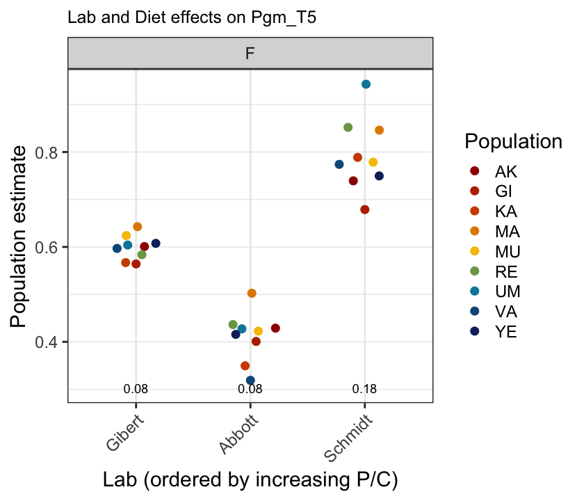
```

```{r echo=FALSE, out.width="50%"}
knitr::include_graphics("Diets/DrosEU_Diets_PC_ratios_Pgm_T6_pop_facets.pdf")
```

```{r echo=FALSE, out.width="50%"}
knitr::include_graphics("Diets/DrosEU_Diets_PC_ratios_Pgm_Total_pop_facets.png")
```

## PCAs with ~similar P:C ratio datasets 


```{r include=FALSE}
colorize <- function(x, color) {
  if (knitr::is_latex_output()) {
    sprintf("\\textcolor{%s}{%s}", color, x)
  } else if (knitr::is_html_output()) {
    sprintf("<span style='color: %s;'>%s</span>", color,
      x)
  } else x
}
```

_Notes_

- Using model estimates for line rather than raw data (scaled to
unit variance).

- Comparing all data (i.e. the previous analysis) with estimates
from a single lab but with similar P:C ratio in diet.

- TL is missing from males

- Lmer estimates (rather than glmer estimates used for dia)

- Sexes dealt with separately

  - PCA1 (M9) – male PCA with 9 traits
  
  - PCA2 (F9) – female PCA with 9 traits equivalent to males
  
  - PCA3 (Fmax) – female PCA with all 12 female traits
  
  - PCA4 (FmaxPlus) – female PCA with 13 traits (12 female traits + via)
  
- Loadings of traits on to PCs are considered of interest if greater than > 0.4 (or < -0.4).

  - Loadings `r colorize("__> 0.6__", "red")` are in `r colorize("bold red", "red")`
  
  - Loadings from `r colorize("0.4 - 0.59", "darkred")`  are in `r colorize("dark red", "darkred")`
  
```{r echo=FALSE}
knitr::include_graphics("LinearModelsPop/PCA_ControlledDiet/PCAd_4_Rmd/PCAd_r_Rmd1.pdf")
```

```{r echo=FALSE}
knitr::include_graphics("LinearModelsPop/PCA_ControlledDiet/PCAd_4_Rmd/PCAd_r_Rmd2.pdf")
```

### PCA 1 differences

- The main axes of variation have ‘swapped’.  
  - In the all data analysis, CCRT + CSM (-ve) and DW + WA (+ve) load on to PC1, in the P:C control, they load onto PC2.  
  - In all data, HSM + LS (-ve) and WA (+ve) load on to PC2, in the P:C control they load onto PC1  
  - A direct inverse correlation between HSM and CSM + SR has strengthened for PC3 in the P:C control  
- What could be driving changes?  
  - There is no TL in P:C control, so the body size correlations may be less strong?  
  - In the P:C control DT_A loads onto PC1 (but in all data it only loads
strongly onto PC4)

```{r echo=FALSE}
knitr::include_graphics("LinearModelsPop/PCA_ControlledDiet/PCAd_4_Rmd/PCAd_r_Rmd3.pdf")
```

```{r echo=FALSE}
knitr::include_graphics("LinearModelsPop/PCA_ControlledDiet/PCAd_4_Rmd/PCAd_r_Rmd4.pdf")
```

### PCA 2 results
- The main axis of variation (PC1) is fairly similar  
    - In both all data and P:C control size traits (DW, TL and WA) positively correlate. In all data they negatively correlate to LS, and in P:C control they positively correlate with DT_A.  

- The negative correlation between CCRT and CSM moves from PC2 in all data to PC3 in P:C control, and the negative correlation between CSM and HSM is weaker (loading < 0.4)

- Some trait correlations along PC2 and PC3 appear to have broken down

- Again, it seems like DT_A is driving these changes (it correlates with both PC1 and PC2 in P:C control, but only PC4 in all data

```{r echo=FALSE}
knitr::include_graphics("LinearModelsPop/PCA_ControlledDiet/PCAd_4_Rmd/PCAd_r_Rmd5.pdf")
```

```{r echo=FALSE}
knitr::include_graphics("LinearModelsPop/PCA_ControlledDiet/PCAd_4_Rmd/PCAd_r_Rmd6.pdf")
```

### PCA 3 results 
- Similar to PCA 2 results in some ways: the main axis of variation (PC1) is again a size correlation:

  - In both all data and P:C control size traits (DW, TL and WA) positively correlate. In all data they negatively correlate to LS, and in P:C control they positively correlate with DT_A and Pigm.
  
- The negative correlation between CCRT and CSM moves from PC3 in all data to PC2 in P:C control (similar but inverse to PCA 2 result).

- Possible negative correlation between CSM and HSM, bu 
weaker (loading < 0.4)

- DT_A effect? Loss of fecundity correlations?

```{r echo=FALSE}
knitr::include_graphics("LinearModelsPop/PCA_ControlledDiet/PCAd_4_Rmd/PCAd_r_Rmd7.pdf")
```

```{r echo=FALSE}
knitr::include_graphics("LinearModelsPop/PCA_ControlledDiet/PCAd_4_Rmd/PCAd_r_Rmd8.pdf")
```

### PCA 4 results

- Similar results to PCA 2 and PCA 3.

- Negative correlation between CSM and HSM on PC3 is now maintained with highish loadings (> 0.4), although correlation of dia has switched signs.
  
  - Across PCA 3 and PCA 4 there is a disassociation of the all data PC3 (+CCRT +dia +HSM –CSM)

- Again, DT_A is strong, viability and fecundity do not retain high loading for PC1, 2 or 3

### Summary

- Some important changes to trait correlations between all data and P:C controlled data. Some patterns remain similar, but the North/South divide (at least in females) is less clear.

- Strong effect of development time, suggesting that DT_A variability may be more influenced by diet than other traits? Perhaps not surprising, given nutritional/resource thresholds for metamorphosis?

- On the other hand, fecundity, viability (and to a lesser extent life span) lose importance 

– why might this be?

  - Could inter-line (genotypic) variability be more important in these traits than diet-induced variability?
  
# Results : Lab Correlations

_**Please refer to /LabCorrelations folder for trait-specific plots*_

## Pearson's - Line
```{r echo=FALSE, out.width="100%", out.height="100%"}
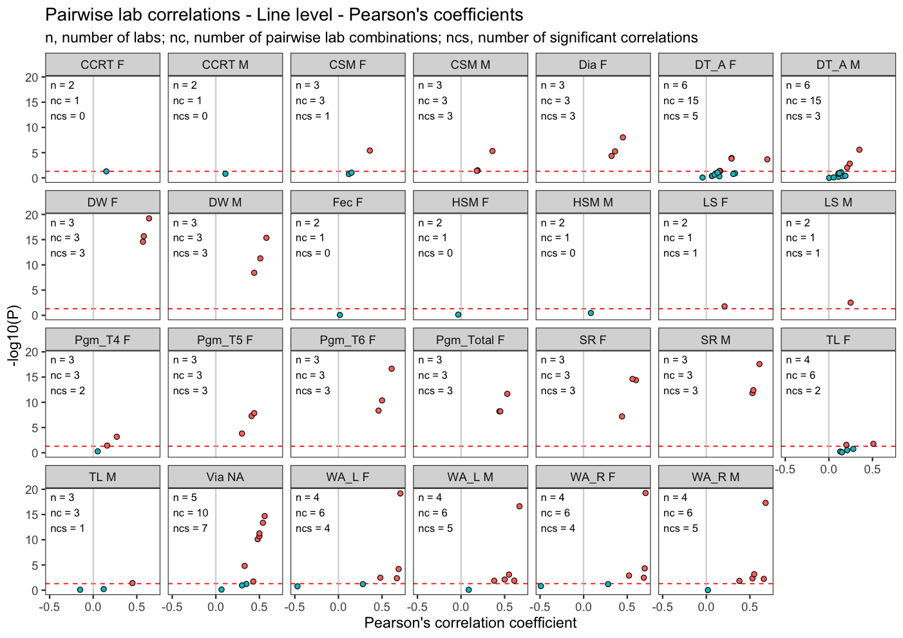
```

## Pearson's - Population
```{r echo=FALSE}
knitr::include_graphics("LabCorrelations/lab_correlation_pop_pearson.png")
```

## Spearman's - Line
```{r echo=FALSE}
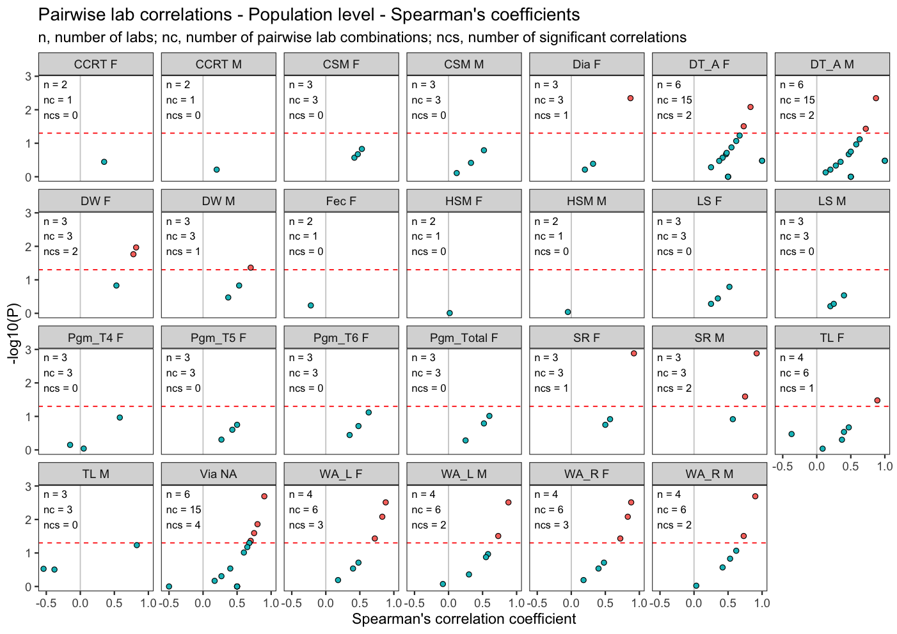
```

# Results : Trait Correlations 

* Input data : line means
* Input data : line means extracted either from models with Lab as a random effect or from meta analyses estimates (or both)
(i) Correlations between all pairs of traits using 
- Pearson’s 
- Spearman’s
- Distance correlations
(ii) MANOVA on line means 
(iii) PCAs

## Pearson's 
```{r echo=FALSE}

```

```{r echo=FALSE}
knitr::include_graphics("TraitCorrelations/trait_correlations_f9_line_random_coefs.png")
```

```{r echo=FALSE}
knitr::include_graphics("TraitCorrelations/trait_correlations_fmax_line_random_coefs_diet.png")
```

```{r echo=FALSE}
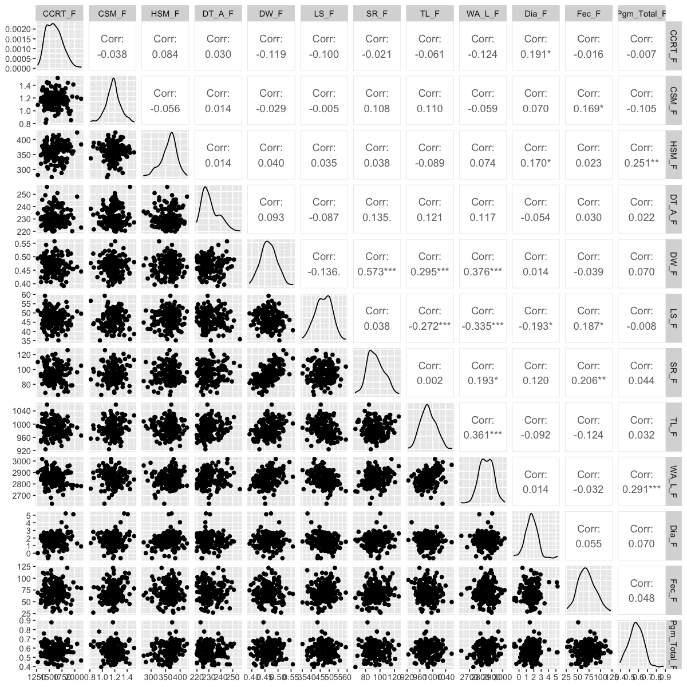
```

```{r echo=FALSE}

```

```{r echo=FALSE}
knitr::include_graphics("TraitCorrelations/trait_correlations_fmaxp_line_random_coefs.png")
```

```{r echo=FALSE}
knitr::include_graphics("TraitCorrelations/trait_correlations_m9_line_random_coefs_diet.png")
```

```{r echo=FALSE}
knitr::include_graphics("TraitCorrelations/trait_correlations_m9_line_random_coefs.png")
```

## PCA

_Notes_

- Using model estimates for line rather than raw data (scaled to unit variance).

- Sexes dealt with seperately

- PCA1 (M9) – male PCA with 9 traits

- PCA2 (F9) – female PCA with 9 traits equivalent to males

- PCA3 (Fmax) – female PCA with all 12 female traits

- PCA4 (FmaxPlus) – female PCA with 13 traits (12 female traits + viability)

- Loadings of traits on to PCs are considered of interest if greater than > 0.4 (or < -0.4).

  - Loadings `r colorize("__> 0.6__", "red")` are in `r colorize("bold red", "red")`
  
  - Loadings from `r colorize("0.4 - 0.59", "darkred")`  are in `r colorize("dark red", "darkred")`

```{r echo=FALSE}

```

### PCA 1 results

- PC1 accounts for 25.23% of the variance

- PC1: high trait loading values (>0.5):
  
  - WA, DW, SR = +ve PC1
  
  - CCRT, CSM = –ve PC1.
  
  - Por/Aus/Ukr/Rus = +ve PC1 (large, resistant to starvation & cold)
  
  - Tur/Spa = –ve PC1 (small, susceptible to starvation & cold)

- PC2: high trait loading values (>0.5):
  
  - TL, WA +ve PC2,
  
  - LS, HSM –ve PC2
  
  - Por/Tur/Spa = +ve PC2 (large, short-lived, resistant to heat)
  
  - Den/Fin. = -ve PC2 (small, long-lived, susceptible to heat)


```{r, echo=FALSE}

```

```{r, echo=FALSE}
knitr::include_graphics("EnvironmentalAnalysis/PCA_Results/PCA_4_Rmd/PCA_4_Rmd_Page_3.png")
```

### PCA 2 results

- PC1 accounts for 23.61% of the variance

- PC1: high trait loading values (>0.4):

  - DW, WA, TL, SR = +ve PC1

  - LS = –ve PC1.

  - Por/Aus = +ve PC1 (large, resistant to starvation)

  - Tur/Fin/Spa = –ve PC1 (small, susceptible to starvation)

- PC2: high trait loading values (>0.4):

  - LS, SR +ve PC2,

  - TL –ve PC2

  - Den/Rus/Fin = +ve PC2 (small, long-lived, resistant to starvation)

  - Tur/Ukr/Por = -ve PC2 (large, short-lived, susceptible to starvation)

- PC3: high trait loading values (>0.5):

  - CCRT, HSM +ve PC3,

  - CSM –ve PC3

  - Ukr/Fin = +ve PC3 (resistance to cold, susceptible to heat)

  - Tur/Spa/Den = -ve PC3 (susceptible to cold, resistant to heat)

```{r, echo=FALSE}

```

```{r, echo=FALSE}
knitr::include_graphics("EnvironmentalAnalysis/PCA_Results/PCA_4_Rmd/PCA_4_Rmd_Page_5.png")
```

### PCA 3 results

- PC1 accounts for 18.61% of the variance

- PC1: high trait loading values (>0.4):

  - DW, WA, TL, SR = +ve PC1

  - LS = –ve PC1.

  - Por/Aus/Ukr = +ve PC1 (large, resistant to starvation)

  - Tur/Fin/Spa = –ve PC1 (small, susceptible to starvation)

- PC2: high trait loading values (>0.4):

  - Fec, SR, LS +ve PC2,

  - TL –ve PC2

  - Den/Rus/Fin = +ve PC2 (small, long-lived, resistant to starvation)

  - Tur/Ukr/Por = -ve PC2 (large, short-lived, susceptible to starvation)

- PC3: high trait loading values (>0.4):

  - HSM, Pigm, dia, CCRT +ve PC3,

  - CSM –ve PC3

  - Ukr/Aus = +ve PC3 (resist cold, suscept heat, higher diap, more pigm)

  - Spa/Den/Por = -ve PC3 (suscept cold, resist heat, lower diap, less pigm)


```{r echo=FALSE}
knitr::include_graphics("EnvironmentalAnalysis/PCA_Results/PCA_4_Rmd/PCA_4_Rmd_Page_6.png")
```


```{r echo=FALSE}
knitr::include_graphics("EnvironmentalAnalysis/PCA_Results/PCA_4_Rmd/PCA_4_Rmd_Page_7.png")
```


### PCA 4 results

- PC1 accounts for 16.73% of the variance

- PC1: high trait loading values (>0.4):

  - WA, DW, TL, SR = +ve PC1

  - LS = –ve PC1.

  - Por/Aus/Ukr = +ve PC1 (large, resistant to starvation)

  - Fin/Spa/Tur = –ve PC1 (small, susceptible to starvation)

- PC2: high trait loading values (>0.4):

  - Via, Fec, SR, HSM, LS +ve PC2,

  - 0 traits –ve PC2

  - Fin/Den/Ger = +ve PC2 (High via & fec, long-lived, resist starve, suscept. heat)

  - Tur/Spa/Por = -ve PC2 (Low via & fec, short-lived, suscept. starve, resist heat)

- PC3: high trait loading values (>0.4):

  - HSM, dia, Pigm, CCRT +ve PC3,

  - CSM –ve PC3

  - Ukr/Aus = +ve PC3 (resist cold, suscept heat, higher diapause, more pigm)

  - Spa/Den/Rus = -ve PC3 (suscept cold, resist heat, lower diapause, less pigm)


###Summary

- PC1 always includes positive correlation of dry weight, wing area and starvation resistance as well as….

  - … negative corr. with CSM in males
  
  - … negative corr. with life span in females
  
  - Por/Aus (+ Ukr/Rus) are positive
  
  - Tur/Spa (+ Fin) are negative

- PC2 differs somewhat between males and females (note ‘+’ and ‘–’ switch)

  - In males:

    - +ve correlation with thorax length and wing area

    - -ve correlation with HSM and lifespan

    - Por/Tur/Spa are positive

    - Den/Fin are negative

  - In females:

    - -ve correlation with thorax length

    - +ve correlation with lifespan and starvation resistance (+ fecundity and viability)

    - Tur/Por (+ Ukr/Spa) are negative

    - Den/Fin (+ Rus/Ger) are positive

- PC3 potentially interesting in females…

  - Positive correlation between HSM and CCRT (+ diapause and pigmentation)

  - Negative correlation with CSM

  - Ukr (+Aus/Fin) are positive

  - Spa/Den (+Tur/Rus/Por) are negative

  - Interestingly, in males HSM and CCRT negatively correlate with one another on PC3….

## Trait Correlations & Discriminant Function Analyses

### Females 

```{r out.width="50%", echo=FALSE}

knitr::include_graphics("TraitCorrelations/FromMR/FemaleDis.png")
```

### Males

```{r out.width="50%", echo=FALSE}

knitr::include_graphics("TraitCorrelations/FromMR/MaleParCor.png")
knitr::include_graphics("TraitCorrelations/FromMR/MaleDis.png")
```

# Results : Climatic variables 

## From Venera 

For the analyses of the climatic variables, two time periods were chosen: 30 years (to trace the long-lasting climatic effects) and 30 days (short weather effect, on average over a couple generations for different localities, to account for maternal/grand-maternal effects). 14 climatic variables data (see the list below) was downloaded from the NASA database using R package “nasapower” and PCA analysis was done with “FactoMineR” package.

```{r echo=FALSE}
ClimVarPCA <- read.csv("EnvironmentalAnalysis/PCA_clim/TraitsCombined/ClimVar4PCA_4Rmd.csv")
knitr::kable(ClimVarPCA, caption = 'Table X: List of the climatic variables used in PCA.')
```

__PCA for 30 days data__ 

```{r echo=FALSE}

```

__PCA for 30 years data__ 

```{r echo=FALSE}
knitr::include_graphics("EnvironmentalAnalysis/PCA_clim/TraitsCombined/graphs/30y_PCA.png")
```

First two PCs in both datasets had eigen values >1 explaining 94.7% (30 days) and 89.8% (30 years) and were used in the further analyses.


__PCA for 30 days data__ 

```{r echo=FALSE}
knitr::include_graphics("EnvironmentalAnalysis/PCA_clim/TraitsCombined/graphs/30d_scree_plot.png")
```

__PCA for 30 years data__ 

```{r echo=FALSE}
knitr::include_graphics("EnvironmentalAnalysis/PCA_clim/TraitsCombined/graphs/30y_scree_plot.png")
```

The populations are separated in two dimensions rather differently in two datasets - possibly because the short-term climate data (30 days) does not include winter (cold season).


__PCA for 30 days data__ 

```{r echo=FALSE}

```

__PCA for 30 years data__ 

```{r echo=FALSE}
knitr::include_graphics("EnvironmentalAnalysis/PCA_clim/TraitsCombined/graphs/30y_PCA_pops.png")
```

Contribution of PCs

PC1 is mostly affected by the temperature values (but not only), while precipitation/humidity is among strongest contributors to PC2.

__PCA for 30 days data__ 

```{r echo=FALSE}


```

__PCA for 30 years data__ 

```{r echo=FALSE}
knitr::include_graphics("EnvironmentalAnalysis/PCA_clim/TraitsCombined/graphs/30y_PC1_contr.png")

```

Correlation with geographical coordinates

__PCA for 30 days data__ 

```{r echo=FALSE}

```

__PCA for 30 years data__ 

```{r echo=FALSE}
knitr::include_graphics("EnvironmentalAnalysis/PCA_clim/TraitsCombined/graphs/30y_correlations.png")
```

Analysis of the trait PCA (Ewan) with the climate data PCA (above). 

```{r echo=FALSE}

```

There is a strong association of trait PC2 with climate PCs in both datasets. However, the association of the trait PC3 with climate PCs is clear in 30-years dataset (in 30-day dataset - only clim PC2 shows association in F9 set).

## From Alan

_Goal_: Test whether phenotypic variation in isofemale lines collected at different locations is correlated with aspects of weather and climate prior to sampling. To perform this analysis, I propose that 

_Dataset_: 
- Phenotype data: metaanalysis estimates of phenotypes, individual phenotypes + PCA reduction of phenotype space

- Environmental data: NASApower data
    - Temperature, Rainfall, Humidity. What else?

_Strategy_: 
- The goal is to build a large number of models for each phenotype. Each model will regress phenotype (or PCA projection) onto one of the environmental variables, or summarizations of the environmental variables. 

- For each phenotype and model, we can assess whether the environmental model is:
  - “Significant” p<0.05
  - “Significant after multiple testing correction” depends on how many environmental models
  - Has normalized effect size with confidence intervals that do not overlap 
  
- We can also assess whether the direction of the environmental effect is consistent with a priori expectations. For instance we can predict that cold-shock-mortality will be lower in locations that more recently experienced a cold shock.

_Data transformations_:
- Normalize phenotype data & environmental data: `(Estimate-mean(Estimate, na.rm=T))/sd(Estimate, na.rm=T)`
- Do we use the population means? Or do we use the line means?
  - Line means give us more power, but population means is a more conservative model
- How do we summarize environmental data?
  - Windows of time: 
    - I suggest that we keep things relatively simple, e.g., 1 day prior to collection, 1 week prior, 1 month prior, 6 months prior, 12 months prior.
- Summarization functions:
  - The mean, min, max
  - Number of days above or below a pre-defined threshold
  - Other more sophisticated functions (e.g., those that Vera used)

_Problems_:
- Model selection and multiple testing

Here is an analysis that highlights some of the ways I have been looking at the data. Some aspects are clear, some are less so. I’d be curious to hear your thoughts and also to work with you both to sort out any analyses.

```{r echo=FALSE}
knitr::include_graphics("EnvironmentalAnalysis/FromAB/DriveDoc1.jpg")
```

The color represents eta-squared, which is a standardized estimate of effect size. Like, R2. Orange boxes mean that this model is the best model by AIC. Green boxes mean that this model has delta-AIC < 2 from the best model. A dot means that the confidence intervals for eta2 do not overlap 0. A blue dot means that the slope of the relationship between the phenotype and the environment is positive. A red dot means that it is negative.

Heat shock mortality makes sense. The best model is the proportion of days in the 30 days prior to sampling when the maximum temp is about ~35°C. There is a negative relationship that means that the more days of high temp, the lower the HSM. 

CSM is less clear: cold shock mortality in females is best predicted by the minimum temperature in the 30 days prior to sampling. There is a negative relationship meaning that CSM is higher when the minimum temp is lower. 

```{r echo=FALSE}
knitr::include_graphics("EnvironmentalAnalysis/FromAB/MailDoc1.jpg")
```

# Results : GDM

_**Please refer to /GDM folder for details.**_


```{r echo=FALSE}
GDM_table1 <- read.csv("GDM/GDM_table1.csv")
GDM_table2 <- read.csv("GDM/GDM_table2.csv")
GDM_table3 <- read.csv("GDM/GDM_table3.csv")
```

```{r echo=FALSE, message=FALSE}
knitr::kable(GDM_table1, caption = 'Table 1: Predictor variables identified as important in GDMs.')
```

```{r echo=FALSE, message=FALSE}
knitr::kable(GDM_table2, caption = 'Table 2: Proportion of variation in phenotypic variables that explained by each model')
```

_Table 3: Result of generalized dissimilarity model for phenotypic variables, the most important predictor variables were shown in bold._

```{r echo=FALSE}
knitr::include_graphics("GDM/GDM_Table3_4Rmd.png")
```

## Dry weight
```{r echo=FALSE, out.width="40%", out.height="40%"}
knitr::include_graphics("GDM/GDM_Worldclim/DW_M/DW_M_vapr7_i-spline.jpeg")
```

```{r, out.width="50%"}
knitr::include_graphics("GDM/GDM_Worldclim/DW_M/DW_M_bio2_i-spline.jpeg")
```

## Fecundity
```{r, out.width="50%"}
knitr::include_graphics("GDM/GDM_Worldclim/Fec/Fec_srad01_i-spline.jpeg")
```

```{r, out.width="50%"}
knitr::include_graphics("GDM/GDM_Worldclim/Fec/Fec_wind07_i-spline.jpeg")
```

## Lifespan
```{r, out.width="50%"}

```

```{r, out.width="50%"}

```

```{r, out.width="50%"}

```

```{r, out.width="50%"}

```

```{r, out.width="50%"}
knitr::include_graphics("GDM/GDM_Worldclim/LS_M/LS_M_GDM_srad05_i-spline.jpeg")
```

```{r, out.width="50%"}
knitr::include_graphics("GDM/GDM_Worldclim/LS_M/LS_M_GDM_srad06_i-spline.jpeg")
```

```{r, out.width="50%"}
knitr::include_graphics("GDM/GDM_Worldclim/LS_M/LS_M_GDM_prec10_i-spline.jpeg")
```

```{r, out.width="50%"}
knitr::include_graphics("GDM/GDM_Worldclim/LS_M/LS_M_GDM_wind12_i-spline.jpeg")
```

## Thorax length
```{r, out.width="50%"}
knitr::include_graphics("GDM/GDM_Worldclim/TL_F/TL_F_perc05_i-spline.jpeg")
```

```{r, out.width="50%"}
  
```

```{r, out.width="50%"}
  knitr::include_graphics("GDM/GDM_Worldclim/TL_F/TL_F_wind12_i-spline.jpeg")
```

## Wing area
```{r, out.width="50%"}
knitr::include_graphics("GDM/GDM_Worldclim/WA_L_M/WA_L_M_wind08_i-spline.jpeg")
```

```{r, out.width="50%"}
knitr::include_graphics("GDM/GDM_Worldclim/WA_L_M/WA_L_M_vapr06_i-spline.jpeg")
```

```{r, out.width="50%"}
knitr::include_graphics("GDM/GDM_Worldclim/WA_R_F/WA_R_F_wind8_i-spline.jpeg")
```

```{r, out.width="50%"}
knitr::include_graphics("GDM/GDM_Worldclim/WA_R_F/WA_R_F_vapr8_i-spline.jpeg")
```

```{r, out.width="50%"}

```

```{r, out.width="50%"}

```

```{r, out.width="50%"}
knitr::include_graphics("GDM/GDM_Worldclim/WA_R_M/WA_R_M_vapr06_i-spline.jpeg")
```

# Results : Heritability

* Input data line means per lab and each lab is a replicate
* Input data line means for each lab
* Intraclass correlations (David et al. 2005)
* Evolvability 


```{r echo=FALSE, message=FALSE}
h2_rc_btwlabs <- read.csv("Heritability/H2_line_random_coefs_between_labs.csv")
DT::datatable(h2_rc_btwlabs, options = list(pageLength = 10)) %>% formatRound(4:6, 3)

```

```{r echo=FALSE, message=FALSE}
h2_data_btwlabs <- read.csv("Heritability/H2_line_raw_data_between_labs.csv")
DT::datatable(h2_data_btwlabs, options = list(pageLength = 10)) %>% formatRound(4:6, 3)
```

```{r echo=FALSE, message=FALSE}
h2_data_withinlabs <- read.csv("Heritability/H2_line_raw_data_within_labs.csv")
DT::datatable(h2_data_withinlabs, options = list(pageLength = 10)) %>% formatRound(4:7, 3)
```


# Results : Wolbachia

## Population

```{r, echo=FALSE}
pval_Wolb_pop <- read.csv("LinearModelsPop_Wolb/all_models_pop_pvalues_Wolb.csv")
```

```{r, echo=FALSE}
DT::datatable(pval_Wolb_pop, options = list(pageLength = 10)) %>% formatRound(6:6, 3)
```

```{r echo=FALSE}
knitr::include_graphics("LinearModelsPop_Wolb/all_models_pop_pvalues_Wolb.pdf")
```

## Latitude 

```{r, echo=FALSE}
pval_Wolb_lat <- read.csv("LinearModelsLat_Wolb/all_models_lat_pvalues_Wolb.csv")
```

```{r, echo=FALSE}
DT::datatable(pval_Wolb_lat, options = list(pageLength = 10)) %>% formatRound(6:6, 3)
```

```{r echo=FALSE}
knitr::include_graphics("LinearModelsLat_Wolb/all_models_lat_pvalues_Wolb.pdf")
```

## Longitude

```{r, echo=FALSE}
pval_Wolb_lon <- read.csv("LinearModelsLon_Wolb/all_models_lon_pvalues_Wolb.csv")
```

```{r, echo=FALSE}
DT::datatable(pval_Wolb_lon, options = list(pageLength = 10)) %>% formatRound(6:6, 4)
```


```{r echo=FALSE}
knitr::include_graphics("LinearModelsLon_Wolb/all_models_lon_pvalues_Wolb.pdf")
```


## Altitude

```{r, echo=FALSE}
pval_Wolb_alt <- read.csv("LinearModelsAlt_Wolb/all_models_alt_pvalues_Wolb.csv")
```

```{r, echo=FALSE}
DT::datatable(pval_Wolb_alt, options = list(pageLength = 10)) %>% formatRound(6:6, 3)
```


```{r echo=FALSE}
knitr::include_graphics("LinearModelsAlt_Wolb/all_models_alt_pvalues_Wolb.pdf")
```


# Results : UPGMA trees 

Here are some example UPGMA trees from Jorge and Cristina -- please refer to /UPGMATrees folder for all of the trees. 

_CCRT Female_

```{r echo=FALSE, out.width="50%"}

```

_CSM Female_

```{r echo=FALSE, out.width="50%"}

```

_DT_A Female_

```{r echo=FALSE, out.width="50%"}
knitr::include_graphics("UPGMATrees/DT_A_F_meta_summary.txt.Hoedjes.png")
```

_DW Male_

```{r echo=FALSE, out.width="50%"}
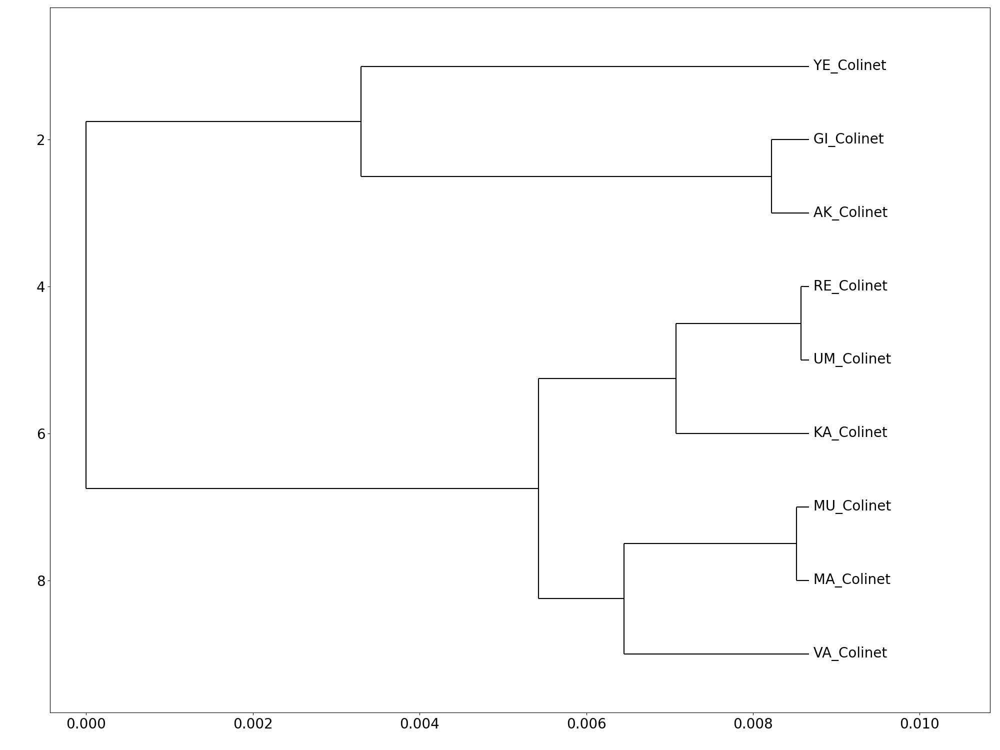
```

_SR Female_

```{r echo=FALSE, out.width="50%"}
knitr::include_graphics("UPGMATrees/SR_F_meta_summary.txt.Pasyukova.png")
```

_WA_R Female_

```{r echo=FALSE, out.width="50%"}
knitr::include_graphics("UPGMATrees/WA_R_F_meta_summary.txt.StamenkovicRadak.png")
```

# Results : Qst - Fst  _tbd_

# _Results : Species Distribution Model_

## SDM_Maxent_WorldClim

```{r eval=FALSE, include=FALSE}
htmltools::includeHTML("SDM_Maxent_worldclime/Results/Dmelanogaster.html")
```

```{r echo=FALSE}


knitr::include_graphics("SDM_Maxent_worldclime/SDM_4_Rmd/DrosEU_PhenotypingWG_Page_3.png")
knitr::include_graphics("SDM_Maxent_worldclime/SDM_4_Rmd/DrosEU_PhenotypingWG_Page_4.png")
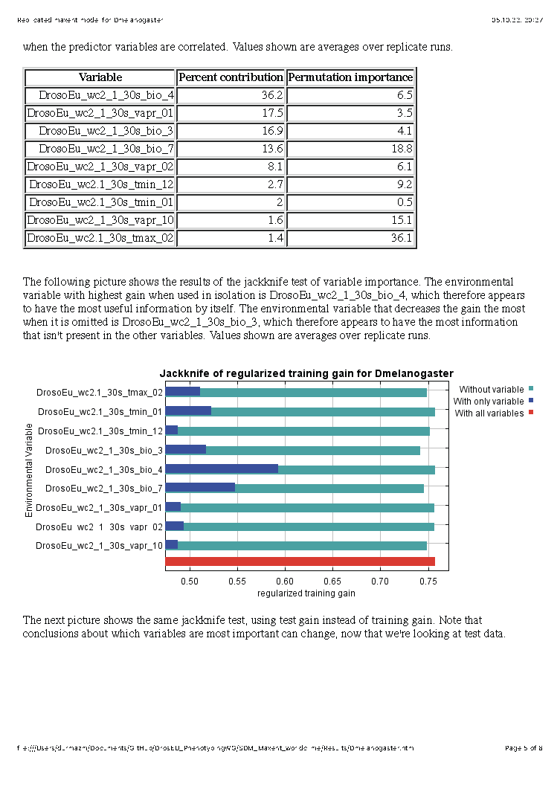
knitr::include_graphics("SDM_Maxent_worldclime/SDM_4_Rmd/DrosEU_PhenotypingWG_Page_6.png")
```

# References

## GDM

- Baldassarre, D. T., Thomassen, H. A., Karubian, J., & Webster, M. S. (2013). The role of ecological variation in driving divergence of sexual and non-sexual traits in the red-backed fairy-wren (Malurus melanocephalus). BMC Evolutionary Biology, 13(1), 75. doi:10.1186/1471-2148-13-75

- Ferrier, S., Manion, G., Elith, J., & Richardson, K. (2007). Using generalized dissimilarity modelling to analyse and predict patterns of beta diversity in regional biodiversity assessment. Diversity and Distributions, 13(3), 252-264. doi:https://doi.org/10.1111/j.1472-4642.2007.00341.x

- Thomassen, H. A., Buermann, W., Milá, B., . . . Smith, T. B. (2010). Modeling environmentally associated morphological and genetic variation in a rainforest bird, and its application to conservation prioritization. Evolutionary Applications, 3(1), 1-16. doi:https://doi.org/10.1111/j.1752-4571.2009.00093.x

## Heritability

- David, J., Gibert, P., Legout, H. et al. Isofemale lines in Drosophila: an empirical approach to quantitative trait analysis in natural populations. Heredity 94, 3–12 (2005). https://doi.org/10.1038/sj.hdy.6800562

## SDM

- Mina Hojat Ansari, Steven J.B. Cooper, Michael P. Schwarz, Mehregan Ebrahimi, Gaynor Dolman, Leah Reinberger, Kathleen M. Saint, Stephen C. Donnellan, C. Michael Bull, Michael G. Gardner, Plio-Pleistocene diversification and biogeographic barriers in southern Australia reflected in the phylogeography of a widespread and common lizard species, Molecular Phylogenetics and Evolution, Volume 133, 2019, Pages 107-119, ISSN 1055-7903, https://doi.org/10.1016/j.ympev.2018.12.014.