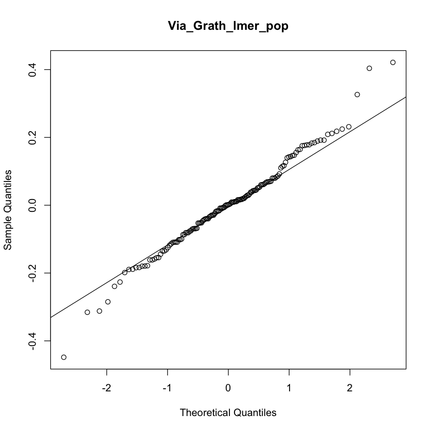
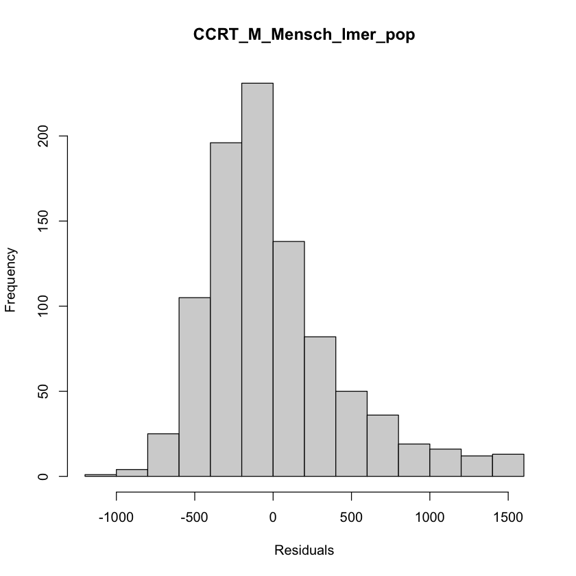
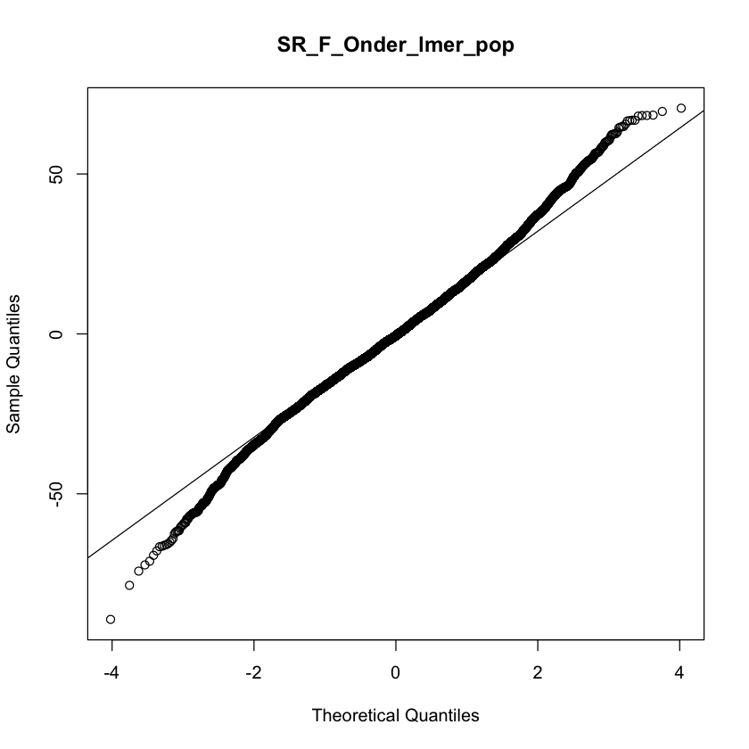
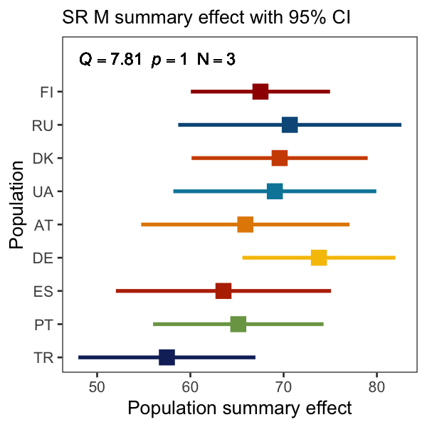
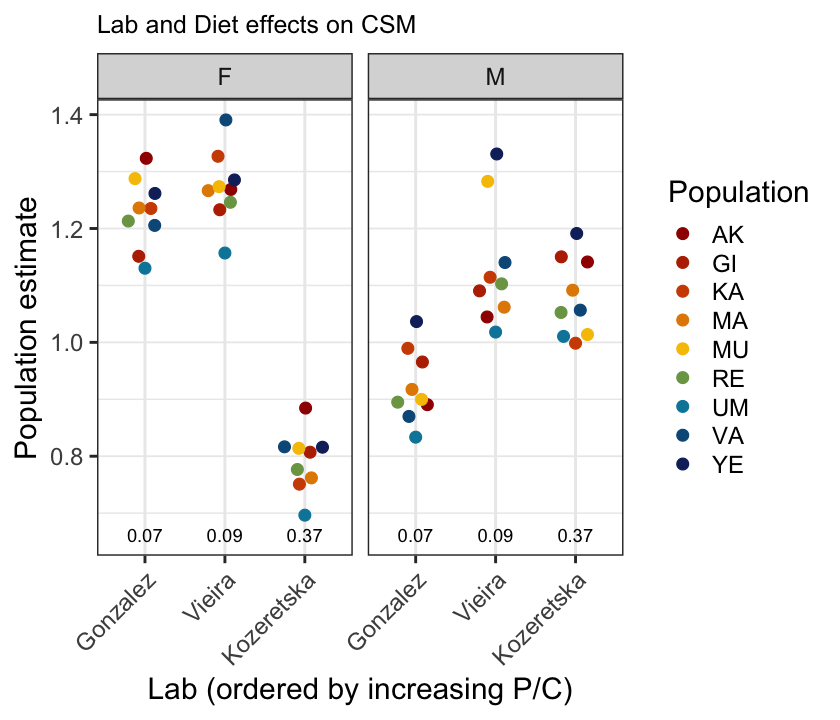

# Continent-wide differentiation of fitness traits and patterns of climate adaptation among European populations of Drosophila melanogaster

Esra Durmaz Mitchell, Envel Kerdaffrec, _et al._, and Thomas Flatt

Author contributions can be found here 

https://docs.google.com/spreadsheets/d/1SkiqZlpZlEs1nf6JJUakREYS4mpghSmgb_0QlL8o3ek/edit#gid=1616763697

Correspondence: esra@bmb.sdu.dk; thomas.flatt@unifr.ch 

Short Running Title: Phenomic Analysis of European D. melanogaster


Collaborative phenotyping effort of European _Drosophila melanogaster_ populations


*Lay Summary*

For over 100 years, the vinegar fly Drosophila melanogaster has been a workhorse for studying the genetic and phenotypic basis of evolutionary change. Ancestrally of southern-central African origin, this insect expanded its range, migrated out of Africa and colonized new habitats and climate zones around the globe. Recent population genomic analyses suggest that Europe was colonized from the Middle East ~1,800 years ago, yet we still know surprisingly little about how this human commensal adapted to different locales on the European continent and elsewhere. Here, we assayed fly strains isolated from 9 European populations for 16 traits in an international consortium effort, involving >100 researchers from 26 research groups in 17 countries and using semi-standardized experimental protocols. Despite differences in experimental (environmental) conditions among labs, our trait measurements agreed well across research teams, suggesting that they are robust and generalizable. European populations of the vinegar fly are markedly differentiated for several phenotypic traits that are related to Darwinian fitness and which might be subject to natural selection. Notably, flies from locations with higher humidity and rainfall and lower temperature survive better to the adult stage, lay more eggs, are better at surviving famine and, as adults, live longer than flies from drier, warmer locations; yet, as compared to flies from warmer, drier locales, they are considerably less well adapted to surviving heat stress, suggesting a trade-off between these components of fitness. Our findings begin to illuminate how this subtropical/tropical insect has adapted to different climates and habitats on the European continent and showcase the value of collaborative multi-lab studies that perform experiments in parallel.


*General overview of the phenotyping effort*

We assayed 16 phenotypic traits, most of them representing fitness components (see Table 1 in main text for details): viability, developmental time, dry weight, thorax length, wing area, fertility, lifespan, cold-shock mortality, chill-coma recovery time, heat-shock mortality, diapause, locomotor activity, circadian eclosion timing, pigmentation, starvation resistance, and parasitoid resistance. Assay protocols for each trait are given below; detailed information about phenotyping batches, experimental blocks, replication, sample sizes, etc. can be found in Tables xx (i.e. CSM_pop). Phenotyping assays were carried out at 25ºC, 12 hours light:12 hours dark, and a minimum relative air humidity of 60%. Strains were maintained under density-controlled conditions for at least two generations prior to the assays. The fly food recipes used by the different labs are shown in Table X. Unless stated otherwise, mated females and males were phenotyped for a given trait. The following principal investigators and their research groups participated in the phenotyping effort (in alphabetical order): Jessica Abbott (JA); Alan Bergland (AB); Jean-Christophe Billeter (JCB); Hervé Colinet (HC); Claudia Fricke (CF); Thomas Flatt (TF); Patricia Gibert (PG); Josefa González (JG); Sonja Grath (SG); Katja Hoedjes (KH); Jan Hrcek (JH); Iryna Kozeretska (IK); Julian Mensch (JM); Banu Onder (BO); John Parsch (JP); Elena Pasyukova (EP); Nico Posnien (NP); Michael G. Ritchie (MR); Christian Schlötterer (CS); Paul Schmidt (PS); Marina Stamenkovic-Radak (MSR); Eran Tauber (ET); Jorge Vieira (JV); Christian Wegener (CW); Bas J. Zwaan (BZ).


```{r libraries, echo=FALSE, message=FALSE, warning=FALSE}

library(tidyverse)
library(ggpubr)
library(hrbrthemes)
library(qwraps2)
library(afex)
library(Hmisc)
library(knitr)
library(cowplot)
library(ggrepel)
library(DT)
library(data.table)
library(MetBrewer)
```


Nine sampling locations were chosen based on genomic data and these locations covered a wide range of latitude (~20°) and longitude (~40°) across the continent (see table below). From each location, 15 to 20 isofemale lines were established in corresponding labs at the sampling location and the isofemale lines were centrally maintained by Élio Sucena  at Instituto Gulbenkian de Ciência (IGC), Lisbon, Portugal. A total of 173 isofemale lines were used in this study.

```{r droseu_coord, echo=FALSE, message=FALSE}
droseu_coord <- read.csv("InfoTables/DrosEU_Coordinates.csv")
droseu_coord <- data.frame(droseu_coord %>%
  add_column(Collector = c("Jorge Vieira", "Josefa Gonzalez", "Mads Schou", "John Parsch & Amanda Glaser-Schmitt","Andrea Betancourt","Maaria Kankare","Iryna Kozeretska","Banu Onder","Elena Pasyukova")))
```

```{r echo=FALSE, message=FALSE}
knitr::kable(droseu_coord, align = "llcccl", caption = 'Table X. Sampling locations, coordinates and collectors, sorted by increasing latitude')
```

```{css, echo = FALSE}
caption {
      color: black;
      font-weight: bold;
      font-size: 1.0em;
    }
```


<style>
p.caption {
  font-size: 0.9em;
}
</style>


```{r echo=FALSE}
knitr::include_graphics("InfoTables/samples_map_2-1.png")
```

```{r panmix_theme, echo=FALSE, message=FALSE}
panmix_theme <- theme(panel.grid.major = element_blank(), panel.grid.minor = element_blank(),panel.background = element_blank(), axis.line = element_line(colour = "black",), axis.title.x = element_text(size = 16), axis.text.x = element_text(size = 16, colour = "black"), axis.text.y = element_text(size = 16, colour = "black"),axis.title.y = element_text(size = 16))
```

```{r droseu_labs, echo=FALSE, message=FALSE}
droseu_labs <- data.frame(read.csv("InfoTables/DrosEU_Labs.csv"))
```

## Contributors (phenotyping)

Contributed labs are `r unique(droseu_labs$PI)` and detailed list below:

```{r echo=FALSE}
knitr::kable(droseu_labs, allign = "llll", caption = "Table X. Contributed labs and traits, sorted by trait")
```

```{r echo=FALSE, message=FALSE}
cities <- read.csv("InfoTables/DrosEU_cities.csv")
```


```{r echo=FALSE}

```


# Methods 

## Fly material

## Drosophila population samples, isofemale lines, and stock maintenance

In summer and fall 2018 we collected inseminated D. melanogaster females at 9 European locations, which had already previously been characterized at the population genomic level by the DrosEU consortium (see Figure 1 in the main text; see Kapun et al., 2020, 2021; also see Machado et al. 2021): PT, Portugal (Recarei = RE); ES, Spain (Gimenells = GI [Lleida]); TR, Turkey (Yesiloz = YE); DE, Germany (Munich = MU); AT, Austria (Mauternbach = MA); UA, Ukraine (Uman = UM); DK, Denmark (Karensminde = KA); FI, Finland (Akaa = AK); RU, Russia (Valday = VA). From these females we established 173 isofemale lines, with each population being represented by at least 15 lines (Table SI.X) – we call this collection of lines the DrosEU population panel (DPP). Lines were centralized and maintained in the lab of Élio Sucena (ES) where species status (D. melanogaster vs. D. simulans) was verified using the protocol of Faria & Sucena (2017) and where  lines were tested for Wolbachia infection (see below for methodological details). Subsequently, lines were sent to participating laboratories for phenotyping (Figure 1 in the main text; see Table X). To comply with the Nagoya protocol, material transfer agreements (MTAs) were prepared and exchanged between researchers to transport fly samples across borders.


## Diets

```{r droseu_diets, echo=FALSE, message=FALSE}
droseu_diets <- data.frame(read.csv("InfoTables/DrosEU_Diets_Feb22.csv"))
```

```{r, echo=FALSE}
DT::datatable(droseu_diets, options = list(pageLength = 10))
```


## Chromosomal inversion frequencies

For each isofemale line, the presence or absence of 5 cosmopolitan inversions (In(3R)P, In(2L)t, In(3L)P, In(2R)Ns and In(3R)mo) was diagnosed by PCR using previously published primers (Corbett-Detig et al, 2012) on DNA extracted from pools of 10-15 mixed-sex flies using the Qiagen DNeasy Blood & Tissue Kit. Supplementary table xx summarizes primer sequences and assay conditions. Average inversion frequencies were derived for each population.

## Trait-specific assay conditions and measurements

### Viability
##### Gibert, Grath, Hoedjes, Schmidt, Stamenkovic-Radak and Zwaan Labs

Viability (=proportion egg-to-adult survival) was determined in parallel with developmental time (see below). Groups of 3-day to 5-day-old adults (at least 25 pairs) per isofemale line were allowed to lay eggs for at least 2 hours. Yeast was provided to stimulate egg laying. Immediately thereafter 40 eggs were collected and placed into a vial with 5 mL medium, with three replicate vials per isofemale line. The PS lab followed an alternative protocol whereby females were allowed to lay eggs directly into vials and the total number of eggs was recorded afterwards. Viability was calculated per vial as the proportion of adult individuals which eclosed from the eggs.

### Developmental time

#### Egg-to-pupa developmental time
##### Schmidt Lab
Egg-to-pupa developmental time (in hrs) was scored twice per day, when the chamber lights were turned on and two hours before they were turned off, by counting the number of individuals that had pupariated. Locations on the walls of the vials with new pupae were marked with a permanent marker in order to keep track of which pupae had emerged each day. 

#### Egg-to-adult developmental time
##### Gibert, Grath, Hoedjes, Schmidt, Stamenkovic-Radak and Zwaan Labs

Egg-to-adult developmental time (in hrs) was scored twice per day, similar to egg-to-pupa developmental time (see below); all adults that had emerged from each vial were collected for counting and sexing.

### Dry weight
##### Colinet, Hoedjes and Onder Labs

Measurements were performed in 3, 5 and 5 batches for the HC, KH and BO labs, respectively. Seven-day-old flies (on average 24 females and 24 males per isofemale line) from cultures of controlled density (50 eggs/5 mL of food) were sacrificed by either placing them directly at -20°C or by putting them first into a vial containing a piece of cotton imbibed with an ethyl acetate solution before storing them at -20ºC. Flies were sexed, placed individually into 96-well plates and transferred into a drying oven set at 60-70°C for at least 72 hours. Plates that were not measured immediately after the drying period were stored at room temperature using a protective cover for later weighing; if this was the case, previously dried plates were placed in the oven (60-70°C) for another 24 hours the day before weight measurements, to ensure that flies were well dehydrated. Flies were then transferred individually with an aspirator onto a small piece of aluminum foil for weight measurement on a microbalance with an accuracy of 1µg (Mettler Toledo UMX2 or MT5, Sartorius Cubis Micro Balance).

### Thorax length
##### Kozeretska, Posnien, Ritchie and Schmidt Labs

Flies used for measurements of thorax length were reared in 2 batches by the IK and in 1 batch by all other labs. NP kept the flies at -20°C for 5-14 days prior to mounting. Bodies / thoraces of 5- to 10-day-old flies (per isofemale line and sex, on average ~40 individuals for the IK and MR labs, and ~10 individuals for the NP and PS labs) were placed onto a double-sided sticky tape attached to a microscope slide or taped directly to the slide. Bodies were laid out on their right side, and photographs of thoraces were taken using a digital camera connected to a dissecting microscope (NP lab: QImaging MicroPublisher 5.0 digital camera mounted to a Leica M205 FA stereo microscope; MR lab: Leica DFC295 camera attached to a Leica M60 microscope; IK lab: a digital single-lens reflex (DSLR) Sigeta MCMOS 5100 5.1Mp USB 2.0 camera mounted on a MBS-10 stereo microscope, PS lab: Olympus DP73 digital camera mounted on a Leica MZ9.5 stereo microscope). Within each lab always the same magnification (50x) and resolution were used to increase reproducibility; a scale bar inserted on each photo or a software (PS lab) allowed transforming (square) pixels into (square) µm. Thorax length was defined as the distance from the anterior margin of the thorax to the posterior tip of the scutellum and was measured using the ‘Straight Line’ tool in ImageJ/Fiji (https://fiji.sc/) (Figure XA).

### Wing area
##### Onder, Posnien, Ritchie and Stamenkovic-Radak Labs

Flies used for wing area measurements were reared in 7, 1, 15 and 5 batches by the BO, NP, MR and MSR labs, respectively. Both the left and right wings of 5- to 10-day-old flies (per isofemale line and sex, on average 30 individuals were measured in the BO, MR and MSR labs, and 10 individuals in the NP lab) were removed and mounted in Entellan (Merck) (BO) or Hoyer’s mounting medium (NP) or placed directly onto double-sided sticky tape (MR, MSR). NP and MSR kept the flies at -20°C for 5 - 14 days prior to wing dissections. Photographs of wings were taken using a digital camera connected to a dissecting microscope (NP: QImaging MicroPublisher 5.0 digital camera mounted to a Leica M205 FA stereo microscope; MSR: Bresser MikroCam 5.0 MP digital camera mounted to Nikon SMZ 745T stereo microscope; MR: Leica DFC295 camera attached to Leica M60 stereo microscope; BO: Leica S9i with integrated 10 MP CMOS-camera). Within each lab the same magnification and resolution was used (NP: 50X; MSR: 50X; MR: 50X; BO: 48X). A photograph of a scale bar (ruler) was taken with the same settings as for the rest of the images during every measurement session, thereby allowing the conversion of (square) pixels to (square) µm. 

```{r}
knitr::include_graphics("ThoraxLength/Figure_PosnienLab.png")
```
_Figure X_. Thorax and wing measurements. (A) Thorax length was measured from the anterior margin of the thorax to the posterior tip of the scutellum. (B) Measurement area of the wing. (B’) Landmarks used to exclude the posterior part of the wing for area measurements. (C) Position of 15 landmarks used for wing centroid size (WCS) assessment. 

Wing area was estimated by quantifying wing centroid size (WCS; Bookstein, 1996). Fifteen landmarks (Figure X) were placed on wing images using tpsUtil and tpsDig2 (Rohlf, 2015) to obtain raw x and y landmark coordinates. WCS was calculated as the square root of the sum of squared deviations of landmarks around their centroid as implemented in MorphoJ (Klingenberg, 2011) or tpsRelw (Rohlf, 2015). To confirm that WCS represents wing area, the NP lab also manually measured wing area by outlining wings (Figure XB) with the "Polygon Selection" tool in Fiji (https://fiji.sc/). The most proximal part of the wing was excluded from measurements, using two distinct landmarks, since it was more susceptible to damage during dissection (Figure XB’). Linear regression of WCS against manually measured wing area showed a high positive correlation (adjusted R2 = 0.83, F1, 538 = 2605, p < 2.2 x 10-16) (Figure ??). 


### Fertility
##### Billeter and Fricke Labs

For each isofemale line, up to 10 males and 10 virgin females were placed together in single-sex groups and allowed to mature for five days. Individual pairs were then placed together in a vial (5-7 pairs per line), and mating interactions were observed to ensure successful mating (a copulation duration of at least 10 minutes). Up to 5 successfully mated females per isofemale line were obtained. After successful mating, males were discarded and single females were allowed to oviposit for 2 days, then moved to a fresh vial and allowed to oviposit for 4 days, and then moved again to a new vial and allowed to oviposit for 2 days. Vials were maintained for at least 12 days until all offspring had eclosed. Prior to counting offspring, vials were kept in a freezer. Fertility was defined as the sum of all eclosed offspring produced per female over a maximum timespan of 8 days after a single mating.


### Lifespan

#### Line level measurements

##### Parsch and Pasyukova Labs

Lifespan (i.e., the duration of adult lifespan, in days) was measured for at least 15 isofemale lines per population, with 5-8 replicate vials per line. Each vial contained 10 flies per sex (20 flies in total), collected within 24 hours of eclosion and kept on 5 mL of food medium. Replicates were assayed in two batches (blocks), with at least one replicate for each line in each block. Food vials were changed and mortality was recorded every Monday, Wednesday, and Friday in the JP lab and daily in the EP lab (except for weekends). Flies that had escaped or which had died from non-natural causes during the course of the experiment were marked as censored for subsequent analysis.

#### Population level measurements

##### Flatt Lab
In contrast to the JP and EP labs, the TF lab assayed adult lifespan at the population level, not at the level of isofemale lines nested in populations. 24-hour cohorts of adult flies were kept in 1L demography cages (see Tatar et al., 2001 for details of cage design), with 10 replicate cages per population (each cage contained 5 flies per line and sex for each of the populations; see supplementary Table xx for a detailed list of lines). Age at death was scored when changing vials (containing 5 mL of food) on the cages, at first every second day for the first 3 weeks of the experiment, and thereafter on Mondays, Wednesdays and Fridays, until all individuals in the experiment had died. Flies that had escaped or which had died from non-natural causes during the course of the assay were marked as censored for subsequent analysis.

### Cold-shock mortality
##### Gonzalez, Kozeretska and Vieira Labs

Measurements were performed in 32, 9 and 2 batches (blocks) for the JV, JG and IK labs, respectively. For each isofemale line and sex, 1-8 replicates consisting of 6-25 flies collected around the peak of eclosion time were placed in vials with fresh food at least one day before the experiment. Five- to seven-day-old flies were then transferred into empty vials immersed in an ice-water bath in a box (polystyrene or styrofoam) and stored at 4°C. After 18 hours of cold-shock, vials were moved to a room at 25°C, and the number of dead flies was scored at a single time point 24 hours later. Cold-shock mortality was estimated for each vial as the proportion of dead flies, i.e. the number of dead flies divided by the number of assayed flies.

### Chill-coma recovery time
##### Vieira and Mensch Labs

Measurements of chill-coma recovery time (CCRT) were performed in 27 and 11 batches (blocks) for the JV and JM labs, respectively. Six 7-day-old flies per isofemale line and sex were placed in an empty vial (one vial per sex per line) immersed in an ice-water bath in a polystyrene box placed in a 4°C room. Six hours later, flies were removed from the vials and placed into individual wells of 24-well plates while being kept on ice. A timer was started once plates were moved from the ice to a bench in a room at 25°C. The recovery of each fly was monitored for a maximum duration of 60 minutes. Flies that were able to stand on their legs were considered recovered and CCRT (in seconds) was recorded. Flies that did not recover within 60 minutes of the recovery period were marked as censored for subsequent analysis.

### Heat-shock mortality
##### Parsch and Vieira Labs

Heat-shock mortality was measured for at least 15 isofemale lines per population. Single sex groups of fifteen 5- to 7-day-old flies were placed into empty vials inside a incubator set at 37ºC and the number of dead flies was scored for 7 hours every 30 minutes in the JV lab, or for 8 - 8.5 hours approximately every 45 minutes (for a total of 10-11 observations) in the JP lab. For each isofemale line, 5 replicates were assayed per sex. Replicates were measured in 32 batches (blocks) for the JV lab, and in 9 batches (blocks) during a single day for the JP lab. Heat-shock mortality was estimated for each vial as the proportion of dead flies, i.e. the number of dead flies divided by the number of assayed flies.

### Reproductive diapause
##### Bergland, Flatt and Schlotterer Labs

To induce adult reproductive diapause (or dormancy), 2-hour-old virgin females (on average 15 flies per isofemale line per population) were exposed to standard diapause-inducing conditions (Saunders et al., 1989), i.e., 12°C and 10:14 hours light:dark, during 3 weeks. Flies were transferred to new vials once per week. After 3 weeks under diapause conditions, flies were kept at -80ºC until dissection. Both ovaries were examined; an individual was classified as diapausing if all oocytes < stage 10 and if no mature eggs were present; individuals were classified as non-diapausing if at least one oocyte was > stage 10 or if mature eggs were present.


### Locomotor activity
##### Tauber Lab

Locomotor activity was measured on 1-13 males (on average 4) for each line using DAM2 Drosophila monitors (Trikinetics Inc., Waltham, MA, USA) in 2 batches (blocks). Single 1- to 3-day-old flies were placed into vials (10 cm x 0.5 cm) filled with 2 cm sugar/agar medium. Monitors were placed in light (LED) chambers, in an incubator at 24°C with ~30% humidity. Flies were entrained to a light-dark cycle (LD 12:12) for 5 days and then allowed to free-run for 10 days in constant darkness (DD). 

### Circadian eclosion timing
##### Wegener Lab

Eclosion rhythmicity was measured at the population level using outcrossed isofemale lines for each of the 9 populations (Table XX for IDs of lines used for outcrossing). For each experiment, similar numbers of offspring for all  isofemale lines of a given population were pooled and interbred. Flies were raised at a light-dark cycle of 14:10 hours (LD 14:10) in a climate chamber at either 18°C or 29°C, depending on the experiment. Age-mixed puparia of the resulting F1 generation (spanning an age difference of around 5 days at 18°C, or 4 days at 29°C) were collected and glued to a circular perspex disc using fungicide-free methyl cellulose glue (Tapetenkleister Nr. 389, Auro, Germany; diluted 1:30 in water). Eclosion was monitored for one week under LD14:10 or under constant darkness (DD) at either 18°C or 29°C using Drosophila eclosion monitors (Trikinetics Inc., Waltham, MA, USA). 

### Pigmentation
##### Abbott, Gibert and Schmidt Labs

Abbott, Gibert and Schmidt Labs

For each line, ten 13- to 15-day-old females, either alive or preserved in 95% ethanol, were air dried and placed on their left side, with photographs taken using a dissecting microscope  (PG lab: Axio Imager Z1, Zeiss; JA lab: Nikon SMZ1270, PS lab: Olympus DP73 digital camera mounted on a Leica MZ9.5 stereo microscope). Images were analyzed with ImageJ 1.46r, using the “Area Fraction” measurement tool. “Area Fraction” measures the percentage of pixels in a selected area highlighted in red using the “Threshold” tool, yielding an estimate of the percentage of dark pigmentation on the three terminal tergites of the abdomen (tergites 4, 5 and 6). The same tergites were scored by the PS lab using the procedure described in David et al. (1990); pigmentation scores were multiplied by 10 in order for them to be converted into pigmentation percentages similar to those measured by the JA and PG labs.


### Starvation resistance
##### Gonzalez, Onder and Pasyukova Labs

Measurements were performed in 5 batches (blocks) with at least 1 replicate per line in each batch. For each isofemale line and sex, 10 replicate vials, each with ten 3- to 7-day-old flies were assayed. Flies were kept in vials with 5 mL of 2% agar for the duration of the assay. Age at death was scored every 8 hours and starvation resistance was estimated as the number of hours from the start of the experiment until death.


### Parasitoid resistance
##### Hrcek Lab

Parasitoid resistance was measured using 5-8 isofemale lines per population in 3 batches (blocks). Groups of 3- to 5-day-old adults (at least 50 pairs) were allowed to lay eggs on an agar plate overnight for 10 hours. Yeast paste was provided to stimulate egg laying. Immediately thereafter, 80 eggs were collected and placed into a vial with 10 mL of medium. Eight to ten vials were prepared per line, depending on the number of eggs collected. Two days after eggs collection, a single female parasitoid Leptopilina boulardi, aged between 5- to 7-days old, was introduced for 24 hours into each vial (4 to 6 vials) belonging to the parasitization treatment group. Four vials were left non-parasitized as a control. Parasitoid resistance was measured as the proportion of adult flies emerging from the parasitized vials divided by the mean emergence of adults in the non-parasitized control vials.

### Wolbachia infections

Isofemale lines were screened for the presence of Wolbachia using three complementary approaches: (1) regular PCR-based screening using protocols described in Miller et al. (1988) and Faria & Sucena (2017) (ES lab); (2) this first screen was independently repeated using regular PCR following Strunov et al. (2022) (MK lab); and (3) quantitative real-time PCR (qPCR)-based screening following a modified protocol from Sambrook et al. (1989) (EP lab). For approach (1), whole-genome DNA was extracted from 3-5 flies per line following the protocol of Miller et al. (1988). A multiplex PCR reaction was carried out in 96-well plates using 1μL of diluted DNA with the GoTaq G2 Flexi DNA polymerase (Promega) in a 10μL total reaction volume per well using the following diagnostic primer pairs: Slif (Fwd: 5’ GTTAGCGCCTATTAGCACAT 3’; Rev: 5’ CGGGACAACTCAGTCTGTAA 3’); wsp (81Fwd: 5’ TGGTCCAATAAGTGATGAAGAAAC 3’; 691Rev: 5’ AAAAATTAAACGCTACTCCA 3’). The latter pair of primers serves to diagnose the presence or absence of Wolbachia (Zhou et al., 1998). The following PCR protocol was used: 95 ºC for 10 min; 30 cycles at 95 ºC for 30s, 60 ºC for 1 min, 72 ºC for 1 min; and a final extension step at 72 ºC for 10 min. PCR products were visualized by gel electrophoresis (1.5% agarose in TAE supplied with 1% RedSafe). For approach (2), we performed PCRs using VNTR-141 primers (Riegler et al., 2012) following the PCR conditions described in Strunov et al. (2022). This allowed us to distinguish between the two most common Wolbachia variants, wMel and wMelCS, based on a diagnostic length polymorphism in the VNTR region. For qPCR, whole-genomie DNA was extracted from pools of 20 flies per line following Sambrook et al. (1989). For approach (3), qPCR was performed on a MiniOpticon real-time PCR system (Bio-Rad). The total reaction volume was 20 µl per well, with 1 µl of diluted DNA, HotStart Taq (Sibenzyme), and SYBR Green I and W-Spec primers (Fwd: 5’ CATACCTATTCGAAGGGATAG 3’; Rev 5’ AGCTTCGAGTGAAACCAATTC 3’; Werren & Windsor, 2000). The W-Spec primer set is thought to give a stronger and more specific signal than a number of other primers (Simoes et al., 2011). The following PCR protocol was used: 94 ºC for 2.5 min; 50 cycles at 94 ºC for 20 s, 64 ºC for 20 s, 72 ºC for 30 s. The specificity of the PCR products detected was determined by melting curve analysis.


## Statistical analyses
### Linear models

Because of (for practical reasons inevitable) differences in data collection and structure among labs, it was typically not feasible for us to fit a single global trait-specific model that would incorporate all data from several labs that had measured the same phenotypic trait. Instead, we had to fit lab-specific models. In total, we ran 97 individual linear models (see XX for the separate analyses of circular data, i.e., circadian eclosion timing and locomotor activity). Modeling was performed in R (v.4.1.1) with the lmer function from the afex package (v.1.0-1). In all models, Population (i.e., population ID) was included as a fixed factor and, whenever applicable, Line (isofemale line ID), Replicate (e.g., replicate vial) and Batch (block) were included as random factors with appropriate nesting as in the following example:  
Trait ~ Population + (1|Line:Population) + (1|Batch) + (1|Replicate:Line:Population).
To keep the number of factors (and interactions) in the models small, and because we were not specifically interested in quantifying sexual dimorphism, the sexes were analyzed separately. Proportional data (e.g., for traits such as viability, pigmentation and cold-shock mortality) were arcsine-square-root transformed prior to analysis. Diapause and parasitoid resistance data were analyzed with binomial generalized linear mixed-effect models (glmer function from the afex package version 1.0-1) with Population as a fixed effect and Line nested within Population as a random effect. The number of flies scored and the number of flies emerging in control vials served as weights for diapause and parasitoid resistance, respectively. In two cases (locomotor activity ‒ absolute phase measured by the ET lab and viability measured by the PS lab) we used linear (fixed-effects) models instead of linear mixed-effect models because of singularity issues or lack of line replication. For the 95 linear mixed-effect models marginal R2 values (proportion of variance explained by Population) were extracted using the r2_nakagawa function from the performance package (v.0.10.2) (Nakagawa & Schielzeth, 2013). For the two linear models mentioned above we extracted R2 values from the model summaries. Population estimates and associated standard errors were extracted from all 97 model outputs by using the emmeans function from the emmeans package (v.1.7.1-1). Line random coefficients and associated standard errors were derived from Line random effects extracted from model outputs using the extract_random_effects function from the mixedup package (v.0.3.9) (Clark, 2022). Population coefficients were subsequently added to Line random effects to obtain Line random coefficients. Standard errors for the Line random coefficients were calculated as follows: 
sqrt(Population_SE^2 + Line_random_effect_SE^2)).

### Analyses of survival and mortality data
In addition to using linear mixed-effects models for analyzing time-to-event data (i.e., for lifespan, cold-shock mortality, chill-coma recovery time, heat-shock mortality, starvation resistance), we also used mixed-effects Cox models (i.e., Cox regression; proportional hazard analysis) implemented in the coxme package in R to analyze these traits.
### Analyses of locomotor activity
Locomotor activity data were processed into 30 minute bins, and four variables were analyzed. These included (1) circadian period and (2) acrophase (phase in DD) and were analyzed with the MESA algorithm (https://biodare2.ed.ac.uk/) (Zielinski et al., 2014). The other two variables, (3) activity level and (4) nocturnal/diurnal ratio, were analyzed with a R script (Pegoraro et al., 2022). The level of activity represents the daily number of 30-minute bins in which the animal moved at least once, averaged over 5 days. The ND ratio was calculated as the total number of 30-minute bins in which the animal was active during the 12 dark hours, divided by the number of activity bins during the 12 light hours (over 5 days). Except for the acrophase, data analysis was performed in R (R Development Core Team 2013). Except for the acrophase, data were analyzed with mixed-model ANOVA using the lme function in the nlme package in R (Pinheiro et al., 2023). Line was treated as a random effect. Analysis of acrophase was carried out using the Oriana software for circular statistics (Kovach Computing Services, Pentraeth, Isle of Anglesey, UK).

### Analyses of circadian eclosion timing and eclosion rhythmicity 
Eclosion events were processed into 1 hour bins. Phase and period were calculated using maximum entropy spectrum analysis (MESA); rhythmicity was assessed by using the JTK_CYCLE model, followed by Benjamini-Hochberg correction, as well as using Lomb-Scargle periodogram analysis, implemented in BioDare2 (https://biodare2.ed.ac.uk) (Zielinski et al., 2014).

### Effects of Wolbachia infection status on phenotypic variation
Based on the Wolbachia infection status of the isofemale lines as determined by the methods described above, we tested for phenotypic effects of Wolbachia presence in all investigated populations. To do so, we focused on isofemale lines that were unambiguously identified as being Wolbachia-infected (wol+) or uninfected (wol-) with both PCR approaches described above. The populations from Finland and Russia were excluded as all lines from these locations were Wolbachia-infected. Moreover, we only included lines that were assayed in all labs investigating a given phenotype. Finally, we only considered populations with at least three isofemale lines of each infection type (wol+, wol-). For each trait, we fitted linear mixed-effects models using the lme4 package in R (Bates et al., 2015) to test for the fixed effects of Population and of Wolbachia infection status on phenotypic variation. Whenever possible, we also included the factors Sex and Protein to carbohydrate ratio (P:C-ratio) of the laboratory fly food. To account for the fact that the latter factor is confounded by lab identity, we additionally included the random factor Lab in our models. Moreover, we fitted the random factors Line (nested within population) and Experimental batch (nested within lab) to account for biological and technical replication. To test for significance of the fixed factors and all possible interactions, we employed Type-III analysis of deviance using the R package car.

'### Heritability estimates; genotypic, environmental and phenotypic variances
For each trait and lab, we estimated broad-sense heritability (H2, i.e., the total genotypic variance divided by the phenotypic variance) as “isofemale heritability” (intraclass correlation) by assuming that isofemale lines faithfully represent distinct genotypes (see Parsons, 1983; Hoffmann & Parsons, 1988; Falconer & Mackay, 1996; David et al., 2005). To do so, we estimated phenotypic and genotypic (as well as environmental) variances using linear mixed-effects models with the lmer function in the lme4 package in R (Bates et al., 2015); the models had the following form: Y = L + e, where Y is the phenotypic trait, L represents the random effect of genotype (i.e., the Line IDs), and e is the error. 

### Correlations between trait values measured by different labs
To assess the extent of reproducibility (repeatability) of trait estimates across labs, we estimated pairwise Pearson’s correlations between trait values estimated by different labs that had measured the same trait. Input trait values for these analyses consisted of Line random coefficients extracted from linear mixed-effect models (see above); correlations were calculated only for traits that had been measured in more than two labs.

### Meta-analyses of population differences
For each trait and sex, we used meta-analysis to compute Population summary effects. Each lab/assay in which the effect of Population on a trait was assessed with a linear mixed-effect model was considered to represent a separate “study”. Because Population has 9 levels, we carried out subgroup meta-analysis by considering each population as a subgroup, thus enabling us to test for phenotypic differences between populations which were unlikely to be caused by differences in environmental/assay conditions among labs. Input data for this analysis consisted of estimates and associated standard errors for the factor Population obtained from trait- and lab-specific linear mixed-effect models. Estimates were used as Population effects and standard errors were used as weights, i.e., to give more or less weight to “studies” (labs) depending on sample sizes and replication levels. Data from the NP lab (wing area, thorax length) were excluded as our threshold for analysis was a minimum of 5 lines per population but as only 3 lines per population had been phenotyped. The exclusion of these data, and the fact that the MR lab could only assay 5 out of 9 populations, left us with data from only a single single lab (IK), preventing us from analyzing male thorax length. Subgroup meta-analyses were performed in R (v.4.1.1) using a random-effects model implemented in the metagen (random = TRUE, method.tau = "REML") and update.meta (subgroup = Population, tau.common = FALSE) functions of the meta package (version 5.1-1) (Balduzzi et al, 2019). Cochran’s Q was used to assess heterogeneity (i.e., differences in effect sizes) between subgroups (=populations) which were unlikely due to differences in conditions among labs. Resulting p-values were corrected for multiple testing with the Bonferroni procedure (𝛼’ = 𝛼/n = 0.05/26 = 0.0019; n = 26 meta-analyses in total). Population summary effects were extracted from meta-analysis outputs and used as Population compound estimates for downstream analyses. A similar meta-analysis approach (without heterogeneity tests) was employed to generate Line compound estimates using the Line random coefficients and associated standard errors, which were both extracted from the mixed-effect models in which Line could be included as a random effect (see previous section). 

### Multivariate analyses I: Discriminant Function Analysis (DFA)
Broad differences in population phenotypes were assessed for each sex using discriminant function analysis (DFA). Some traits without specified sex (e.g., egg-to-pupa developmental time), and/or with missing data on many lines (e.g. locomotor activity) were not included; however, viability was included in both male and female analyses. In total, we estimated multivariate phenotypes for 134 male lines and 165 female lines (males: 10-17 lines per population, mean = 14.8; females: 14-20 lines per population, mean 18.33), incorporating 10 and 13 phenotypes in males and females, respectively, by using trait values based on model estimates. For both males and females these traits included: chill-coma recovery time, cold-shock mortality, egg-to-adult developmental time, dry weight, heat-shock mortality, lifespan, starvation resistance, thorax length, wing area (left), plus viability. In addition, for females but not for males, we also included reproductive diapause, fecundity, and total pigmentation. For each sex, Mahalanobis distance (D2) was calculated, and the observations (134 and 165 lines in males and females, respectively) were reallocated to determine how distinct the populations were. All analyses were run in Genstat v22.1 with Genstat Procedure Library v30.1 loaded using the discriminate function.

### Multivariate analyses II: Principal Component Analysis (PCA)
To analyze multivariate phenotypic correlations in more detail, trait values from model estimates were transformed using principal component (PC) analysis (PCA) for the same 134 male lines and 165 female lines described above. Separate PCAs were carried out for males and females. For males, nine phenotypes were used (chill-coma recovery time, cold-shock mortality, egg-to-adult developmental time, dry weight, heat-shock mortality, lifespan, starvation resistance, thorax length, and wing area (left)). For females a greater number of phenotypic traits was analyzed, therefore, to get a more complete picture of multivariate phenotypic correlations, three different PCAs with different combinations of phenotypes were carried out: (i) nine phenotypes corresponding to those used in males ‒ see above (i.e., to allow a direct comparison with the male PCA); (ii) all 12 phenotypes measured for females (the nine traits measured in males reproductive diapause, fecundity, and total pigmentation); and (iii) the 12 female phenotypes plus viability (although sex was not specified for viability, it showed strong variation between populations, suggesting that it could be a key phenotype). The 3 versions of the female PCA are termed F9, FMax and FMaxPlus. In the results section (see main text of the paper) we focus on the female results from F9, as this provides the most intuitive comparison with males. Phenotypic traits were scaled to unit variance and transformed using the PCA function from R package FactoMineR (Lê et al 2008). Traits with greater-than-average contributions to a given PC were considered key correlates of PCs, and phenotypic trait loadings are reported for the first 3 PCs. PCA plots with confidence ellipses were visualized with factoextra (Kassambara and Mundt, 2020). To check for effects of diet, all PCAs were also run with trait values derived from a single lab and chosen such that variation in diet (protein:carbohydrate) P:C ratio was controlled (P:C ratio between X and Y, compared with A and Z when considering data from all labs). Trait loadings for P:C controlled PCAs were compared to trait loadings for the PCAs containing data for all labs using Tucker’s Congruence Coefficients, implemented using the factor.congruence function in the psych package (Revelle, 2022).

### Multivariate analyses III: Correlations between environment and phenotype
To analyze effects of environmental factors on phenotypic traits, we downloaded for each population climatic data from the NASA database (https://data.nasa.gov) using geographical coordinates (latitude, longitude) of our sampling locations with help of nasapower R package (Sparks, 2018). Climate data for two different time periods were used: 30 years, in order to test for potential long-term effects on traits, and 30 days prior to the collection (sampling) date in order to test for effects of variation in weather conditions that might have impacted the grandparental or parental populations of field-collected flies. In total, 14 environmental variables (Table SXX) were used for each time period and transformed with PCA in the FactoMineR package (Lê et al., 2008). Environmental PCs with eigenvalues > 1 were then used as predictors in linear models of multivariate phenotypes. Separate models were run for males and females for all phenotypic PCs of interest. We also tested whether correlations between phenotype PCs and environmental PCs were greater than expected by random chance by using a permutation-based approach. In this analysis, we permuted environmental PC values for PC1 and PC2 among population labels and then re-ran correlations between environmental PCs and phenotypic PCs. In addition, in order to assess the clinality of traits, we estimated Pearson’s correlations between traits and latitude, longitude, and altitude; input trait values consisted of Line compound estimates from meta-analyses (see above).


# Results: Examples & Directories & Legends _to_be_removed_

### Tables _to_be_removed_

Here is an example code for tables (egg-to-adult viability). The very same code is used for other traits (either with or without _Batch_) by filtering the data at supervisor, batch, population and/or line levels (and also for sex, if applicable).

```{r descriptive_stats, eval=TRUE, echo=TRUE, message=FALSE, warning=FALSE}

## First defined standard error and coefficient of variation

std_err <- function(x) sd(x)/sqrt(length(x))
coef_var <- function(x) sd(x)/mean(x)
estimate_mode <- function(v) {
   uniqv <- unique(v)
   uniqv[which.max(tabulate(match(v, uniqv)))]
}
```

```{r, eval=FALSE, echo=TRUE, message=FALSE, warning=FALSE}

# Then compute descriptive statistics (mean, median, minimum, maximum, standard error, coefficient of variation and mode) at the defined levels (line with batch information example below):

table_Via_Line_wbatch <- write.csv(d_Via %>% group_by(Supervisor.PI, Batch, Population, Line) %>% summarise_at(vars(ProportionEggtoAdultSurvival), list(Mean = mean, SD= sd, Median = median, Min = min, Max = max, SE = std_err, CV = coef_var, Mode = estimate_mode)), file = "Viability/table_Via_Line_wbatch.csv", row.names = T)

```

Tables for descriptive statistics at population and line levels can be found in the trait directory, under the file name **__table_TraitAbbreviation_Level_BatchInfo.csv__**  (_i.e. Viability/table_Via_Line_wobatch.csv_)

### Figures _to_be_removed_

Data range is calculated with `#r min()` and `#r max()` functions for each trait.

y-axis on the figures is scaled by the minimum (`#r min_trait`) and maximum (`#r max_trait`) values in the full data set for a given trait.

The very same ggplot theme has been used all across the document, called _droseu_theme_

```{r droseu_theme, eval=FALSE, echo=TRUE}
myColors <- met.brewer("Johnson", 9)
names(myColors) <- as.factor(c("AK", "GI", "KA", "MA", "MU", "RE", "UM", "VA", "YE"))
colScale <- scale_fill_manual(name = "Population", values = myColors)

droseu_theme <- theme(panel.grid.major = element_blank(), panel.grid.minor = element_blank(), panel.background = element_blank(), axis.line = element_line(colour = "black",),  axis.title.x = element_text(size = 16), axis.text.x = element_text(size = 16),axis.text.y = element_text(size = 16),axis.title.y = element_text(size = 16), colScale)

p_TraitAbbreviation_Lab + ylim(c(min_trait, max_trait)) + droseu_theme + colScale
```

```{r, echo=FALSE}
## Need to run this in the background
myColors <- met.brewer("Johnson", 9)
names(myColors) <- as.factor(c("AK", "GI", "KA", "MA", "MU", "RE", "UM", "VA", "YE"))
colScale <- scale_fill_manual(name = "Population", values = myColors)

droseu_theme <- theme(panel.grid.major = element_blank(), panel.grid.minor = element_blank(), panel.background = element_blank(), axis.line = element_line(colour = "black",),  axis.title.x = element_text(size = 16), axis.text.x = element_text(size = 16),axis.text.y = element_text(size = 16),axis.title.y = element_text(size = 16))
```

Here is an example code for figures (egg-to-adult viabiliy, Gibert Lab). The very same code is used to generate plots for other contributing labs and traits (either for _Batch_ or _Population_) by filtering the data at supervisor level (for females and males separately, if applicable).

```{r plot_example, eval=FALSE, echo=TRUE, message=FALSE, warning=FALSE}

p_Via_Gibert <- ggplot(data = filter(droseu$via, Supervisor.PI=='Gibert')),
                       #subsets for supervisor
                       aes(x=Population_Lat, y=ProportionEggtoAdultSurvival, fill=Batch)) +
                        #define x- and y-axis and fill
                       geom_boxplot(outlier.shape = NA, notch=FALSE) +  #boxplot
                       labs(title="p_Via_Gibert", x="Population", y = "ProportionEggtoAdultSurvival") +
                      ylim(c(min_Via, max_Via)) +
                      droseu_theme #y-axis limits, axis labels and droseu_theme

pdf(file="Viability/p_Via_Gibert.pdf",width=8, height=5)

p_Via_Gibert

invisible(dev.off())
```


### Linear Models _to_be_removed_

Here is an example code for linear models (egg-to-adult development time, males, Gibert Lab). The very same code is used for other contributing labs and traits by filtering the data at supervisor level (for females and males separately, if applicable), adding or removing factors if they cause convergence problems or singularity (i.e. if only one replicate vial has been phenotyped per line and/or population and/or batch, the lowest level [ _replicate_vial_  in this example] has been dropped from given model).

```{r lmer_example, eval=FALSE, echo=TRUE, message=FALSE, warning=FALSE}
DT_A_M_lmer_Gibert <- lmer(DT_EggAdult ~ Population +
                             #Population (fixed)
                             (1|Line:Population) +
                             #Line (random) is nested in Population (fixed)
                             (1|Batch) +
                             #Batch is a random effect
                             (1|ReplicateVial:Line),
                            #Replicate vial (random) is nested in Line (random)
                           data = d_DT_A_M[d_DT_A_M$Supervisor.PI == "Gibert",])
                            #Filter by Lab in development time, males data
capture.output(summary(DT_A_M_lmer_Gibert),file = "DevelopmentTime/DT_A_M_lmer_Gibert_sum.txt") #save output summary
capture.output(anova(DT_A_M_lmer_Gibert),file = "DevelopmentTime/DT_A_M_lmer_Gibert.txt") #save anova output

```

```{r tukey_example, eval=FALSE, echo=TRUE, message=FALSE, warning=FALSE}
#need to put in tukey example here
```

```{r anova_example, eval=FALSE, echo=TRUE, message=FALSE, warning=FALSE}
anova(DT_A_M_lmer_Gibert) #print anova output
```

```{r summary_example, eval=FALSE, echo=TRUE, message=FALSE, warning=FALSE}
summary(DT_A_M_lmer_Gibert) #print model output summary
```


Here is an example code for linear models for geography (altitude, dry weight, males, Onder Lab). The very same code is used for other contributing labs and traits by filtering the data at supervisor level (for females and males separately, if applicable), adding or removing factors if they cause convergence problems or singularity (i.e. if only one replicate vial has been phenotyped per line and/or population and/or batch, the lowest level [ _replicate_vial_  in this example] has been dropped from given model) and also for latitude and longitude.

```{r genography_example, eval=FALSE, echo=TRUE, message=FALSE, warning=FALSE}
DW_M_lmer_Alt_Onder <- lmer(DW_micrograms ~ Altitude + (1|Population) + (1|Population:Line), data = d_DW_M[d_DW_M$Supervisor.PI == "Onder",])
capture.output(summary(DW_M_lmer_Alt_Onder),file = "DryWeight/DW_M_lmer_Alt_Onder_sum.txt")
capture.output(anova(DW_M_lmer_Alt_Onder),file = "DryWeight/DW_M_lmer_Alt_Onder.txt")
```


### Survival Models _to_be_removed_

Here is an example code for survival analyses (starvation resistance, females, Gonzalez Lab). The very same code is used for other contributing labs and traits by filtering the data at supervisor level and sex. Please note that the level "replicate_vial" has been dropped from all survival analyses, as it clogs the models due to the volume of data.

```{r coxme_example, eval=FALSE, echo=TRUE, message=FALSE, warning=FALSE}
SR_F_coxme_Gonzalez <- coxme(Surv(AgeAtDeath_hours, Censor) ~ Population + (1|Population/Line) , data = filter(d_SR_surv, Supervisor.PI == "Gonzalez", Sex == "F"))
capture.output(summary(SR_F_coxme_Gonzalez), file = "Starvation/SR_F_coxme_Gonzalez_sum.txt")
capture.output(anova(SR_F_coxme_Gonzalez), file = "Starvation/SR_F_coxme_Gonzalez.txt")

```

All analyses outputs can be found in the trait directory (Analyses/Trait), under the file names  **__TraitAbbreviation_Function_Output.txt__** . The analyses at the lab level can be found in the same trait directory, under _by_lab_ folders (_i.e. LinearModelsPop/DevelopmentTime/by_lab_txt_output/DT_A_M_Gibert_lmer_pop_anova.txt_)

### Meta Analyses _to_be_removed_

Please refer to the .pdf file below ( _README_META.pdf_ ) for details.

```{r echo=FALSE}
knitr::include_graphics("MetaAnalyses/README_META.pdf")
```

### Generalized Dissimilarity Model (GDM) _to_be_moved_up_

We used the WorldClim database (www.worldclim.org) which includes 19 bioclimatic variables, monthly precipitation, minimum, maximum and average monthly temperature, wind, vapor and solar radiation. Those variables that are identified as important in the model are shown in table 1 (_Refer to Results V_).

__Generalized dissimilarity model__

The generalized dissimilarity model here after GDM is a matrix regression technique (Ferrier et al., 2007) to analyze and predict primarily beta diversity patterns. However, it was shown that GDM could be used to explore relationship between morphological traits variation and environmental variation (Thomassen et al., 2010; Baldassarre et al., 2013).

In GDM we use matrix correlation among biotic and environmental dissimilarity plus geographic distance between sample sites to predict biotic dissimilarity across landscape. One of the advantages of GDM is that it can fit nonlinear relationship of variables by the help of I-spline function. GDM consists of two steps; in the first step using all pairwise combinations of sampling sites, it fits dissimilarities in predictor variables (environmental variables) to dissimilarities in response variables (phenotypic variables). In this step all environmental predictors with sum of I-spline coefficients of zero were removed then the remaining environmental data were permuted and introduced in the random order to the model. GDM were fitted with these permuted data, and the result of deviance explained by this model compared with deviance explained by GDM fitted to unpermuted data. Predictors importance is calculated based on the difference in deviance explained between permuted model and unpermuted model. In this step backward elimination could be used so that less important predictors were dropped from the model (Ferrier et al., 2007). In the final step, using the result of above procedures spatial prediction of response variables pattern across the entire range of study areas were made.

For each response variable we ran four different models. Ful model that includes environmental and geographic distance as predictor variables. To examine possible correlation between geographic distance and environmental dissimilarity, we ran two additional models each selecting only one of them (geographic distance and environmental dissimilarity) as predator variables. We also ran a random model to compare with fitted models to make sure null hypothesis were not rejected randomly. To run random model, we produced random values of environmental variables for each location and as we have few locations, we produced 100000 random models. Then we used mean deviance explained by these random models and compared them with full, environment and geographic distance models. If the difference between deviance explained by random model were lower than any other three models, we consider the relationship of response variables with predictor variables not random (Thomassen et al., 2010; Baldassarre et al., 2013).


**Reading the data, tables and model outputs in R**
```{r load_Rdas, include=TRUE}
droseu <- readRDS("Data/droseu_master_list_2022-05-02.rds")
lmers_anova <- readRDS("LinearModelsPop/all_lmers_pop_anova_list.rds")
glmers_anova <- readRDS("LinearModelsPop/all_glmers_pop_anova_list.rds")
lmers_tukey <- readRDS("LinearModelsPop/all_lmers_pop_tukey_list.rds")
lmers_sum <- readRDS("LinearModelsPop/all_lmers_pop_summary_list.rds")
table_line_wbatch <- readRDS("DescriptiveStatistics/all_table_Line_wbatch.rds")
table_line_wobatch <- readRDS("DescriptiveStatistics/all_table_Line_wobatch.rds")
table_pop_wbatch <- readRDS("DescriptiveStatistics/all_table_Pop_wbatch.rds")
table_pop_wobatch <- readRDS("DescriptiveStatistics/all_table_Pop_wobatch.rds")
coxme_anova <- readRDS("SurvivalAnalyses/all_coxmes_pop_anova_list.rds")
coxme_sum <- readRDS("SurvivalAnalyses/all_coxmes_pop_summary_list.rds")
```


# Results: Overview _work_in_progress_


# Results: Linear Models  {#anchor}


**_Please note that "Plots and Linear Models by Lab" are presented in alphabetical order._**

Here is a summary table with p-values for all the analyses below. p-value adjustments are only made on meta analyses (Bonferroni correction for n = 20 traits).

```{r, echo=FALSE}
pval_table <- read.csv("InfoTables/models_metas_pvalues_summary_table.csv")
```

```{r, echo=FALSE}
DT::datatable(pval_table, options = list(pageLength = 25)) %>% formatRound(5:9, 4)
```


## Viability

```{r include=FALSE}
dir.create(file.path("Viability"), showWarnings = FALSE)
```

_For a detailed description of tables, plots, linear models and outputs, please refer [here](#anchor) _

### Contributors

Gibert Lab: Cristina Vieira, Laurence Mouton, Natacha Kremer, Sonia Martinez, Patricia Gibert

Grath Lab: Ingo Müller, Sonja Grath

Hoedjes Lab: Hristina Kostic, Katja Hoedjes

Schmidt Lab: Ozan Kiratli, Yonatan Babore, Liam Forsythe, Paul Schmidt

Stamenkovic-Radak Lab: Marija Savic Veselinovic, Marija Tanaskovic, Aleksandra Patenkovic, Mihailo Jelic, Katarina Eric, Pavle Eric, Slobodan Davidovic, Marina Stamenkovic-Radak

Zwaan Lab: Joost van den Heuvel, Bas Zwaan


```{r}
str(droseu$via)
```

### Descriptive Statistics

Descriptive statistics at the line level, with batch information:
```{r, echo=FALSE}
DT::datatable(table_line_wbatch$Via, options = list(pageLength = 10)) %>% formatRound(5:12, 3)
```

Descriptive statistics at the line level, without batch information:
```{r, echo=FALSE}
DT::datatable(table_line_wobatch$Via, options = list(pageLength = 10)) %>% formatRound(4:11, 3)
```

Descriptive statistics at the population level, with batch information:
```{r, echo=FALSE}
DT::datatable(table_pop_wbatch$Via, options = list(pageLength = 10))  %>% formatRound(4:11, 3)
```

Descriptive statistics at the population level, without batch information:
```{r, echo=FALSE}
DT::datatable(table_pop_wobatch$Via, options = list(pageLength = 10)) %>% formatRound(3:10, 3)
```

### Plots and Linear Models by Lab

#### Overview

A positive correlation in the viability dataset was observed among all labs, ranging  between 0.17 to 0.9 for the pairwise comparisons. We detected significant differences in egg-to-adult viability among populations in all datasets (all P<.0001), except for the Grath lab (F=1.95, P=0.16) which only analysed the populations from Akaa, Munich and Recarei and may therefore be underpowered to detect significant differences. . In all other labs, the Yesiloz (Turkey) population had a significantly lower viability compared to the population from Karensminde (Denmark)  (P<0.05 for all). Pairwise comparisons also indicated aa lower viability of the Yesiloz population compared to the populations from Akaa (Finland) and Munich (Germany) (Gibert, Hoedjes, Stamenkovic-Radak and Zwaan); a lower viability compared to the Mauternbach (Austria) population (Gibert, Hoedjes and Zwaan) and to the Uman (Ukraine) and Valday (Russia) populations (Gibert, and Zwaan). Other significant pairwise comparisons indicate a higher viability of the Akaa population compared to the Gimenells population (Gibert and Hoedjes), the Mauternbach population and the Valday population (Gibert and Stamenkovic-Radak). Given the many similarities in the outcomes as described above, it is not surprising that the meta-analysis that included all datasets indicated highly significant differences between populations for viability (Q= 100.39, P<.0001, Pbonf<.0001), suggesting that the  patterns of viability variation are consistent and independent of variation among labs. Overall, the variation in viability appears to have a latitudinal distribution, with a higher viability on average in populations from a higher latitude. This correlation was significant for three of the labs (Gibert F=5.8309, p=0.046; Hoedjes F=12.375, p=0.009 and Zwaan F=9.6762, p=0.02). A significant correlation of viability with altitude was detected by the Hoedjes lab only (F=9.6762, P=0.02), while there was no evidence for a correlation of viability with longitudes for any of the datasets. .

```{r min_max_Via, echo=TRUE}
min_Via <- min(droseu$via$ProportionEggtoAdultSurvival)
max_Via <- max(droseu$via$ProportionEggtoAdultSurvival)
```

y-axis is scaled by the minimum (`r min_Via`) and maximum (`r max_Via`) values in the full data set.


```{r echo=FALSE}
knitr::include_graphics("Viability/p_Via_all.pdf")
```

#### Gibert Lab

```{r}
lmers_anova$Via_Gibert_lmer_pop
```

```{r}
lmers_sum$Via_Gibert_lmer_pop
```


```{r echo=FALSE}
knitr::include_graphics("Viability/p_Via_Gibert.pdf")
knitr::include_graphics("Viability/p_Via_pop_Gibert.pdf")
```

#### Grath Lab

```{r}
lmers_anova$Via_Grath_lmer_pop
```

```{r}
lmers_sum$Via_Grath_lmer_pop
```

```{r echo=FALSE}
knitr::include_graphics("Viability/p_Via_Grath.pdf")
knitr::include_graphics("Viability/p_Via_pop_Grath.pdf")
```

#### Hoedjes Lab

```{r}
lmers_anova$Via_Hoedjes_lmer_pop
```

```{r}
lmers_sum$Via_Hoedjes_lmer_pop
```

```{r echo=FALSE}
knitr::include_graphics("Viability/p_Via_Hoedjes.pdf")
knitr::include_graphics("Viability/p_Via_pop_Hoedjes.pdf")
```

#### Schmidt Lab

```{r}
lmers_anova$Via_Schmidt_lm_pop
```

```{r}
lmers_sum$Via_Schmidt_lm_pop
```

```{r echo=FALSE}
knitr::include_graphics("Viability/p_Via_Schmidt.pdf")
knitr::include_graphics("Viability/p_Via_pop_Schmidt.pdf")
```

#### Stamenkovic-Radak Lab

```{r}
lmers_anova$Via_StamenkovicRadak_lmer_pop
```

```{r}
lmers_sum$Via_StamenkovicRadak_lmer_pop
```

```{r echo=FALSE}
knitr::include_graphics("Viability/p_Via_StamenkovicRadak.pdf")
knitr::include_graphics("Viability/p_Via_pop_StamenkovicRadak.pdf")
```

#### Zwaan Lab

```{r}
lmers_anova$Via_Zwaan_lmer_pop
```

```{r}
lmers_sum$Via_Zwaan_lmer_pop
```

```{r echo=FALSE}
knitr::include_graphics("Viability/p_Via_Zwaan.pdf")
knitr::include_graphics("Viability/p_Via_pop_Zwaan.pdf")
```

### Linear Models / Residuals

#### Gibert Lab
```{r fig.show = "hold", out.width = "49%", fig.align = "default", echo = FALSE}
knitr::include_graphics("LinearModelsPop/Viability/by_lab_models_residuals/Via_Gibert_lmer_pop_hist_residuals.png")

knitr::include_graphics("LinearModelsPop/Viability/by_lab_models_residuals/Via_Gibert_lmer_pop_qq_plot_residuals.png")

```

#### Grath Lab
```{r fig.show = "hold", out.width = "49%", fig.align = "default", echo = FALSE}
knitr::include_graphics("LinearModelsPop/Viability/by_lab_models_residuals/Via_Grath_lmer_pop_hist_residuals.png")


```

#### Hoedjes Lab
```{r fig.show = "hold", out.width = "49%", fig.align = "default", echo = FALSE}
knitr::include_graphics("LinearModelsPop/Viability/by_lab_models_residuals/Via_Hoedjes_lmer_pop_hist_residuals.png")


```

#### Schmidt Lab
```{r fig.show = "hold", out.width = "49%", fig.align = "default", echo = FALSE}
knitr::include_graphics("LinearModelsPop/Viability/by_lab_models_residuals/Via_Schmidt_lm_pop_hist_residuals.png")

knitr::include_graphics("LinearModelsPop/Viability/by_lab_models_residuals/Via_Schmidt_lm_pop_qq_plot_residuals.png")
```

#### Stamenkovic-Radak Lab
```{r fig.show = "hold", out.width = "49%", fig.align = "default", echo = FALSE}
knitr::include_graphics("LinearModelsPop/Viability/by_lab_models_residuals/Via_StamenkovicRadak_lmer_pop_hist_residuals.png")

knitr::include_graphics("LinearModelsPop/Viability/by_lab_models_residuals/Via_StamenkovicRadak_lmer_pop_qq_plot_residuals.png")
```

#### Zwaan Lab
```{r fig.show = "hold", out.width = "49%", fig.align = "default", echo = FALSE}


knitr::include_graphics("LinearModelsPop/Viability/by_lab_models_residuals/Via_Zwaan_lmer_pop_qq_plot_residuals.png")
```

## Developmental time

```{r include=FALSE}
dir.create(file.path("DevelopmentTime"), showWarnings = FALSE)
```

### Egg-to-pupa developmental time

_For a detailed description of tables, plots, linear models and outputs, please refer [here](#anchor) _

#### Contributors

Schmidt Lab: Paul Schmidt

#### Data Reformatting

```{r}
str(droseu$dtp)
```

#### Descriptive Statistics

```{r}
# Note that the trait has been phenotyped only in Schmidt lab and in one batch.
```

Descriptive statistics at the line level:
```{r, echo=FALSE}
DT::datatable(table_line_wobatch$DT_P, options = list(pageLength = 10)) %>% formatRound(4:11, 3)
```

Descriptive statistics at the population level:
```{r, echo=FALSE}
DT::datatable(table_pop_wobatch$DT_P, options = list(pageLength = 10))  %>% formatRound(3:10, 3)
```


#### Plots and Linear Models by Lab

```{r min_max_DT_P, echo=TRUE}
min_DT_P <- min(droseu$dtp$DT_EggPupa)
max_DT_P <- max(droseu$dtp$DT_EggPupa)
```

y-axis is scaled by the minimum (`r min_DT_P`) and maximum (`r max_DT_P`) values in the full data set.

##### Schmidt Lab
```{r}
lmers_anova$DT_P_Schmidt_lmer_pop
```

```{r}
lmers_sum$DT_P_Schmidt_lmer_pop
```

```{r echo=FALSE}
knitr::include_graphics("DevelopmentTime/p_DT_P_Schmidt.pdf")
```

### Egg-to-adult developmental time

_For a detailed description of tables, plots, linear models and outputs, please refer [here](#anchor) _

#### Contributors

Gibert Lab: Cristina Vieira, Laurence Mouton, Natacha Kremer, Sonia Martinez, Patricia Gibert

Grath Lab: Ingo Müller, Sonja Grath

Hoedjes Lab: Hristina Kostic, Katja Hoedjes

Schmidt Lab: Ozan Kiratli, Yonatan Babore, Liam Forsythe, Paul Schmidt

Stamenkovic-Radak Lab: Marija Savic Veselinovic, Marija Tanaskovic, Aleksandra Patenkovic, Mihailo Jelic, Katarina Eric, Pavle Eric, Slobodan Davidovic, Marina Stamenkovic-Radak

Zwaan Lab: Joost van den Heuvel, Bas Zwaan

#### Data Reformatting


```{r d_DT_A}
str(droseu$dta)
```

#### Descriptive Statistics

Descriptive statistics at the line level, with batch information:
```{r, echo=FALSE}
DT::datatable(table_line_wbatch$DT_A, options = list(pageLength = 10)) %>% formatRound(6:13, 3)
```

Descriptive statistics at the line level, without batch information:
```{r, echo=FALSE}
DT::datatable(table_line_wobatch$DT_A, options = list(pageLength = 10)) %>% formatRound(5:12, 3)
```

Descriptive statistics at the population level, with batch information:
```{r, echo=FALSE}
DT::datatable(table_pop_wbatch$DT_A, options = list(pageLength = 10))  %>% formatRound(5:12, 3)
```

Descriptive statistics at the population level, without batch information:
```{r, echo=FALSE}
DT::datatable(table_pop_wobatch$DT_A, options = list(pageLength = 10)) %>% formatRound(4:11, 3)
```

#### Plots and Linear Models by Lab

##### Overview

We observed a very wide range in pairwise correlations among egg-to-adult development time between the different labs, ranging from 0.02 to 0.99 for females, and even negative correlations of -0.45 to 0.70 for males. This indicates a very high level of inter-laboratory variation, e.g. either due to dietary differences or laboratory conditions, which limits inferences on variation in developmental time across labs. Given the observed correlations, it is not surprising that the meta-analysis did not indicate significant differences between populations (females: Q=7.69, P=0.464, Pbonf=1; males Q=8.80, P=0.360, Pbonf=1), indicating that there were no consistent overall patterns among the different datasets. Linear analyses on variation between populations of individual datasets did, however, indicate significant differences in development time in almost all datasets (P<.05), except in the dataset on female developmental time from the Zwaan lab (P=0.051) and the data from the Grath lab (females: P=0.28, males: P=0.39). The Grath lab only analysed the populations from Akaa, Munich and Recarei, however. f. Although the patterns in variation among the different labs were mostly inconsistent,  some shared differences among populations can be observed. A significantly higher development time for both sexes was observed for the Recarei (Portugal) population compared to the Karensminde (Denmark) population by both iHoedjes and Stamenkovic-Radak; and for the Valday (Russia) population compared to Karensminde by both Schmidt and Stamenkovic-Radak. Females from the Recarei population had a higher development time than females from the Akaa population (Hoedjes and Stamenkovic-Radak),while males of the Valday population had a higher development time than bothe Akaa and Munich males (Schmidt and Stamenkovic-Radak).  . Few of the labs also detected latitudinal (Hoedjes, females only:  F=6.746, p= 0.04; males F= 5.7584, p=0.04847) or longitudinal (Hoedjes, males only: F=5.6936, p=0.047; Zwaan, males only: F=7.8178, P=0.023), although these patterns were not consistent among the different sexes and labs.

```{r min_max_DT_A, echo=TRUE}
min_DT_A <- min(droseu$dta$DT_EggAdult)
max_DT_A <- max(droseu$dta$DT_EggAdult)
```

y-axis is scaled by the minimum (`r min_DT_A`) and maximum (`r max_DT_A`) values in the full data set.

```{r echo=FALSE}
knitr::include_graphics("DevelopmentTime/p_DT_A_F_all.pdf")
knitr::include_graphics("DevelopmentTime/p_DT_A_M_all.pdf")
```

##### Gibert Lab

```{r}
lmers_anova$DT_A_F_Gibert_lmer_pop
```

```{r}
lmers_sum$DT_A_F_Gibert_lmer_pop
```

```{r}
lmers_anova$DT_A_M_Gibert_lmer_pop
```

```{r}
lmers_sum$DT_A_M_Gibert_lmer_pop
```

```{r echo=FALSE}
knitr::include_graphics("DevelopmentTime/p_DT_A_F_Gibert.pdf")
knitr::include_graphics("DevelopmentTime/p_DT_A_F_pop_Gibert.pdf")
```

```{r echo=FALSE}
knitr::include_graphics("DevelopmentTime/p_DT_A_M_Gibert.pdf")
knitr::include_graphics("DevelopmentTime/p_DT_A_M_pop_Gibert.pdf")
```

##### Grath Lab
```{r}
lmers_anova$DT_A_F_Grath_lmer_pop
```

```{r}
lmers_sum$DT_A_F_Grath_lmer_pop
```

```{r}
lmers_anova$DT_A_M_Grath_lmer_pop
```

```{r}
lmers_sum$DT_A_M_Grath_lmer_pop
```

```{r echo=FALSE}
knitr::include_graphics("DevelopmentTime/p_DT_A_F_Grath.pdf")
knitr::include_graphics("DevelopmentTime/p_DT_A_F_pop_Grath.pdf")
```

```{r echo=FALSE}
knitr::include_graphics("DevelopmentTime/p_DT_A_M_Grath.pdf")
knitr::include_graphics("DevelopmentTime/p_DT_A_M_pop_Grath.pdf")
```

##### Hoedjes Lab

```{r}
lmers_anova$DT_A_F_Hoedjes_lmer_pop
```

```{r}
lmers_sum$DT_A_F_Hoedjes_lmer_pop
```

```{r}
lmers_anova$DT_A_M_Hoedjes_lmer_pop
```

```{r}
lmers_sum$DT_A_M_Hoedjes_lmer_pop
```

```{r echo=FALSE}
knitr::include_graphics("DevelopmentTime/p_DT_A_F_Hoedjes.pdf")
knitr::include_graphics("DevelopmentTime/p_DT_A_F_pop_Hoedjes.pdf")
```

```{r echo=FALSE}
knitr::include_graphics("DevelopmentTime/p_DT_A_M_Hoedjes.pdf")
knitr::include_graphics("DevelopmentTime/p_DT_A_M_pop_Hoedjes.pdf")
```

##### Schmidt Lab

```{r}
lmers_anova$DT_A_F_Schmidt_lmer_pop
```

```{r}
lmers_sum$DT_A_F_Schmidt_lmer_pop
```

```{r}
lmers_anova$DT_A_M_Schmidt_lmer_pop
```

```{r}
lmers_sum$DT_A_M_Schmidt_lmer_pop
```

```{r echo=FALSE}
knitr::include_graphics("DevelopmentTime/p_DT_A_F_Schmidt.pdf")
knitr::include_graphics("DevelopmentTime/p_DT_A_F_pop_Schmidt.pdf")
```

```{r echo=FALSE}
knitr::include_graphics("DevelopmentTime/p_DT_A_M_Schmidt.pdf")
knitr::include_graphics("DevelopmentTime/p_DT_A_M_pop_Schmidt.pdf")
```

##### Stamenkovic-Radak Lab

```{r}
lmers_anova$DT_A_F_StamenkovicRadak_lmer_pop
```

```{r}
lmers_sum$DT_A_F_StamenkovicRadak_lmer_pop
```

```{r}
lmers_anova$DT_A_M_StamenkovicRadak_lmer_pop
```

```{r}
lmers_sum$DT_A_M_StamenkovicRadak_lmer_pop
```

```{r echo=FALSE}
knitr::include_graphics("DevelopmentTime/p_DT_A_F_StamenkovicRadak.pdf")
knitr::include_graphics("DevelopmentTime/p_DT_A_F_pop_StamenkovicRadak.pdf")
```

```{r echo=FALSE}
knitr::include_graphics("DevelopmentTime/p_DT_A_M_StamenkovicRadak.pdf")
knitr::include_graphics("DevelopmentTime/p_DT_A_M_pop_StamenkovicRadak.pdf")
```

##### Zwaan Lab

```{r}
lmers_anova$DT_A_F_Zwaan_lmer_pop
```

```{r}
lmers_sum$DT_A_F_Zwaan_lmer_pop
```

```{r}
lmers_anova$DT_A_M_Zwaan_lmer_pop
```

```{r}
lmers_sum$DT_A_M_Zwaan_lmer_pop
```

```{r echo=FALSE}
knitr::include_graphics("DevelopmentTime/p_DT_A_F_Zwaan.pdf")
knitr::include_graphics("DevelopmentTime/p_DT_A_F_pop_Zwaan.pdf")
```

```{r echo=FALSE}
knitr::include_graphics("DevelopmentTime/p_DT_A_M_Zwaan.pdf")
knitr::include_graphics("DevelopmentTime/p_DT_A_M_pop_Zwaan.pdf")
```

#### Linear Models / Residuals

##### Gibert Lab
_Females_

```{r fig.show = "hold", out.width = "49%", fig.align = "default", echo = FALSE}


knitr::include_graphics("LinearModelsPop/DevelopmentTime/by_lab_models_residuals/DT_A_F_Gibert_lmer_pop_qq_plot_residuals.png")
```


_Males_

```{r fig.show = "hold", out.width = "49%", fig.align = "default", echo = FALSE}
knitr::include_graphics("LinearModelsPop/DevelopmentTime/by_lab_models_residuals/DT_A_M_Gibert_lmer_pop_hist_residuals.png")

knitr::include_graphics("LinearModelsPop/DevelopmentTime/by_lab_models_residuals/DT_A_M_Gibert_lmer_pop_qq_plot_residuals.png")
```

##### Grath Lab

_Females_

```{r fig.show = "hold", out.width = "49%", fig.align = "default", echo = FALSE}
knitr::include_graphics("LinearModelsPop/DevelopmentTime/by_lab_models_residuals/DT_A_F_Grath_lmer_pop_hist_residuals.png")


```

_Males_

```{r fig.show = "hold", out.width = "49%", fig.align = "default", echo = FALSE}


knitr::include_graphics("LinearModelsPop/DevelopmentTime/by_lab_models_residuals/DT_A_M_Grath_lmer_pop_qq_plot_residuals.png")
```

##### Hoedjes Lab

_Females_

```{r fig.show = "hold", out.width = "49%", fig.align = "default", echo = FALSE}
knitr::include_graphics("LinearModelsPop/DevelopmentTime/by_lab_models_residuals/DT_A_F_Hoedjes_lmer_pop_hist_residuals.png")

knitr::include_graphics("LinearModelsPop/DevelopmentTime/by_lab_models_residuals/DT_A_F_Hoedjes_lmer_pop_qq_plot_residuals.png")
```

_Males_

```{r fig.show = "hold", out.width = "49%", fig.align = "default", echo = FALSE}
knitr::include_graphics("LinearModelsPop/DevelopmentTime/by_lab_models_residuals/DT_A_M_Hoedjes_lmer_pop_hist_residuals.png")

knitr::include_graphics("LinearModelsPop/DevelopmentTime/by_lab_models_residuals/DT_A_M_Hoedjes_lmer_pop_qq_plot_residuals.png")
```

##### Schmidt Lab

_Females_

```{r fig.show = "hold", out.width = "49%", fig.align = "default", echo = FALSE}
knitr::include_graphics("LinearModelsPop/DevelopmentTime/by_lab_models_residuals/DT_A_F_Schmidt_lmer_pop_hist_residuals.png")


```

_Males_

```{r fig.show = "hold", out.width = "49%", fig.align = "default", echo = FALSE}


knitr::include_graphics("LinearModelsPop/DevelopmentTime/by_lab_models_residuals/DT_A_M_Schmidt_lmer_pop_qq_plot_residuals.png")
```

##### Stamenkovic-Radak Lab

_Females_

```{r fig.show = "hold", out.width = "49%", fig.align = "default", echo = FALSE}
knitr::include_graphics("LinearModelsPop/DevelopmentTime/by_lab_models_residuals/DT_A_F_StamenkovicRadak_lmer_pop_hist_residuals.png")


```

_Males_

```{r fig.show = "hold", out.width = "49%", fig.align = "default", echo = FALSE}
knitr::include_graphics("LinearModelsPop/DevelopmentTime/by_lab_models_residuals/DT_A_M_StamenkovicRadak_lmer_pop_hist_residuals.png")

knitr::include_graphics("LinearModelsPop/DevelopmentTime/by_lab_models_residuals/DT_A_M_StamenkovicRadak_lmer_pop_qq_plot_residuals.png")
```

##### Zwaan Lab

_Females_

```{r fig.show = "hold", out.width = "49%", fig.align = "default", echo = FALSE}
knitr::include_graphics("LinearModelsPop/DevelopmentTime/by_lab_models_residuals/DT_A_F_Zwaan_lmer_pop_hist_residuals.png")

knitr::include_graphics("LinearModelsPop/DevelopmentTime/by_lab_models_residuals/DT_A_F_Zwaan_lmer_pop_qq_plot_residuals.png")
```

_Males_

```{r fig.show = "hold", out.width = "49%", fig.align = "default", echo = FALSE}


knitr::include_graphics("LinearModelsPop/DevelopmentTime/by_lab_models_residuals/DT_A_M_Zwaan_lmer_pop_qq_plot_residuals.png")
```

## Dry weight

```{r include=FALSE}
dir.create(file.path("DryWeight"), showWarnings = FALSE)
```

_For a detailed description of tables, plots, linear models and outputs, please refer [here](#anchor) _

### Contributors

Colinet Lab: Sapho-Lou Marti , Hervé Colinet

Hoedjes Lab: Hristina Kostic, Katja Hoedjes

Onder Lab: Seda Coskun, Senel Selin Senkal, Dogus Can, Banu Sebnem Onder

### Data Reformatting

```{r}
str(droseu$dw)
```

### Descriptive Statistics

Descriptive statistics at the line level, with batch information:
```{r table_DW_Line_wobatch, echo=FALSE}
DT::datatable(table_line_wbatch$DW, options = list(pageLength = 10)) %>% formatRound(6:13, 3)
```

Descriptive statistics at the line level, without batch information:
```{r, echo=FALSE}
DT::datatable(table_line_wobatch$DW, options = list(pageLength = 10)) %>% formatRound(5:12, 3)
```

Descriptive statistics at the population level, with batch information:
```{r, echo=FALSE}
DT::datatable(table_pop_wbatch$DW, options = list(pageLength = 10))  %>% formatRound(5:12, 3)
```

Descriptive statistics at the population level, without batch information:
```{r, echo=FALSE}
DT::datatable(table_pop_wobatch$DW, options = list(pageLength = 10))  %>% formatRound(4:11, 3)
```

### Plots and Linear Models by Lab

#### Overview

We observed moderate to high correlations in the adult dry weights measured by the different labs, ranging from 0.61 to 0.92 in females and from 0.42 to 0.78 in males. Yet, although significant differences among the nine populations were observed, these effects were not consistent among all labs, as also illustrated by the non-significant outcomes of the meta-analyses (females: Q=10.6, P=0.22, Pbonf=1; males: Q=23.1, P=0.0032, Pbonf=0.064). Both the Colinet and Onder labs observed differences in female dry weight  among the populations (Colinet: F=2.34, P=0.021; Onder: F=5.36, P<.0001), whereas this differences was only marginally significant for the Hoedjes lab (F=1.92, P=0.060). For males, significant differences between the populations were only observed for the Colinet lab (F=4.81, P<.0001), while this was marginally significant for the Onder lab (F=1.95, P=0.057). Post-hoc tests revealed several pairwise differences between populations, of which only a single one was shared between the Colinet and Onder datasets: a significant difference in female dry weight between the Akaa (Finland) and Recarei (Portugal) populations. Overall, most significant pairwise comparisons indicate a difference in dry weight of the Yesiloz (Turkey) population (5 significant pairwise comparisons in males, 3 in females) and the Akaa population (5 significant pairwise comparisons in females). Flies from these two populations, both females and to a lesser extent males, have a lower adult dry weight on average than the other populations. There was no evidence for correlations of adult dry weight and altitude, latitude and longitude for either sex.

```{r min_max_DW}
min_DW <- min(droseu$dw$DW_micrograms)
max_DW <- max(droseu$dw$DW_micrograms)
```

y-axis is scaled by the minimum (`r min_DW`) and maximum (`r max_DW`) values in the full data set.

```{r echo=FALSE}
knitr::include_graphics("DryWeight/p_DW_F_all.pdf")
knitr::include_graphics("DryWeight/p_DW_M_all.pdf")
```

#### Colinet Lab

```{r}
lmers_anova$DW_F_Colinet_lmer_pop
```

```{r}
lmers_sum$DW_F_Colinet_lmer_pop
```

```{r}
lmers_anova$DW_M_Colinet_lmer_pop
```

```{r}
lmers_sum$DW_M_Colinet_lmer_pop
```

```{r echo=FALSE}
knitr::include_graphics("DryWeight/p_DW_F_Colinet.pdf")
knitr::include_graphics("DryWeight/p_DW_F_pop_Colinet.pdf")
```

```{r echo=FALSE}
knitr::include_graphics("DryWeight/p_DW_M_Colinet.pdf")
knitr::include_graphics("DryWeight/p_DW_M_pop_Colinet.pdf")
```

#### Hoedjes Lab

```{r}
lmers_anova$DW_F_Hoedjes_lmer_pop
```

```{r}
lmers_sum$DW_F_Hoedjes_lmer_pop
```

```{r}
lmers_anova$DW_M_Hoedjes_lmer_pop
```

```{r}
lmers_sum$DW_M_Hoedjes_lmer_pop
```

```{r echo=FALSE}
knitr::include_graphics("DryWeight/p_DW_F_Hoedjes.pdf")
knitr::include_graphics("DryWeight/p_DW_F_pop_Hoedjes.pdf")
```

```{r echo=FALSE}
knitr::include_graphics("DryWeight/p_DW_M_Hoedjes.pdf")
knitr::include_graphics("DryWeight/p_DW_M_pop_Hoedjes.pdf")
```

#### Onder Lab

```{r}
lmers_anova$DW_F_Onder_lmer_pop
```

```{r}
lmers_sum$DW_F_Onder_lmer_pop
```

```{r}
lmers_anova$DW_M_Onder_lmer_pop
```

```{r}
lmers_sum$DW_M_Onder_lmer_pop
```

```{r echo=FALSE}
knitr::include_graphics("DryWeight/p_DW_F_Onder.pdf")
knitr::include_graphics("DryWeight/p_DW_F_pop_Onder.pdf")
```

```{r echo=FALSE}
knitr::include_graphics("DryWeight/p_DW_M_Onder.pdf")
knitr::include_graphics("DryWeight/p_DW_M_pop_Onder.pdf")
```

### Linear Models / Residuals

#### Colinet Lab

_Females_

```{r fig.show = "hold", out.width = "49%", fig.align = "default", echo = FALSE}
knitr::include_graphics("LinearModelsPop/DryWeight/by_lab_models_residuals/DW_F_Colinet_lmer_pop_hist_residuals.png")


```

_Males_

```{r fig.show = "hold", out.width = "49%", fig.align = "default", echo = FALSE}
knitr::include_graphics("LinearModelsPop/DryWeight/by_lab_models_residuals/DW_M_Colinet_lmer_pop_hist_residuals.png")

knitr::include_graphics("LinearModelsPop/DryWeight/by_lab_models_residuals/DW_M_Colinet_lmer_pop_qq_plot_residuals.png")
```

#### Hoedjes Lab

_Females_

```{r fig.show = "hold", out.width = "49%", fig.align = "default", echo = FALSE}


knitr::include_graphics("LinearModelsPop/DryWeight/by_lab_models_residuals/DW_F_Hoedjes_lmer_pop_qq_plot_residuals.png")
```

_Males_

```{r fig.show = "hold", out.width = "49%", fig.align = "default", echo = FALSE}
knitr::include_graphics("LinearModelsPop/DryWeight/by_lab_models_residuals/DW_M_Hoedjes_lmer_pop_hist_residuals.png")

knitr::include_graphics("LinearModelsPop/DryWeight/by_lab_models_residuals/DW_M_Hoedjes_lmer_pop_qq_plot_residuals.png")
```

#### Onder Lab

_Females_

```{r fig.show = "hold", out.width = "49%", fig.align = "default", echo = FALSE}
knitr::include_graphics("LinearModelsPop/DryWeight/by_lab_models_residuals/DW_F_Onder_lmer_pop_hist_residuals.png")

knitr::include_graphics("LinearModelsPop/DryWeight/by_lab_models_residuals/DW_F_Onder_lmer_pop_qq_plot_residuals.png")
```

_Males_

```{r fig.show = "hold", out.width = "49%", fig.align = "default", echo = FALSE}
knitr::include_graphics("LinearModelsPop/DryWeight/by_lab_models_residuals/DW_M_Onder_lmer_pop_hist_residuals.png")

knitr::include_graphics("LinearModelsPop/DryWeight/by_lab_models_residuals/DW_M_Onder_lmer_pop_qq_plot_residuals.png")
```


## Thorax length

```{r include=FALSE}
dir.create(file.path("ThoraxLength"), showWarnings = FALSE)
```

_For a detailed description of tables, plots, linear models and outputs, please refer [here](#anchor) _

### Contributors

Kozeretska Lab: Svitlana Serga, Alexandra Protsenko, Oleksandr Maistrenko, Iryna Kozeretska

Posnien Lab: Micael Reis, Lennart Hüper

Ritchie Lab: Megan Mcgunnigle, Nicola  Cook, Teresa Abaurrea, Michael Ritchie

Schmidt Lab: Amy Goldfischer, Paul Schmidt

### Data Reformatting

```{r}
str(droseu$tl)
```

### Descriptive Statistics

Descriptive statistics at the line level, with batch information:
```{r, echo=FALSE}
DT::datatable(table_line_wbatch$TL, options = list(pageLength = 10)) %>% formatRound(6:13, 3)
```

Descriptive statistics at the line level, without batch information:
```{r, echo=FALSE}
DT::datatable(table_line_wobatch$TL, options = list(pageLength = 10)) %>% formatRound(5:12, 3)
```

Descriptive statistics at the population level, with batch information:
```{r, echo=FALSE}
DT::datatable(table_pop_wbatch$TL, options = list(pageLength = 10))  %>% formatRound(5:12, 3)
```

Descriptive statistics at the population level, without batch information:
```{r, echo=FALSE}
DT::datatable(table_pop_wobatch$TL, options = list(pageLength = 10))  %>% formatRound(4:11, 3)
```

### Plots and Linear Models by Lab

#### Overview

Correlations among labs were 0.34 to 0.82 for females and 0.78 for males if data from Posnien Lab was excluded. Correlations of Posnien Lab data with other labs were extremely low or even negative with 0.28 to -0.35 for females and -0.33 to -0.53 for males. Significant differences among populations were observed for females in two of four labs (i.e. Kozeretska and Schmidt) and for males in one of three labs (i.e. Kozeretska). Ritchie and Posnien labs did not find population differences. Flies from the Finland (Akaa, AK) population were the smallest (Schmidt lab) and among the smallest (Kozeretska lab) in two labs, while flies from the Portugal (Recarei, RE) and Austria (Mauternbach, MA) populations were consistently among the largest flies in the Kozeretska and Schmidt labs. In Posnien lab data most obvious differences were observed in males between Germany (Munich, MU) and Spain (Gimenells, GI), with the GI population being the largest (GI was second largest in Schmidt lab female data).
In one of four labs (i.e. Schmidt lab), we found a marginally significant correlation of female thorax length with latitude (F1, 6.67 = 6.0178, p = 0.04557). No correlations between thorax length and longitude or altitude, respectively, were found.

Wing area, thorax length and dry weight: Tendency towards larger flies in Spain/Portugal and smallest flies in Finland. That would be against Bergmann’s rule, right. Based on lab experiments for flies raised at different temperatures, I’d expect larger body size at lower temperature.


```{r}
min_TL <- min(droseu$tl$TL_micrometers)
max_TL <- max(droseu$tl$TL_micrometers)
```

y-axis is scaled by the minimum (`r min_TL`) and maximum (`r max_TL`) values in the full data set.

```{r echo=FALSE}
knitr::include_graphics("ThoraxLength/p_TL_F.pdf")
knitr::include_graphics("ThoraxLength/p_TL_M.pdf")
```

#### Kozeretska Lab

```{r}
lmers_anova$TL_F_Kozeretska_lmer_pop
```

```{r}
lmers_sum$TL_F_Kozeretska_lmer_pop
```

```{r}
lmers_anova$TL_M_Kozeretska_lmer_pop
```

```{r}
lmers_sum$TL_M_Kozeretska_lmer_pop
```

```{r echo=FALSE}
knitr::include_graphics("ThoraxLength/p_TL_F_Kozeretska.pdf")
knitr::include_graphics("ThoraxLength/p_TL_F_pop_Kozeretska.pdf")
```

```{r echo=FALSE}
knitr::include_graphics("ThoraxLength/p_TL_M_Kozeretska.pdf")
knitr::include_graphics("ThoraxLength/p_TL_M_pop_Kozeretska.pdf")
```

#### Posnien Lab

```{r}
lmers_anova$TL_F_Posnien_lmer_pop
```

```{r}
lmers_sum$TL_F_Posnien_lmer_pop
```

```{r}
lmers_anova$TL_M_Posnien_lmer_pop
```

```{r}
lmers_sum$TL_M_Posnien_lmer_pop
```

```{r echo=FALSE}
knitr::include_graphics("ThoraxLength/p_TL_F_Posnien.pdf")
knitr::include_graphics("ThoraxLength/p_TL_F_pop_Posnien.pdf")
```

```{r echo=FALSE}
knitr::include_graphics("ThoraxLength/p_TL_M_Posnien.pdf")
knitr::include_graphics("ThoraxLength/p_TL_M_pop_Posnien.pdf")
```

#### Ritchie Lab

```{r}
lmers_anova$TL_F_Ritchie_lmer_pop
```

```{r}
lmers_sum$TL_F_Ritchie_lmer_pop
```

```{r}
lmers_anova$TL_M_Ritchie_lmer_pop
```

```{r}
lmers_sum$TL_M_Ritchie_lmer_pop
```

```{r echo=FALSE}
knitr::include_graphics("ThoraxLength/p_TL_F_Ritchie.pdf")
knitr::include_graphics("ThoraxLength/p_TL_F_pop_Ritchie.pdf")
```

```{r echo=FALSE}
knitr::include_graphics("ThoraxLength/p_TL_M_Ritchie.pdf")
knitr::include_graphics("ThoraxLength/p_TL_M_pop_Ritchie.pdf")
```

#### Schmidt Lab

```{r}
lmers_anova$TL_F_Schmidt_lmer_pop
```

```{r}
lmers_sum$TL_F_Schmidt_lmer_pop
```

```{r echo=FALSE}
knitr::include_graphics("ThoraxLength/p_TL_F_Schmidt.pdf")
knitr::include_graphics("ThoraxLength/p_TL_F_pop_Schmidt.pdf")
```

### Linear Models / Residuals

#### Kozeretska Lab

_Females_

```{r fig.show = "hold", out.width = "49%", fig.align = "default", echo = FALSE}
knitr::include_graphics("LinearModelsPop/ThoraxLength/by_lab_models_residuals/TL_F_Kozeretska_lmer_pop_hist_residuals.png")


```

_Males_

```{r fig.show = "hold", out.width = "49%", fig.align = "default", echo = FALSE}


knitr::include_graphics("LinearModelsPop/ThoraxLength/by_lab_models_residuals/TL_M_Kozeretska_lmer_pop_qq_plot_residuals.png")
```

#### Posnien Lab

_Females_

```{r fig.show = "hold", out.width = "49%", fig.align = "default", echo = FALSE}
knitr::include_graphics("LinearModelsPop/ThoraxLength/by_lab_models_residuals/TL_F_Posnien_lmer_pop_hist_residuals.png")

knitr::include_graphics("LinearModelsPop/ThoraxLength/by_lab_models_residuals/TL_F_Posnien_lmer_pop_qq_plot_residuals.png")
```

_Males_

```{r fig.show = "hold", out.width = "49%", fig.align = "default", echo = FALSE}
knitr::include_graphics("LinearModelsPop/ThoraxLength/by_lab_models_residuals/TL_M_Posnien_lmer_pop_hist_residuals.png")

knitr::include_graphics("LinearModelsPop/ThoraxLength/by_lab_models_residuals/TL_M_Posnien_lmer_pop_qq_plot_residuals.png")
```

#### Ritchie Lab

_Females_

```{r fig.show = "hold", out.width = "49%", fig.align = "default", echo = FALSE}
knitr::include_graphics("LinearModelsPop/ThoraxLength/by_lab_models_residuals/TL_F_Ritchie_lmer_pop_hist_residuals.png")


```

_Males_

```{r fig.show = "hold", out.width = "49%", fig.align = "default", echo = FALSE}
knitr::include_graphics("LinearModelsPop/ThoraxLength/by_lab_models_residuals/TL_M_Ritchie_lmer_pop_hist_residuals.png")

knitr::include_graphics("LinearModelsPop/ThoraxLength/by_lab_models_residuals/TL_M_Ritchie_lmer_pop_qq_plot_residuals.png")
```

#### Schmidt Lab

_Females_

```{r fig.show = "hold", out.width = "49%", fig.align = "default", echo = FALSE}


knitr::include_graphics("LinearModelsPop/ThoraxLength/by_lab_models_residuals/TL_F_Schmidt_lmer_pop_qq_plot_residuals.png")
```

```{r echo=FALSE}
for (i in dev.list()[1]:dev.list()[length(dev.list())]) {
   invisible(dev.off())
}
# crashed bc tries to save lots -- need to remove some sometimes
```

## Wing area

```{r include=FALSE}
dir.create(file.path("WingArea"), showWarnings = FALSE)
```

_For a detailed description of tables, plots, linear models and outputs, please refer [here](#anchor) _

### Contributors

Onder Lab: Cansu Aksoy, Ekin Demir, Ezgi Cobanoglu, Banu Sebnem Onder

Posnien Lab: Micael Reis, Lennart Hüper, Nico Posnien

Ritchie Lab: Megan Mcgunnigle, Nicola  Cook, Teresa Abaurrea, Marija Tanaskovic, Michael Ritchie

Stamenkovic-Radak Lab: Marija Savic Veselinovic, Marija Tanaskovic, Aleksandra Patenkovic, Filip Filopovski, Mihailo Jelic, Katarina Eric, Pavle Eric, Slobodan Davidovic, Marina Stamenkovic-Radak

### Data Reformatting

```{r d_WA}
str(droseu$wa)
```

### _Left_

```{r echo=FALSE}
for (i in dev.list()[1]:dev.list()[length(dev.list())]) {
   invisible(dev.off())
}
# crashed bc tries to save lots -- need to remove some sometimes
```


### Descriptive Statistics

Descriptive statistics at the line level, with batch information:
```{r, echo=FALSE}
DT::datatable(table_line_wbatch$WA_Left, options = list(pageLength = 10)) %>% formatRound(6:13, 3)
```

Descriptive statistics at the line level, without batch information:
```{r, echo=FALSE}
DT::datatable(table_line_wobatch$WA_Left, options = list(pageLength = 10)) %>% formatRound(5:12, 3)
```

Descriptive statistics at the population level, with batch information:
```{r, echo=FALSE}
DT::datatable(table_pop_wbatch$WA_Left, options = list(pageLength = 10))  %>% formatRound(5:12, 3)
```

Descriptive statistics at the population level, without batch information:
```{r, echo=FALSE}
DT::datatable(table_pop_wobatch$WA_Left, options = list(pageLength = 10))  %>% formatRound(4:11, 3)
```

### Plots and Linear Models by Lab

#### Overview

Correlations among labs range from 0.07 to 0.92 in females and 0.03 to 0.92 in males. Significant differences among populations in female and male wing areas are not consistent among labs (Table WA). There are no significant pairwise differences among population in the Posnien and Ritchie data. However, some pairwise differences among population present in Onder and Stamenkovic-Radak dataset. Most of the pairwise differences are shared between the two dataset. Where Recarei population have the largest centroid size and significantly differ from Akaa, Gimenells, Karensminde, Munich, Valday and Yesiloz in both sexes. The other shared significant differences are among Akaa and Mauterbach, Akaa and Uman, and among Uman and Yesiloz population.
There was no evidence for any correlation between wing area and altitude, latitude and longitude. There was only a weak but significant relationship between female wing area and latitude in the Posnien dataset (female left wing area F1, 25 = 6.5631, p = 0.0168; female right wing area F1, 25 = 6.6129, p = 0.0165).

```{r}

min_WAL <- min(droseu$wa$CentroidSizeLeft_micrometers)
max_WAL <- max(droseu$wa$CentroidSizeLeft_micrometers)

```

y-axis is scaled by the minimum (`r min_WAL`) and maximum (`r max_WAL`) values in the full data set.


```{r echo=FALSE}
knitr::include_graphics("WingArea/p_WA_F_L.pdf")
knitr::include_graphics("WingArea/p_WA_M_L.pdf")
```

#### Onder Lab

```{r}
lmers_anova$WA_L_F_Onder_lmer_pop
```

```{r}
lmers_sum$WA_L_F_Onder_lmer_pop
```

```{r}
lmers_anova$WA_L_M_Onder_lmer_pop
```

```{r}
lmers_sum$WA_L_M_Onder_lmer_pop
```

```{r echo=FALSE}
knitr::include_graphics("WingArea/p_WA_F_Onder_L.pdf")
knitr::include_graphics("WingArea/p_WA_F_L_pop_Onder.pdf")
```

```{r echo=FALSE}
knitr::include_graphics("WingArea/p_WA_M_Onder_L.pdf")
knitr::include_graphics("WingArea/p_WA_M_L_pop_Onder.pdf")
```

#### Posnien Lab

```{r}
lmers_anova$WA_L_F_Posnien_lmer_pop
```

```{r}
lmers_sum$WA_L_F_Posnien_lmer_pop
```

```{r}
lmers_anova$WA_L_M_Posnien_lmer_pop
```

```{r}
lmers_sum$WA_L_M_Posnien_lmer_pop
```


```{r echo=FALSE}
knitr::include_graphics("WingArea/p_WA_F_L_Posnien.pdf")
knitr::include_graphics("WingArea/p_WA_F_L_pop_Posnien.pdf")
```

```{r echo=FALSE}
knitr::include_graphics("WingArea/p_WA_M_L_Posnien.pdf")
knitr::include_graphics("WingArea/p_WA_M_L_pop_Posnien.pdf")
```

#### Ritchie Lab

```{r}
lmers_anova$WA_L_F_Ritchie_lmer_pop
```

```{r}
lmers_sum$WA_L_F_Ritchie_lmer_pop
```

```{r}
lmers_anova$WA_L_M_Ritchie_lmer_pop
```

```{r}
lmers_sum$WA_L_M_Ritchie_lmer_pop
```

```{r echo=FALSE}
knitr::include_graphics("WingArea/p_WA_F_L_Ritchie.pdf")
knitr::include_graphics("WingArea/p_WA_F_L_pop_Ritchie.pdf")
```

```{r echo=FALSE}
knitr::include_graphics("WingArea/p_WA_M_L_Ritchie.pdf")
knitr::include_graphics("WingArea/p_WA_M_L_pop_Ritchie.pdf")
```

#### Stamenkovic-Radak Lab

```{r}
lmers_anova$WA_L_F_StamenkovicRadak_lmer_pop
```

```{r}
lmers_sum$WA_L_F_StamenkovicRadak_lmer_pop
```

```{r}
lmers_anova$WA_L_M_StamenkovicRadak_lmer_pop
```

```{r}
lmers_sum$WA_L_M_StamenkovicRadak_lmer_pop
```

```{r echo=FALSE}
knitr::include_graphics("WingArea/p_WA_F_L_StamenkovicRadak.pdf")
knitr::include_graphics("WingArea/p_WA_F_L_pop_StamenkovicRadak.pdf")
```

```{r echo=FALSE}
knitr::include_graphics("WingArea/p_WA_M_L_StamenkovicRadak.pdf")
knitr::include_graphics("WingArea/p_WA_M_L_pop_StamenkovicRadak.pdf")
```

### _Right_

### Descriptive Statistics

Descriptive statistics at the line level, with batch information:
```{r, echo=FALSE}
DT::datatable(table_line_wbatch$WA_Right, options = list(pageLength = 10)) %>% formatRound(6:13, 3)
```

Descriptive statistics at the line level, without batch information:
```{r, echo=FALSE}
DT::datatable(table_line_wobatch$WA_Right, options = list(pageLength = 10)) %>% formatRound(5:12, 3)
```

Descriptive statistics at the population level, with batch information:
```{r, echo=FALSE}
DT::datatable(table_pop_wbatch$WA_Right, options = list(pageLength = 10))  %>% formatRound(5:12, 3)
```

Descriptive statistics at the population level, without batch information:
```{r, echo=FALSE}
DT::datatable(table_pop_wobatch$WA_Right, options = list(pageLength = 10))  %>% formatRound(4:11, 3)
```

### Plots and Linear Models by Lab

#### Overview

```{r}
min_WAR <- min(droseu$wa$CentroidSizeRight_micrometers)
max_WAR <- max(droseu$wa$CentroidSizeRight_micrometers)
```

```{r echo=FALSE}
knitr::include_graphics("WingArea/p_WA_F_R.pdf")
knitr::include_graphics("WingArea/p_WA_M_R.pdf")
```

#### Onder Lab

```{r include=FALSE}
for (i in dev.list()[1]:dev.list()[length(dev.list())]) {
   invisible(dev.off())
}
# crashed bc tries to save lots -- need to remove some
```

```{r}
lmers_anova$WA_R_F_Onder_lmer_pop
```

```{r}
lmers_sum$WA_R_F_Onder_lmer_pop
```

```{r}
lmers_anova$WA_R_M_Onder_lmer_pop
```

```{r}
lmers_sum$WA_R_M_Onder_lmer_pop
```

```{r echo=FALSE}
knitr::include_graphics("WingArea/p_WA_F_R_Onder.pdf")
knitr::include_graphics("WingArea/p_WA_F_R_pop_Onder.pdf")
```

```{r echo=FALSE}
knitr::include_graphics("WingArea/p_WA_M_R_Onder.pdf")
knitr::include_graphics("WingArea/p_WA_M_R_pop_Onder.pdf")
```

#### Posnien Lab

```{r}
lmers_anova$WA_R_F_Posnien_lmer_pop
```

```{r}
lmers_sum$WA_R_F_Posnien_lmer_pop
```

```{r}
lmers_anova$WA_R_M_Posnien_lmer_pop
```

```{r}
lmers_sum$WA_R_M_Posnien_lmer_pop
```


```{r echo=FALSE}
knitr::include_graphics("WingArea/p_WA_F_R_Posnien.pdf")
knitr::include_graphics("WingArea/p_WA_F_R_pop_Posnien.pdf")
```

```{r echo=FALSE}
knitr::include_graphics("WingArea/p_WA_M_R_Posnien.pdf")
knitr::include_graphics("WingArea/p_WA_M_R_pop_Posnien.pdf")
```

#### Ritchie Lab

```{r}
lmers_anova$WA_R_F_Ritchie_lmer_pop
```

```{r}
lmers_sum$WA_R_F_Ritchie_lmer_pop
```

```{r}
lmers_anova$WA_R_M_Ritchie_lmer_pop
```

```{r}
lmers_sum$WA_R_M_Ritchie_lmer_pop
```


```{r echo=FALSE}
knitr::include_graphics("WingArea/p_WA_F_R_Ritchie.pdf")
knitr::include_graphics("WingArea/p_WA_F_R_pop_Ritchie.pdf")
```

```{r echo=FALSE}
knitr::include_graphics("WingArea/p_WA_M_R_Ritchie.pdf")
knitr::include_graphics("WingArea/p_WA_M_R_pop_Ritchie.pdf")
```

#### Stamenkovic-Radak Lab

```{r}
lmers_anova$WA_R_F_StamenkovicRadak_lmer_pop
```

```{r}
lmers_sum$WA_R_F_StamenkovicRadak_lmer_pop
```

```{r}
lmers_anova$WA_R_M_StamenkovicRadak_lmer_pop
```

```{r}
lmers_sum$WA_R_M_StamenkovicRadak_lmer_pop
```

```{r echo=FALSE}
knitr::include_graphics("WingArea/p_WA_F_R_StamenkovicRadak.pdf")
knitr::include_graphics("WingArea/p_WA_F_R_pop_StamenkovicRadak.pdf")
```

```{r echo=FALSE}
knitr::include_graphics("WingArea/p_WA_M_R_StamenkovicRadak.pdf")
knitr::include_graphics("WingArea/p_WA_M_R_pop_StamenkovicRadak.pdf")
```

### Linear Models / Residuals (Left)

#### Onder Lab

_Females_

```{r fig.show = "hold", out.width = "49%", fig.align = "default", echo = FALSE}
knitr::include_graphics("LinearModelsPop/WingArea/by_lab_models_residuals/WA_L_F_Onder_lmer_pop_hist_residuals.png")


```

_Males_

```{r fig.show = "hold", out.width = "49%", fig.align = "default", echo = FALSE}
knitr::include_graphics("LinearModelsPop/WingArea/by_lab_models_residuals/WA_L_M_Onder_lmer_pop_hist_residuals.png")


```

#### Posnien Lab

_Females_

```{r fig.show = "hold", out.width = "49%", fig.align = "default", echo = FALSE}


knitr::include_graphics("LinearModelsPop/WingArea/by_lab_models_residuals/WA_L_F_Posnien_lmer_pop_qq_plot_residuals.png")
```

_Males_

```{r fig.show = "hold", out.width = "49%", fig.align = "default", echo = FALSE}
knitr::include_graphics("LinearModelsPop/WingArea/by_lab_models_residuals/WA_L_M_Posnien_lmer_pop_hist_residuals.png")


```

#### Ritchie Lab

_Females_

```{r fig.show = "hold", out.width = "49%", fig.align = "default", echo = FALSE}
knitr::include_graphics("LinearModelsPop/WingArea/by_lab_models_residuals/WA_L_F_Ritchie_lmer_pop_hist_residuals.png")

knitr::include_graphics("LinearModelsPop/WingArea/by_lab_models_residuals/WA_L_F_Ritchie_lmer_pop_qq_plot_residuals.png")
```

_Males_

```{r fig.show = "hold", out.width = "49%", fig.align = "default", echo = FALSE}
knitr::include_graphics("LinearModelsPop/WingArea/by_lab_models_residuals/WA_L_M_Ritchie_lmer_pop_hist_residuals.png")

knitr::include_graphics("LinearModelsPop/WingArea/by_lab_models_residuals/WA_L_M_Ritchie_lmer_pop_qq_plot_residuals.png")
```

#### Stamenkovic-Radak Lab

_Females_

```{r fig.show = "hold", out.width = "49%", fig.align = "default", echo = FALSE}


```

_Males_

```{r fig.show = "hold", out.width = "49%", fig.align = "default", echo = FALSE}
knitr::include_graphics("LinearModelsPop/WingArea/by_lab_models_residuals/WA_L_M_StamenkovicRadak_lmer_pop_hist_residuals.png")

knitr::include_graphics("LinearModelsPop/WingArea/by_lab_models_residuals/WA_L_M_StamenkovicRadak_lmer_pop_qq_plot_residuals.png")
```

### Linear Models / Residuals (Right)

#### Onder Lab

_Females_

```{r fig.show = "hold", out.width = "49%", fig.align = "default", echo = FALSE}
knitr::include_graphics("LinearModelsPop/WingArea/by_lab_models_residuals/WA_R_F_Onder_lmer_pop_hist_residuals.png")

knitr::include_graphics("LinearModelsPop/WingArea/by_lab_models_residuals/WA_R_F_Onder_lmer_pop_qq_plot_residuals.png")
```

_Males_

```{r fig.show = "hold", out.width = "49%", fig.align = "default", echo = FALSE}
knitr::include_graphics("LinearModelsPop/WingArea/by_lab_models_residuals/WA_R_M_Onder_lmer_pop_hist_residuals.png")

knitr::include_graphics("LinearModelsPop/WingArea/by_lab_models_residuals/WA_R_M_Onder_lmer_pop_qq_plot_residuals.png")
```

#### Posnien Lab

_Females_

```{r fig.show = "hold", out.width = "49%", fig.align = "default", echo = FALSE}
knitr::include_graphics("LinearModelsPop/WingArea/by_lab_models_residuals/WA_R_F_Posnien_lmer_pop_hist_residuals.png")

knitr::include_graphics("LinearModelsPop/WingArea/by_lab_models_residuals/WA_R_F_Posnien_lmer_pop_qq_plot_residuals.png")
```

_Males_

```{r fig.show = "hold", out.width = "49%", fig.align = "default", echo = FALSE}


knitr::include_graphics("LinearModelsPop/WingArea/by_lab_models_residuals/WA_R_M_Posnien_lmer_pop_qq_plot_residuals.png")
```

#### Ritchie Lab

_Females_

```{r fig.show = "hold", out.width = "49%", fig.align = "default", echo = FALSE}


knitr::include_graphics("LinearModelsPop/WingArea/by_lab_models_residuals/WA_R_F_Ritchie_lmer_pop_qq_plot_residuals.png")
```

_Males_

```{r fig.show = "hold", out.width = "49%", fig.align = "default", echo = FALSE}
knitr::include_graphics("LinearModelsPop/WingArea/by_lab_models_residuals/WA_R_M_Ritchie_lmer_pop_hist_residuals.png")


```

#### Stamenkovic-Radak Lab

_Females_

```{r fig.show = "hold", out.width = "49%", fig.align = "default", echo = FALSE}
knitr::include_graphics("LinearModelsPop/WingArea/by_lab_models_residuals/WA_R_F_StamenkovicRadak_lmer_pop_hist_residuals.png")


```

_Males_

```{r fig.show = "hold", out.width = "49%", fig.align = "default", echo = FALSE}


knitr::include_graphics("LinearModelsPop/WingArea/by_lab_models_residuals/WA_R_M_StamenkovicRadak_lmer_pop_qq_plot_residuals.png")
```

```{r echo=FALSE}
for (i in dev.list()[1]:dev.list()[length(dev.list())]) {
   invisible(dev.off())
}
# crashed bc tries to save lots -- need to remove some sometimes
```

## Fecundity

```{r include=FALSE}
dir.create(file.path("Fecundity"), showWarnings = FALSE)
```

_For a detailed description of tables, plots, linear models and outputs, please refer [here](#anchor) _

```{r}
#Note that the trait has been phenotyped only in females.
```

### Contributors

Billeter Lab: Xiaocui Wang, Tiphaine Bailly, Mario Mira, Jean-Christophe Billeter

Fricke Lab: Claudia Fricke

### Data Reformatting

```{r d_Fec}
str(droseu$fec)
```

### Descriptive Statistics

Descriptive statistics at the line level, with batch information:
```{r tables_fec, echo=FALSE}
DT::datatable(table_line_wbatch$Fec, options = list(pageLength = 10)) %>% formatRound(6:13, 3)
```

Descriptive statistics for fecundity at the line level, without batch information:
```{r, echo=FALSE}
DT::datatable(table_line_wobatch$Fec, options = list(pageLength = 10)) %>% formatRound(5:12, 3)
```

Descriptive statistics at the population level, with batch information:
```{r, echo=FALSE}
DT::datatable(table_pop_wbatch$Fec, options = list(pageLength = 10))  %>% formatRound(5:12, 3)
```

Descriptive statistics at the population level, without batch information:
```{r, echo=FALSE}
DT::datatable(table_pop_wobatch$Fec, options = list(pageLength = 10)) %>% formatRound(4:11, 3)
```

### Plots and Linear Models by Lab

#### Overview

Fecundity data was collected for the nine populations by two different laboratories and was determined based on the total number of adult offspring produced from a single mating. No clear clinal pattern was observed for fecundity, neither along altitude nor longitude. Interpopulation variation in fecundity was found across latitude in one measuring condition that used non-standardized nutritionally rich food (Billeter group: ANOVA F1,6.85 = 6.565, p = 0.038), but this latitudinal variation was not observed in the measuring condition using standardized food (Fricke group: ANOVA F1,161.9 = 0.161, p = 0.689). In fact,  the nine populations did not differ in fecundity when tested  on standardized food (Fricke group, ANOVA: F8,146.3 = 0.458, p = 0.884), but did  when tested on non-standard nutritionally rich food (Billeter group: ANOVA: F8,148.39 = 2.799, p = 0.0065). However post-hoc tests revealed that differences between populations in the non-standard food treatment were mainly driven by the two divergent population from Karensminde, Denmark and Yesiloz, Turkey (z.ratio =3.56, p =0.011) and one near-significant comparison between Karensminde, Denmark and Recarei, Portugal (z.ratio = 2.96, p = 0.075). The non- standardized food was expected to lead to higher fecundity because of its higher quantity of yeast than the standardized food, leading to higher egg production and hence explaining higher fecundity. However, as fecundity data were only collected in two laboratories with different food conditions, the data are confounded by two variables; lab and diet.


```{r echo=TRUE}
min_Fec <- min(droseu$fec$NumberOfAdultsEclosed)
max_Fec <- max(droseu$fec$NumberOfAdultsEclosed)
```

y-axis is scaled by the minimum (`r min_Fec`) and maximum (`r max_Fec`) values in the full data set.


```{r echo=FALSE}
knitr::include_graphics("Fecundity/p_Fec_all.pdf")
```

#### Billeter Lab

```{r}
lmers_anova$Fec_Billeter_lmer_pop
```

```{r}
lmers_sum$Fec_Billeter_lmer_pop
```

```{r echo=FALSE}
knitr::include_graphics("Fecundity/p_Fec_Billeter.pdf")
knitr::include_graphics("Fecundity/p_Fec_pop_Billeter.pdf")
```

#### Fricke Lab

```{r}
lmers_anova$Fec_Fricke_lmer_pop
```

```{r}
lmers_sum$Fec_Fricke_lmer_pop
```

```{r echo=FALSE}
knitr::include_graphics("Fecundity/p_Fec_Fricke.pdf")
knitr::include_graphics("Fecundity/p_Fec_pop_Fricke.pdf")
```

### Linear Models / Residuals

#### Billeter Lab

```{r fig.show = "hold", out.width = "49%", fig.align = "default", echo = FALSE}


knitr::include_graphics("LinearModelsPop/Fecundity/by_lab_models_residuals/Fec_Billeter_lmer_pop_qq_plot_residuals.png")
```

#### Fricke Lab

```{r fig.show = "hold", out.width = "49%", fig.align = "default", echo = FALSE}


knitr::include_graphics("LinearModelsPop/Fecundity/by_lab_models_residuals/Fec_Fricke_lmer_pop_qq_plot_residuals.png")
```

## Lifespan

```{r echo=FALSE}
dir.create(file.path("Lifespan"), showWarnings = FALSE)
```

_For a detailed description of tables, plots, linear models and outputs, please refer [here](#anchor) _

```{r echo=FALSE}
for (i in dev.list()[1]:dev.list()[length(dev.list())]) {
   invisible(dev.off())
}
# crashed bc tries to save lots -- need to remove some
```

### Contributors

Flatt Lab: Esra Durmaz, Envel Kerdaffrec, Thibault Schowing, Virginie Thieu, Marisa Rodrigues, Thomas Flatt

Parsch Lab: Amanda Glaser-Schmitt, Eliza Argyridou, John Parsch

Pasyukova Lab: Natalia Roshina, Alexander Symonenko, Mikhail Trostnikov, Evgenia Tsybul'ko, Ekaterina Veselkina, Olga Rybina, Elena Pasyukova

### Data Reformatting

```{r}
str(droseu$lsl)
```

```{r}
str(droseu$lsp)
```

```{r}
str(droseu$lsm)
```

### Descriptive Statistics

Descriptive statistics at the line level, with batch information:

```{r tbales_ls, echo=FALSE}
DT::datatable(table_line_wbatch$LS_L, options = list(pageLength = 10)) %>% formatRound(6:13, 3)
```

Descriptive statistics at the line level, without batch information:

```{r, echo=FALSE}
DT::datatable(table_line_wobatch$LS_L, options = list(pageLength = 10)) %>% formatRound(5:12, 3)
```

Descriptive statistics at the population level, with batch information:
```{r, echo=FALSE}
DT::datatable(table_pop_wbatch$LS_M, options = list(pageLength = 10)) %>% formatRound(5:12, 3)
```

Descriptive statistics at the population level, without batch information:
```{r, echo=FALSE}
DT::datatable(table_pop_wobatch$LS_M, options = list(pageLength = 10)) %>% formatRound(4:11, 3)
```

### Plots and Linear Models by Lab

#### Overview

We detected subtle but significant lifespan differences among populations for both sexes in all labs (mixed-effects linear model and Cox mixed effects model; P <  0.014 for all), suggesting that European populations are phenotypically and genetically differentiated for this trait. However, the effect of the individual populations varied depending upon the sex and lab (make Supplementary Table?). Briefly, of 36 pairwise comparisons between populations, in females, 26, 14, and 1 population pairs were detected as significantly different in the Flatt, Parsch, and Pasyukova labs, respectively, of which 10 were detected by both the Flatt and Parsch labs (P < 0.04 for all) and 1 was detected by the Parsch and Pasyukova labs (P < 0.002 for both). The direction of the detected significant difference was in agreement for all population pairs with the exception of the Gimenells and Mauternbach comparison, which was detected by the Flatt and Parsch labs. In males, 7, 9, and 4 population pairs were detected as significantly different in the Flatt, Parsch, and Pasyukova labs, respectively, of which 1 was detected by both the Flatt and Parsch labs (P < 0.007 for both). This pair, Munich and Recarei, was also detected as significantly different in females by the Flatt and Parsch labs (P < 0.025 for both), with the direction of the detected significant difference in agreement for both labs and sexes. Using meta-analysis performed on all data across all labs, we found evidence for consistent population differences in lifespan for males (P = 0.02; albeit non-significant after multiple testing correction) but not for females (P = 1). Could perhaps consider to say something about whether, on average, females lived longer than males or not, etc.

We observed a significant positive relationship between lifespan and latitude for the Flatt lab in females (P = 0.004) and for the Parsch lab in males (P = 0.004). None of the labs found a significant effect of longitude or altitude on lifespan for either sex (mixed-effects linear model; P > 0.128 for all).

Pairwise correlations between labs for population means of lifespan were generally positive and higher for males (0.40–0.52) than for females (0.20–0.57). Correlations between the Flatt lab, who measured lifespan at the population level, and the Parsch and Pasyukova labs, who measured lifespan at the line level, were qualitatively comparable to the correlations between the Parsch and Pasyukova labs, suggesting that lifespan estimates from population cages and individual line measurements were fairly congruent.


```{r}
min_LS <- min(droseu$lsm$LSM_AgeAtDeath_days)
max_LS <- max(droseu$lsm$LSM_AgeAtDeath_days)
```

y-axis is scaled by the minimum (`r min_LS`) and maximum (`r max_LS`) values in the full data set.

```{r echo=FALSE}
knitr::include_graphics("Lifespan/p_LS_F.pdf")
knitr::include_graphics("Lifespan/p_LS_M.pdf")
```

#### Flatt Lab

```{r}
lmers_anova$LS_F_Flatt_lmer_pop
```

```{r}
lmers_sum$LS_F_Flatt_lmer_pop
```

```{r}
lmers_anova$LS_M_Flatt_lmer_pop
```

```{r}
lmers_sum$LS_M_Flatt_lmer_pop
```

```{r echo=FALSE}
knitr::include_graphics("Lifespan/p_LS_F_Flatt.pdf")
knitr::include_graphics("Lifespan/p_LS_M_Flatt.pdf")
```

#### Parsch Lab

```{r}
lmers_anova$LS_F_Parsch_lmer_pop
```

```{r}
lmers_sum$LS_F_Parsch_lmer_pop
```

```{r}
lmers_anova$LS_M_Parsch_lmer_pop
```

```{r}
lmers_sum$LS_M_Parsch_lmer_pop
```
```{r echo=FALSE}
knitr::include_graphics("Lifespan/p_LS_F_Parsch.pdf")
knitr::include_graphics("Lifespan/p_LS_F_pop_Parsch.pdf")
```

```{r echo=FALSE}
knitr::include_graphics("Lifespan/p_LS_M_Parsch.pdf")
knitr::include_graphics("Lifespan/p_LS_M_pop_Parsch.pdf")
```

#### Pasyukova Lab

```{r}
lmers_anova$LS_F_Pasyukova_lmer_pop
```

```{r}
lmers_sum$LS_F_Pasyukova_lmer_pop
```

```{r}
lmers_anova$LS_M_Pasyukova_lmer_pop
```

```{r}
lmers_sum$LS_M_Pasyukova_lmer_pop
```

```{r echo=FALSE}
knitr::include_graphics("Lifespan/p_LS_F_Pasyukova.pdf")
knitr::include_graphics("Lifespan/p_LS_F_pop_Pasyukova.pdf")
```

```{r echo=FALSE}
knitr::include_graphics("Lifespan/p_LS_M_Pasyukova.pdf")
knitr::include_graphics("Lifespan/p_LS_M_pop_Pasyukova.pdf")
```

### Survival Analyses

#### Flatt Lab

_Females_
```{r}
coxme_anova$LS_P_F_Flatt_coxme
```

```{r echo=FALSE}
knitr::include_graphics("SurvivalAnalyses/Lifespan/p_LS_F_Flatt_survival_curves.pdf")
```

_Males_
```{r}
coxme_anova$LS_P_M_Flatt_coxme
```

```{r echo=FALSE}
knitr::include_graphics("SurvivalAnalyses/Lifespan/p_LS_M_Flatt_survival_curves.pdf")
```

#### Parsch Lab

_Females_

```{r}
coxme_anova$LS_L_F_Parsch_coxme
```

```{r echo=FALSE}
knitr::include_graphics("SurvivalAnalyses/Lifespan/p_LS_F_Parsch_survival_curves.pdf")
```

_Males_

```{r}
coxme_anova$LS_L_M_Parsch_coxme
```

```{r echo=FALSE}
knitr::include_graphics("SurvivalAnalyses/Lifespan/p_LS_M_Parsch_survival_curves.pdf")
```

#### Pasyukova Lab

_Females_
```{r}
coxme_anova$LS_L_F_Pasyukova_coxme
```

```{r echo=FALSE}
knitr::include_graphics("SurvivalAnalyses/Lifespan/p_LS_F_Pasyukova_survival_curves.pdf")
```

_Males_
```{r}
coxme_anova$LS_L_M_Pasyukova_coxme
```

```{r echo=FALSE}
knitr::include_graphics("SurvivalAnalyses/Lifespan/p_LS_M_Pasyukova_survival_curves.pdf")
```

### Linear Models / Residuals

#### Flatt Lab

_Females_

```{r fig.show = "hold", out.width = "49%", fig.align = "default", echo = FALSE}


```

_Males_

```{r fig.show = "hold", out.width = "49%", fig.align = "default", echo = FALSE}
knitr::include_graphics("LinearModelsPop/Lifespan/by_lab_models_residuals/LS_M_Flatt_lmer_pop_hist_residuals.png")

knitr::include_graphics("LinearModelsPop/Lifespan/by_lab_models_residuals/LS_M_Flatt_lmer_pop_qq_plot_residuals.png")
```

#### Parsch Lab

_Females_

```{r fig.show = "hold", out.width = "49%", fig.align = "default", echo = FALSE}


knitr::include_graphics("LinearModelsPop/Lifespan/by_lab_models_residuals/LS_F_Parsch_lmer_pop_qq_plot_residuals.png")
```

_Males_

```{r fig.show = "hold", out.width = "49%", fig.align = "default", echo = FALSE}


```

#### Pasyukova Lab

_Females_

```{r fig.show = "hold", out.width = "49%", fig.align = "default", echo = FALSE}
knitr::include_graphics("LinearModelsPop/Lifespan/by_lab_models_residuals/LS_F_Pasyukova_lmer_pop_hist_residuals.png")

knitr::include_graphics("LinearModelsPop/Lifespan/by_lab_models_residuals/LS_F_Pasyukova_lmer_pop_qq_plot_residuals.png")
```

_Males_

```{r fig.show = "hold", out.width = "49%", fig.align = "default", echo = FALSE}
knitr::include_graphics("LinearModelsPop/Lifespan/by_lab_models_residuals/LS_M_Pasyukova_lmer_pop_hist_residuals.png")


```

## Cold-shock mortality

```{r echo=FALSE}
dir.create(file.path("ColdShock"), showWarnings = FALSE)
```

_For a detailed description of tables, plots, linear models and outputs, please refer [here](#anchor) _

### Contributors

Gonzalez Lab: Llewellyn Green, Josefa Gonzalez, Miriam Merenciano

Kozeretska Lab: Svitlana Serga, Alexandra Protsenko, Oleksandr Maistrenko, Iryna Kozeretska

Vieira Lab: Jorge Vieira, Cristina P. Vieira, Pedro Duque, Tânia Dias


### Data Reformatting

```{r}
str(droseu$csm)
```

### Descriptive Statistics


Descriptive statistics at the line level, with batch information:
```{r, echo=FALSE}
DT::datatable(table_line_wbatch$CSM, options = list(pageLength = 10)) %>% formatRound(6:13, 3)
```

Descriptive statistics at the line level, without batch information:
```{r, echo=FALSE}
DT::datatable(table_line_wobatch$CSM, options = list(pageLength = 10)) %>% formatRound(5:12, 3)
```

Descriptive statistics at the population level, with batch information:
```{r, echo=FALSE}
DT::datatable(table_pop_wbatch$CSM, options = list(pageLength = 10)) %>% formatRound(5:12, 3)
```

Descriptive statistics at the population level, without batch information:
```{r, echo=FALSE}
DT::datatable(table_pop_wobatch$CSM, options = list(pageLength = 10)) %>% formatRound(4:11, 3)
```

### Plots and Linear Models by Lab

#### Overview

To check the variability in response to cold, we performed cold-shock mortality assays in all the strains from the nine European populations in three different labs. We measured the number of deaths for both males and females 24 hours after a cold shock of 4ºC for 18 hours (see Material and Methods).

We found that the correlation between data obtained in different labs was quite strong, ranging from r2=0.22 to r2=0.55 in males, and from r2=0.40 to r2=0.70 in females (Figure X). In the three lab-replicates, we observed high variability within populations and strains. Moreover, female flies tend to be more resistant to cold-shock compared to males.

Results also showed no evidence for correlation with the spatial variables altitude, latitude, and longitude for any of the three cold-shock lab-replicates obtained in the different labs (all p-values > 0.05). Moreover, using a meta-analysis approach, we found that there are no statistically significant differences between populations. However, when analysing the results of the three labs individually, we observed that only the Vieira dataset showed evidence of population differences in males (p-value = 0.025). After Bonferroni correction for multiple testing (N=3), this difference becomes non-significant (p-value > 0.05).

Overall, these results suggest that cold-shock mortality is a moderately replicable phenotype across lab-replicates. However, we could not detect any correlation with spatial variables or population difference, likely due to the use of isofemale lines.


```{r min_max_CSM, echo=TRUE}
min_CSM <- min(droseu$csm$CSM_PropDead_ED)
max_CSM <- max(droseu$csm$CSM_PropDead_ED)
```

y-axis is scaled by the minimum (`r min_CSM`) and maximum (`r max_CSM`) values in the full data set.

```{r echo=FALSE}
knitr::include_graphics("ColdShock/p_CSM_F.pdf")
knitr::include_graphics("ColdShock/p_CSM_M.pdf")
```
#### Gonzalez Lab

```{r}
lmers_anova$CSM_F_Gonzalez_lmer_pop
```

```{r}
lmers_sum$CSM_F_Gonzalez_lmer_pop
```

```{r}
lmers_anova$CSM_M_Gonzalez_lmer_pop
```

```{r}
lmers_sum$CSM_M_Gonzalez_lmer_pop
```

```{r echo=FALSE}
knitr::include_graphics("ColdShock/p_CSM_F_Gonzalez.pdf")
knitr::include_graphics("ColdShock/p_CSM_F_pop_Gonzalez.pdf")
```

```{r echo=FALSE}
knitr::include_graphics("ColdShock/p_CSM_M_Gonzalez.pdf")
knitr::include_graphics("ColdShock/p_CSM_M_pop_Gonzalez.pdf")
```

#### Kozeretska Lab

```{r}
lmers_anova$CSM_F_Kozeretska_lmer_pop
```

```{r}
lmers_sum$CSM_F_Kozeretska_lmer_pop
```

```{r}
lmers_anova$CSM_M_Kozeretska_lmer_pop
```

```{r}
lmers_sum$CSM_M_Kozeretska_lmer_pop
```

```{r echo=FALSE}
knitr::include_graphics("ColdShock/p_CSM_F_Kozeretska.pdf")
knitr::include_graphics("ColdShock/p_CSM_F_pop_Kozeretska.pdf")
```

```{r echo=FALSE}
knitr::include_graphics("ColdShock/p_CSM_M_Kozeretska.pdf")
knitr::include_graphics("ColdShock/p_CSM_M_pop_Kozeretska.pdf")
```

#### Vieira Lab

```{r}
lmers_anova$CSM_F_Vieira_lmer_pop
```

```{r}
lmers_sum$CSM_F_Vieira_lmer_pop
```

```{r}
lmers_anova$CSM_M_Vieira_lmer_pop
```

```{r}
lmers_sum$CSM_M_Vieira_lmer_pop
```

```{r echo=FALSE}
knitr::include_graphics("ColdShock/p_CSM_F_Vieira.pdf")
knitr::include_graphics("ColdShock/p_CSM_F_pop_Vieira.pdf")
```

```{r echo=FALSE}
knitr::include_graphics("ColdShock/p_CSM_M_Vieira.pdf")
knitr::include_graphics("ColdShock/p_CSM_M_pop_Vieira.pdf")
```

### Linear Models / Residuals

#### Gonzalez Lab

_Females_

```{r fig.show = "hold", out.width = "49%", fig.align = "default", echo = FALSE}
knitr::include_graphics("LinearModelsPop/ColdShock/by_lab_models_residuals/CSM_F_Gonzalez_lmer_pop_hist_residuals.png")


```

_Males_

```{r fig.show = "hold", out.width = "49%", fig.align = "default", echo = FALSE}
knitr::include_graphics("LinearModelsPop/ColdShock/by_lab_models_residuals/CSM_M_Gonzalez_lmer_pop_hist_residuals.png")


```

#### Kozeretska Lab

_Females_

```{r fig.show = "hold", out.width = "49%", fig.align = "default", echo = FALSE}
knitr::include_graphics("LinearModelsPop/ColdShock/by_lab_models_residuals/CSM_F_Kozeretska_lmer_pop_hist_residuals.png")

knitr::include_graphics("LinearModelsPop/ColdShock/by_lab_models_residuals/CSM_F_Kozeretska_lmer_pop_qq_plot_residuals.png")
```

_Males_

```{r fig.show = "hold", out.width = "49%", fig.align = "default", echo = FALSE}


knitr::include_graphics("LinearModelsPop/ColdShock/by_lab_models_residuals/CSM_M_Kozeretska_lmer_pop_qq_plot_residuals.png")
```

#### Vieira Lab

_Females_

```{r fig.show = "hold", out.width = "49%", fig.align = "default", echo = FALSE}
knitr::include_graphics("LinearModelsPop/ColdShock/by_lab_models_residuals/CSM_F_Vieira_lmer_pop_hist_residuals.png")

knitr::include_graphics("LinearModelsPop/ColdShock/by_lab_models_residuals/CSM_F_Vieira_lmer_pop_qq_plot_residuals.png")
```

_Males_

```{r fig.show = "hold", out.width = "49%", fig.align = "default", echo = FALSE}
knitr::include_graphics("LinearModelsPop/ColdShock/by_lab_models_residuals/CSM_M_Vieira_lmer_pop_hist_residuals.png")

knitr::include_graphics("LinearModelsPop/ColdShock/by_lab_models_residuals/CSM_M_Vieira_lmer_pop_qq_plot_residuals.png")
```

```{r echo=FALSE}
for (i in dev.list()[1]:dev.list()[length(dev.list())]) {
   invisible(dev.off())
}
# crashed bc tries to save lots -- need to remove some sometimes
```

## Chill-coma recovery time

```{r include=FALSE}
dir.create(file.path("ChillComa"), showWarnings = FALSE)
```

_For a detailed description of tables, plots, linear models and outputs, please refer [here](#anchor) _

### Contributors

Mensch Lab: Florencia Putero, Lucas Kreiman, Julian Mensch

Vieira Lab: Jorge Vieira, Cristina P. Vieira, Pedro Duque, Tânia Dias


### Data Reformatting

```{r}
str(droseu$ccrt)
```

### Descriptive Statistics

Descriptive statistics at the line level, with batch information:
```{r, echo=FALSE}
DT::datatable(table_line_wbatch$CCRT, options = list(pageLength = 10)) %>% formatRound(6:13, 3)
```

Descriptive statistics at the line level, without batch information:
```{r, echo=FALSE}
DT::datatable(table_line_wobatch$CCRT, options = list(pageLength = 10)) %>% formatRound(5:12, 3)
```

Descriptive statistics at the population level, with batch information:
```{r, echo=FALSE}
DT::datatable(table_pop_wbatch$CCRT, options = list(pageLength = 10)) %>% formatRound(5:12, 3)
```

Descriptive statistics at the population level, without batch information:
```{r, echo=FALSE}
DT::datatable(table_pop_wobatch$CCRT, options = list(pageLength = 10)) %>% formatRound(4:11, 3)
```

### Plots and Linear Models by Lab

#### Overview

We detected significant differences among populations for both sexes in all labs (using mixed-effects linear model and Cox mixed-effects model), except for males in the Mensch dataset using the mixed-effects linear model, suggesting that European populations are genetically differentiated for this trait. Correlations between labs for population means were positive and higher for females (0.3) than for males (0.09). Males and females of Mauterbach population showed the fastest chill coma recovery time (i.e. higher cold tolerance) in the Viera dataset, and this population significantly differs from Akaa and Umam, in females, and from Munich, Yesiloz and Gimenells, in males. In the Mensch dataset, the fastest chill coma recovery time was found for females of Gimenells population, which significantly differ from Yesiloz. We observed a significant negative relationship between female chill coma recovery time and longitude in the Mensch dataset (F= 7.372, p = 0.0287). No significant effects of latitude or altitude on chill coma for either sex were found.

```{r min_max_CCRT, echo=TRUE}
min_CCRT <- min(droseu$ccrt$CCRT_seconds)
max_CCRT <- max(droseu$ccrt$CCRT_seconds)
```

y-axis is scaled by the minimum (`r min_CSM`) and maximum (`r max_CSM`) values in the full data set.

#### Mensch Lab

```{r}
lmers_anova$CCRT_F_Mensch_lmer_pop
```

```{r}
lmers_sum$CCRT_F_Mensch_lmer_pop
```

```{r}
lmers_anova$CCRT_M_Mensch_lmer_pop
```

```{r}
lmers_sum$CCRT_M_Mensch_lmer_pop
```

```{r echo=FALSE}
knitr::include_graphics("ChillComa/p_CCRT_F_Mensch.pdf")
knitr::include_graphics("ChillComa/p_CCRT_F_pop_Mensch.pdf")
```

```{r echo=FALSE}
knitr::include_graphics("ChillComa/p_CCRT_M_Mensch.pdf")
knitr::include_graphics("ChillComa/p_CCRT_M_pop_Mensch.pdf")
```

#### Vieira Lab

```{r}
lmers_anova$CCRT_F_Vieira_lmer_pop
```

```{r}
lmers_sum$CCRT_F_Vieira_lmer_pop
```

```{r}
lmers_anova$CCRT_M_Vieira_lmer_pop
```

```{r}
lmers_sum$CCRT_M_Vieira_lmer_pop
```

```{r echo=FALSE}
knitr::include_graphics("ChillComa/p_CCRT_F_Vieira.pdf")
knitr::include_graphics("ChillComa/p_CCRT_F_pop_Vieira.pdf")
```

```{r echo=FALSE}
knitr::include_graphics("ChillComa/p_CCRT_M_Vieira.pdf")
knitr::include_graphics("ChillComa/p_CCRT_M_pop_Vieira.pdf")
```

### Survival Analyses

#### Mensch Lab

_Females_
```{r}
coxme_anova$CCRT_F_coxme_Mensch
```

```{r, echo=FALSE}
knitr::include_graphics("SurvivalAnalyses/ChillComa/p_CCRT_F_Mensch_survival_curves.pdf")
```

_Males_
```{r}
coxme_anova$CCRT_M_coxme_Mensch
```

```{r, echo=FALSE}
knitr::include_graphics("SurvivalAnalyses/ChillComa/p_CCRT_M_Mensch_survival_curves.pdf")
```

#### Vieira Lab

_Females_
```{r}
coxme_anova$CCRT_F_coxme_Vieira
```

```{r, echo=FALSE}
knitr::include_graphics("SurvivalAnalyses/ChillComa/p_CCRT_F_Vieira_survival_curves.pdf")
```

_Males_
```{r}
coxme_anova$CCRT_M_coxme_Vieira
```

```{r, echo=FALSE}
knitr::include_graphics("SurvivalAnalyses/ChillComa/p_CCRT_M_Vieira_survival_curves.pdf")
```

### Linear Models / Residuals

#### Mensch Lab

_Females_

```{r fig.show = "hold", out.width = "49%", fig.align = "default", echo = FALSE}


```

_Males_

```{r fig.show = "hold", out.width = "49%", fig.align = "default", echo = FALSE}



```

#### Vieira Lab

_Females_

```{r fig.show = "hold", out.width = "49%", fig.align = "default", echo = FALSE}
knitr::include_graphics("LinearModelsPop/ChillComa/by_lab_models_residuals/CCRT_F_Vieira_lmer_pop_hist_residuals.png")

knitr::include_graphics("LinearModelsPop/ChillComa/by_lab_models_residuals/CCRT_F_Vieira_lmer_pop_qq_plot_residuals.png")
```

_Males_

```{r fig.show = "hold", out.width = "49%", fig.align = "default", echo = FALSE}


```

## Heat-shock mortality

```{r include=FALSE}
dir.create(file.path("HeatShock"), showWarnings = FALSE)
```

_For a detailed description of tables, plots, linear models and outputs, please refer [here](#anchor) _

### Contributors

Parsch Lab: Eliza Argyridou, Amanda Glaser-Schmitt, John Parsch

Vieira Lab: Jorge Vieira, Cristina P. Vieira, Pedro Duque, Tânia Dias

### Data Reformatting

```{r}
str(droseu$hsm)
```

### Descriptive Statistics

Descriptive statistics at the line level, with batch information:
```{r, echo=FALSE}
DT::datatable(table_line_wbatch$HSM, options = list(pageLength = 10)) %>% formatRound(6:13, 3)
```

Descriptive statistics at the line level, without batch information:
```{r, echo=FALSE}
DT::datatable(table_line_wobatch$HSM, options = list(pageLength = 10)) %>% formatRound(5:12, 3)
```

Descriptive statistics at the population level, with batch information:
```{r, echo=FALSE}
DT::datatable(table_pop_wbatch$HSM, options = list(pageLength = 10)) %>% formatRound(5:11, 3)
```

Descriptive statistics at the population level, without batch information:
```{r, echo=FALSE}
DT::datatable(table_pop_wobatch$HSM, options = list(pageLength = 10)) %>% formatRound(4:11, 3)
```

### Plots and Linear Models by Lab

#### Overview

Correlations in heatshock mortality between labs were very low with no correlation in females (-0.03) and relatively low correlation in males (0.25). We found no evidence for an effect of longitude on heatshock mortality in either sex or lab (Mixed linear model; P > 0.412 for all).  In the Parsch lab, we detected a significant negative relationship between altitude and female heatshock mortality (P = 0.0089), a significant positive relationship between latitude and male heatshock mortality (P = 0.0163), and a marginally non-significant positive relationship between latitude and female heathshock mortality (P = 0.05358). We detected subtle but significant differences among populations for both sexes in both labs (Mixed linear model and Cox mixed effects model; P < 0.0025 for all). Of 36 pairwise comparisons between populations, in females, 12 and 13 population pairs were significantly different in the Parsch and Vieira labs, respectively. In both labs, Munich was significantly different from Recarei and Yesiloz (P < 0.004 for both), but the effects were in the opposite direction for both pairs. In males, 14 and 3 population pairs were significantly different in the Parsch and Vieira labs, respectively. In both labs, Akaa was significantly different from Gimenells (P < 0.003 for both) in the same direction. When we analyzed the data from both labs meta-analyses, we could not find evidence of any consistent significant differences between populations for either sex (P > 0.05 for both).


```{r}
min_HSM <- min(droseu$hsm$TimeDeath_min)
max_HSM <- max(droseu$hsm$TimeDeath_min)
```

y-axis is scaled by the minimum (`r min_HSM`) and maximum (`r max_HSM`) values in the full data set.

```{r echo=FALSE}
knitr::include_graphics("HeatShock/p_HSM_F.pdf")
knitr::include_graphics("HeatShock/p_HSM_M.pdf")
```

#### Parsch Lab

```{r}
lmers_anova$HSM_F_Parsch_lmer_pop
```

```{r}
lmers_sum$HSM_F_Parsch_lmer_pop
```

```{r}
lmers_anova$HSM_M_Parsch_lmer_pop
```

```{r}
lmers_sum$HSM_M_Parsch_lmer_pop
```

```{r echo=FALSE}
knitr::include_graphics("HeatShock/p_HSM_F_Parsch.pdf")
knitr::include_graphics("HeatShock/p_HSM_F_pop_Parsch.pdf")
```

```{r echo=FALSE}
knitr::include_graphics("HeatShock/p_HSM_M_Parsch.pdf")
knitr::include_graphics("HeatShock/p_HSM_M_pop_Parsch.pdf")
```

#### Vieira Lab

```{r}
lmers_anova$HSM_F_Vieira_lmer_pop
```

```{r}
lmers_sum$HSM_F_Vieira_lmer_pop
```

```{r}
lmers_anova$HSM_M_Vieira_lmer_pop
```

```{r}
lmers_sum$HSM_M_Vieira_lmer_pop
```

```{r echo=FALSE}
knitr::include_graphics("HeatShock/p_HSM_F_Vieira.pdf")
knitr::include_graphics("HeatShock/p_HSM_F_pop_Vieira.pdf")
```

```{r echo=FALSE}
knitr::include_graphics("HeatShock/p_HSM_M_Vieira.pdf")
knitr::include_graphics("HeatShock/p_HSM_M_pop_Vieira.pdf")
```

### Survival Analyses

#### Parsch Lab

_Females_
```{r}
coxme_anova$HSM_F_coxme_Parsch
```

```{r, echo=FALSE}
knitr::include_graphics("SurvivalAnalyses/HeatShock/p_HSM_F_Parsch_survival_curves.pdf")
```

_Males_
```{r}
coxme_anova$HSM_M_coxme_Parsch
```

```{r, echo=FALSE}
knitr::include_graphics("SurvivalAnalyses/HeatShock/p_HSM_M_Parsch_survival_curves.pdf")
```

#### Vieira Lab

_Females_
```{r}
coxme_anova$HSM_F_coxme_Vieira
```

```{r, echo=FALSE}
knitr::include_graphics("SurvivalAnalyses/HeatShock/p_HSM_F_Vieira_survival_curves.pdf")
```

_Males_
```{r}
coxme_anova$HSM_M_coxme_Vieira
```

```{r, echo=FALSE}
knitr::include_graphics("SurvivalAnalyses/HeatShock/p_HSM_M_Vieira_survival_curves.pdf")
```

### Linear Models / Residuals

#### Parsch Lab

_Females_

```{r fig.show = "hold", out.width = "49%", fig.align = "default", echo = FALSE}
knitr::include_graphics("LinearModelsPop/HeatShock/by_lab_models_residuals/HSM_F_Parsch_lmer_pop_hist_residuals.png")


```

_Males_

```{r fig.show = "hold", out.width = "49%", fig.align = "default", echo = FALSE}


knitr::include_graphics("LinearModelsPop/HeatShock/by_lab_models_residuals/HSM_M_Parsch_lmer_pop_qq_plot_residuals.png")
```

#### Vieria Lab

_Females_

```{r fig.show = "hold", out.width = "49%", fig.align = "default", echo = FALSE}
knitr::include_graphics("LinearModelsPop/HeatShock/by_lab_models_residuals/HSM_F_Vieira_lmer_pop_hist_residuals.png")

knitr::include_graphics("LinearModelsPop/HeatShock/by_lab_models_residuals/HSM_F_Vieira_lmer_pop_qq_plot_residuals.png")
```

_Males_

```{r fig.show = "hold", out.width = "49%", fig.align = "default", echo = FALSE}
knitr::include_graphics("LinearModelsPop/HeatShock/by_lab_models_residuals/HSM_M_Vieira_lmer_pop_hist_residuals.png")

knitr::include_graphics("LinearModelsPop/HeatShock/by_lab_models_residuals/HSM_M_Vieira_lmer_pop_qq_plot_residuals.png")
```

## Diapause

```{r include=FALSE}
dir.create(file.path("Diapause"), showWarnings = FALSE)
```

_For a detailed description of tables, plots, linear models and outputs, please refer [here](#anchor) _

### Contributors

Bergland Lab: Liam Miller, Alan Bergland, Priscilla Erickson

Flatt Lab: Esra Durmaz, Envel Kerdaffrec, Thibault Schowing, Virginie Thieu, Marisa Rodrigues, Thomas Flatt

Schlotterer Lab: Manolis Lyrakis, Christian Schlötterer

### Data Reformatting

```{r}
str(droseu$dia)
```

### Descriptive Statistics

Descriptive statistics at the population level, with batch information:
```{r echo=FALSE}
DT::datatable(table_pop_wbatch$Dia_Prop_Max_Stage9, options = list(pageLength = 10)) %>% formatRound(5:12, 3)
```

Descriptive statistics at the population level, without batch information:
```{r echo=FALSE}
DT::datatable(table_pop_wobatch$Dia_Prop_Max_Stage9, options = list(pageLength = 10)) %>% formatRound(4:11, 3)
```

### Plots and Linear Models by Lab

#### Overview

We observe a significant effect of population on diapause status measured in two of the three labs. Significant among-population effects were observed in the Bergland lab (Chisq=17, DF=8, p=0.02) and the Schlotterer lab (Chisq=22, DF=8, p=0.004). There was no among-population effect observed in the Flatt lab (Chisq=5.3, DF=8, p=0.71). We do not observe any significant correlation between population model estimates and latitude, altitude, or longitude of any of the individual labs.

We observed significant positive correlation between population model estimates between the Bergland lab and the Schlotterer lab (Pearson correlation coefficient = 0.866, p=0.0025). We observed a marginal positive correlation between population model estimates between the Flatt lab and the Schlotterer lab (Pearson correlation coefficient = 0.65, p=0.057). We do not observe a significant correlation between population model estimates between the Flatt lab and the Bergland lab (Pearson correlation coefficient = 0.421, p=0.26).

We observe a significant positive correlation between isofemale line model estimates between the Bergland lab and the Schlotter lab (Pearson correlation coefficient = 0.34, p=1.5e-5). We observe a significant positive correlation between isofemale line model estimates between the Flatt lab and the Schlotterer lab (Pearson correlation coefficient = 0.27, p=0.00047). We observe a significant positive correlation between the isofemale line estimates between the Flatt lab and the Bergland lab (Pearson correlation coefficient = 0.31, p=0.00012).


```{r}
min_Dia <- min(droseu$dia$Prop_Max_Stage9)
max_Dia <- max(droseu$dia$Prop_Max_Stage9)
```

```{r echo=FALSE}
knitr::include_graphics("Diapause/p_Dia.pdf")
```

#### Bergland Lab
```{r}
lmers_anova$Dia_Bergland_lmer_pop
```

```{r}
lmers_sum$Dia_Bergland_lmer_pop
```

```{r echo=FALSE}
knitr::include_graphics("Diapause/p_Dia_Pop_Bergland_wbatch.pdf")
knitr::include_graphics("Diapause/p_Dia_Pop_Bergland_wobatch.pdf")
```

#### Flatt Lab

```{r}
lmers_anova$Dia_Flatt_lm_pop
```

```{r}
lmers_sum$Dia_Flatt_lm_pop
```

```{r echo=FALSE}
knitr::include_graphics("Diapause/p_Dia_Pop_Flatt_wbatch.pdf")
knitr::include_graphics("Diapause/p_Dia_Pop_Flatt_wobatch.pdf")
```

#### Schlotterer Lab

```{r}
lmers_anova$Dia_Schlotterer_lmer_pop
```

```{r}
lmers_sum$Dia_Schlotterer_lmer_pop
```

```{r echo=FALSE}
knitr::include_graphics("Diapause/p_Dia_Pop_Schlotterer_wbatch.pdf")
knitr::include_graphics("Diapause/p_Dia_Pop_Schlotterer_wobatch.pdf")
```

### Linear Models / Residuals

#### Bergland Lab

```{r fig.show = "hold", out.width = "49%", fig.align = "default", echo = FALSE}


```

#### Flatt Lab

```{r fig.show = "hold", out.width = "49%", fig.align = "default", echo = FALSE}


```

#### Schlotterer Lab

```{r fig.show = "hold", out.width = "49%", fig.align = "default", echo = FALSE}


knitr::include_graphics("LinearModelsPop/Diapause/by_lab_models_residuals/Dia_Schlotterer_lmer_pop_qq_plot_residuals.png")
```


## Circadian eclosion timing

```{r include=FALSE}
dir.create(file.path("CircadianEclosion"), showWarnings = FALSE)
```

_For a detailed description of tables, plots, linear models and outputs, please refer [here](#anchor) _

```{r}
#Note that the trait has been phenotyped as mixed sex.
```

### Contributors

Wegener Lab: Susanne Klühspies, Christian Wegener

### Data Reformatting

```{r}
str(droseu$cets)
```

### Descriptive Statistics

#### 18_LD_DD

Descriptive statistics for ZT_hours_MESA:
```{r echo=FALSE}
DT::datatable(table_pop_wbatch$CETS_18_LD_DD_ZT_hours_MESA, options = list(pageLength = 10)) %>% formatRound(5:5, 3)
```

Descriptive statistics for ZT_hours_LSPR:
```{r echo=FALSE}
DT::datatable(table_pop_wbatch$CETS_18_LD_DD_ZT_hours_LSPR, options = list(pageLength = 10)) %>% formatRound(5:5, 3)
```

Descriptive statistics for Period_MESA:
```{r echo=FALSE}
DT::datatable(table_pop_wbatch$CETS_18_LD_DD_Period_MESA, options = list(pageLength = 10)) %>% formatRound(5:5, 3)
```

Descriptive statistics for Period_LSPR:
```{r echo=FALSE}
DT::datatable(table_pop_wbatch$CETS_18_LD_DD_Period_LSPR, options = list(pageLength = 10)) %>% formatRound(5:5, 3)
```

Descriptive statistics for Rhythmicity_LSPR_amplitude:
```{r echo=FALSE}
DT::datatable(table_pop_wbatch$CETS_18_LD_DD_Rhythmicity_LSPR_amplitude, options = list(pageLength = 10)) %>% formatRound(5:5, 3)
```

Descriptive statistics for Rhythmicity_JTK_p_BH_corrected:
```{r echo=FALSE}
DT::datatable(table_pop_wbatch$CETS_18_LD_DD_Rhythmicity_JTK_p_BH_corrected, options = list(pageLength = 10)) %>% formatRound(5:5, 3)
```

#### 18_LD_LD

Descriptive statistics for ZT_hours_MESA:
```{r echo=FALSE}
DT::datatable(table_pop_wbatch$CETS_18_LD_LD_ZT_hours_MESA, options = list(pageLength = 10)) %>% formatRound(5:5, 3)
```

Descriptive statistics for ZT_hours_LSPR:
```{r echo=FALSE}
DT::datatable(table_pop_wbatch$CETS_18_LD_LD_ZT_hours_LSPR, options = list(pageLength = 10)) %>% formatRound(5:5, 3)
```

Descriptive statistics for Period_MESA:
```{r echo=FALSE}
DT::datatable(table_pop_wbatch$CETS_18_LD_LD_Period_MESA, options = list(pageLength = 10)) %>% formatRound(5:5, 3)
```

Descriptive statistics for Period_LSPR:
```{r echo=FALSE}
DT::datatable(table_pop_wbatch$CETS_18_LD_LD_Period_LSPR, options = list(pageLength = 10)) %>% formatRound(5:5, 3)
```

Descriptive statistics for Rhythmicity_LSPR_amplitude:
```{r echo=FALSE}
DT::datatable(table_pop_wbatch$CETS_18_LD_LD_Rhythmicity_LSPR_amplitude, options = list(pageLength = 10)) %>% formatRound(5:5, 3)
```

Descriptive statistics for Rhythmicity_JTK_p_BH_corrected:
```{r echo=FALSE}
DT::datatable(table_pop_wbatch$CETS_18_LD_LD_Rhythmicity_JTK_p_BH_corrected, options = list(pageLength = 10)) %>% formatRound(5:5, 3)
```

#### 29_LD_DD

Descriptive statistics for ZT_hours_MESA:
```{r echo=FALSE}
DT::datatable(table_pop_wbatch$CETS_29_LD_DD_ZT_hours_MESA, options = list(pageLength = 10)) %>% formatRound(5:5, 3)
```

Descriptive statistics for ZT_hours_LSPR:
```{r echo=FALSE}
DT::datatable(table_pop_wbatch$CETS_29_LD_DD_ZT_hours_LSPR, options = list(pageLength = 10)) %>% formatRound(5:5, 3)
```

Descriptive statistics for Period_MESA:
```{r echo=FALSE}
DT::datatable(table_pop_wbatch$CETS_29_LD_DD_Period_MESA, options = list(pageLength = 10)) %>% formatRound(5:5, 3)
```

Descriptive statistics for Period_LSPR:
```{r echo=FALSE}
DT::datatable(table_pop_wbatch$CETS_29_LD_DD_Period_LSPR, options = list(pageLength = 10)) %>% formatRound(5:5, 3)
```

Descriptive statistics for Rhythmicity_LSPR_amplitude:
```{r echo=FALSE}
DT::datatable(table_pop_wbatch$CETS_29_LD_DD_Rhythmicity_LSPR_amplitude, options = list(pageLength = 10)) %>% formatRound(5:5, 3)
```

Descriptive statistics for Rhythmicity_JTK_p_BH_corrected:
```{r echo=FALSE}
DT::datatable(table_pop_wbatch$CETS_29_LD_DD_Rhythmicity_JTK_p_BH_corrected, options = list(pageLength = 10)) %>% formatRound(5:5, 3)
```

#### 29_LD_LD

Descriptive statistics for ZT_hours_MESA:
```{r echo=FALSE}
DT::datatable(table_pop_wbatch$CETS_29_LD_LD_ZT_hours_MESA, options = list(pageLength = 10)) %>% formatRound(5:5, 3)
```

Descriptive statistics for ZT_hours_LSPR:
```{r echo=FALSE}
DT::datatable(table_pop_wbatch$CETS_29_LD_LD_ZT_hours_LSPR, options = list(pageLength = 10)) %>% formatRound(5:5, 3)
```

Descriptive statistics for Period_MESA:
```{r echo=FALSE}
DT::datatable(table_pop_wbatch$CETS_29_LD_LD_Period_MESA, options = list(pageLength = 10)) %>% formatRound(5:5, 3)
```

Descriptive statistics for Period_LSPR:
```{r echo=FALSE}
DT::datatable(table_pop_wbatch$CETS_29_LD_LD_Period_LSPR, options = list(pageLength = 10)) %>% formatRound(5:5, 3)
```

Descriptive statistics for Rhythmicity_LSPR_amplitude:
```{r echo=FALSE}
DT::datatable(table_pop_wbatch$CETS_29_LD_LD_Rhythmicity_LSPR_amplitude, options = list(pageLength = 10)) %>% formatRound(5:5, 3)
```

Descriptive statistics for Rhythmicity_JTK_p_BH_corrected:
```{r echo=FALSE}
DT::datatable(table_pop_wbatch$CETS_29_LD_LD_Rhythmicity_JTK_p_BH_corrected, options = list(pageLength = 10)) %>% formatRound(5:5, 3)
```

### Plots and Linear Models by Lab

#### Overview

Eclosion was rhythmic for all populations under LD14:10 and DD conditions at 18° or 29°C (Lomb-Scargle periodogram analysis, JTK-Cycle), with some differences in the period (MESA), rhythmicity power (Lomb-Scargle periodogram analysis, JTK-Cycle) and eclosion peak phase (MESA). These differences were not statistically analysed as rhythmic eclosion can only be assessed on the population level and requires high number of flies (n=378-3506 in our assays), and N essentially equals 1 for every condition*population. The observed differences were uncorrelated with latitude or longitude (Spearman correlation analysis); geographical patterns in the time of peak eclosion, rhythmicity or period were not found.
These results speaks against a geographic adaption of the time of eclosion or eclosion rhythmicity in Drosophila melanogaster, in contrast to systematic North to South variations observed in other European Drosophila species (D. subobscura: Lankinen P (1993) North South Differences in Circadian Eclosion Rhythm in European Populations of Drosophila-Subobscura. Heredity 71:210–218. https://doi.org/10.1038/hdy.1993.126. D. littoralis: Lankinen P (1986) Geographical variation in circadian eclosion rhythm and photoperiodic adult diapause inDrosophila littoralis. J Comp Physiol 159:123–142. https://doi.org/10.1007/BF00612503).
Table CET: Phase of eclosion peak (MESA), period (MESA) and rhythmicity (Lomb-Scargle periodogram analysis amplitude) for the outcrossed populations (N=1, n=(1)2-3(4), 378-3506 eclosed flies, total 39.733 flies). Animals were entrained at LD 14:10 at the indicated temperature, then glued and assayed either at LD14:10 or in DD.


#### Wegener Lab

From Chris:

```{r echo=FALSE}
knitr::include_graphics("CircadianEclosion/FromChris/Graphs_plate_MESA.png")
```

```{r echo=FALSE}
knitr::include_graphics("CircadianEclosion/FromChris/Graphs_DrosEU_eclosion/Slide1.png")
```

```{r echo=FALSE}
knitr::include_graphics("CircadianEclosion/FromChris/Graphs_DrosEU_eclosion/Slide2.png")
```

```{r echo=FALSE}
knitr::include_graphics("CircadianEclosion/FromChris/Graphs_DrosEU_eclosion/Slide3.png")
```

From Eran:

```{r}

```

```{r}

```

## Locomotor activity

```{r include=FALSE}
dir.create(file.path("Locomotor"), showWarnings = FALSE)
```

_For a detailed description of tables, plots, linear models and outputs, please refer [here](#anchor) _

```{r}
#Note that the trait has been phenotyped only in males.
```

### Contributors

Tauber Lab: Bettina Fishman, Eran Tauber

### Data Reformatting

```{r}
str(droseu$la)
```
### Descriptive Statistics

#### LA - Activity

Descriptive statistics at the line level, with batch information:
```{r, echo=FALSE}
DT::datatable(table_line_wbatch$LA_Activity, options = list(pageLength = 10)) %>% formatRound(6:13, 3)
```

Descriptive statistics at the line level, without batch information:
```{r, echo=FALSE}
DT::datatable(table_line_wobatch$LA_Activity, options = list(pageLength = 10)) %>% formatRound(5:12, 3)
```

Descriptive statistics at the population level, with batch information:
```{r, echo=FALSE}
DT::datatable(table_pop_wbatch$LA_Activity, options = list(pageLength = 10)) %>% formatRound(5:12, 3)
```

Descriptive statistics at the population level, without batch information:
```{r, echo=FALSE}
DT::datatable(table_pop_wbatch$LA_Activity, options = list(pageLength = 10)) %>% formatRound(4:11, 3)
```

#### LA - ND ratio

Descriptive statistics at the line level, with batch information:
```{r, echo=FALSE}
DT::datatable(table_line_wbatch$LA_ND, options = list(pageLength = 10)) %>% formatRound(6:13, 3)
```

Descriptive statistics at the line level, without batch information:
```{r, echo=FALSE}
DT::datatable(table_line_wobatch$LA_ND, options = list(pageLength = 10)) %>% formatRound(5:12, 3)
```

Descriptive statistics at the population level, with batch information:
```{r, echo=FALSE}
DT::datatable(table_pop_wbatch$LA_ND, options = list(pageLength = 10)) %>% formatRound(5:12, 3)
```

Descriptive statistics at the population level, without batch information:
```{r, echo=FALSE}
DT::datatable(table_pop_wobatch$LA_ND, options = list(pageLength = 10)) %>% formatRound(4:11, 3)
```

#### LA - Circadian Phase

Descriptive statistics at the line level, with batch information:
```{r, echo=FALSE}
DT::datatable(table_line_wbatch$LA_CircPhase, options = list(pageLength = 10)) %>% formatRound(6:13, 3)
```

Descriptive statistics at the line level, without batch information:
```{r, echo=FALSE}
DT::datatable(table_line_wobatch$LA_CircPhase, options = list(pageLength = 10)) %>% formatRound(5:12, 3)
```

Descriptive statistics at the population level, with batch information:
```{r, echo=FALSE}
DT::datatable(table_pop_wbatch$LA_CircPhase, options = list(pageLength = 10)) %>% formatRound(5:12, 3)
```

Descriptive statistics at the population level, without batch information:
```{r, echo=FALSE}
DT::datatable(table_pop_wobatch$LA_CircPhase, options = list(pageLength = 10)) %>% formatRound(4:11, 3)
```

### Plots and Linear Models by Lab

#### Overview

The free-running period (the periodicity in DD) differed significantly among populations (mixed linear model, F8,83 = 2.29, p = 0.029), median ranging from 23.66 (GI) to 24.44 (AK; Figure X). The acrophase (timing of peak activity under DD) also differed significantly among populations (Mardia-Watson-Wheeler test: W =51.36, p =1.39E-5). About 13 hr differed between the acrophase of the earliest population (AK) and that of the latest (MA, Figure X). Under LD conditions, we detected a substantial difference in daily amount of activity exhibited by each population (Fig. X). Populations UM and MU showing the lowest activity, while MA and RE being most active. The difference was highly significant (mixed linear model, F8,83 = 4.59, p < 0.0001). The nocturnal-diurnal ratio (measuring diurnal preference) did not differ significantly among populations.

#### Tauber Lab

_ND_
```{r}
lmers_anova$LA_NDlog2_Tauber_lmer_pop
```

```{r}
lmers_sum$LA_NDlog2_Tauber_lmer_pop
```

_CircPhase_
```{r}
lmers_anova$LA_CircPhase_Tauber_lmer_pop
```

```{r}
lmers_sum$LA_CircPhase_Tauber_lmer_pop
```

_Activity_
```{r}
lmers_anova$LA_Activity_Tauber_lmer_pop
```

```{r}
lmers_sum$LA_Activity_Tauber_lmer_pop
```

From Eran:

Red letters denote significant difference by Multiple Comparisons of Means: Tukey Contrasts

```{r echo=FALSE}
knitr::include_graphics("Locomotor/FromEran/pheno2022_Page_1.png")
```

```{r echo=FALSE}
knitr::include_graphics("Locomotor/FromEran/pheno2022_Page_2.png")
```

```{r echo=FALSE}
knitr::include_graphics("Locomotor/FromEran/pheno2022_Page_3.png")
```

Phase in DD represented in angle. The mean and 95 confidence limits are shown. CI limits in red indicate uniform distribution (low concentration. i.e. Rayleigh test not significant).

```{r echo=FALSE}
knitr::include_graphics("Locomotor/FromEran/pheno2022_Page_4.png")
```

Oriana 3 (Stacked circular).

```{r echo=FALSE}

```

### Linear Models / Residuals


_Activity_

```{r echo=FALSE, out.width="50%"}
knitr::include_graphics("LinearModelsPop/Locomotor/by_lab_models_residuals/LA_Activity_Tauber_lmer_pop_hist_residuals.png")
```

```{r echo=FALSE, out.width="50%"}
knitr::include_graphics("LinearModelsPop/Locomotor/by_lab_models_residuals/LA_Activity_Tauber_lmer_pop_hist_residuals.png")
```

_ND Ratio_

```{r echo=FALSE, out.width="50%"}
knitr::include_graphics("LinearModelsPop/Locomotor/by_lab_models_residuals/LA_NDlog2_Tauber_lmer_pop_hist_residuals.png")
```

```{r echo=FALSE, out.width="50%"}
knitr::include_graphics("LinearModelsPop/Locomotor/by_lab_models_residuals/LA_NDlog2_Tauber_lmer_pop_qq_plot_residuals.png")
```

_Circadian Phase_

```{r echo=FALSE, out.width="50%"}
knitr::include_graphics("LinearModelsPop/Locomotor/by_lab_models_residuals/LA_CircPhase_Tauber_lmer_pop_hist_residuals.png")
```

```{r echo=FALSE, out.width="50%"}
knitr::include_graphics("LinearModelsPop/Locomotor/by_lab_models_residuals/LA_CircPhase_Tauber_lmer_pop_qq_plot_residuals.png")
```

## Starvation resistance

```{r include=FALSE}
dir.create(file.path("Starvation"), showWarnings = FALSE)
```

_For a detailed description of tables, plots, linear models and outputs, please refer [here](#anchor) _

### Contributors

Gonzalez Lab: Llewellyn Green, Josefa Gonzalez, Miriam Merenciano

Onder Lab: Seda Coskun, Ekin Demir, Senel Selin Senkal, Cansu Aksoy

Pasyukova Lab: Alexander Symonenko, Natalia Roshina, Mikhail Trostnokov, Ekaterina Veselkina, Evgenia Tsybul'ko, Olga Rybina, Elena Pasyukova


### Data Reformatting

```{r}
str(droseu$sr)
```

### Descriptive Statistics

Descriptive statistics at the line level, with batch information:
```{r, echo=FALSE}
DT::datatable(table_line_wbatch$SR, options = list(pageLength = 10)) %>% formatRound(6:13, 3)
```

Descriptive statistics at the line level, without batch information:
```{r, echo=FALSE}
DT::datatable(table_line_wobatch$SR, options = list(pageLength = 10)) %>% formatRound(5:12, 3)
```

Descriptive statistics at the population level, with batch information:
```{r, echo=FALSE}
DT::datatable(table_pop_wbatch$SR, options = list(pageLength = 10)) %>% formatRound(5:12, 3)
```

Descriptive statistics at the population level, without batch information:
```{r, echo=FALSE}
DT::datatable(table_pop_wobatch$SR, options = list(pageLength = 10)) %>% formatRound(4:11, 3)
```

### Plots and Linear Models by Lab

#### Overview

Correlations among labs ranging from 0.82 to 0.94 in males and 0.69 to 0.92 in females, where correlations among labs were higher for males. Significant differences among populations in female and male starvation resistance are consistent among labs (Table SR). Pairwise comparisons show that the Yesiloz population significantly differs from Munich and Valday in both sexes and in all labs.
There was no evidence for any correlation between starvation resistance and altitude, latitude and longitude.


```{r}
min_SR <- min(droseu$sr$AgeAtDeath_hours)
max_SR <- max(droseu$sr$AgeAtDeath_hours)
```

```{r echo=FALSE}
knitr::include_graphics("Starvation/p_SR_F.pdf")
knitr::include_graphics("Starvation/p_SR_M.pdf")
```

#### Gonzalez Lab

```{r}
lmers_anova$SR_F_Gonzalez_lmer_pop
```

```{r}
lmers_sum$SR_F_Gonzalez_lmer_pop
```

```{r}
lmers_anova$SR_M_Gonzalez_lmer_pop
```

```{r}
lmers_sum$SR_M_Gonzalez_lmer_pop
```

```{r echo=FALSE}
knitr::include_graphics("Starvation/p_SR_F_Gonzalez.pdf")
knitr::include_graphics("Starvation/p_SR_F_pop_Gonzalez.pdf")
```

```{r echo=FALSE}
knitr::include_graphics("Starvation/p_SR_M_Gonzalez.pdf")
knitr::include_graphics("Starvation/p_SR_M_pop_Gonzalez.pdf")
```

#### Onder Lab

```{r}
lmers_anova$SR_F_Onder_lmer_pop
```

```{r}
lmers_sum$SR_F_Onder_lmer_pop
```

```{r}
lmers_anova$SR_M_Onder_lmer_pop
```

```{r}
lmers_sum$SR_M_Onder_lmer_pop
```

```{r echo=FALSE}
knitr::include_graphics("Starvation/p_SR_F_Onder.pdf")
knitr::include_graphics("Starvation/p_SR_F_pop_Onder.pdf")
```

```{r echo=FALSE}
knitr::include_graphics("Starvation/p_SR_M_Onder.pdf")
knitr::include_graphics("Starvation/p_SR_M_pop_Onder.pdf")
```

#### Pasyukova Lab

```{r}
lmers_anova$SR_F_Pasyukova_lmer_pop
```

```{r}
lmers_sum$SR_F_Pasyukova_lmer_pop
```

```{r}
lmers_anova$SR_M_Pasyukova_lmer_pop
```

```{r}
lmers_sum$SR_M_Pasyukova_lmer_pop
```

```{r echo=FALSE}
knitr::include_graphics("Starvation/p_SR_F_Pasyukova.pdf")
knitr::include_graphics("Starvation/p_SR_F_pop_Pasyukova.pdf")
```

```{r echo=FALSE}
knitr::include_graphics("Starvation/p_SR_M_Pasyukova.pdf")
knitr::include_graphics("Starvation/p_SR_M_pop_Pasyukova.pdf")
```

### Survival Analyses

#### Gonzalez Lab

_Females_
```{r}
coxme_anova$SR_F_Gonzalez_coxme
```

```{r echo=FALSE}
knitr::include_graphics("SurvivalAnalyses/Starvation/p_SR_F_Gonzalez_survival_curves.pdf")
```

_Males_
```{r}
coxme_anova$SR_M_Gonzalez_coxme
```

```{r echo=FALSE}
knitr::include_graphics("SurvivalAnalyses/Starvation/p_SR_M_Gonzalez_survival_curves.pdf")
```

#### Onder Lab

_Females_
```{r}
coxme_anova$SR_F_Onder_coxme
```

```{r echo=FALSE}
knitr::include_graphics("SurvivalAnalyses/Starvation/p_SR_F_Onder_survival_curves.pdf")
```

_Males_

```{r}
coxme_anova$SR_M_Onder_coxme
```

```{r echo=FALSE}
knitr::include_graphics("SurvivalAnalyses/Starvation/p_SR_M_Onder_survival_curves.pdf")
```

#### Pasyukova Lab

_Females_
```{r}
coxme_anova$SR_F_Pasyukova_coxme
```

```{r echo=FALSE}
knitr::include_graphics("SurvivalAnalyses/Starvation/p_SR_F_Pasyukova_survival_curves.pdf")
```

_Males_
```{r}
coxme_anova$SR_M_Pasyukova_coxme
```

```{r echo=FALSE}
knitr::include_graphics("SurvivalAnalyses/Starvation/p_SR_M_Pasyukova_survival_curves.pdf")
```

#### coxme

### Linear Models / Residuals

#### Gonzalez Lab

_Females_

```{r fig.show = "hold", out.width = "49%", fig.align = "default", echo = FALSE}
knitr::include_graphics("LinearModelsPop/Starvation/by_lab_models_residuals/SR_F_Gonzalez_lmer_pop_hist_residuals.png")


```

_Males_

```{r fig.show = "hold", out.width = "49%", fig.align = "default", echo = FALSE}
knitr::include_graphics("LinearModelsPop/Starvation/by_lab_models_residuals/SR_M_Gonzalez_lmer_pop_hist_residuals.png")

knitr::include_graphics("LinearModelsPop/Starvation/by_lab_models_residuals/SR_M_Gonzalez_lmer_pop_qq_plot_residuals.png")
```

#### Onder Lab

_Females_

```{r fig.show = "hold", out.width = "49%", fig.align = "default", echo = FALSE}



```

_Males_

```{r fig.show = "hold", out.width = "49%", fig.align = "default", echo = FALSE}
knitr::include_graphics("LinearModelsPop/Starvation/by_lab_models_residuals/SR_M_Onder_lmer_pop_hist_residuals.png")

knitr::include_graphics("LinearModelsPop/Starvation/by_lab_models_residuals/SR_M_Onder_lmer_pop_qq_plot_residuals.png")
```

#### Pasyukova Lab

_Females_

```{r fig.show = "hold", out.width = "49%", fig.align = "default", echo = FALSE}
knitr::include_graphics("LinearModelsPop/Starvation/by_lab_models_residuals/SR_F_Pasyukova_lmer_pop_hist_residuals.png")

knitr::include_graphics("LinearModelsPop/Starvation/by_lab_models_residuals/SR_F_Pasyukova_lmer_pop_qq_plot_residuals.png")
```

_Males_

```{r fig.show = "hold", out.width = "49%", fig.align = "default", echo = FALSE}
knitr::include_graphics("LinearModelsPop/Starvation/by_lab_models_residuals/SR_M_Pasyukova_lmer_pop_hist_residuals.png")


```

## Pigmentation

```{r include=FALSE}
dir.create(file.path("Pigmentation"), showWarnings = FALSE)
```

_For a detailed description of tables, plots, linear models and outputs, please refer [here](#anchor) _

### Contributors

Abbott Lab: Jessica Abbott, Qinyang Li, Shahzad Khan

Gibert Lab:Cristina Vieira, Laurence Mouton, Natacha Kremer, Sonia Martinez, Camille Mermet, Patricia Gibert

Schmidt Lab: Amy Goldfischer, Paul Schmidt

### Data Reformatting

```{r}
str(droseu$pgm)
```

### Descriptive Statistics

### _T4_
Descriptive statistics at the line level, with batch information:
```{r, echo=FALSE}
DT::datatable(table_line_wbatch$Pgm_PercT4, options = list(pageLength = 10)) %>% formatRound(6:13, 3)
```

Descriptive statistics at the line level, without batch information:
```{r table_Pgm_Line_PercT4_wobatch, echo=FALSE}
DT::datatable(table_line_wobatch$Pgm_PercT4, options = list(pageLength = 10)) %>% formatRound(5:12, 3)
```

Descriptive statistics at the population level, with batch information:
```{r table_Pgm_Pop_PercT4_wbatch, echo=FALSE}
DT::datatable(table_pop_wbatch$Pgm_PercT4, options = list(pageLength = 10)) %>% formatRound(5:12, 3)
```

Descriptive statistics at the population level, without batch information:
```{r table_Pgm_Pop_PercT4_wobatch, echo=FALSE}
DT::datatable(table_pop_wobatch$Pgm_PercT4, options = list(pageLength = 10))%>% formatRound(4:11, 3)
```

### _T5_

Descriptive statistics at the line level, with batch information:
```{r, echo=FALSE}
DT::datatable(table_line_wbatch$Pgm_PercT5, options = list(pageLength = 10)) %>% formatRound(6:13, 3)
```

Descriptive statistics at the line level, without batch information:
```{r table_Pgm_Line_PercT5_wobatch, echo=FALSE}
DT::datatable(table_line_wobatch$Pgm_PercT5, options = list(pageLength = 10)) %>% formatRound(5:12, 3)
```

Descriptive statistics at the population level, with batch information:
```{r table_Pgm_Pop_PercT5_wbatch, echo=FALSE}
DT::datatable(table_pop_wbatch$Pgm_PercT5, options = list(pageLength = 10)) %>% formatRound(5:12, 3)
```

Descriptive statistics at the population level, without batch information:
```{r table_Pgm_Pop_PercT5_wobatch, echo=FALSE}
DT::datatable(table_pop_wobatch$Pgm_PercT5, options = list(pageLength = 10))%>% formatRound(4:11, 3)
```

### _T6_

Descriptive statistics at the line level, with batch information:
```{r, echo=FALSE}
DT::datatable(table_line_wbatch$Pgm_PercT6, options = list(pageLength = 10)) %>% formatRound(6:13, 3)
```

Descriptive statistics at the line level, without batch information:
```{r table_Pgm_Line_PercT6_wobatch, echo=FALSE}
DT::datatable(table_line_wobatch$Pgm_PercT6, options = list(pageLength = 10)) %>% formatRound(5:12, 3)
```

Descriptive statistics at the population level, with batch information:
```{r table_Pgm_Pop_PercT6_wbatch, echo=FALSE}
DT::datatable(table_pop_wbatch$Pgm_PercT6, options = list(pageLength = 10)) %>% formatRound(5:12, 3)
```

Descriptive statistics at the population level, without batch information:
```{r table_Pgm_Pop_PercT6_wobatch, echo=FALSE}
DT::datatable(table_pop_wobatch$Pgm_PercT6, options = list(pageLength = 10))%>% formatRound(4:11, 3)
```

### _Total_

Descriptive statistics at the line level, with batch information:

```{r, echo=FALSE}
DT::datatable(table_line_wbatch$Pgm_TotalPerc, options = list(pageLength = 10)) %>% formatRound(6:13, 3)
```

Descriptive statistics at the line level, without batch information:
```{r table_Pgm_Line_PercT_wobatch, echo=FALSE}
DT::datatable(table_line_wobatch$Pgm_TotalPerc, options = list(pageLength = 10)) %>% formatRound(5:12, 3)
```

Descriptive statistics at the population level, with batch information:
```{r table_Pgm_Pop_PercT_wbatch, echo=FALSE}
DT::datatable(table_pop_wbatch$Pgm_TotalPerc, options = list(pageLength = 10)) %>% formatRound(5:12, 3)
```

Descriptive statistics at the population level, without batch information:
```{r table_Pgm_Pop_PercT_wobatch, echo=FALSE}
DT::datatable(table_pop_wobatch$Pgm_TotalPerc, options = list(pageLength = 10))%>% formatRound(4:11, 3)
```

#### Overview

Correlations among labs were higher and less variable for the more posterior parts of the abdomen compared to the more anterior parts of the abdomen (ranging from -0.13 to 0.69 for tergite 4, 0.33 to 0.62 for tergite 5, and 0.44 to 0.62 for tergite 6). Correlations among labs were also generally higher for total pigmentation area compared to the individual tergites (ranging from 0.41 to 0.72).

There was very limited evidence for any correlation between pigmentation and the spatial variables altitude, latitude, and longitude. There was a weak but significant positive relationship between black area on tergite 5 and altitude in the Gibert dataset (F1, 6.310 = 9.054, p = 0.0223), as well as a weak but significant positive relationship between black area on tergite 4 and longitude in the Gibert data (F1, 7.923 = 8.5328, p = 0.01946). However given the weak nature of these relationships and the fact that they were only present in one dataset, they do not seem to represent a robust pattern.

There was somewhat better evidence of significant differences among populations in pigmentation, although the magnitude and direction was not completely consistent between datasets (see table XX). When analysed using a meta-analysis approach, there was no evidence of any consistent significant differences between populations.

Collectively, these results suggest that although pigmentation is moderately repeatable across datasets, there is considerable individual heterogeneity within isofemale lines which make possible differences between populations difficult to detect.


### Plots and Linear Models by Lab

#### Abbott Lab

_PercT4_

```{r}
lmers_anova$Pgm_T4_Abbott_lmer_pop
```

```{r}
lmers_sum$Pgm_T4_Abbott_lmer_pop
```

```{r echo=FALSE}
knitr::include_graphics("Pigmentation/p_Pgm_Abbott_PercT4.pdf")
knitr::include_graphics("Pigmentation/p_Pgm_pop_Abbott_PercT4.pdf")
```

_PercT5_

```{r}
lmers_anova$Pgm_T5_Abbott_lmer_pop
```

```{r}
lmers_sum$Pgm_T5_Abbott_lmer_pop
```

```{r echo=FALSE}
knitr::include_graphics("Pigmentation/p_Pgm_Abbott_PercT5.pdf")
knitr::include_graphics("Pigmentation/p_Pgm_pop_Abbott_PercT5.pdf")
```

_PercT6_

```{r}
lmers_anova$Pgm_T6_Abbott_lmer_pop
```

```{r}
lmers_sum$Pgm_T6_Abbott_lmer_pop
```

```{r echo=FALSE}
knitr::include_graphics("Pigmentation/p_Pgm_Abbott_PercT6.pdf")
knitr::include_graphics("Pigmentation/p_Pgm_pop_Abbott_PercT6.pdf")
```

_TotalPerc_

```{r}
lmers_anova$Pgm_Total_Abbott_lmer_pop
```

```{r}
lmers_sum$Pgm_Total_Abbott_lmer_pop
```

```{r echo=FALSE}
knitr::include_graphics("Pigmentation/p_Pgm_Abbott_TotalPerc.pdf")
knitr::include_graphics("Pigmentation/p_Pgm_pop_Abbott_TotalPerc.pdf")
```

#### Gibert Lab

_PercT4_

```{r}
lmers_anova$Pgm_T4_Gibert_lmer_pop
```

```{r}
lmers_sum$Pgm_T4_Gibert_lmer_pop
```

```{r echo=FALSE}
knitr::include_graphics("Pigmentation/p_Pgm_Gibert_PercT4.pdf")
knitr::include_graphics("Pigmentation/p_Pgm_pop_Gibert_PercT4.pdf")
```

_PercT5_

```{r}
lmers_anova$Pgm_T5_Gibert_lmer_pop
```

```{r}
lmers_sum$Pgm_T5_Gibert_lmer_pop
```

```{r echo=FALSE}
knitr::include_graphics("Pigmentation/p_Pgm_Gibert_PercT5.pdf")
knitr::include_graphics("Pigmentation/p_Pgm_pop_Gibert_PercT5.pdf")
```

_PercT6_

```{r}
lmers_anova$Pgm_T6_Gibert_lmer_pop
```

```{r}
lmers_sum$Pgm_T6_Gibert_lmer_pop
```

```{r echo=FALSE}
knitr::include_graphics("Pigmentation/p_Pgm_Gibert_PercT6.pdf")
knitr::include_graphics("Pigmentation/p_Pgm_pop_Gibert_PercT6.pdf")
```

_TotalPerc_

```{r}
lmers_anova$Pgm_Total_Gibert_lmer_pop
```

```{r}
lmers_sum$Pgm_Total_Gibert_lmer_pop
```

```{r echo=FALSE}
knitr::include_graphics("Pigmentation/p_Pgm_Gibert_TotalPerc.pdf")
knitr::include_graphics("Pigmentation/p_Pgm_pop_Gibert_TotalPerc.pdf")
```

#### Schmidt Lab

_PercT4_

```{r}
lmers_anova$Pgm_T4_Schmidt_lmer_pop
```

```{r}
lmers_sum$Pgm_T4_Schmidt_lmer_pop
```

```{r echo=FALSE}
knitr::include_graphics("Pigmentation/p_Pgm_Schmidt_PercT4.pdf")
knitr::include_graphics("Pigmentation/p_Pgm_pop_Schmidt_PercT4.pdf")
```

_PercT5_
```{r}
lmers_anova$Pgm_T5_Schmidt_lmer_pop
```

```{r}
lmers_sum$Pgm_T5_Schmidt_lmer_pop
```

```{r echo=FALSE}
knitr::include_graphics("Pigmentation/p_Pgm_Schmidt_PercT5.pdf")
knitr::include_graphics("Pigmentation/p_Pgm_pop_Schmidt_PercT5.pdf")
```

_PercT6_
```{r}
lmers_anova$Pgm_T6_Schmidt_lmer_pop
```

```{r}
lmers_sum$Pgm_T6_Schmidt_lmer_pop
```

```{r echo=FALSE}
knitr::include_graphics("Pigmentation/p_Pgm_Schmidt_PercT6.pdf")
knitr::include_graphics("Pigmentation/p_Pgm_pop_Schmidt_PercT6.pdf")
```

_TotalPerc_

```{r}
lmers_anova$Pgm_Total_Schmidt_lmer_pop
```

```{r}
lmers_sum$Pgm_Total_Schmidt_lmer_pop
```

```{r echo=FALSE}
knitr::include_graphics("Pigmentation/p_Pgm_Schmidt_TotalPerc.pdf")
knitr::include_graphics("Pigmentation/p_Pgm_pop_Schmidt_TotalPerc.pdf")
```

### Linear Models / Residuals

#### Abbott Lab
```{r fig.show = "hold", out.width = "49%", fig.align = "default", echo = FALSE}
knitr::include_graphics("LinearModelsPop/Pigmentation/by_lab_models_residuals/Pgm_T4_Abbott_lmer_pop_hist_residuals.png")

knitr::include_graphics("LinearModelsPop/Pigmentation/by_lab_models_residuals/Pgm_T4_Abbott_lmer_pop_qq_plot_residuals.png")
```

```{r fig.show = "hold", out.width = "49%", fig.align = "default", echo = FALSE}


knitr::include_graphics("LinearModelsPop/Pigmentation/by_lab_models_residuals/Pgm_T5_Abbott_lmer_pop_qq_plot_residuals.png")
```

```{r fig.show = "hold", out.width = "49%", fig.align = "default", echo = FALSE}
knitr::include_graphics("LinearModelsPop/Pigmentation/by_lab_models_residuals/Pgm_T6_Abbott_lmer_pop_hist_residuals.png")

knitr::include_graphics("LinearModelsPop/Pigmentation/by_lab_models_residuals/Pgm_T6_Abbott_lmer_pop_qq_plot_residuals.png")
```

```{r fig.show = "hold", out.width = "49%", fig.align = "default", echo = FALSE}
knitr::include_graphics("LinearModelsPop/Pigmentation/by_lab_models_residuals/Pgm_Total_Abbott_lmer_pop_hist_residuals.png")

knitr::include_graphics("LinearModelsPop/Pigmentation/by_lab_models_residuals/Pgm_Total_Abbott_lmer_pop_qq_plot_residuals.png")
```

#### Gibert Lab

```{r fig.show = "hold", out.width = "49%", fig.align = "default", echo = FALSE}
knitr::include_graphics("LinearModelsPop/Pigmentation/by_lab_models_residuals/Pgm_T4_Gibert_lmer_pop_hist_residuals.png")


```

```{r fig.show = "hold", out.width = "49%", fig.align = "default", echo = FALSE}
knitr::include_graphics("LinearModelsPop/Pigmentation/by_lab_models_residuals/Pgm_T5_Gibert_lmer_pop_hist_residuals.png")

knitr::include_graphics("LinearModelsPop/Pigmentation/by_lab_models_residuals/Pgm_T5_Gibert_lmer_pop_qq_plot_residuals.png")
```

```{r fig.show = "hold", out.width = "49%", fig.align = "default", echo = FALSE}
knitr::include_graphics("LinearModelsPop/Pigmentation/by_lab_models_residuals/Pgm_T6_Gibert_lmer_pop_hist_residuals.png")

knitr::include_graphics("LinearModelsPop/Pigmentation/by_lab_models_residuals/Pgm_T6_Gibert_lmer_pop_qq_plot_residuals.png")
```

```{r fig.show = "hold", out.width = "49%", fig.align = "default", echo = FALSE}
knitr::include_graphics("LinearModelsPop/Pigmentation/by_lab_models_residuals/Pgm_Total_Gibert_lmer_pop_hist_residuals.png")


```

#### Schmidt Lab

```{r fig.show = "hold", out.width = "49%", fig.align = "default", echo = FALSE}
knitr::include_graphics("LinearModelsPop/Pigmentation/by_lab_models_residuals/Pgm_T4_Schmidt_lmer_pop_hist_residuals.png")

knitr::include_graphics("LinearModelsPop/Pigmentation/by_lab_models_residuals/Pgm_T4_Schmidt_lmer_pop_qq_plot_residuals.png")
```

```{r fig.show = "hold", out.width = "49%", fig.align = "default", echo = FALSE}
knitr::include_graphics("LinearModelsPop/Pigmentation/by_lab_models_residuals/Pgm_T5_Schmidt_lmer_pop_hist_residuals.png")


```

```{r fig.show = "hold", out.width = "49%", fig.align = "default", echo = FALSE}


```

```{r fig.show = "hold", out.width = "49%", fig.align = "default", echo = FALSE}
knitr::include_graphics("LinearModelsPop/Pigmentation/by_lab_models_residuals/Pgm_Total_Schmidt_lmer_pop_hist_residuals.png")


```


## Parasitoid resistance

```{r include=FALSE}
dir.create(file.path("ParasitoidResistance"), showWarnings = FALSE)
```

_For a detailed description of tables, plots, linear models and outputs, please refer [here](#anchor) _

### Contributors

Hrcek Lab: Vincent Montbel, Somayeh Rasouli Dogaheh, Jan Hrcek

# Results: Meta-Analyses

```{r echo=FALSE}
# Full .pdf can be downloaded at /MetaAnalyses directory.
knitr::include_graphics("MetaAnalyses/README_META.pdf")
```


The aim of the meta analysis approach is to combine effects from different studies to identify an overall effect. Here, for a given trait, we consider each lab as being a study in which the effect of _Population_ has been assessed via a linear mixed-effect model. However, as we are not directly interested in finding overall effects and because _Population_ has 9 levels, we perform a subgroup meta analysis that allows to test for differences between populations (each population being considered as a subgroup). In a way, this is conceptually similar to performing a regression analysis to test for the effect of _Population_ on a given trait.

The input data for the subgroup meta analysis consists of the estimates and standard errors obtained for _Population_ in the trait- and lab-specific linear mixed-effect models. Estimates are used as populations effects, and standard errors of those estimates are used as weights --- to give more or less weight to labs depending on sample size and replication level.

This approach can be used to assess differences between populations and generate compound population estimates as input data for downstream analyses. Similarly, this approach can be applied to line random coefficents extracted from the mixed-effect models (in which _Line_ is a random-effect variable) to generate compound line estimates --- note that we are not interested in finding differences between lines here.

## Population differentiation and compound estimates

### Input data

Linear models population estimates are located in the LinearModelsPop directory and trait sub directories. Files with identical names but different extensions contain the same data, they are just in different formats to simplify data handling and browsing.

```{r echo=FALSE}
dir("../..", recursive = T)[grep("pop_estimates", dir("../..", recursive = T))]
```
Population estimates are available as a list (File 1), in which each element contains estimates for a given trait, or as a table (collapsed list, File 2 and 3). These files contain the population estimates for all the traits.

Alternatively, population estimates are available for each trait separately, for example for Viability:

```{r echo=FALSE}
f <- dir("../..", recursive = T)[grep("pop_model_estimates", dir("../..", recursive = T))]
f[grep("LinearModelsPop/Viability/", f)]
```


```{r load data table}
# read in models estimates for a specific trait, Viability, as a table
estimates_via <- readRDS("LinearModelsPop/Viability/Via_lmers_pop_model_estimates.rds")
print(estimates_via)
```


## Meta analyses model

We run meta analyses trait- and sex-wise using a random-effect model since we assume that effects measured in each lab do not only deviate because of sampling error alone but also because of other sources of variance --- such as lab effect.

```{r wa meta libs}
# packages and function
library(meta)
library(metafor)
source("Code/functions.R") # get makeEffects
```

```{r wa meta, echo=TRUE}
# read in models estimates for all models as a list
estimates_list <- readRDS("LinearModelsPop/all_models_pop_estimates_list.rds")

# meta analysis
meta_via <- metagen(data = makeEffects(estimates_list$via_lmer),
                    TE = Y,
                    seTE = SE,
                    studlab = Study,
                    fixed = FALSE,
                    random = TRUE,
                    method.tau = "REML")
```

```{r wa subgroup, eval=FALSE, include=FALSE}
# subgroup meta analysis
meta_via_sub <- update.meta(meta_via, subgroup = Population, tau.common = FALSE)
```

As discussed in early September 2022 at the "analyses task force" meeting, partial data (incomple data sets) from Posnien lab has been removed prior to running analyses for Wing Area and Thorax Length.

Importantly meta analyses have been run for all the traits, including those that have been measured in single labs (Locomotor Activity and Egg-to-pupa Development Time) and thus for which there is no data to combine. Obviously, results from these analyses are not relevant but it allows us to keep those traits in the loop and to streamline the generation of compound estimates --- they will be equal to linear model estimates in the case of the aforementioned traits. The same applies to Thorax Length males, a trait for which some populations have been measured only in one lab. _Population_ subgroup meta analyses have been run for the following 33 traits / sub traits / sex combinations (only 26 of them are actually relevant):

```{r echo=FALSE}
ce <- readRDS("MetaAnalyses/all_models_pop_meta_compound_estimates_list.rds")
print(gsub("MetaAnalyses/_pop_meta_compound_estimates", "", names(ce) ))
```
Also note that glmer estimates (not lmer) were used as input for the Diapause meta analysis.


## Meta analyses output

All meta analyses related outputs are saved in the MetaAnalyses directory and trait sub directories. For example all the _Population_ subgroup analysis files for Viability are listed below:

```{r echo=FALSE}
f <- dir("../..", recursive = T)[grep("pop_meta", dir("../..", recursive = T))]
rev(f[grep("MetaAnalyses/Viability/", f)])
#rev(dir("Viability/")[grep("pop_meta", dir("Viability/"))])
```
File naming is consistent between traits. The _trait_ or _sub trait_ abbrevation (Via for Viability, for other traits such as Wing Area Left it will be WA_L) is followed by _sex_ (NA because not available for Viability, otherwise F or M, and sometimes B when measurements were done on both sexes at the same time) and by the type of _models_ the input data comes from (lmers, can also be glmers). Files with identical names but with different extensions contain the same data but are saved in different formats to facilitate both data handling and browsing. Raw results of the subgroup analysis are stored in Files 1 and 2, which are then used to extract population summary effects (compound estimates) and analysis statistics (Files 5 and 6). Files 3 and 4 are graphic representations of the subgroup analysis results.


### Model results

Below are shown the raw results of the Viability meta analysis (files 1 and 2):
```{r eval=FALSE, include=FALSE}
# meta results for Viability
meta_via <- readRDS("MetaAnalyses/Viability/Via_NA_lmers_pop_meta.rds")
print(meta_via)
```

We are mainly interested in the second part of the meta analysis output, starting from the "Results for subgroups (random effects model)" table. For each population one can extract a summary effect (compound estimate) with its 95% confidence interval as well as the number of labs that have contributed to phenoytyping (k). Differences between populations can be assessed with the _Q_ statistic shown in the "Test for subgroup differences (random effects model)" part of the model output. In short, the _Q_ statistic quantifies the heterogeneity between the different subgroups, the higher the _Q_ value the greater the heterogeneity. Under the null hypothesis of no differences between subgroups, _Q_ follows a central $\chi^2$ distribution with degrees of freedom equal to k subgroups - 1, so one can report a _p_ value for any observed value of _Q_. In the case of Viability, _Q_ = 100.09 and is statistically significant (_p_ < 0.0001), meaning that _Population_ does have a significant effect on Viability.

### Compound population estimates

Compound population estimates (population summary effects) and their 95% confidence intervals were extracted from the meta analyses results and stored in Files 5 and 6. Below is an example for Viability:

```{r load comp pop via}
# read in population compound estimates
comp_pop_via <- readRDS("MetaAnalyses/Viability/Via_NA_lmers_pop_meta_compound_estimates.rds")
print(select(comp_pop_via, -c(Models, Sex, SE, N_lab_av))) # for clarity
```


### Visualisation of the meta analyses results

Results can be represented with a simplified forest plot (Files 3 and 4) where population summary effects (compound estimates) and populations are represented on x and y axis, respectively (Figure \@ref(fig:meta-plot-example)).


```{r meta-plot-example, echo=FALSE, out.width="50%", fig.cap="Subgroup meta analysis for Viability. N indicates the average number of labs that have phenotyped the different populations.", fig.align = "center"}
knitr::include_graphics("MetaAnalyses/Viability/Via_NA_lmers_pop_meta_summary_effect.png")
```


### Compiled data for all traits

Compiled population compound estimates, meta analyses statistics and composite figures for all traits are available in the MetaAnalyses directory:

```{r echo=FALSE}
dir("../..", recursive = T)[grep("all_models_pop_meta", dir("../..", recursive = T))]

#dir()[grep("pop", dir())]
```

All meta analyses main statistics are compiled in a single table (Files 4 and 6). _P_ values were corrected for multiple testing using Bonferroni and Benjamini Hochberg procedures (For Bonferroni n= 26 which corresponds to the number of "relevant" meta analyses that have been performed, see above). As mentioned earlier in the document, statistics for Locomotor Activity, Egg-to-pupa Development Time and Thorax Length in males should not be considered and have been filtered out from this table, leaving results for only 26 traits.

```{r}
# meta compiled statistics
meta_stats <- readRDS("MetaAnalyses/all_models_pop_meta_pvalues.rds")
print(meta_stats %>% mutate_at(vars(contains(c("P", "Q"))), round, 3))
```

Statistics such as _Q_ and _p_ values for all traits can be visualised on a single graph (File 5 and Figure \@ref(fig:meta-plot-pvalues)).

```{r meta-plot-pvalues, echo=FALSE, out.width="50%", fig.cap="All meta analyses Q statistics and p values.", fig.align = "center"}
knitr::include_graphics("MetaAnalyses/all_models_pop_meta_pvalues.png")
```


Compiled compound population estimates for all traits are available both as a list (File 1) or a table (collapsed list, Files 2 and 3).
```{r}
# population compoud estimates as list
comp_pop_list <- readRDS("MetaAnalyses/all_models_pop_meta_compound_estimates_list.rds")
lapply(comp_pop_list, function(x) select(x, -c(Models, SE, N_lab_av))) %>% head(4)
```


Finally population summary effects for all traits can be visualized with a composite figure of all the meta analyses results (Files 7 and 8, Figure \@ref(fig:meta-fig-main)).


```{r meta-fig-main, echo=FALSE, fig.cap="Meta analyses population summary effects for all 26 traits.", fig.align = "center"}

```

## Compound line estimates

The meta analysis approach described for _Population_ has also been used to generate line compound estimates.

### Input data

Compiled line random coefficients extracted from the linear models outputs:
```{r echo=FALSE}
dir("../..", recursive = T)[grep("all_models_line_random_coefs", dir("../..", recursive = T))]
```

Trait-specific line random coefficients extracted from the linear models outputs, for example for Viability:
```{r echo=FALSE}
f <- dir("../..", recursive = T)[grep("line_random_coefs", dir("../..", recursive = T))]
f[grep("LinearModelsPop/Viability/", f)]
```

### Meta analyses model

The only difference with the _Population_ subgroup meta analyses is that here subgroups are defined by the _Line_ variable.

Importantly, as previously mentionned in the _Population_ meta analyses section, meta analyses for _Line_ have been run for all the traits, including those that have been measured in single labs (Locomotor Activity and Egg-to-pupa Development Time). In addition, even for traits involving several labs, some lines might have been measured only once. Again, results from these analyses are meaningless and should not be considered but it allows us to keep those traits in the loop and to streamline the generation of compound estimates. _Line_ subgroup meta analyses have been run for the following 32 traits to generate line compound estimates:

```{r echo=FALSE}
rc <- readRDS("MetaAnalyses/all_models_line_meta_compound_random_coefs_list.rds")
print(gsub("MetaAnalyses/_line_meta_compound_random_coefs", "", names(rc) ))
```

Note that we could not run the analysis for Locomotor Activity AbsPhase since line random coefficients are not available for that particular trait --- _Line_ could not be included as a random-effect factor in the linear model. For Diapause, we ran the meta analysis using the glmer models estimates only.

Finally partial data (incomple data sets) from Posnien lab has been removed prior to running analyses for Wing Area and Thorax Length, to match what has been done in the _Population_ meta analyses.

### Meta analyses output

We are not interested in testing for differences between lines, we just want to extract line summary effects (compound estimates), so there is not much to be shown here. However analyses raw results are still available for each trait, for example for Viability:

```{r echo=FALSE}
f <- dir("../..", recursive = T)[grep("line_meta", dir("../..", recursive = T))]
f <- f[grep("MetaAnalyses/Viability/", f)]
rev(f[grep("random_coefs", f, invert = T)])
#rev(dir("Viability/")[grep("pop_meta", dir("Viability/"))])
```

#### Compound line estimates

Compound line estimates (line summary effects) and their 95% confidence intervals were extracted from the meta analyses raw results for each trait. Below are listed the files for Viability:
```{r echo=FALSE}
f <- dir("../..", recursive = T)[grep("line_meta_compound", dir("../..", recursive = T))]
rev(f[grep("MetaAnalyses/Viability/", f)])
#rev(dir("Viability/")[grep("pop_meta", dir("Viability/"))])
```

#### Compiled data for all traits

Line compound estimates for all traits have been exported as a list, table and wide table:

```{r echo=FALSE}
dir("../..", recursive = T)[grep("all_models_line_meta", dir("../..", recursive = T))]

#dir()[grep("pop", dir())]
```
```{r}
# wide table, showing the first 30 lines and first 6 traits
lc_wide <- read.csv("MetaAnalyses/all_models_line_meta_compound_random_coefs_wide.csv")
print(lc_wide[1:30, 1:8])
```

## Results overview

```{r echo=FALSE}

```

```{r echo=FALSE, out.width="50%", fig.align='center'}
knitr::include_graphics("MetaAnalyses/all_models_pop_meta_pvalues.png")
```

## Plots by Trait

### Viability

```{r echo=FALSE, out.width="50%"}
knitr::include_graphics("MetaAnalyses/Viability/Via_NA_lmers_pop_meta_summary_effect.png")
```

### Development Time


```{r fig.show = "hold", out.width = "49%", fig.align = "default", echo = FALSE}

knitr::include_graphics("MetaAnalyses/DevelopmentTime/DT_A_M_lmers_pop_meta_summary_effect.png")
```


### Dry weight


```{r fig.show = "hold", out.width = "49%", fig.align = "default", echo = FALSE}
knitr::include_graphics("MetaAnalyses/DryWeight/DW_F_lmers_pop_meta_summary_effect.png")
knitr::include_graphics("MetaAnalyses/DryWeight/DW_M_lmers_pop_meta_summary_effect.png")
```


### Thorax length

```{r echo=FALSE, out.width="49%"}
knitr::include_graphics("MetaAnalyses/ThoraxLength/TL_F_lmers_pop_meta_summary_effect.png")
```

### Wing area

_Left Wings_

```{r fig.show = "hold", out.width = "49%", fig.align = "default", echo = FALSE}
knitr::include_graphics("MetaAnalyses/WingArea/WA_L_F_lmers_pop_meta_summary_effect.png")
knitr::include_graphics("MetaAnalyses/WingArea/WA_L_M_lmers_pop_meta_summary_effect.png")
```

_Right Wings_

```{r fig.show = "hold", out.width = "49%", fig.align = "default", echo = FALSE}
knitr::include_graphics("MetaAnalyses/WingArea/WA_R_F_lmers_pop_meta_summary_effect.png")
knitr::include_graphics("MetaAnalyses/WingArea/WA_R_M_lmers_pop_meta_summary_effect.png")
```


### Fecundity

```{r echo=FALSE, out.width="49%"}

```

### Lifespan


```{r fig.show = "hold", out.width = "49%", fig.align = "default", echo = FALSE}
knitr::include_graphics("MetaAnalyses/Lifespan/LS_F_lmers_pop_meta_summary_effect.png")
knitr::include_graphics("MetaAnalyses/Lifespan/LS_M_lmers_pop_meta_summary_effect.png")
```


### Cold-shock mortality


```{r fig.show = "hold", out.width = "49%", fig.align = "default", echo = FALSE}
knitr::include_graphics("MetaAnalyses/ColdShock/CSM_F_lmers_pop_meta_summary_effect.png")
knitr::include_graphics("MetaAnalyses/ColdShock/CSM_M_lmers_pop_meta_summary_effect.png")
```


### Chill-coma recovery time


```{r fig.show = "hold", out.width = "49%", fig.align = "default", echo = FALSE}
knitr::include_graphics("MetaAnalyses/ChillComa/CCRT_F_lmers_pop_meta_summary_effect.png")
knitr::include_graphics("MetaAnalyses/ChillComa/CCRT_M_lmers_pop_meta_summary_effect.png")
```


### Heat-shock mortality


```{r fig.show = "hold", out.width = "49%", fig.align = "default", echo = FALSE}
knitr::include_graphics("MetaAnalyses/HeatShock/HSM_F_lmers_pop_meta_summary_effect.png")

```


### Diapause

Using GLMER estimates

```{r echo=FALSE, out.width="49%"}
knitr::include_graphics("MetaAnalyses/Diapause/Dia_F_glmers_pop_meta_summary_effect.png")
```

### Starvation resistance


```{r fig.show = "hold", out.width = "49%", fig.align = "default", echo = FALSE}
knitr::include_graphics("MetaAnalyses/Starvation/SR_F_lmers_pop_meta_summary_effect.png")


```


### Pigmentation

```{r echo=FALSE, out.width="49%"}
knitr::include_graphics("MetaAnalyses/Pigmentation/Pgm_Total_F_lmers_pop_meta_summary_effect.png")
```


# Results: Lab Correlations

_**Please refer to /LabCorrelations folder for trait-specific plots**_

Input data are populations estimates and lines random coefficients extracted from each single linear model. On the composite figures below, the red dashed lines represent the 0.05 significance threshold.


## Pearson's - Population level
```{r echo=FALSE}
knitr::include_graphics("LabCorrelations/lab_correlation_pop_pearson.png")
```

## Spearman's - Population level
```{r echo=FALSE}
knitr::include_graphics("LabCorrelations/lab_correlation_pop_spearman.png")
```

## Pearson's - Line level
```{r echo=FALSE}
knitr::include_graphics("LabCorrelations/lab_correlation_line_pearson.png")
```

## Spearman's - Line level
```{r echo=FALSE}

```


# Results: Heritability

* Within lab H2: input data raw data, when lines are replicated (to be optimized)
* Between labs H2: input data either line random coefs from linear models for each lab or raw data (to be optimized)
* Intraclass correlations (David et al. 2005) (to be done)
* Evolvability (to be done)

_Whitin lab H2_
```{r echo=FALSE, message=FALSE}
h2_data_withinlabs <- read.csv("Heritability/H2_line_raw_data_within_labs.csv")
DT::datatable(h2_data_withinlabs, options = list(pageLength = 10)) %>% formatRound(4:7, 3)
```

_Bwtween lab H2 with random coefs_
```{r echo=FALSE, message=FALSE}
h2_rc_btwlabs <- read.csv("Heritability/H2_line_random_coefs_between_labs.csv")
DT::datatable(h2_rc_btwlabs, options = list(pageLength = 10)) %>% formatRound(4:6, 3)

```

_Bwtween lab H2 with raw data_
```{r echo=FALSE, message=FALSE}
h2_data_btwlabs <- read.csv("Heritability/H2_line_raw_data_between_labs.csv")
DT::datatable(h2_data_btwlabs, options = list(pageLength = 10)) %>% formatRound(4:6, 3)
```


# Results: Linear Models with Geographical Variables

```{r eval=FALSE, echo=TRUE}
# All model outputs can be found in:

lmers_lat <- readRDS("LinearModelsLat/all_lmers_lat_anova_list.rds")
lmers_lon <- readRDS("LinearModelsLon/all_lmers_lon_anova_list.rds")
lmers_alt <- readRDS("LinearModelsAlt/all_lmers_alt_anova_list.rds")
```

## Geography - Latitude

```{r, echo=FALSE}
pval_table_lat <- read.csv("LinearModelsLat/all_models_lat_pvalues.csv")
```

```{r, echo=FALSE}
DT::datatable(pval_table_lat, options = list(pageLength = 10)) %>% formatRound(6, 4)
```

## Geography - Longitude

```{r, echo=FALSE}
pval_table_lon <- read.csv("LinearModelsLon/all_models_lon_pvalues.csv")
```

```{r, echo=FALSE}
DT::datatable(pval_table_lon, options = list(pageLength = 10)) %>% formatRound(6, 4)
```

## Geography - Altitude

```{r, echo=FALSE}
pval_table_alt <- read.csv("LinearModelsAlt/all_models_alt_pvalues.csv")
```

```{r, echo=FALSE}
DT::datatable(pval_table_alt, options = list(pageLength = 10)) %>% formatRound(6, 4)
```


# Results: Correlations with Geographical Variables


## Latitude - Line level
```{r echo=FALSE}

```

```{r echo=FALSE, out.width="50%", fig.align='center', fig.cap="Dashed black and red lines represent uncorrected and corrected for multiple testing (Bonferroni) significance thresholds, respectively."}
knitr::include_graphics("GeoCorrelations/line_lat_pearson_correlations.png")
```

## Latitude - Population level
```{r echo=FALSE}
knitr::include_graphics("GeoCorrelations/pop_lat_pearson_correlations_facets.png")
```

```{r echo=FALSE, out.width="50%", fig.align='center', fig.cap="Dashed black and red lines represent uncorrected and corrected for multiple testing (Bonferroni) significance thresholds, respectively."}
knitr::include_graphics("GeoCorrelations/pop_lat_pearson_correlations.png")
```

## Longtitude - Line level
```{r echo=FALSE}
knitr::include_graphics("GeoCorrelations/line_lon_pearson_correlations_facets.png")
```

```{r echo=FALSE, out.width="50%", fig.align='center', fig.cap="Dashed black and red lines represent uncorrected and corrected for multiple testing (Bonferroni) significance thresholds, respectively."}
knitr::include_graphics("GeoCorrelations/line_lon_pearson_correlations.png")
```

## Longtitude - Population level
```{r echo=FALSE}
knitr::include_graphics("GeoCorrelations/pop_lon_pearson_correlations_facets.png")
```

```{r echo=FALSE, out.width="50%", fig.align='center', fig.cap="Dashed black and red lines represent uncorrected and corrected for multiple testing (Bonferroni) significance thresholds, respectively."}
knitr::include_graphics("GeoCorrelations/pop_lon_pearson_correlations.png")
```


# Results: Trait Correlations

* Input data: line compound estimates from meta analyses outputs and line random coefficients from linear models for P/C controlled correlations
(i) Correlations between all pairs of traits using
- Pearson’s
- Spearman’s (to be done)
- Distance correlations (to be done)
(ii) MANOVA on line means (to be done)
(iii) PCAs

## Pearson pairwise correlations

The different trait subsets used for lab correlations are described in the next section about PCAs.

```{r echo=FALSE, fig.cap="Trait correlations in females for the nine traits that were measured on both sexes using line compound estimates from all labs", fig.align='center'}

```

```{r echo=FALSE, fig.cap="Trait correlations in females for the nine traits that were measured on both sexes using line estimates from labs with similar P/C ratios", fig.align='center'}
knitr::include_graphics("TraitCorrelations/trait_correlations_f9_line_random_coefs_diet.png")
```


```{r echo=FALSE, fig.cap="Trait correlations for all 12 female traits using line compound estimates from all labs", fig.align='center'}
knitr::include_graphics("TraitCorrelations/trait_correlations_fmax_line_random_coefs.png")
```

```{r echo=FALSE, fig.cap="Trait correlations for all 12 female traits using line estimates from labs with similar P/C ratios", fig.align='center'}

```


```{r echo=FALSE, fig.cap="Trait correlations for all 12 female traits plus viability using line compound estimates from all labs", fig.align='center'}
knitr::include_graphics("TraitCorrelations/trait_correlations_fmaxp_line_random_coefs.png")
```

```{r echo=FALSE, fig.cap="Trait correlations for all 12 female traits plus viability using line estimates from labs with similar P/C ratios", fig.align='center'}
knitr::include_graphics("TraitCorrelations/trait_correlations_fmaxp_line_random_coefs_diet.png")
```


```{r echo=FALSE, fig.cap="Trait correlations in males for the nine traits that were measured on both sexes using line compound estimates from all labs", fig.align='center'}

```

```{r echo=FALSE, fig.cap="Trait correlations in males for the nine traits that were measured on both sexes using line estimates from labs with similar P/C ratios", fig.align='center'}

```


## Spearman pairwise correlations (tba)


## PCA

```{r include=FALSE}
colorize <- function(x, color) {
  if (knitr::is_latex_output()) {
    sprintf("\\textcolor{%s}{%s}", color, x)
  } else if (knitr::is_html_output()) {
    sprintf("<span style='color: %s;'>%s</span>", color,
      x)
  } else x
}
```


_Notes_

- Using model estimates for line rather than raw data (scaled to unit variance).

- Sexes dealt with seperately

- PCA1 (M9) – male PCA with 9 traits

- PCA2 (F9) – female PCA with 9 traits equivalent to males

- PCA3 (Fmax) – female PCA with all 12 female traits

- PCA4 (FmaxPlus) – female PCA with 13 traits (12 female traits + viability)

- Loadings of traits on to PCs are considered of interest if greater than > 0.4 (or < -0.4).

  - Loadings `r colorize("__> 0.6__", "red")` are in `r colorize("bold red", "red")`

  - Loadings from `r colorize("0.4 - 0.59", "darkred")`  are in `r colorize("dark red", "darkred")`

```{r echo=FALSE}
knitr::include_graphics("EnvironmentalAnalysis/PCA_Results/PCA_4_Rmd/PCA_4_Rmd_Page_1.png")
```

### PCA 1 results

- PC1 accounts for 25.23% of the variance

- PC1: high trait loading values (>0.5):

  - WA, DW, SR = +ve PC1

  - CCRT, CSM = –ve PC1.

  - Por/Aus/Ukr/Rus = +ve PC1 (large, resistant to starvation & cold)

  - Tur/Spa = –ve PC1 (small, susceptible to starvation & cold)

- PC2: high trait loading values (>0.5):

  - TL, WA +ve PC2,

  - LS, HSM –ve PC2

  - Por/Tur/Spa = +ve PC2 (large, short-lived, resistant to heat)

  - Den/Fin. = -ve PC2 (small, long-lived, susceptible to heat)


```{r, echo=FALSE}
knitr::include_graphics("EnvironmentalAnalysis/PCA_Results/PCA_4_Rmd/PCA_4_Rmd_Page_2.png")
```

```{r, echo=FALSE}
knitr::include_graphics("EnvironmentalAnalysis/PCA_Results/PCA_4_Rmd/PCA_4_Rmd_Page_3.png")
```

### PCA 2 results

- PC1 accounts for 23.61% of the variance

- PC1: high trait loading values (>0.4):

  - DW, WA, TL, SR = +ve PC1

  - LS = –ve PC1.

  - Por/Aus = +ve PC1 (large, resistant to starvation)

  - Tur/Fin/Spa = –ve PC1 (small, susceptible to starvation)

- PC2: high trait loading values (>0.4):

  - LS, SR +ve PC2,

  - TL –ve PC2

  - Den/Rus/Fin = +ve PC2 (small, long-lived, resistant to starvation)

  - Tur/Ukr/Por = -ve PC2 (large, short-lived, susceptible to starvation)

- PC3: high trait loading values (>0.5):

  - CCRT, HSM +ve PC3,

  - CSM –ve PC3

  - Ukr/Fin = +ve PC3 (resistance to cold, susceptible to heat)

  - Tur/Spa/Den = -ve PC3 (susceptible to cold, resistant to heat)

```{r, echo=FALSE}
knitr::include_graphics("EnvironmentalAnalysis/PCA_Results/PCA_4_Rmd/PCA_4_Rmd_Page_4.png")
```

```{r, echo=FALSE}

```

### PCA 3 results

- PC1 accounts for 18.61% of the variance

- PC1: high trait loading values (>0.4):

  - DW, WA, TL, SR = +ve PC1

  - LS = –ve PC1.

  - Por/Aus/Ukr = +ve PC1 (large, resistant to starvation)

  - Tur/Fin/Spa = –ve PC1 (small, susceptible to starvation)

- PC2: high trait loading values (>0.4):

  - Fec, SR, LS +ve PC2,

  - TL –ve PC2

  - Den/Rus/Fin = +ve PC2 (small, long-lived, resistant to starvation)

  - Tur/Ukr/Por = -ve PC2 (large, short-lived, susceptible to starvation)

- PC3: high trait loading values (>0.4):

  - HSM, Pigm, dia, CCRT +ve PC3,

  - CSM –ve PC3

  - Ukr/Aus = +ve PC3 (resist cold, suscept heat, higher diap, more pigm)

  - Spa/Den/Por = -ve PC3 (suscept cold, resist heat, lower diap, less pigm)


```{r echo=FALSE}

```


```{r echo=FALSE}

```


### PCA 4 results

- PC1 accounts for 16.73% of the variance

- PC1: high trait loading values (>0.4):

  - WA, DW, TL, SR = +ve PC1

  - LS = –ve PC1.

  - Por/Aus/Ukr = +ve PC1 (large, resistant to starvation)

  - Fin/Spa/Tur = –ve PC1 (small, susceptible to starvation)

- PC2: high trait loading values (>0.4):

  - Via, Fec, SR, HSM, LS +ve PC2,

  - 0 traits –ve PC2

  - Fin/Den/Ger = +ve PC2 (High via & fec, long-lived, resist starve, suscept. heat)

  - Tur/Spa/Por = -ve PC2 (Low via & fec, short-lived, suscept. starve, resist heat)

- PC3: high trait loading values (>0.4):

  - HSM, dia, Pigm, CCRT +ve PC3,

  - CSM –ve PC3

  - Ukr/Aus = +ve PC3 (resist cold, suscept heat, higher diapause, more pigm)

  - Spa/Den/Rus = -ve PC3 (suscept cold, resist heat, lower diapause, less pigm)


###Summary

- PC1 always includes positive correlation of dry weight, wing area and starvation resistance as well as….

  - … negative corr. with CSM in males

  - … negative corr. with life span in females

  - Por/Aus (+ Ukr/Rus) are positive

  - Tur/Spa (+ Fin) are negative

- PC2 differs somewhat between males and females (note ‘+’ and ‘–’ switch)

  - In males:

    - +ve correlation with thorax length and wing area

    - -ve correlation with HSM and lifespan

    - Por/Tur/Spa are positive

    - Den/Fin are negative

  - In females:

    - -ve correlation with thorax length

    - +ve correlation with lifespan and starvation resistance (+ fecundity and viability)

    - Tur/Por (+ Ukr/Spa) are negative

    - Den/Fin (+ Rus/Ger) are positive

- PC3 potentially interesting in females…

  - Positive correlation between HSM and CCRT (+ diapause and pigmentation)

  - Negative correlation with CSM

  - Ukr (+Aus/Fin) are positive

  - Spa/Den (+Tur/Rus/Por) are negative

  - Interestingly, in males HSM and CCRT negatively correlate with one another on PC3….

## Trait Correlations & Discriminant Function Analyses

### Females

```{r out.width="50%", echo=FALSE}
knitr::include_graphics("TraitCorrelations/FromMR/FemaleParCor.png")
knitr::include_graphics("TraitCorrelations/FromMR/FemaleDis.png")
```

### Males

```{r out.width="50%", echo=FALSE}
knitr::include_graphics("TraitCorrelations/FromMR/MaleCor.png")
knitr::include_graphics("TraitCorrelations/FromMR/MaleParCor.png")

```


# Results: Effect of Diet and Lab

## Overview


```{r echo=FALSE, out.width="50%", fig.cap="Protein to carbohydrate (P/C) ratio variation among labs.", fig.align = "center"}
knitr::include_graphics("Diets/DrosEU_Diets_PC_ratios_facets.png")
```

```{r echo=FALSE, out.width="70%", fig.cap="Protein to carbohydrate (P/C) ratio variation between and within traits.", fig.align = "center"}
knitr::include_graphics("Diets/DrosEU_Diets_PC_ratios_traits_facets.png")
```

```{r echo=FALSE, fig.cap="Effect of protein to carbohydrate (P/C) ratio on population estimates for each trait.", fig.align = "center"}

```

```{r echo=FALSE, fig.cap="Effect of lab on population estimates for each trait.", fig.align = "center"}
knitr::include_graphics("Diets/DrosEU_Diets_lab_traits_pop_facets.png")
```

```{r echo=FALSE, fig.cap="Effect of lab and P/C ratio on population estimates. Red dots and lines represent PC/ratios. P/C ratios are scaled within but not between traits.", fig.align = "center"}

```


### Plots by trait

Lab P/C ratios are indicated at the bottom of the y axis.

#### Viability
```{r echo=FALSE, out.width="50%"}
knitr::include_graphics("Diets/DrosEU_Diets_PC_ratios_Via_pop_facets.png")
```

#### Development time
```{r echo=FALSE, out.width="50%"}
knitr::include_graphics("Diets/DrosEU_Diets_PC_ratios_DT_A_pop_facets.png")
```

#### Dry weight
```{r echo=FALSE, out.width="50%"}
knitr::include_graphics("Diets/DrosEU_Diets_PC_ratios_DW_pop_facets.png")
```

#### Thorax length
```{r echo=FALSE, out.width="50%"}
knitr::include_graphics("Diets/DrosEU_Diets_PC_ratios_TL_pop_facets.png")
```

#### Wing area
```{r echo=FALSE, out.width="50%"}
knitr::include_graphics("Diets/DrosEU_Diets_PC_ratios_WA_L_pop_facets.png")
```

#### Fecundity
```{r echo=FALSE, out.width="50%"}
knitr::include_graphics("Diets/DrosEU_Diets_PC_ratios_Fec_pop_facets.png")
```

#### Lifespan
```{r echo=FALSE, out.width="50%"}
knitr::include_graphics("Diets/DrosEU_Diets_PC_ratios_LS_pop_facets.png")
```

#### Cold-shock mortality
```{r echo=FALSE, out.width="50%"}

```

#### Heat-shock mortality
```{r echo=FALSE, out.width="50%"}
knitr::include_graphics("Diets/DrosEU_Diets_PC_ratios_HSM_pop_facets.png")
```

#### Diapause
```{r echo=FALSE, out.width="50%"}
knitr::include_graphics("Diets/DrosEU_Diets_PC_ratios_Dia_pop_facets.png")
```

#### Starvation resistance
```{r echo=FALSE, out.width="50%"}

```

```{r echo=FALSE, out.width="50%"}
knitr::include_graphics("Diets/DrosEU_Diets_PC_ratios_WA_R_pop_facets.png")
```

#### Pigmentation
```{r echo=FALSE, out.width="50%"}

```

```{r echo=FALSE, out.width="50%"}
knitr::include_graphics("Diets/DrosEU_Diets_PC_ratios_Pgm_T5_pop_facets.png")
```

```{r echo=FALSE, out.width="50%"}
knitr::include_graphics("Diets/DrosEU_Diets_PC_ratios_Pgm_T6_pop_facets.png")
```

```{r echo=FALSE, out.width="50%"}
knitr::include_graphics("Diets/DrosEU_Diets_PC_ratios_Pgm_Total_pop_facets.png")
```

## Meta regressions

In a meta analysis framework (similiar to what has been used to generate compound estimates) one can run meta regressions to test for the effect of different variables (called moderators) on trait variation. Here one can regress out the effect of _Population_ alone (similar to the subgroup analyses carried out previously) or in combination with other moderators such as _Lab_ and _Diet_. This allow us to roughly estimate how much variance is explained by the different moderators, which would help interpret the lab correlations and the main subgroup meta analyses resuts. However, given our small samples sizes, these meta regressions will be even more underpowered than the subgroup analyses and resuts should be interpreted with caution.

```{r echo=FALSE, fig.align='center', fig.cap="Variance explained (R2) by Population, Lab and P/C ratio for each trait. Note that some P/C infomation is missing in some cases and that these analyses could be run only when at least two labs have phenotyped the same trait." }
knitr::include_graphics("MetaRegressionDiet/all_models_pop_meta_reg_diets_facets.png")
```

Below is a summary table recapitulating the data presented in the previous figure.

```{r, echo=FALSE}
meta_reg_diet <- read.csv("MetaRegressionDiet/all_models_pop_meta_reg_diets_r2.csv")
DT::datatable(meta_reg_diet, options = list(pageLength = 20)) %>% formatRound(4:5, c(2,4))
```

## PCAs with ~similar P:C ratio datasets


```{r include=FALSE}
colorize <- function(x, color) {
  if (knitr::is_latex_output()) {
    sprintf("\\textcolor{%s}{%s}", color, x)
  } else if (knitr::is_html_output()) {
    sprintf("<span style='color: %s;'>%s</span>", color,
      x)
  } else x
}
```

_Notes_

- Using model estimates for line rather than raw data (scaled to
unit variance).

- Comparing `r colorize("all data", "blue")` (i.e. the previous analysis) with estimates from a single lab but with similar  `r colorize("P:C ratio", "green")` in diet.

- TL is missing from males

- Lmer estimates (rather than glmer estimates used for dia)

- Sexes dealt with separately

  - PCA1 (M9) – male PCA with 9 traits

  - PCA2 (F9) – female PCA with 9 traits equivalent to males

  - PCA3 (Fmax) – female PCA with all 12 female traits

  - PCA4 (FmaxPlus) – female PCA with 13 traits (12 female traits + via)

- Loadings of traits on to PCs are considered of interest if greater than > 0.4 (or < -0.4).

  - Loadings `r colorize("__> 0.6__", "red")` are in `r colorize("bold red", "red")`

  - Loadings from `r colorize("0.4 - 0.59", "darkred")`  are in `r colorize("dark red", "darkred")`

```{r echo=FALSE}

```

```{r echo=FALSE}

```

### PCA 1 differences

- Whether using `r colorize("all data", "blue")` or `r colorize("P:C control", "green")` the result is similar

- There is a slight difference in PC1: in the `r colorize("P:C control", "green")` analysis, WA no longer loads on to PC1, but HSM does

- For PC2 the result is similar (negative correlation of LS and WA).

- For PC3 the negative correlation between CCRT and HSM is less strong in `r colorize("P:C control", "green")` than `r colorize("all data", "blue")`, but the positive correlation between CCRT and SR is maintained

```{r echo=FALSE}

```

```{r echo=FALSE}

```

### PCA 2 results
- The main axis of variation (PC1) is fairly similar

- In both `r colorize("all data", "blue")` and `r colorize("P:C control", "green")` size traits (DW, TL and WA) positively correlate. In `r colorize("all data", "blue")` they also negatively correlate to LS

- The negative correlation between SR and TL moves from PC2 in `r colorize("all data", "blue")` to PC3 in `r colorize("P:C control", "green")`. In `r colorize("P:C control", "green")` the positive correlation of LS (with SR) is weaker, but there is now a positive correlation between DT_A, HSM and SR.

- The negative correlation of CSM and HSM has moved from PC3 in `r colorize("all data", "blue")` to PC4 in `r colorize("P:C control", "green")` (and is weaker)

- Some trait correlations along PC2 and PC3 are weaker or have broken down, e.g. positive correlation between CCRT and HSM in `r colorize("all data", "blue")` PC3 is now negative correlation in `r colorize("P:C control", "green")` PC2

```{r echo=FALSE}

```

```{r echo=FALSE}

```

### PCA 3 results
- Similar to PCA 2 results in some ways: the main axis of variation (PC1) is again a size correlation:
  - In both `r colorize("all data", "blue")` and `r colorize("P:C control", "green")` size traits (DW, TL and WA) positively correlate. In `r colorize("all data", "blue")` they negatively correlate to LS, and in `r colorize("P:C control", "green")` they positively correlate with Pigm.

- The positive correlation between CCRT and Dia moves from PC3 in `r colorize("all data", "blue")` to PC2 in `r colorize("P:C control", "green")`

- The positive correlation between Fec and Pigm moves from PC2 in `r colorize("all data", "blue")` to PC3 in `r colorize("P:C control", "green")`

- Loss of some other trait correlations (including LS correlations)

```{r echo=FALSE}

```

```{r echo=FALSE}
knitr::include_graphics("LinearModelsPop/PCA_ControlledDiet/PCAd_4_Rmd/PCAd_r_Rmd8.png")
```

### PCA 4 results

- Similar results to PCA 2 and PCA 3.

- Positive correlation between HSM and Via maintained for PC2

- Negative correlation between CCRT and Dia maintained in PC3

- Negative correlation between LS and SR moves from PC1 in `r colorize("all data", "blue")` to PC4 in `r colorize("P:C control", "green")`

- Loss of some other trait correlations

### Summary

- Some important changes to trait correlations between `r colorize("all data", "blue")` and `r colorize("P:C control", "green")`led data. Some patterns remain similar, but the North/South divide (at least in females) is less clear.

- Development time has a stronger effect. Could withinpopulation DT_A variability be more influenced by diet than other traits? Perhaps not surprising, given nutritional/resource thresholds for metamorphosis?


# Results: Climatic Variables

## From Venera

For the analyses of the climatic variables, two time periods were chosen: 30 years (to trace the long-lasting climatic effects) and 30 days (short weather effect, on average over a couple generations for different localities, to account for maternal/grand-maternal effects). 14 climatic variables data (see the list below) was downloaded from the NASA database using R package “nasapower” and PCA analysis was done with “FactoMineR” package.

```{r echo=FALSE}
ClimVarPCA <- read.csv("EnvironmentalAnalysis/PCA_clim/TraitsCombined/ClimVar4PCA_4Rmd.csv")
knitr::kable(ClimVarPCA, caption = 'Table X: List of the climatic variables used in PCA.')
```

__PCA for 30 days data__

```{r echo=FALSE}
knitr::include_graphics("EnvironmentalAnalysis/PCA_clim/TraitsCombined/graphs/30d_PCA.png")
```

__PCA for 30 years data__

```{r echo=FALSE}

```

First two PCs in both datasets had eigen values >1 explaining 94.7% (30 days) and 89.8% (30 years) and were used in the further analyses.


__PCA for 30 days data__

```{r echo=FALSE}

```

__PCA for 30 years data__

```{r echo=FALSE}

```

The populations are separated in two dimensions rather differently in two datasets - possibly because the short-term climate data (30 days) does not include winter (cold season).


__PCA for 30 days data__

```{r echo=FALSE}
knitr::include_graphics("EnvironmentalAnalysis/PCA_clim/TraitsCombined/graphs/30d_PCA_pops.png")
```

__PCA for 30 years data__

```{r echo=FALSE}

```

Contribution of PCs

PC1 is mostly affected by the temperature values (but not only), while precipitation/humidity is among strongest contributors to PC2.

__PCA for 30 days data__

```{r echo=FALSE}
knitr::include_graphics("EnvironmentalAnalysis/PCA_clim/TraitsCombined/graphs/30d_PC1_contr.png")
knitr::include_graphics("EnvironmentalAnalysis/PCA_clim/TraitsCombined/graphs/30d_PC2_contr.png")
```

__PCA for 30 years data__

```{r echo=FALSE}
knitr::include_graphics("EnvironmentalAnalysis/PCA_clim/TraitsCombined/graphs/30y_PC1_contr.png")
knitr::include_graphics("EnvironmentalAnalysis/PCA_clim/TraitsCombined/graphs/30y_PC2_contr.png")
```

Correlation with geographical coordinates

__PCA for 30 days data__

```{r echo=FALSE}
knitr::include_graphics("EnvironmentalAnalysis/PCA_clim/TraitsCombined/graphs/30d_correlations.png")
```

__PCA for 30 years data__

```{r echo=FALSE}

```

Analysis of the trait PCA (Ewan) with the climate data PCA (above).

```{r echo=FALSE}
knitr::include_graphics("EnvironmentalAnalysis/PCA_clim/TraitsCombined/ClimVarTable_4Rmd.png")
```

There is a strong association of trait PC2 with climate PCs in both datasets. However, the association of the trait PC3 with climate PCs is clear in 30-years dataset (in 30-day dataset - only clim PC2 shows association in F9 set).


## Summarize both environmental and phenotypic PCs for PC2 (strongest correlation

```{r echo=FALSE}


knitr::include_graphics("EnvironmentalAnalysis/DualPCA/DualPCA_M9_y30.png")

```


## From Alan (old)
__Goal__:

Test whether phenotypic variation in isofemale lines collected at different locations is correlated with aspects of weather and climate prior to sampling. To perform this analysis, I propose that

__Dataset__:

- Phenotype data: metaanalysis estimates of phenotypes, individual phenotypes + PCA reduction of phenotype space

- Environmental data: NASApower data
    - Temperature, Rainfall, Humidity. What else?

__Strategy__:

- The goal is to build a large number of models for each phenotype. Each model will regress phenotype (or PCA projection) onto one of the environmental variables, or summarizations of the environmental variables.

- For each phenotype and model, we can assess whether the environmental model is:
  - “Significant” p<0.05
  - “Significant after multiple testing correction” depends on how many environmental models
  - Has normalized effect size with confidence intervals that do not overlap

- We can also assess whether the direction of the environmental effect is consistent with a priori expectations. For instance we can predict that cold-shock-mortality will be lower in locations that more recently experienced a cold shock.

__Data transformations__:

- Normalize phenotype data & environmental data: `(Estimate-mean(Estimate, na.rm=T))/sd(Estimate, na.rm=T)`
- Do we use the population means? Or do we use the line means?
  - Line means give us more power, but population means is a more conservative model
- How do we summarize environmental data?
  - Windows of time:
    - I suggest that we keep things relatively simple, e.g., 1 day prior to collection, 1 week prior, 1 month prior, 6 months prior, 12 months prior.
- Summarization functions:
  - The mean, min, max
  - Number of days above or below a pre-defined threshold
  - Other more sophisticated functions (e.g., those that Vera used)

__Problems__:

- Model selection and multiple testing

Here is an analysis that highlights some of the ways I have been looking at the data. Some aspects are clear, some are less so. I’d be curious to hear your thoughts and also to work with you both to sort out any analyses.

```{r echo=FALSE}

```

The color represents eta-squared, which is a standardized estimate of effect size. Like, R2. Orange boxes mean that this model is the best model by AIC. Green boxes mean that this model has delta-AIC < 2 from the best model. A dot means that the confidence intervals for eta2 do not overlap 0. A blue dot means that the slope of the relationship between the phenotype and the environment is positive. A red dot means that it is negative.

Heat shock mortality makes sense. The best model is the proportion of days in the 30 days prior to sampling when the maximum temp is about ~35°C. There is a negative relationship that means that the more days of high temp, the lower the HSM.

CSM is less clear: cold shock mortality in females is best predicted by the minimum temperature in the 30 days prior to sampling. There is a negative relationship meaning that CSM is higher when the minimum temp is lower.

```{r echo=FALSE}

```

# Results: GDM

_**Please refer to /GDM folder for details.**_


```{r echo=FALSE}
GDM_table1 <- read.csv("GDM/GDM_table1.csv")
GDM_table2 <- read.csv("GDM/GDM_table2.csv")
GDM_table3 <- read.csv("GDM/GDM_table3.csv")
```

```{r echo=FALSE, message=FALSE}
knitr::kable(GDM_table1, caption = 'Table 1: Predictor variables identified as important in GDMs.')
```

```{r echo=FALSE, message=FALSE}
knitr::kable(GDM_table2, caption = 'Table 2: Proportion of variation in phenotypic variables that explained by each model')
```

_Table 3: Result of generalized dissimilarity model for phenotypic variables, the most important predictor variables were shown in bold._

```{r echo=FALSE}

```

## Dry weight
```{r echo=FALSE, out.width="40%", out.height="40%"}
knitr::include_graphics("GDM/GDM_Worldclim/DW_M/DW_M_vapr7_i-spline.jpeg")
```

```{r echo=FALSE, out.width="40%", out.height="40%"}
knitr::include_graphics("GDM/GDM_Worldclim/DW_M/DW_M_bio2_i-spline.jpeg")
```

## Fecundity
```{r echo=FALSE, out.width="40%", out.height="40%"}
knitr::include_graphics("GDM/GDM_Worldclim/Fec/Fec_srad01_i-spline.jpeg")
```

```{r echo=FALSE, out.width="40%", out.height="40%"}

```

## Lifespan
```{r echo=FALSE, out.width="40%", out.height="40%"}
knitr::include_graphics("GDM/GDM_Worldclim/LS_F/LS_F_srad05_i-spline.jpeg")
```

```{r echo=FALSE, out.width="40%", out.height="40%"}
knitr::include_graphics("GDM/GDM_Worldclim/LS_F/LS_F_bio10_i-spline.jpeg")
```

```{r echo=FALSE, out.width="40%", out.height="40%"}
knitr::include_graphics("GDM/GDM_Worldclim/LS_F/LS_F_vapr06_i-spline.jpeg")
```

```{r echo=FALSE, out.width="40%", out.height="40%"}
knitr::include_graphics("GDM/GDM_Worldclim/LS_F/LS_F_wind08_ispline.jpeg")
```

```{r echo=FALSE, out.width="40%", out.height="40%"}
knitr::include_graphics("GDM/GDM_Worldclim/LS_M/LS_M_GDM_srad05_i-spline.jpeg")
```

```{r echo=FALSE, out.width="40%", out.height="40%"}
knitr::include_graphics("GDM/GDM_Worldclim/LS_M/LS_M_GDM_srad06_i-spline.jpeg")
```

```{r echo=FALSE, out.width="40%", out.height="40%"}

```

```{r echo=FALSE, out.width="40%", out.height="40%"}

```

## Thorax length
```{r echo=FALSE, out.width="40%", out.height="40%"}

```

```{r echo=FALSE, out.width="40%", out.height="40%"}
knitr::include_graphics("GDM/GDM_Worldclim/TL_F/TL_F_srad06_i-spline.jpeg")
```

```{r echo=FALSE, out.width="40%", out.height="40%"}

```

## Wing area
```{r echo=FALSE, out.width="40%", out.height="40%"}
knitr::include_graphics("GDM/GDM_Worldclim/WA_L_M/WA_L_M_wind08_i-spline.jpeg")
```

```{r echo=FALSE, out.width="40%", out.height="40%"}

```

```{r echo=FALSE, out.width="40%", out.height="40%"}

```

```{r echo=FALSE, out.width="40%", out.height="40%"}

```

```{r echo=FALSE, out.width="40%", out.height="40%"}
knitr::include_graphics("GDM/GDM_Worldclim/WA_R_F/WA_R_F_bio8_i-spline.jpeg")
```

```{r echo=FALSE, out.width="40%", out.height="40%"}
knitr::include_graphics("GDM/GDM_Worldclim/WA_R_M/WA_R_M_wind08_i-spline.jpeg")
```

```{r echo=FALSE, out.width="40%", out.height="40%"}

```

# Results: Wolbachia

## Population

```{r, echo=FALSE}
pval_Wolb_pop <- read.csv("LinearModelsPop_Wolb/all_models_pop_pvalues_Wolb.csv")
```

```{r, echo=FALSE}
DT::datatable(pval_Wolb_pop, options = list(pageLength = 10)) %>% formatRound(6:6, 3)
```

```{r echo=FALSE}
knitr::include_graphics("LinearModelsPop_Wolb/all_models_pop_pvalues_Wolb.pdf")
```

## Latitude

```{r, echo=FALSE}
pval_Wolb_lat <- read.csv("LinearModelsLat_Wolb/all_models_lat_pvalues_Wolb.csv")
```

```{r, echo=FALSE}
DT::datatable(pval_Wolb_lat, options = list(pageLength = 10)) %>% formatRound(6:6, 3)
```

```{r echo=FALSE}
knitr::include_graphics("LinearModelsLat_Wolb/all_models_lat_pvalues_Wolb.pdf")
```

## Longitude

```{r, echo=FALSE}
pval_Wolb_lon <- read.csv("LinearModelsLon_Wolb/all_models_lon_pvalues_Wolb.csv")
```

```{r, echo=FALSE}
DT::datatable(pval_Wolb_lon, options = list(pageLength = 10)) %>% formatRound(6:6, 4)
```


```{r echo=FALSE}
knitr::include_graphics("LinearModelsLon_Wolb/all_models_lon_pvalues_Wolb.pdf")
```


## Altitude

```{r, echo=FALSE}
pval_Wolb_alt <- read.csv("LinearModelsAlt_Wolb/all_models_alt_pvalues_Wolb.csv")
```

```{r, echo=FALSE}
DT::datatable(pval_Wolb_alt, options = list(pageLength = 10)) %>% formatRound(6:6, 3)
```


```{r echo=FALSE}
knitr::include_graphics("LinearModelsAlt_Wolb/all_models_alt_pvalues_Wolb.pdf")
```


# Results: UPGMA trees

Here are some example UPGMA trees from Jorge and Cristina -- please refer to /UPGMATrees folder for all of the trees.

_CCRT Female_

```{r echo=FALSE, out.width="50%"}
knitr::include_graphics("UPGMATrees/CCRT_F_meta_summary.txt.Mensch.png")
```

_CSM Female_

```{r echo=FALSE, out.width="50%"}
knitr::include_graphics("UPGMATrees/CSM_F_meta_summary.txt.Gonzalez.png")
```

_DT_A Female_

```{r echo=FALSE, out.width="50%"}

```

_DW Male_

```{r echo=FALSE, out.width="50%"}
knitr::include_graphics("UPGMATrees/DW_M_meta_summary.txt.Colinet.png")
```

_SR Female_

```{r echo=FALSE, out.width="50%"}

```

_WA_R Female_

```{r echo=FALSE, out.width="50%"}

```

# Results: Qst - Fst  _tbd_

# _Results: Species Distribution Model_

## SDM_Maxent_WorldClim

```{r eval=FALSE, include=FALSE}
htmltools::includeHTML("SDM_Maxent_worldclime/Results/Dmelanogaster.html")
```

```{r echo=FALSE}
knitr::include_graphics("SDM_Maxent_worldclime/SDM_4_Rmd/DrosEU_PhenotypingWG_Page_1.png")
knitr::include_graphics("SDM_Maxent_worldclime/SDM_4_Rmd/DrosEU_PhenotypingWG_Page_2.png")


knitr::include_graphics("SDM_Maxent_worldclime/SDM_4_Rmd/DrosEU_PhenotypingWG_Page_5.png")

```

# References

## Circadian eclosion timing

- BioDare2 (https://biodare2.ed.ac.uk) (Zielinski, T., Moore, A. M., Troup, E., Halliday, K. J., and Millar, A. J. (2014). Strengths and Limitations of Period Estimation Methods for Circadian Data. PLOS ONE 9, e96462. doi: 10.1371/journal.pone.0096462)

## GDM

- Baldassarre, D. T., Thomassen, H. A., Karubian, J., & Webster, M. S. (2013). The role of ecological variation in driving divergence of sexual and non-sexual traits in the red-backed fairy-wren (Malurus melanocephalus). BMC Evolutionary Biology, 13(1), 75. doi:10.1186/1471-2148-13-75

- Ferrier, S., Manion, G., Elith, J., & Richardson, K. (2007). Using generalized dissimilarity modelling to analyse and predict patterns of beta diversity in regional biodiversity assessment. Diversity and Distributions, 13(3), 252-264. doi:https://doi.org/10.1111/j.1472-4642.2007.00341.x

- Thomassen, H. A., Buermann, W., Milá, B., . . . Smith, T. B. (2010). Modeling environmentally associated morphological and genetic variation in a rainforest bird, and its application to conservation prioritization. Evolutionary Applications, 3(1), 1-16. doi:https://doi.org/10.1111/j.1752-4571.2009.00093.x

## Heritability

- David, J., Gibert, P., Legout, H. et al. Isofemale lines in Drosophila: an empirical approach to quantitative trait analysis in natural populations. Heredity 94, 3–12 (2005). https://doi.org/10.1038/sj.hdy.6800562

## SDM

- Mina Hojat Ansari, Steven J.B. Cooper, Michael P. Schwarz, Mehregan Ebrahimi, Gaynor Dolman, Leah Reinberger, Kathleen M. Saint, Stephen C. Donnellan, C. Michael Bull, Michael G. Gardner, Plio-Pleistocene diversification and biogeographic barriers in southern Australia reflected in the phylogeography of a widespread and common lizard species, Molecular Phylogenetics and Evolution, Volume 133, 2019, Pages 107-119, ISSN 1055-7903, https://doi.org/10.1016/j.ympev.2018.12.014.

## Morphometrics

- Rohlf, F. J. (2006). tpsDig, Digitize Landmarks and Outlines, Version 2.05. Stony Brook, NY: Department of Ecology and Evolution, State University of New York
