# DrosEU_Wolbachia

Here, I am reporting an updated analysis of the DrosEU phenotyping focusing on potential effects of _Wolbachia_ infections on trait variation. I therefore tested for the effect of presence/absence of _Wolbachia_ on trait variation in different populations (hereafter called "Countries") taking into account that certain traits were measured in more than one lab. I only included countries that were polymorphic for _Wolbachia_ infections, i.e., I had to exclude "Russia" and "Finland", since all lines in these countries were _Wolbachia_-positive. To avoid biases, I excluded countries with less than two lines for each infection type (infected [wol+] and uninfected [wol-]) and only retained lines that were analyzed in at least n-1 labs (where _n_ is the number of labs analyzing a given phenotype) for each trait.

In addition to the traits analyzed in the main analysis, I also investigated developmental assymetry for the phenotype WingArea. I therefore calculated the absolute differnce between left and right centroid.

Following the general statistical approach of the main analyzes I employed general linear mixed models of the form `Trait ~ Wolbachia * Sex * Country + PC.ratio+(1|Lab) + (1|Line:Country) + (1|Batch)` _Trait_ is the dependent variable, _Wolbachia_ is an independent variable with two levels (+,-), _Sex_ is an independent variable with two levels (F,M) which was only fitted whenever both sexes were analyzed, _Country_ is a nominal fixed factor descrribing the populations with varying levels (depending on the filtering explained above), which was only fitted when more than two populations were included in the analysis. Whenever a trait was investigated in more than one lab, I fitted the diet PC.ratio as a continuous factor and added the nominal factor _Lab_ as a random factor. In addition, I included the random factors Line (nested in Country) and Batch as described in the main analysis. I further included all possible interactions among the factors _Wolbachia_, _Sex_ and _Country_, whenever possible.

I used the _car_ package in R to perform Type-III ANOVAs for each model. Importantly, I adjusted contrasts to fit Type - III ANOVAs in R, see here <https://rcompanion.org/rcompanion/d_04.html> and <https://www.r-bloggers.com/2011/03/anova-%E2%80%93-type-iiiiii-ss-explained/>. Essentially this uses sum contrasts to compare each group against grand mean. The default settings in _R_ are not correct.

In addition, I plotted the mean trait values for each Wolbachia type in the context of Country, Lab and Sex whenever possible. The error bars represent Standard Deviations for plots showing the lab means and Standard Errors for the Country means Below, I am showing the plots and report significant factors

### Chill Coma

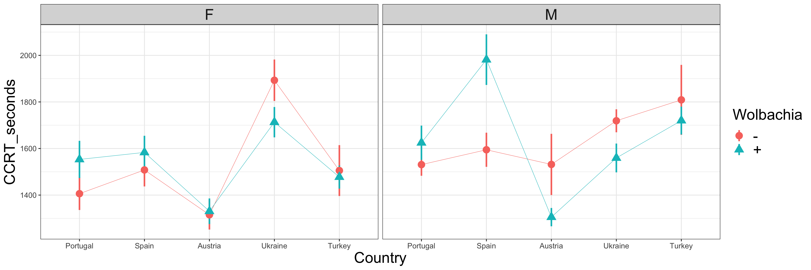

| Factor                | Chisq     | Df  | Pr(>Chisq)  |        |
| --------------------- | --------- | --- | ----------- | ------ |
| (Intercept)           | 3781.1494 | 1   | &lt;2.2e-16 | \*\*\* |
| Wolbachia             | 0.0049    | 1   | 0.9444345   |        |
| Country               | 24.7465   | 4   | 5.657e-05   | \*\*\* |
| Sex                   | 9.9067    | 1   | 0.0016468   | \*\*   |
| Wolbachia:Country     | 8.8236    | 4   | 0.0656628   | .      |
| Wolbachia:Sex         | 0.0047    | 1   | 0.9454932   |        |
| Country:Sex           | 22.3480   | 4   | 0.0001709   | \*\*\* |
| Wolbachia:Country:Sex | 6.5071    | 4   | 0.1643463   |        |

### Cold Shock Mortality

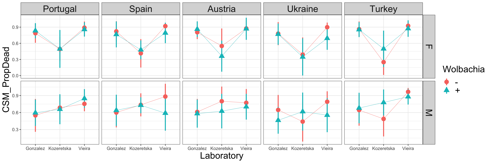
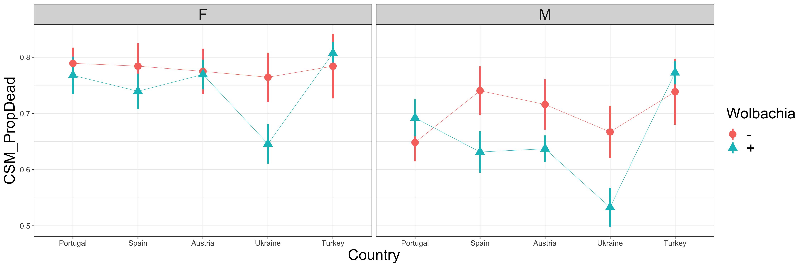

| Factor                | Chisq    | Df  | Pr(>Chisq)  |        |
| --------------------- | -------- | --- | ----------- | ------ |
| (Intercept)           | 127.6540 | 1   | &lt;2.2e-16 | \*\*\* |
| Wolbachia             | 2.2825   | 1   | 0.13084     |        |
| Country               | 7.2735   | 4   | 0.12212     |        |
| Sex                   | 38.5557  | 1   | 5.321e-10   | \*\*\* |
| PC.ratio              | 5.0372   | 1   | 0.02481     | \*     |
| Wolbachia:Country     | 5.4970   | 4   | 0.23999     |        |
| Wolbachia:Sex         | 0.3152   | 1   | 0.57448     |        |
| Country:Sex           | 3.1691   | 4   | 0.52993     |        |
| Wolbachia:Country:Sex | 3.7428   | 4   | 0.44193     |        |

### Development Time (ETA)

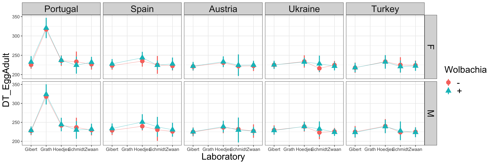
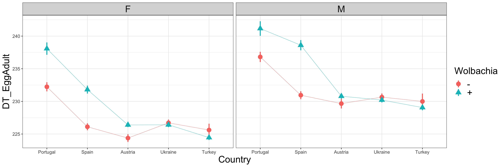

| Factor                | Chisq    | Df  | Pr(>Chisq)  |        |
| --------------------- | -------- | --- | ----------- | ------ |
| (Intercept)           | 15.8424  | 1   | 6.884e-05   | \*\*\* |
| Wolbachia             | 2.3727   | 1   | 0.123476    |        |
| Country               | 16.4695  | 4   | 0.002450    | \*\*   |
| Sex                   | 317.2622 | 1   | &lt;2.2e-16 | \*\*\* |
| PC.ratio              | 0.0613   | 1   | 0.804380    |        |
| Wolbachia:Country     | 6.5635   | 4   | 0.160832    |        |
| Wolbachia:Sex         | 0.0137   | 1   | 0.906705    |        |
| Country:Sex           | 14.7101  | 4   | 0.005342    | \*\*   |
| Wolbachia:Country:Sex | 2.2248   | 4   | 0.694487    |        |

### Diapause

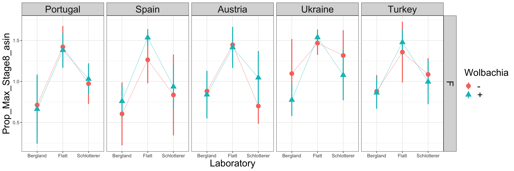

| Factor            | Chisq   | Df  | Pr(>Chisq) |     |
| ----------------- | ------- | --- | ---------- | --- |
| (Intercept)       | 4.5751  | 1   | 0.03244    | \*  |
| Wolbachia         | 0.0235  | 1   | 0.87819    |     |
| Country           | 10.5265 | 4   | 0.03243    | \*  |
| PC.ratio          | 0.0836  | 1   | 0.77245    |     |
| Wolbachia:Country | 4.1100  | 4   | 0.39133    |     |

### Dry weight

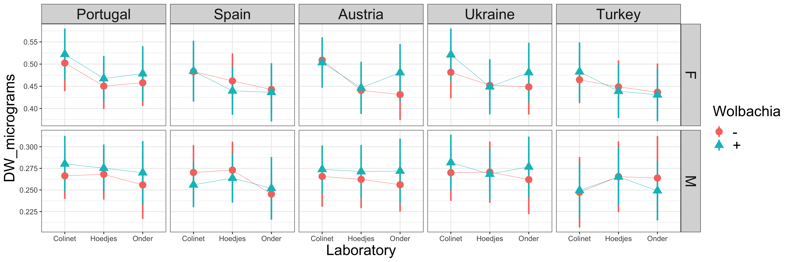

| Factor                | Chisq      | Df  | Pr(>Chisq)  |        |
| --------------------- | ---------- | --- | ----------- | ------ |
| (Intercept)           | 14778.8956 | 1   | &lt;2.2e-16 | \*\*\* |
| Wolbachia             | 2.3452     | 1   | 0.125671    |        |
| Country               | 10.3645    | 4   | 0.034716    | \*     |
| Sex                   | 41065.4297 | 1   | &lt;2.2e-16 | \*\*\* |
| PC.ratio              | 313.9711   | 1   | &lt;2.2e-16 | \*\*\* |
| Wolbachia:Country     | 2.7430     | 4   | 0.601714    |        |
| Wolbachia:Sex         | 8.1435     | 1   | 0.004322    | \*\*   |
| Country:Sex           | 26.9587    | 4   | 2.026e-05   | \*\*\* |
| Wolbachia:Country:Sex | 12.9142    | 4   | 0.011703    | \*     |

### Fecundity

| Factor            | Chisq  | Df  | Pr(>Chisq) |     |
| ----------------- | ------ | --- | ---------- | --- |
| Wolbachia         | 1.8068 | 1   | 0.17890    |     |
| (Intercept)       | 5.6540 | 1   | 0.01742    | \*  |
| Country           | 3.0578 | 4   | 0.54821    |     |
| PC.ratio          | 2.2413 | 1   | 0.13436    |     |
| Wolbachia:Country | 0.3586 | 4   | 0.98573    |     |

### Heat Shock

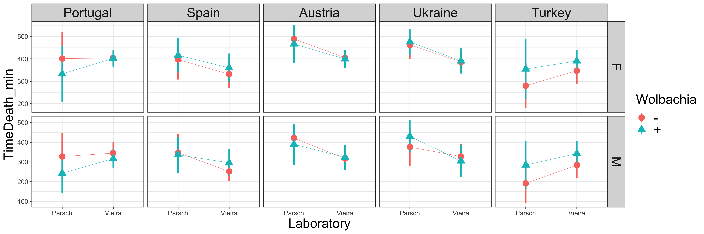
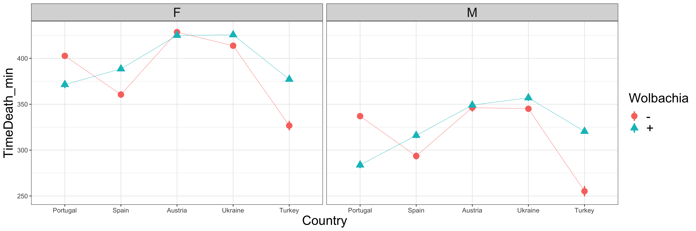

| Factor                | Chisq     | Df  | Pr(>Chisq)  |        |
| --------------------- | --------- | --- | ----------- | ------ |
| (Intercept)           | 483.7408  | 1   | &lt;2.2e-16 | \*\*\* |
| Wolbachia             | 0.0528    | 1   | 0.8182592   |        |
| Country               | 102.0529  | 4   | &lt;2.2e-16 | \*\*\* |
| Sex                   | 3092.3527 | 1   | &lt;2.2e-16 | \*\*\* |
| PC.ratio              | 12.1750   | 1   | 0.0004844   | \*\*\* |
| Wolbachia:Country     | 3.3733    | 4   | 0.4974090   |        |
| Wolbachia:Sex         | 0.2726    | 1   | 0.6015815   |        |
| Country:Sex           | 16.9285   | 4   | 0.0019958   | \*\*   |
| Wolbachia:Country:Sex | 23.2757   | 4   | 0.0001115   | \*\*\* |

### Lifespan

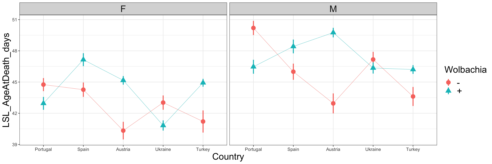

| Factor                | Chisq    | Df  | Pr(>Chisq)  |        |
| --------------------- | -------- | --- | ----------- | ------ |
| (Intercept)           | 8.4862   | 1   | 0.0035784   | \*\*   |
| Wolbachia             | 0.8254   | 1   | 0.3636129   |        |
| Country               | 1.6020   | 4   | 0.8084274   |        |
| Sex                   | 126.2562 | 1   | &lt;2.2e-16 | \*\*\* |
| PC.ratio              | 0.7508   | 1   | 0.3862209   |        |
| Wolbachia:Country     | 5.4552   | 4   | 0.2436999   |        |
| Wolbachia:Sex         | 0.0033   | 1   | 0.9540255   |        |
| Country:Sex           | 22.0584  | 4   | 0.0001951   | \*\*\* |
| Wolbachia:Country:Sex | 7.2346   | 4   | 0.1239979   |        |

### Pigmentation

| Factor            | Chisq   | Df  | Pr(>Chisq) |        |
| ----------------- | ------- | --- | ---------- | ------ |
| (Intercept)       | 18.3491 | 1   | 1.839e-05  | \*\*\* |
| Wolbachia         | 0.4498  | 1   | 0.50242    |        |
| Country           | 12.6608 | 4   | 0.01306    | \*     |
| PC.ratio          | 0.6794  | 1   | 0.40979    |        |
| Wolbachia:Country | 0.8059  | 4   | 0.93766    |        |

### Starvation

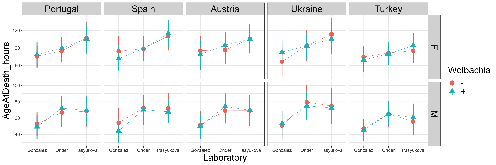

| Factor                | Chisq      | Df  | Pr(>Chisq)  |        |
| --------------------- | ---------- | --- | ----------- | ------ |
| (Intercept)           | 13.4597    | 1   | 0.0002437   | \*\*\* |
| Wolbachia             | 0.0177     | 1   | 0.8942880   |        |
| Country               | 17.2913    | 4   | 0.0016965   | \*\*   |
| Sex                   | 13936.4179 | 1   | &lt;2.2e-16 | \*\*\* |
| PC.ratio              | 2.5622     | 1   | 0.1094428   |        |
| Wolbachia:Sex         | 6.0875     | 1   | 0.0136141   | \*     |
| Wolbachia:Country     | 0.9866     | 4   | 0.9118229   |        |
| Country:Sex           | 69.6422    | 4   | 2.701e-14   | \*\*\* |
| Wolbachia:Country:Sex | 9.9410     | 4   | 0.0414338   | \*     |

### Thorax Length

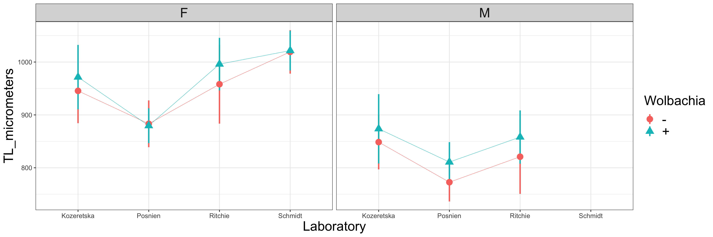
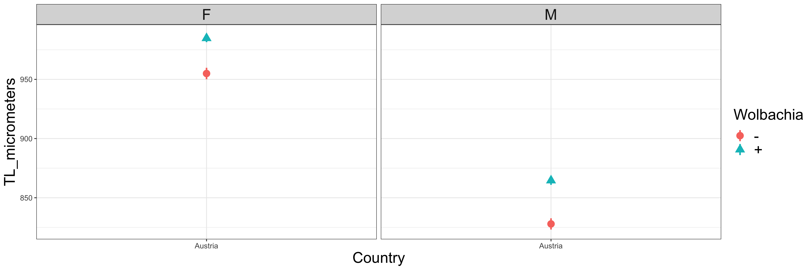

| Factor        | Chisq     | Df  | Pr(>Chisq) |        |
| ------------- | --------- | --- | ---------- | ------ |
| (Intercept)   | 148.6740  | 1   | &lt;2e-16  | \*\*\* |
| Wolbachia     | 0.1802    | 1   | 0.6712     |        |
| Sex           | 1143.8346 | 1   | &lt;2e-16  | \*\*\* |
| PC.ratio      | 0.3235    | 1   | 0.5695     |        |
| Wolbachia:Sex | 0.1213    | 1   | 0.7276     |        |

### Viability

| Factor            | Chisq    | Df  | Pr(>Chisq)  |        |
| ----------------- | -------- | --- | ----------- | ------ |
| (Intercept)       | 522.5781 | 1   | &lt;2.2e-16 | \*\*\* |
| Wolbachia         | 3.0356   | 1   | 0.08146     | .      |
| Country           | 34.7633  | 4   | 5.195e-07   | \*\*\* |
| PC.ratio          | 2.5563   | 1   | 0.10986     |        |
| Wolbachia:Country | 9.9248   | 4   | 0.04171     | \*     |

### Wing area

#### Average Size

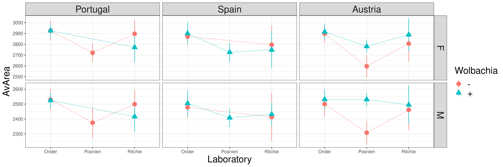
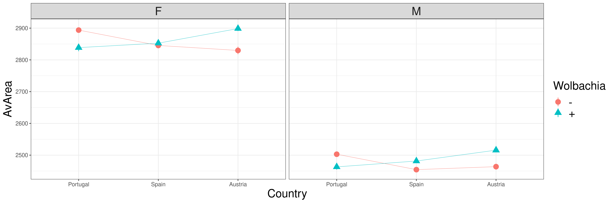

| Factor                | Chisq     | Df  | Pr(>Chisq) |        |
| --------------------- | --------- | --- | ---------- | ------ |
| (Intercept)           | 148.1305  | 1   | &lt;2e-16  | \*\*\* |
| Wolbachia             | 2.4846    | 1   | 0.11497    |        |
| Country               | 8.2861    | 2   | 0.01587    | \*     |
| Sex                   | 9133.5741 | 1   | &lt;2e-16  | \*\*\* |
| PC.ratio              | 1.1974    | 1   | 0.27385    |        |
| Wolbachia:Country     | 3.4554    | 2   | 0.17769    |        |
| Wolbachia:Sex         | 0.3384    | 1   | 0.56078    |        |
| Country:Sex           | 0.9356    | 2   | 0.62639    |        |
| Wolbachia:Country:Sex | 5.3901    | 2   | 0.06754    | .      |

#### Developmental Assymetry

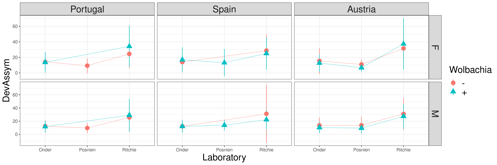

| Factor                | Chisq   | Df  | Pr(>Chisq) |      |
| --------------------- | ------- | --- | ---------- | ---- |
| (Intercept)           | 0.0482  | 1   | 0.826226   |      |
| Wolbachia             | 1.6634  | 1   | 0.197143   |      |
| Country               | 0.7166  | 2   | 0.698850   |      |
| Sex                   | 10.7692 | 1   | 0.001032   | \*\* |
| PC.ratio              | 0.5219  | 1   | 0.470052   |      |
| Wolbachia:Country     | 3.8649  | 2   | 0.144791   |      |
| Wolbachia:Sex         | 5.9411  | 1   | 0.014792   | \*   |
| Country:Sex           | 0.4089  | 2   | 0.815085   |      |
| Wolbachia:Country:Sex | 0.1563  | 2   | 0.924803   |      |
